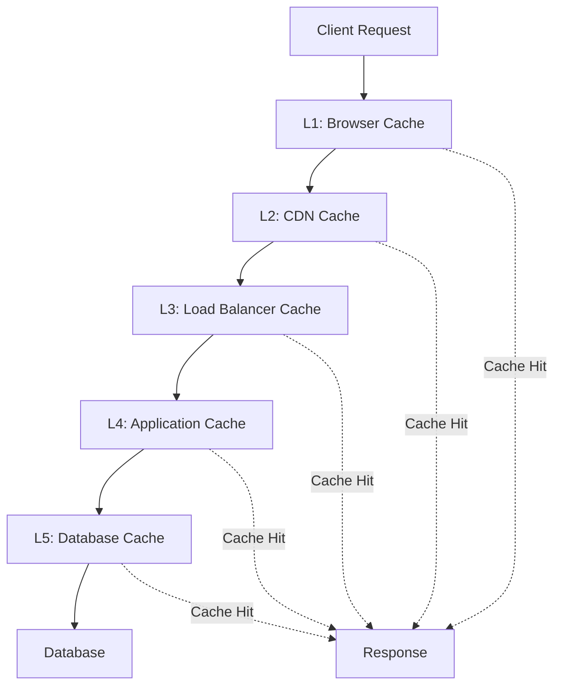

# Complete Caching Guide for System Design
*Comprehensive reference covering caching strategies, patterns, and implementation approaches*

## 📚 Table of Contents

1. [Caching Fundamentals](#caching-fundamentals)
2. [Cache Types and Levels](#cache-types-and-levels)
3. [Caching Patterns](#caching-patterns)
4. [Cache Invalidation Strategies](#cache-invalidation-strategies)
5. [Distributed Caching](#distributed-caching)
6. [Cache Performance and Monitoring](#cache-performance-and-monitoring)
7. [Advanced Caching Techniques](#advanced-caching-techniques)
8. [Cache Security](#cache-security)
9. [Real-world Implementation](#real-world-implementation)
10. [Interview Questions](#interview-questions)

---

## 💾 Caching Fundamentals

### What is Caching?

**Caching** is a technique to store frequently accessed data in a fast storage layer (cache) to reduce latency and improve system performance by avoiding expensive operations like database queries, API calls, or complex computations.

### Key Metrics

| Metric | Description | Formula | Target |
|--------|-------------|---------|--------|
| **Hit Rate** | Percentage of requests served from cache | `(Cache Hits / Total Requests) × 100` | 80-95% |
| **Miss Rate** | Percentage of requests not in cache | `(Cache Misses / Total Requests) × 100` | 5-20% |
| **Latency Reduction** | Performance improvement | `(DB Latency - Cache Latency) / DB Latency` | 90%+ |
| **Throughput** | Requests per second served | `Cache RPS + DB RPS` | Maximize |

### When to Use Caching

```java
@Component
public class CachingDecisionService {
    
    public boolean shouldCache(DataAccessPattern pattern) {
        // High read-to-write ratio
        if (pattern.getReadWriteRatio() > 10) {
            return true;
        }
        
        // Expensive computation or database query
        if (pattern.getAverageProcessingTime() > Duration.ofMillis(100)) {
            return true;
        }
        
        // Frequently accessed data
        if (pattern.getAccessFrequency() > 100) { // requests per minute
            return true;
        }
        
        // Relatively stable data
        if (pattern.getUpdateFrequency() < Duration.ofHours(1)) {
            return true;
        }
        
        return false;
    }
    
    public CacheStrategy recommendStrategy(DataAccessPattern pattern) {
        if (pattern.isRealTimeRequired()) {
            return CacheStrategy.WRITE_THROUGH;
        } else if (pattern.isHighWrite()) {
            return CacheStrategy.WRITE_BEHIND;
        } else if (pattern.isToleratesToStaleData()) {
            return CacheStrategy.CACHE_ASIDE;
        } else {
            return CacheStrategy.REFRESH_AHEAD;
        }
    }
}
```

---

## 🏗️ Cache Types and Levels

### Multi-Level Cache Architecture



### Browser/Client-side Caching

```java
@RestController
public class CacheableResourceController {
    
    @GetMapping("/api/static/{resource}")
    public ResponseEntity<Resource> getStaticResource(@PathVariable String resource) {
        Resource resourceData = resourceService.getResource(resource);
        
        return ResponseEntity.ok()
            .cacheControl(CacheControl.maxAge(365, TimeUnit.DAYS)
                .cachePublic()
                .immutable())
            .eTag(resourceService.getETag(resource))
            .lastModified(resourceData.getLastModified())
            .body(resourceData);
    }
    
    @GetMapping("/api/dynamic/{id}")
    public ResponseEntity<UserProfile> getDynamicResource(@PathVariable Long id) {
        UserProfile profile = userService.getUserProfile(id);
        
        return ResponseEntity.ok()
            .cacheControl(CacheControl.maxAge(5, TimeUnit.MINUTES)
                .cachePrivate())
            .eTag(String.valueOf(profile.hashCode()))
            .body(profile);
    }
    
    // Conditional requests handling
    @GetMapping("/api/users/{id}")
    public ResponseEntity<User> getUser(@PathVariable Long id,
                                       @RequestHeader(value = "If-None-Match", required = false) String ifNoneMatch,
                                       @RequestHeader(value = "If-Modified-Since", required = false) String ifModifiedSince) {
        
        User user = userService.getUser(id);
        String currentETag = String.valueOf(user.hashCode());
        
        // Return 304 Not Modified if client has current version
        if (currentETag.equals(ifNoneMatch)) {
            return ResponseEntity.status(HttpStatus.NOT_MODIFIED).build();
        }
        
        return ResponseEntity.ok()
            .eTag(currentETag)
            .lastModified(user.getLastModified())
            .body(user);
    }
}
```

### Application-Level Caching

```java
@Configuration
@EnableCaching
public class CacheConfiguration {
    
    @Bean
    public CacheManager cacheManager() {
        CompositeCacheManager compositeCacheManager = new CompositeCacheManager();
        compositeCacheManager.setCacheManagers(
            l1CacheManager(), // In-memory L1 cache
            l2CacheManager()  // Distributed L2 cache
        );
        return compositeCacheManager;
    }
    
    @Bean
    public CacheManager l1CacheManager() {
        CaffeineCacheManager manager = new CaffeineCacheManager();
        manager.setCaffeine(Caffeine.newBuilder()
            .maximumSize(10_000)
            .expireAfterWrite(10, TimeUnit.MINUTES)
            .expireAfterAccess(5, TimeUnit.MINUTES)
            .recordStats()
            .removalListener((key, value, cause) -> {
                logger.debug("L1 cache eviction: key={}, cause={}", key, cause);
            }));
        return manager;
    }
    
    @Bean
    public CacheManager l2CacheManager() {
        RedisCacheManager.Builder builder = RedisCacheManager.builder(redisConnectionFactory())
            .cacheDefaults(RedisCacheConfiguration.defaultCacheConfig()
                .entryTtl(Duration.ofHours(1))
                .serializeKeysWith(RedisSerializationContext.SerializationPair
                    .fromSerializer(new StringRedisSerializer()))
                .serializeValuesWith(RedisSerializationContext.SerializationPair
                    .fromSerializer(new GenericJackson2JsonRedisSerializer())))
            .transactionAware();
        
        return builder.build();
    }
}

@Service
public class UserService {
    
    @Cacheable(value = "users", key = "#userId", unless = "#result == null")
    public User getUser(Long userId) {
        logger.info("Fetching user {} from database", userId);
        return userRepository.findById(userId).orElse(null);
    }
    
    @Cacheable(value = "user-profiles", key = "#userId", condition = "#userId > 0")
    public UserProfile getUserProfile(Long userId) {
        return userProfileRepository.findByUserId(userId);
    }
    
    @CacheEvict(value = {"users", "user-profiles"}, key = "#user.id")
    public User updateUser(User user) {
        return userRepository.save(user);
    }
    
    @Caching(
        cacheable = @Cacheable(value = "popular-users", key = "'popular:' + #limit"),
        evict = @CacheEvict(value = "user-stats", allEntries = true)
    )
    public List<User> getPopularUsers(int limit) {
        return userRepository.findTopUsers(limit);
    }
}
```

### Database-Level Caching

```java
// Query Result Caching
@Configuration
public class DatabaseCacheConfiguration {
    
    @Bean
    public LocalSessionFactoryBean sessionFactory() {
        LocalSessionFactoryBean sessionFactory = new LocalSessionFactoryBean();
        
        Properties hibernateProperties = new Properties();
        
        // Enable second-level cache
        hibernateProperties.put("hibernate.cache.use_second_level_cache", "true");
        hibernateProperties.put("hibernate.cache.region.factory_class", 
            "org.hibernate.cache.caffeine.CaffeineCacheRegionFactory");
        
        // Enable query cache
        hibernateProperties.put("hibernate.cache.use_query_cache", "true");
        
        // Enable statistics for monitoring
        hibernateProperties.put("hibernate.generate_statistics", "true");
        
        sessionFactory.setHibernateProperties(hibernateProperties);
        return sessionFactory;
    }
}

@Entity
@Cache(usage = CacheConcurrencyStrategy.READ_WRITE)
@Table(name = "users")
public class User {
    @Id
    private Long id;
    
    private String username;
    private String email;
    
    @Cache(usage = CacheConcurrencyStrategy.READ_WRITE)
    @OneToMany(mappedBy = "user", fetch = FetchType.LAZY)
    private List<Order> orders;
}

@Repository
public class UserRepository {
    
    @Autowired
    private EntityManager entityManager;
    
    // Enable query cache for specific queries
    public List<User> findActiveUsers() {
        return entityManager.createQuery(
            "SELECT u FROM User u WHERE u.status = :status", User.class)
            .setParameter("status", UserStatus.ACTIVE)
            .setHint("org.hibernate.cacheable", true)
            .setHint("org.hibernate.cacheRegion", "user-queries")
            .getResultList();
    }
}
```

---

## 🔄 Caching Patterns

### Cache-Aside (Lazy Loading)

```java
@Service
public class CacheAsideUserService {
    
    @Autowired
    private UserRepository userRepository;
    
    @Autowired
    private RedisTemplate<String, User> redisTemplate;
    
    private static final String USER_CACHE_KEY = "user:%d";
    private static final Duration CACHE_TTL = Duration.ofMinutes(30);
    
    public User getUser(Long userId) {
        String cacheKey = String.format(USER_CACHE_KEY, userId);
        
        // Try cache first
        User cachedUser = redisTemplate.opsForValue().get(cacheKey);
        if (cachedUser != null) {
            logger.debug("Cache hit for user {}", userId);
            return cachedUser;
        }
        
        // Cache miss - fetch from database
        logger.debug("Cache miss for user {}", userId);
        User user = userRepository.findById(userId).orElse(null);
        
        if (user != null) {
            // Store in cache
            redisTemplate.opsForValue().set(cacheKey, user, CACHE_TTL);
        }
        
        return user;
    }
    
    public User updateUser(User user) {
        // Update database first
        User savedUser = userRepository.save(user);
        
        // Invalidate cache
        String cacheKey = String.format(USER_CACHE_KEY, user.getId());
        redisTemplate.delete(cacheKey);
        
        return savedUser;
    }
}
```

### Write-Through Caching

```java
@Service
public class WriteThroughCacheService {
    
    @Autowired
    private UserRepository userRepository;
    
    @Autowired
    private RedisTemplate<String, User> redisTemplate;
    
    public User createUser(CreateUserRequest request) {
        // Create user object
        User user = new User();
        user.setUsername(request.getUsername());
        user.setEmail(request.getEmail());
        
        // Write to database first
        User savedUser = userRepository.save(user);
        
        // Write to cache immediately (synchronous)
        String cacheKey = String.format(USER_CACHE_KEY, savedUser.getId());
        redisTemplate.opsForValue().set(cacheKey, savedUser, CACHE_TTL);
        
        logger.debug("User {} saved to database and cache", savedUser.getId());
        return savedUser;
    }
    
    public User updateUser(User user) {
        // Update database
        User savedUser = userRepository.save(user);
        
        // Update cache immediately
        String cacheKey = String.format(USER_CACHE_KEY, user.getId());
        redisTemplate.opsForValue().set(cacheKey, savedUser, CACHE_TTL);
        
        return savedUser;
    }
    
    public void deleteUser(Long userId) {
        // Delete from database
        userRepository.deleteById(userId);
        
        // Delete from cache
        String cacheKey = String.format(USER_CACHE_KEY, userId);
        redisTemplate.delete(cacheKey);
    }
}
```

### Write-Behind (Write-Back) Caching

```java
@Service
public class WriteBehindCacheService {
    
    @Autowired
    private RedisTemplate<String, User> redisTemplate;
    
    @Autowired
    private UserRepository userRepository;
    
    private final ExecutorService writeBackExecutor = Executors.newFixedThreadPool(10);
    private final Map<String, PendingWrite> pendingWrites = new ConcurrentHashMap<>();
    
    public User updateUser(User user) {
        String cacheKey = String.format(USER_CACHE_KEY, user.getId());
        
        // Write to cache immediately
        redisTemplate.opsForValue().set(cacheKey, user, CACHE_TTL);
        
        // Schedule asynchronous database write
        PendingWrite pendingWrite = new PendingWrite(user, System.currentTimeMillis());
        pendingWrites.put(cacheKey, pendingWrite);
        
        // Debounce writes - only write latest version to database
        CompletableFuture.delayedExecutor(5, TimeUnit.SECONDS, writeBackExecutor)
            .execute(() -> flushToDatabase(cacheKey));
        
        return user;
    }
    
    private void flushToDatabase(String cacheKey) {
        PendingWrite pendingWrite = pendingWrites.remove(cacheKey);
        
        if (pendingWrite != null) {
            try {
                userRepository.save(pendingWrite.getUser());
                logger.debug("Flushed user {} to database", pendingWrite.getUser().getId());
            } catch (Exception e) {
                logger.error("Failed to flush user to database", e);
                
                // Retry logic or dead letter queue
                retryOrEnqueueForLater(pendingWrite);
            }
        }
    }
    
    // Periodic flush of pending writes
    @Scheduled(fixedRate = 60000) // Every minute
    public void flushPendingWrites() {
        List<String> keysToFlush = pendingWrites.entrySet().stream()
            .filter(entry -> System.currentTimeMillis() - entry.getValue().getTimestamp() > 30000)
            .map(Map.Entry::getKey)
            .collect(Collectors.toList());
            
        keysToFlush.forEach(this::flushToDatabase);
    }
    
    @Data
    private static class PendingWrite {
        private final User user;
        private final long timestamp;
    }
}
```

### Refresh-Ahead Caching

```java
@Service
public class RefreshAheadCacheService {
    
    @Autowired
    private UserRepository userRepository;
    
    @Autowired
    private RedisTemplate<String, User> redisTemplate;
    
    private final ScheduledExecutorService refreshExecutor = Executors.newScheduledThreadPool(5);
    private static final double REFRESH_THRESHOLD = 0.8; // Refresh when 80% of TTL elapsed
    
    public User getUser(Long userId) {
        String cacheKey = String.format(USER_CACHE_KEY, userId);
        
        // Get from cache with TTL information
        User cachedUser = getCachedUserWithTTL(cacheKey);
        
        if (cachedUser != null) {
            // Check if refresh is needed (proactive refresh)
            long ttl = redisTemplate.getExpire(cacheKey, TimeUnit.SECONDS);
            long originalTtl = CACHE_TTL.getSeconds();
            
            if (ttl < (originalTtl * (1 - REFRESH_THRESHOLD))) {
                // Trigger background refresh
                refreshExecutor.execute(() -> refreshCacheEntry(userId, cacheKey));
            }
            
            return cachedUser;
        }
        
        // Cache miss - synchronous fetch
        return fetchAndCache(userId, cacheKey);
    }
    
    private void refreshCacheEntry(Long userId, String cacheKey) {
        try {
            logger.debug("Refreshing cache for user {}", userId);
            
            User freshUser = userRepository.findById(userId).orElse(null);
            if (freshUser != null) {
                redisTemplate.opsForValue().set(cacheKey, freshUser, CACHE_TTL);
            }
        } catch (Exception e) {
            logger.warn("Failed to refresh cache for user {}", userId, e);
        }
    }
    
    private User getCachedUserWithTTL(String cacheKey) {
        return redisTemplate.opsForValue().get(cacheKey);
    }
    
    private User fetchAndCache(Long userId, String cacheKey) {
        User user = userRepository.findById(userId).orElse(null);
        
        if (user != null) {
            redisTemplate.opsForValue().set(cacheKey, user, CACHE_TTL);
        }
        
        return user;
    }
}
```

---

## 🔄 Cache Invalidation Strategies

### Time-based Expiration (TTL)

```java
@Service
public class TTLCacheService {
    
    @Autowired
    private RedisTemplate<String, Object> redisTemplate;
    
    public void cacheWithTTL(String key, Object value, Duration ttl) {
        redisTemplate.opsForValue().set(key, value, ttl);
    }
    
    // Sliding expiration - reset TTL on access
    public Object getWithSlidingExpiration(String key, Duration slidingTtl) {
        Object value = redisTemplate.opsForValue().get(key);
        
        if (value != null) {
            // Reset expiration time
            redisTemplate.expire(key, slidingTtl);
        }
        
        return value;
    }
    
    // Different TTL based on data type
    public void smartCache(String key, Object value, CacheDataType dataType) {
        Duration ttl = switch (dataType) {
            case STATIC_REFERENCE -> Duration.ofDays(1);
            case USER_SESSION -> Duration.ofHours(2);
            case API_RESPONSE -> Duration.ofMinutes(15);
            case COMPUTED_RESULT -> Duration.ofMinutes(30);
            case REAL_TIME_DATA -> Duration.ofSeconds(30);
        };
        
        redisTemplate.opsForValue().set(key, value, ttl);
    }
}
```

### Event-driven Invalidation

```java
@Component
public class EventDrivenCacheInvalidation {
    
    @Autowired
    private CacheManager cacheManager;
    
    @EventListener
    @Async
    public void handleUserUpdate(UserUpdatedEvent event) {
        String userId = event.getUserId().toString();
        
        // Invalidate user cache
        evictCache("users", userId);
        
        // Invalidate related caches
        evictCache("user-profiles", userId);
        evictCache("user-preferences", userId);
        
        // Invalidate aggregate caches that include this user
        evictCache("popular-users");
        evictPattern("search:users:*");
    }
    
    @EventListener
    @Async
    public void handlePostCreated(PostCreatedEvent event) {
        String authorId = event.getAuthorId().toString();
        
        // Invalidate author's post list
        evictCache("user-posts", authorId);
        
        // Invalidate follower feeds (fan-out invalidation)
        List<Long> followerIds = userService.getFollowerIds(event.getAuthorId());
        followerIds.forEach(followerId -> 
            evictCache("user-feed", followerId.toString()));
    }
    
    private void evictCache(String cacheName, String key) {
        Cache cache = cacheManager.getCache(cacheName);
        if (cache != null) {
            cache.evict(key);
        }
    }
    
    private void evictCache(String cacheName) {
        Cache cache = cacheManager.getCache(cacheName);
        if (cache != null) {
            cache.clear();
        }
    }
    
    private void evictPattern(String pattern) {
        // For Redis-based caches
        RedisTemplate<String, Object> redisTemplate = getRedisTemplate();
        Set<String> keys = redisTemplate.keys(pattern);
        
        if (keys != null && !keys.isEmpty()) {
            redisTemplate.delete(keys);
        }
    }
}
```

### Cache Tags and Dependencies

```java
@Service
public class TaggedCacheService {
    
    @Autowired
    private RedisTemplate<String, Object> redisTemplate;
    
    private static final String TAG_SET_PREFIX = "tag:";
    
    public void cacheWithTags(String key, Object value, Duration ttl, String... tags) {
        // Store the actual cached data
        redisTemplate.opsForValue().set(key, value, ttl);
        
        // Associate with tags
        for (String tag : tags) {
            String tagSetKey = TAG_SET_PREFIX + tag;
            redisTemplate.opsForSet().add(tagSetKey, key);
            redisTemplate.expire(tagSetKey, ttl.plusMinutes(5)); // Slightly longer TTL for tag sets
        }
    }
    
    public void invalidateByTag(String tag) {
        String tagSetKey = TAG_SET_PREFIX + tag;
        Set<Object> keysToInvalidate = redisTemplate.opsForSet().members(tagSetKey);
        
        if (keysToInvalidate != null && !keysToInvalidate.isEmpty()) {
            // Convert to string keys and delete
            List<String> keys = keysToInvalidate.stream()
                .map(Object::toString)
                .collect(Collectors.toList());
                
            redisTemplate.delete(keys);
            
            // Clean up the tag set
            redisTemplate.delete(tagSetKey);
            
            logger.info("Invalidated {} cache entries for tag: {}", keys.size(), tag);
        }
    }
    
    // Example usage
    public void cacheUserData(Long userId, User user) {
        String key = "user:" + userId;
        
        cacheWithTags(key, user, Duration.ofMinutes(30),
            "user-data",
            "user-" + userId,
            "department-" + user.getDepartmentId(),
            "role-" + user.getRole()
        );
    }
    
    // Invalidate all users in a department
    public void invalidateDepartmentUsers(Long departmentId) {
        invalidateByTag("department-" + departmentId);
    }
}
```

### Write-through with Pessimistic Locking

```java
@Service
public class ConsistentCacheService {
    
    @Autowired
    private RedisTemplate<String, Object> redisTemplate;
    
    @Autowired
    private UserRepository userRepository;
    
    private final RedissonClient redissonClient;
    
    @Transactional
    public User updateUserWithConsistency(Long userId, UpdateUserRequest request) {
        String lockKey = "lock:user:" + userId;
        String cacheKey = "user:" + userId;
        
        RLock lock = redissonClient.getLock(lockKey);
        
        try {
            // Acquire distributed lock
            boolean acquired = lock.tryLock(5, 30, TimeUnit.SECONDS);
            
            if (!acquired) {
                throw new CacheException("Could not acquire lock for user: " + userId);
            }
            
            // Update database within lock
            User user = userRepository.findById(userId)
                .orElseThrow(() -> new UserNotFoundException(userId));
                
            user.setEmail(request.getEmail());
            user.setLastModified(LocalDateTime.now());
            
            User savedUser = userRepository.save(user);
            
            // Update cache within same lock
            redisTemplate.opsForValue().set(cacheKey, savedUser, Duration.ofMinutes(30));
            
            return savedUser;
            
        } catch (InterruptedException e) {
            Thread.currentThread().interrupt();
            throw new CacheException("Lock acquisition interrupted", e);
        } finally {
            if (lock.isHeldByCurrentThread()) {
                lock.unlock();
            }
        }
    }
}
```

---

## 🌐 Distributed Caching

### Redis Cluster Configuration

```java
@Configuration
public class RedisClusterConfig {
    
    @Bean
    public RedisConnectionFactory redisConnectionFactory() {
        RedisClusterConfiguration clusterConfiguration = new RedisClusterConfiguration()
            .clusterNode("redis-node-1", 6379)
            .clusterNode("redis-node-2", 6379)
            .clusterNode("redis-node-3", 6379)
            .clusterNode("redis-node-4", 6379)
            .clusterNode("redis-node-5", 6379)
            .clusterNode("redis-node-6", 6379);
            
        // Connection pool configuration
        JedisPoolConfig poolConfig = new JedisPoolConfig();
        poolConfig.setMaxTotal(200);
        poolConfig.setMaxIdle(50);
        poolConfig.setMinIdle(10);
        poolConfig.setTestOnBorrow(true);
        poolConfig.setTestOnReturn(true);
        
        JedisConnectionFactory factory = new JedisConnectionFactory(clusterConfiguration, poolConfig);
        return factory;
    }
    
    @Bean
    public RedisTemplate<String, Object> redisTemplate(RedisConnectionFactory connectionFactory) {
        RedisTemplate<String, Object> template = new RedisTemplate<>();
        template.setConnectionFactory(connectionFactory);
        
        // Serialization configuration
        template.setKeySerializer(new StringRedisSerializer());
        template.setValueSerializer(new GenericJackson2JsonRedisSerializer());
        template.setHashKeySerializer(new StringRedisSerializer());
        template.setHashValueSerializer(new GenericJackson2JsonRedisSerializer());
        
        return template;
    }
    
    @Bean
    public RedissonClient redissonClient() {
        Config config = new Config();
        config.useClusterServers()
            .addNodeAddress("redis://redis-node-1:6379")
            .addNodeAddress("redis://redis-node-2:6379")
            .addNodeAddress("redis://redis-node-3:6379")
            .addNodeAddress("redis://redis-node-4:6379")
            .addNodeAddress("redis://redis-node-5:6379")
            .addNodeAddress("redis://redis-node-6:6379")
            .setRetryAttempts(3)
            .setRetryInterval(1500)
            .setConnectTimeout(10000)
            .setTimeout(3000);
            
        return Redisson.create(config);
    }
}
```

### Consistent Hashing for Cache Distribution

```java
@Component
public class ConsistentHashCacheClient {
    
    private final TreeMap<Long, RedisTemplate<String, Object>> ring = new TreeMap<>();
    private final List<RedisTemplate<String, Object>> nodes;
    private final int virtualNodes = 150;
    
    public ConsistentHashCacheClient(List<RedisTemplate<String, Object>> redisNodes) {
        this.nodes = redisNodes;
        buildHashRing();
    }
    
    private void buildHashRing() {
        ring.clear();
        
        for (int i = 0; i < nodes.size(); i++) {
            RedisTemplate<String, Object> node = nodes.get(i);
            
            for (int j = 0; j < virtualNodes; j++) {
                String virtualNodeKey = "node-" + i + "-vnode-" + j;
                long hash = hash(virtualNodeKey);
                ring.put(hash, node);
            }
        }
    }
    
    public void set(String key, Object value, Duration ttl) {
        RedisTemplate<String, Object> node = getNodeForKey(key);
        node.opsForValue().set(key, value, ttl);
    }
    
    public Object get(String key) {
        RedisTemplate<String, Object> node = getNodeForKey(key);
        return node.opsForValue().get(key);
    }
    
    public void delete(String key) {
        RedisTemplate<String, Object> node = getNodeForKey(key);
        node.delete(key);
    }
    
    private RedisTemplate<String, Object> getNodeForKey(String key) {
        if (ring.isEmpty()) {
            throw new IllegalStateException("No cache nodes available");
        }
        
        long hash = hash(key);
        Map.Entry<Long, RedisTemplate<String, Object>> entry = ring.ceilingEntry(hash);
        
        if (entry == null) {
            entry = ring.firstEntry();
        }
        
        return entry.getValue();
    }
    
    private long hash(String key) {
        return Hashing.murmur3_128().hashString(key, StandardCharsets.UTF_8).asLong();
    }
    
    // Handle node failures and additions
    public void addNode(RedisTemplate<String, Object> newNode) {
        nodes.add(newNode);
        buildHashRing();
        logger.info("Added new cache node. Ring now has {} nodes.", nodes.size());
    }
    
    public void removeNode(RedisTemplate<String, Object> failedNode) {
        nodes.remove(failedNode);
        buildHashRing();
        logger.warn("Removed failed cache node. Ring now has {} nodes.", nodes.size());
    }
}
```

### Cache Replication and Failover

```java
@Service
public class ReplicatedCacheService {
    
    private final RedisTemplate<String, Object> primaryCache;
    private final List<RedisTemplate<String, Object>> replicaCaches;
    private final ExecutorService replicationExecutor = Executors.newFixedThreadPool(5);
    
    public void set(String key, Object value, Duration ttl) {
        try {
            // Write to primary cache first
            primaryCache.opsForValue().set(key, value, ttl);
            
            // Asynchronously replicate to replicas
            replicaCaches.forEach(replica -> 
                replicationExecutor.execute(() -> replicateToNode(replica, key, value, ttl))
            );
            
        } catch (Exception e) {
            logger.error("Failed to write to primary cache", e);
            throw new CacheException("Cache write failed", e);
        }
    }
    
    public Object get(String key) {
        try {
            // Try primary cache first
            Object value = primaryCache.opsForValue().get(key);
            
            if (value != null) {
                return value;
            }
            
            // Fallback to replicas if primary fails
            for (RedisTemplate<String, Object> replica : replicaCaches) {
                try {
                    value = replica.opsForValue().get(key);
                    if (value != null) {
                        // Repair primary cache asynchronously
                        replicationExecutor.execute(() -> 
                            repairPrimaryCache(key, value));
                        return value;
                    }
                } catch (Exception e) {
                    logger.warn("Replica cache failure", e);
                    continue;
                }
            }
            
            return null;
            
        } catch (Exception e) {
            logger.error("Failed to read from caches", e);
            return null;
        }
    }
    
    private void replicateToNode(RedisTemplate<String, Object> replica, 
                               String key, Object value, Duration ttl) {
        try {
            replica.opsForValue().set(key, value, ttl);
        } catch (Exception e) {
            logger.warn("Failed to replicate to cache node: {}", e.getMessage());
        }
    }
    
    private void repairPrimaryCache(String key, Object value) {
        try {
            primaryCache.opsForValue().set(key, value, Duration.ofMinutes(30));
            logger.debug("Repaired primary cache for key: {}", key);
        } catch (Exception e) {
            logger.warn("Failed to repair primary cache", e);
        }
    }
    
    // Health check and automatic failover
    @Scheduled(fixedRate = 30000)
    public void checkCacheHealth() {
        String healthCheckKey = "health:check:" + System.currentTimeMillis();
        String healthCheckValue = "ok";
        
        // Check primary cache health
        try {
            primaryCache.opsForValue().set(healthCheckKey, healthCheckValue, Duration.ofMinutes(1));
            String retrieved = (String) primaryCache.opsForValue().get(healthCheckKey);
            
            if (!healthCheckValue.equals(retrieved)) {
                logger.error("Primary cache health check failed");
                handlePrimaryCacheFailure();
            }
        } catch (Exception e) {
            logger.error("Primary cache is unreachable", e);
            handlePrimaryCacheFailure();
        }
    }
    
    private void handlePrimaryCacheFailure() {
        // Promote a replica to primary
        if (!replicaCaches.isEmpty()) {
            // Implementation depends on infrastructure
            // Could involve DNS updates, load balancer reconfiguration, etc.
            logger.info("Initiating cache failover procedure");
        }
    }
}
```

---

## 📊 Cache Performance and Monitoring

### Cache Metrics and Monitoring

```java
@Component
public class CacheMetricsCollector {
    
    private final MeterRegistry meterRegistry;
    private final CacheManager cacheManager;
    
    @EventListener
    public void handleCacheHit(CacheHitEvent event) {
        meterRegistry.counter("cache.hits", 
            "cache", event.getCacheName(),
            "key.type", classifyKeyType(event.getKey()))
            .increment();
    }
    
    @EventListener
    public void handleCacheMiss(CacheMissEvent event) {
        meterRegistry.counter("cache.misses",
            "cache", event.getCacheName(),
            "key.type", classifyKeyType(event.getKey()))
            .increment();
    }
    
    @EventListener
    public void handleCacheEviction(CacheEvictionEvent event) {
        meterRegistry.counter("cache.evictions",
            "cache", event.getCacheName(),
            "cause", event.getCause().toString())
            .increment();
    }
    
    @Scheduled(fixedRate = 60000) // Every minute
    public void recordCacheStatistics() {
        cacheManager.getCacheNames().forEach(cacheName -> {
            Cache cache = cacheManager.getCache(cacheName);
            
            if (cache instanceof CaffeineCache) {
                CaffeineCache caffeineCache = (CaffeineCache) cache;
                com.github.benmanes.caffeine.cache.stats.CacheStats stats = 
                    caffeineCache.getNativeCache().stats();
                
                // Record hit rate
                meterRegistry.gauge("cache.hit.rate", 
                    Tags.of("cache", cacheName), stats.hitRate());
                
                // Record cache size
                meterRegistry.gauge("cache.size",
                    Tags.of("cache", cacheName), stats.requestCount());
                
                // Record average load time
                meterRegistry.gauge("cache.load.time.avg",
                    Tags.of("cache", cacheName), stats.averageLoadPenalty() / 1_000_000); // Convert to ms
            }
        });
    }
    
    @Scheduled(fixedRate = 300000) // Every 5 minutes
    public void analyzeHotKeys() {
        // Track most frequently accessed keys
        Map<String, Long> keyFrequency = getKeyAccessFrequency();
        
        List<Map.Entry<String, Long>> topKeys = keyFrequency.entrySet().stream()
            .sorted(Map.Entry.<String, Long>comparingByValue().reversed())
            .limit(10)
            .collect(Collectors.toList());
            
        logger.info("Top 10 hot cache keys: {}", topKeys);
        
        // Alert on hot key concentration
        long totalAccess = keyFrequency.values().stream().mapToLong(Long::longValue).sum();
        long topKeyAccess = topKeys.stream().mapToLong(Map.Entry::getValue).sum();
        
        double concentration = (double) topKeyAccess / totalAccess;
        if (concentration > 0.8) { // Top 10 keys account for 80% of access
            logger.warn("High cache key concentration detected: {:.2f}%", concentration * 100);
        }
    }
    
    private String classifyKeyType(Object key) {
        if (key == null) return "null";
        
        String keyStr = key.toString();
        if (keyStr.startsWith("user:")) return "user";
        if (keyStr.startsWith("product:")) return "product";
        if (keyStr.startsWith("session:")) return "session";
        return "other";
    }
}
```

### Cache Performance Optimization

```java
@Service
public class CacheOptimizationService {
    
    @Autowired
    private RedisTemplate<String, Object> redisTemplate;
    
    // Batch cache operations for better performance
    public Map<String, Object> multiGet(List<String> keys) {
        List<Object> values = redisTemplate.opsForValue().multiGet(keys);
        
        Map<String, Object> result = new HashMap<>();
        for (int i = 0; i < keys.size(); i++) {
            if (values.get(i) != null) {
                result.put(keys.get(i), values.get(i));
            }
        }
        
        return result;
    }
    
    public void multiSet(Map<String, Object> keyValues, Duration ttl) {
        // Use pipeline for better performance
        redisTemplate.executePipelined((RedisCallback<Object>) connection -> {
            keyValues.forEach((key, value) -> {
                byte[] keyBytes = key.getBytes(StandardCharsets.UTF_8);
                byte[] valueBytes = serialize(value);
                
                connection.setEx(keyBytes, ttl.getSeconds(), valueBytes);
            });
            return null;
        });
    }
    
    // Compression for large cache values
    public void setCompressed(String key, Object value, Duration ttl) {
        byte[] serialized = serialize(value);
        
        if (serialized.length > 1024) { // Compress values > 1KB
            byte[] compressed = compress(serialized);
            
            // Store compression flag in metadata
            Map<String, Object> metadata = Map.of(
                "compressed", true,
                "originalSize", serialized.length,
                "data", compressed
            );
            
            redisTemplate.opsForValue().set(key, metadata, ttl);
        } else {
            redisTemplate.opsForValue().set(key, value, ttl);
        }
    }
    
    public Object getCompressed(String key) {
        Object cachedValue = redisTemplate.opsForValue().get(key);
        
        if (cachedValue instanceof Map) {
            @SuppressWarnings("unchecked")
            Map<String, Object> metadata = (Map<String, Object>) cachedValue;
            
            if (Boolean.TRUE.equals(metadata.get("compressed"))) {
                byte[] compressed = (byte[]) metadata.get("data");
                byte[] decompressed = decompress(compressed);
                return deserialize(decompressed);
            }
        }
        
        return cachedValue;
    }
    
    // Memory-efficient cache warming
    public void warmCacheEfficiently(List<String> keys) {
        int batchSize = 100;
        
        for (int i = 0; i < keys.size(); i += batchSize) {
            int endIndex = Math.min(i + batchSize, keys.size());
            List<String> batch = keys.subList(i, endIndex);
            
            // Check which keys are missing from cache
            Map<String, Object> existing = multiGet(batch);
            List<String> missingKeys = batch.stream()
                .filter(key -> !existing.containsKey(key))
                .collect(Collectors.toList());
            
            if (!missingKeys.isEmpty()) {
                // Fetch missing data from database in batch
                Map<String, Object> freshData = fetchBatchFromDatabase(missingKeys);
                
                // Warm cache with fresh data
                multiSet(freshData, Duration.ofMinutes(30));
            }
            
            // Rate limiting to avoid overwhelming the system
            try {
                Thread.sleep(50); // 50ms between batches
            } catch (InterruptedException e) {
                Thread.currentThread().interrupt();
                break;
            }
        }
    }
    
    private byte[] compress(byte[] data) {
        // Use Gzip compression
        try (ByteArrayOutputStream baos = new ByteArrayOutputStream();
             GZIPOutputStream gzipOut = new GZIPOutputStream(baos)) {
            
            gzipOut.write(data);
            gzipOut.finish();
            return baos.toByteArray();
        } catch (IOException e) {
            throw new CacheException("Compression failed", e);
        }
    }
    
    private byte[] decompress(byte[] compressedData) {
        try (ByteArrayInputStream bais = new ByteArrayInputStream(compressedData);
             GZIPInputStream gzipIn = new GZIPInputStream(bais);
             ByteArrayOutputStream baos = new ByteArrayOutputStream()) {
            
            byte[] buffer = new byte[1024];
            int len;
            while ((len = gzipIn.read(buffer)) > 0) {
                baos.write(buffer, 0, len);
            }
            
            return baos.toByteArray();
        } catch (IOException e) {
            throw new CacheException("Decompression failed", e);
        }
    }
}
```

---

## ❓ Interview Questions

### Fundamental Caching Questions

**Q: Explain different caching patterns and when to use each.**

A: **Cache-Aside (Lazy Loading)**
```java
public User getUser(Long userId) {
    // Try cache first
    User user = cache.get("user:" + userId);
    if (user != null) return user;
    
    // Cache miss - fetch from database  
    user = database.findUser(userId);
    if (user != null) {
        cache.put("user:" + userId, user, Duration.ofMinutes(30));
    }
    return user;
}
```
**When to use:** Most common pattern, works well for read-heavy workloads with sporadic writes.

**Write-Through**
```java
public User updateUser(User user) {
    // Write to database first
    User saved = database.save(user);
    
    // Then write to cache
    cache.put("user:" + user.getId(), saved, Duration.ofMinutes(30));
    
    return saved;
}
```
**When to use:** When data consistency is critical and you can tolerate slower writes.

**Write-Behind (Write-Back)**  
```java
public User updateUser(User user) {
    // Write to cache immediately
    cache.put("user:" + user.getId(), user, Duration.ofMinutes(30));
    
    // Schedule async database write
    asyncExecutor.execute(() -> database.save(user));
    
    return user;
}
```
**When to use:** Write-heavy workloads where you can tolerate eventual consistency.

**Refresh-Ahead**
```java
public User getUser(Long userId) {
    User user = cache.get("user:" + userId);
    
    if (user != null && cache.getTTL("user:" + userId) < threshold) {
        // Proactively refresh in background
        asyncExecutor.execute(() -> refreshCache(userId));
    }
    
    return user != null ? user : fetchAndCache(userId);
}
```
**When to use:** Low-latency requirements with predictable access patterns.

**Q: How would you design a caching system that can handle 1M+ requests per second?**

A: **Multi-tier Caching Architecture:**

```java
// Tier 1: In-memory L1 Cache (Application Level)
@Configuration
public class HighPerformanceCacheConfig {
    
    @Bean
    public CacheManager l1CacheManager() {
        return new CaffeineCacheManager() {{
            setCaffeine(Caffeine.newBuilder()
                .maximumSize(100_000)     // 100K entries per node
                .expireAfterWrite(5, TimeUnit.MINUTES)
                .expireAfterAccess(2, TimeUnit.MINUTES)
                .recordStats());
        }};
    }
    
    @Bean
    public RedisClusterConfiguration redisClusterConfig() {
        return new RedisClusterConfiguration()
            .clusterNode("redis-1", 6379)
            .clusterNode("redis-2", 6379)
            .clusterNode("redis-3", 6379)
            // ... 20+ Redis nodes for high throughput
            ;
    }
}

// Tier 2: Distributed Cache with Sharding
@Service
public class ShardedCacheService {
    
    private final ConsistentHashRing<RedisClient> hashRing;
    
    public Object get(String key) {
        // L1 cache first (sub-millisecond)
        Object value = l1Cache.get(key);
        if (value != null) return value;
        
        // L2 distributed cache (1-2ms)
        RedisClient shard = hashRing.getNode(key);
        value = shard.get(key);
        
        if (value != null) {
            l1Cache.put(key, value); // Populate L1
        }
        
        return value;
    }
}
```

**Architecture Components:**
1. **CDN Layer**: Static content (images, JS, CSS) - handles 60-70% of requests
2. **L1 Cache**: In-memory per application instance - 50K-100K RPS per node  
3. **L2 Cache**: Redis cluster with 20+ nodes - 100K+ RPS total
4. **Connection Pooling**: 200+ connections per Redis node
5. **Async Replication**: Reduce write latency

**Capacity Planning:**
- **Application Nodes**: 20-50 nodes, each handling 20K-50K RPS
- **Redis Cluster**: 20+ nodes, each handling 10K-20K operations/sec
- **Network**: 10Gbps+ between cache layers
- **Memory**: 32-64GB per Redis node

**Q: How do you handle cache invalidation in a microservices architecture?**

A: **Event-Driven Cache Invalidation:**

```java
// 1. Domain Events for Cache Invalidation
@DomainService
public class UserService {
    
    @CacheEvict(value = "users", key = "#user.id")
    @CacheEvict(value = "user-profiles", key = "#user.id") 
    public User updateUser(User user) {
        User saved = userRepository.save(user);
        
        // Publish event for cross-service invalidation
        eventPublisher.publishEvent(new UserUpdatedEvent(
            saved.getId(), 
            saved.getVersion(),
            Arrays.asList("users", "user-profiles", "user-feed:" + saved.getId())
        ));
        
        return saved;
    }
}

// 2. Cross-Service Event Handling
@Service
public class CacheInvalidationService {
    
    @EventListener
    @Async
    public void handleUserUpdated(UserUpdatedEvent event) {
        // Invalidate local caches
        event.getCacheKeys().forEach(key -> localCache.evict(key));
        
        // Invalidate related service caches
        notifyRelatedServices(event);
    }
    
    private void notifyRelatedServices(UserUpdatedEvent event) {
        // Notify order service to invalidate user order cache
        orderServiceClient.invalidateUserCache(event.getUserId());
        
        // Notify notification service to invalidate preferences
        notificationServiceClient.invalidateUserPreferences(event.getUserId());
    }
}

// 3. Cache Tags for Complex Dependencies
@Service
public class TaggedCacheInvalidation {
    
    public void cacheUserOrder(Order order) {
        String key = "order:" + order.getId();
        
        cacheWithTags(key, order, Duration.ofHours(1),
            "user:" + order.getUserId(),
            "product:" + order.getProductId(),
            "orders",
            "user-orders:" + order.getUserId()
        );
    }
    
    @EventListener
    public void handleUserDeleted(UserDeletedEvent event) {
        // Invalidate all caches tagged with this user
        invalidateByTag("user:" + event.getUserId());
    }
}

// 4. Distributed Cache Invalidation
@Component
public class DistributedCacheInvalidation {
    
    @EventListener
    public void handleCacheInvalidation(CacheInvalidationEvent event) {
        // Use Redis pub/sub for cluster-wide invalidation
        redisTemplate.convertAndSend("cache.invalidation", 
            new CacheInvalidationMessage(event.getKeys(), event.getPatterns()));
    }
    
    @RedisMessageListener(topics = "cache.invalidation")
    public void onCacheInvalidationMessage(CacheInvalidationMessage message) {
        // Invalidate local caches on all nodes
        message.getKeys().forEach(key -> localCache.evict(key));
        message.getPatterns().forEach(pattern -> localCache.evictPattern(pattern));
    }
}
```

**Invalidation Strategies:**

1. **Time-based (TTL)**: Simple but may serve stale data
2. **Event-driven**: Immediate consistency but complex coordination  
3. **Version-based**: Use version numbers to detect stale data
4. **Write-through**: Always consistent but slower writes
5. **Manual invalidation**: Admin tools for emergency cache clearing

**Best Practices:**
- Use short TTLs for critical data, longer for less critical
- Implement graceful degradation when cache is unavailable
- Monitor cache hit rates and adjust strategies accordingly
- Use cache warming for predictable traffic patterns

---

## 🏷️ Tags

#caching #redis #performance #scalability #cache-invalidation #distributed-systems #memory-management #system-design #optimization #sde2

## 📚 Related Topics

- [[Database-Guide|Database Performance and Optimization]]
- [[Scalability-Guide|System Scaling Strategies]]
- [[Performance-Guide|Application Performance Optimization]]
- [[Monitoring-Guide|Cache Monitoring and Metrics]]
- [[Security-Guide|Cache Security Considerations]]