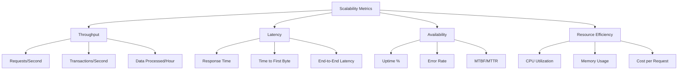

# Complete Scalability Guide for System Design
*Comprehensive reference covering horizontal scaling, vertical scaling, and scalability patterns*

## 📚 Table of Contents

1. [Scalability Fundamentals](#scalability-fundamentals)
2. [Vertical vs Horizontal Scaling](#vertical-vs-horizontal-scaling)
3. [Load Balancing](#load-balancing)
4. [Auto-scaling Strategies](#auto-scaling-strategies)
5. [Microservices Scaling](#microservices-scaling)
6. [Database Scaling](#database-scaling)
7. [Caching for Scalability](#caching-for-scalability)
8. [CDN and Edge Computing](#cdn-and-edge-computing)
9. [Message Queues and Event-Driven Architecture](#message-queues-and-event-driven-architecture)
10. [Performance Metrics and Monitoring](#performance-metrics-and-monitoring)
11. [Scalability Patterns](#scalability-patterns)
12. [Interview Questions](#interview-questions)

---

## ⚖️ Scalability Fundamentals

### What is Scalability?

**Scalability** is a system's ability to handle increased load by adding resources to the system. It's measured by:

- **Throughput**: Requests processed per unit time
- **Response Time**: Time to process a single request  
- **Resource Utilization**: Efficient use of CPU, memory, network, and storage
- **Cost Efficiency**: Performance per dollar spent

### Scalability Dimensions

| Dimension | Description | Example |
|-----------|-------------|---------|
| **Load Scalability** | Handle more concurrent users | 1K → 1M active users |
| **Space Scalability** | Handle larger datasets | 1GB → 1TB database |
| **Geographic Scalability** | Serve users across regions | Single DC → Global CDN |
| **Administrative Scalability** | Easy to manage at scale | 10 servers → 10,000 servers |

### Scalability Metrics



---

## 📈 Vertical vs Horizontal Scaling

### Vertical Scaling (Scale Up)

**Definition**: Adding more power (CPU, RAM, Storage) to existing machines

#### Advantages
- **Simple Implementation**: No code changes required
- **Consistent Performance**: Single-machine performance characteristics
- **Data Consistency**: No distributed system complexity
- **Lower Network Overhead**: All processing on one machine

#### Disadvantages  
- **Single Point of Failure**: If machine fails, entire system down
- **Hardware Limits**: Physical constraints on CPU/RAM upgrades
- **Cost Inefficiency**: High-end hardware has exponential cost increase
- **Downtime for Upgrades**: System must be stopped to add hardware

```java
// Example: Vertical scaling approach
@Configuration
public class DatabaseConfig {
    
    @Bean
    @Primary
    public DataSource primaryDataSource() {
        HikariConfig config = new HikariConfig();
        config.setJdbcUrl("jdbc:postgresql://powerful-db-server:5432/mydb");
        config.setMaximumPoolSize(100); // Increase connection pool
        config.setCachePrepStmts(true);
        config.setPrepStmtCacheSize(512); // Larger prepared statement cache
        config.setPrepStmtCacheSqlLimit(1024);
        
        return new HikariDataSource(config);
    }
    
    @Bean
    public RedisTemplate<String, Object> redisTemplate() {
        RedisTemplate<String, Object> template = new RedisTemplate<>();
        
        // Use more powerful Redis instance
        LettuceConnectionFactory factory = new LettuceConnectionFactory(
            "powerful-redis-server", 6379);
        template.setConnectionFactory(factory);
        
        return template;
    }
}
```

### Horizontal Scaling (Scale Out)

**Definition**: Adding more machines to the resource pool

#### Advantages
- **Better Fault Tolerance**: Failure of one machine doesn't bring down system
- **Unlimited Scaling**: Can add machines indefinitely  
- **Cost Effective**: Use commodity hardware
- **Geographic Distribution**: Machines can be in different locations

#### Disadvantages
- **Complexity**: Distributed system challenges (consistency, coordination)
- **Network Latency**: Communication between machines
- **Data Consistency**: CAP theorem constraints
- **Load Distribution**: Need load balancing strategies

```java
// Example: Horizontal scaling approach
@Configuration
public class HorizontalScalingConfig {
    
    @Bean
    public List<DataSource> databaseShards() {
        List<DataSource> shards = new ArrayList<>();
        
        // Multiple database shards
        for (int i = 1; i <= 4; i++) {
            HikariConfig config = new HikariConfig();
            config.setJdbcUrl("jdbc:postgresql://db-shard-" + i + ":5432/shard" + i);
            config.setMaximumPoolSize(25); // Smaller pool per shard
            shards.add(new HikariDataSource(config));
        }
        
        return shards;
    }
    
    @Bean
    public ShardingStrategy shardingStrategy() {
        return new ConsistentHashShardingStrategy();
    }
    
    @Bean
    public RedisClusterConfiguration redisClusterConfig() {
        return new RedisClusterConfiguration()
            .clusterNode("redis-1", 6379)
            .clusterNode("redis-2", 6379)  
            .clusterNode("redis-3", 6379)
            .clusterNode("redis-4", 6379);
    }
}

@Service
public class UserService {
    
    @Autowired
    private List<DataSource> databaseShards;
    
    @Autowired
    private ShardingStrategy shardingStrategy;
    
    public User findUser(Long userId) {
        // Determine which shard contains this user
        int shardIndex = shardingStrategy.getShardIndex(userId, databaseShards.size());
        DataSource shard = databaseShards.get(shardIndex);
        
        // Query the appropriate shard
        try (Connection conn = shard.getConnection()) {
            PreparedStatement stmt = conn.prepareStatement(
                "SELECT * FROM users WHERE user_id = ?");
            stmt.setLong(1, userId);
            
            ResultSet rs = stmt.executeQuery();
            if (rs.next()) {
                return mapResultSetToUser(rs);
            }
        } catch (SQLException e) {
            throw new DatabaseException("Failed to fetch user", e);
        }
        
        return null;
    }
}
```

### When to Choose Each Approach

| Scenario | Vertical Scaling | Horizontal Scaling |
|----------|------------------|-------------------|
| **Early Stage Startup** | ✅ Simple, fast to implement | ❌ Complex, time-consuming |
| **Predictable Load** | ✅ Good for steady growth | ⚖️ Either works |
| **Tight Budget** | ❌ Expensive high-end hardware | ✅ Commodity hardware |
| **High Availability Required** | ❌ Single point of failure | ✅ Fault tolerance |
| **Massive Scale (1M+ users)** | ❌ Hardware limits | ✅ Unlimited scaling |
| **Geographic Distribution** | ❌ Single location | ✅ Multiple regions |

---

## ⚖️ Load Balancing

### Load Balancing Strategies

#### Round Robin

```java
@Component
public class RoundRobinLoadBalancer implements LoadBalancer {
    
    private final List<Server> servers;
    private final AtomicInteger currentIndex = new AtomicInteger(0);
    
    public RoundRobinLoadBalancer(List<Server> servers) {
        this.servers = servers;
    }
    
    @Override
    public Server selectServer() {
        if (servers.isEmpty()) {
            return null;
        }
        
        int index = currentIndex.getAndIncrement() % servers.size();
        return servers.get(index);
    }
}
```

#### Weighted Round Robin

```java
@Component  
public class WeightedRoundRobinLoadBalancer implements LoadBalancer {
    
    private final List<WeightedServer> servers;
    private final AtomicInteger currentWeight = new AtomicInteger(0);
    
    @Override
    public Server selectServer() {
        if (servers.isEmpty()) return null;
        
        int totalWeight = servers.stream()
            .mapToInt(WeightedServer::getWeight)
            .sum();
            
        int currentPos = currentWeight.getAndIncrement() % totalWeight;
        
        int weightSum = 0;
        for (WeightedServer server : servers) {
            weightSum += server.getWeight();
            if (currentPos < weightSum) {
                return server.getServer();
            }
        }
        
        return servers.get(0).getServer(); // Fallback
    }
}

@Data
public class WeightedServer {
    private final Server server;
    private final int weight; // Higher weight = more requests
    
    // Server with weight 3 gets 3x more requests than weight 1
}
```

#### Least Connections

```java
@Component
public class LeastConnectionsLoadBalancer implements LoadBalancer {
    
    private final List<Server> servers;
    private final ConcurrentHashMap<Server, AtomicInteger> connectionCounts;
    
    public LeastConnectionsLoadBalancer(List<Server> servers) {
        this.servers = servers;
        this.connectionCounts = new ConcurrentHashMap<>();
        
        // Initialize connection counts
        servers.forEach(server -> 
            connectionCounts.put(server, new AtomicInteger(0)));
    }
    
    @Override
    public Server selectServer() {
        return servers.stream()
            .filter(Server::isHealthy)
            .min(Comparator.comparingInt(server -> 
                connectionCounts.get(server).get()))
            .orElse(null);
    }
    
    public void incrementConnections(Server server) {
        connectionCounts.get(server).incrementAndGet();
    }
    
    public void decrementConnections(Server server) {
        connectionCounts.get(server).decrementAndGet();
    }
}
```

#### Consistent Hashing (For Stateful Services)

```java
@Component
public class ConsistentHashLoadBalancer implements LoadBalancer {
    
    private final TreeMap<Long, Server> ring = new TreeMap<>();
    private final List<Server> servers;
    private final int virtualNodes = 150; // Virtual nodes per physical server
    
    public ConsistentHashLoadBalancer(List<Server> servers) {
        this.servers = servers;
        buildRing();
    }
    
    private void buildRing() {
        ring.clear();
        
        for (Server server : servers) {
            for (int i = 0; i < virtualNodes; i++) {
                String virtualNodeKey = server.getId() + "#" + i;
                long hash = hash(virtualNodeKey);
                ring.put(hash, server);
            }
        }
    }
    
    @Override
    public Server selectServer(String key) {
        if (ring.isEmpty()) return null;
        
        long hash = hash(key);
        Map.Entry<Long, Server> entry = ring.ceilingEntry(hash);
        
        // Wrap around if needed
        if (entry == null) {
            entry = ring.firstEntry();
        }
        
        return entry.getValue();
    }
    
    private long hash(String key) {
        // Use MD5 or FNV hash
        return key.hashCode() & 0x7FFFFFFF; // Ensure positive
    }
    
    public void addServer(Server server) {
        servers.add(server);
        buildRing(); // Rebuild ring
    }
    
    public void removeServer(Server server) {
        servers.remove(server);
        buildRing(); // Rebuild ring
    }
}
```

### Load Balancer Types

#### Layer 4 (Transport Layer) Load Balancing

```nginx
# Example: NGINX TCP Load Balancing
upstream backend {
    server 192.168.1.10:8080 weight=3;
    server 192.168.1.11:8080 weight=2;  
    server 192.168.1.12:8080 weight=1;
    server 192.168.1.13:8080 backup;
}

server {
    listen 80;
    proxy_pass backend;
    proxy_timeout 3s;
    proxy_responses 1;
}
```

**Characteristics:**
- ✅ **Fast**: No packet inspection
- ✅ **Protocol Agnostic**: Works with any TCP/UDP traffic
- ❌ **Limited Logic**: Can't make decisions based on content

#### Layer 7 (Application Layer) Load Balancing

```nginx
# Example: NGINX HTTP Load Balancing
upstream api_servers {
    server api1.company.com:8080;
    server api2.company.com:8080;
    server api3.company.com:8080;
}

upstream static_servers {
    server static1.company.com:80;
    server static2.company.com:80;
}

server {
    listen 80;
    server_name company.com;
    
    # Route API requests
    location /api/ {
        proxy_pass http://api_servers;
        proxy_set_header Host $host;
        proxy_set_header X-Real-IP $remote_addr;
        
        # Sticky sessions based on user ID
        hash $cookie_user_id consistent;
    }
    
    # Route static content
    location /static/ {
        proxy_pass http://static_servers;
        proxy_cache my_cache;
        proxy_cache_valid 200 24h;
    }
    
    # Route by user type
    location /admin/ {
        if ($cookie_user_type = "admin") {
            proxy_pass http://admin_servers;
        }
        return 403;
    }
}
```

**Characteristics:**
- ✅ **Smart Routing**: Content-based decisions
- ✅ **SSL Termination**: Handle HTTPS encryption/decryption
- ✅ **Caching**: Built-in caching capabilities
- ❌ **Higher Latency**: Packet inspection overhead

### Health Checks

```java
@Component
public class HealthCheckService {
    
    private final RestTemplate restTemplate;
    private final ScheduledExecutorService scheduler;
    private final ConcurrentHashMap<Server, Boolean> healthStatus;
    
    @PostConstruct
    public void startHealthChecks() {
        // Check every 30 seconds
        scheduler.scheduleAtFixedRate(this::performHealthChecks, 0, 30, TimeUnit.SECONDS);
    }
    
    private void performHealthChecks() {
        servers.parallelStream().forEach(server -> {
            boolean healthy = checkServerHealth(server);
            
            Boolean previousStatus = healthStatus.put(server, healthy);
            
            if (previousStatus != null && previousStatus != healthy) {
                if (healthy) {
                    logger.info("Server {} is now healthy", server.getUrl());
                    eventPublisher.publishEvent(new ServerHealthyEvent(server));
                } else {
                    logger.warn("Server {} is now unhealthy", server.getUrl());
                    eventPublisher.publishEvent(new ServerUnhealthyEvent(server));
                }
            }
        });
    }
    
    private boolean checkServerHealth(Server server) {
        try {
            ResponseEntity<String> response = restTemplate.exchange(
                server.getUrl() + "/health",
                HttpMethod.GET,
                null,
                String.class
            );
            
            return response.getStatusCode().is2xxSuccessful();
            
        } catch (Exception e) {
            logger.debug("Health check failed for server {}: {}", 
                server.getUrl(), e.getMessage());
            return false;
        }
    }
    
    public boolean isServerHealthy(Server server) {
        return healthStatus.getOrDefault(server, false);
    }
}
```

---

## 🔄 Auto-scaling Strategies

### Horizontal Pod Autoscaler (HPA) - Kubernetes

```yaml
# HPA Configuration
apiVersion: autoscaling/v2
kind: HorizontalPodAutoscaler
metadata:
  name: user-service-hpa
spec:
  scaleTargetRef:
    apiVersion: apps/v1
    kind: Deployment
    name: user-service
  minReplicas: 3
  maxReplicas: 50
  metrics:
  - type: Resource
    resource:
      name: cpu
      target:
        type: Utilization
        averageUtilization: 70
  - type: Resource  
    resource:
      name: memory
      target:
        type: Utilization
        averageUtilization: 80
  - type: Pods
    pods:
      metric:
        name: active_connections_per_pod
      target:
        type: AverageValue
        averageValue: "100"
  behavior:
    scaleDown:
      stabilizationWindowSeconds: 300 # 5 minutes
      policies:
      - type: Percent
        value: 10 # Scale down by 10% max
        periodSeconds: 60
    scaleUp:
      stabilizationWindowSeconds: 60 # 1 minute  
      policies:
      - type: Percent
        value: 50 # Scale up by 50% max
        periodSeconds: 30
```

### Custom Metrics Scaling

```java
@Component
public class CustomMetricsCollector {
    
    private final MeterRegistry meterRegistry;
    
    @EventListener
    public void handleUserLogin(UserLoginEvent event) {
        // Track active users
        meterRegistry.counter("active_users").increment();
    }
    
    @EventListener
    public void handleDatabaseConnection(DatabaseConnectionEvent event) {
        // Track database connection pool usage
        meterRegistry.gauge("db_connection_pool_usage", 
            event.getUsedConnections() / (double) event.getTotalConnections());
    }
    
    @Scheduled(fixedRate = 30000) // Every 30 seconds
    public void collectQueueMetrics() {
        // Monitor message queue depth
        int queueDepth = messageQueue.getQueueDepth();
        meterRegistry.gauge("message_queue_depth", queueDepth);
        
        // Trigger scaling if queue is backing up
        if (queueDepth > 1000) {
            eventPublisher.publishEvent(new ScaleUpEvent("Queue depth high: " + queueDepth));
        }
    }
}

// Custom HPA metric
apiVersion: v1
kind: ConfigMap
metadata:
  name: custom-metrics-config
data:
  config.yaml: |
    rules:
    - seriesQuery: 'message_queue_depth'
      resources:
        template: <<.Resource>>
      name:
        matches: "^(.*)_queue_depth$"
        as: "${1}_queue_depth_per_pod"
      metricsQuery: 'sum(<<.Series>>{<<.LabelMatchers>>}) by (<<.GroupBy>>)'
```

### Predictive Scaling

```java
@Service
public class PredictiveScalingService {
    
    @Autowired
    private MachineLearningPredictor mlPredictor;
    
    @Autowired
    private ScalingService scalingService;
    
    @Scheduled(fixedRate = 300000) // Every 5 minutes
    public void predictiveScale() {
        // Collect historical metrics
        List<MetricDataPoint> historicalData = metricsService.getHistoricalData(
            Duration.ofDays(7), Arrays.asList("cpu", "memory", "requests_per_second")
        );
        
        // Predict next hour's load
        PredictionResult prediction = mlPredictor.predict(
            historicalData, 
            Duration.ofHours(1)
        );
        
        // Calculate required capacity
        int currentReplicas = kubernetesService.getCurrentReplicas("user-service");
        int predictedReplicas = calculateRequiredReplicas(prediction);
        
        if (shouldPreScale(currentReplicas, predictedReplicas, prediction.getConfidence())) {
            logger.info("Predictive scaling: {} -> {} replicas (confidence: {}%)", 
                currentReplicas, predictedReplicas, prediction.getConfidence() * 100);
                
            scalingService.scaleGradually("user-service", predictedReplicas, Duration.ofMinutes(10));
        }
    }
    
    private boolean shouldPreScale(int current, int predicted, double confidence) {
        double changeRatio = Math.abs(predicted - current) / (double) current;
        
        // Only pre-scale if:
        // 1. Change is significant (>20%)
        // 2. Confidence is high (>85%)
        // 3. Not during low-traffic hours
        return changeRatio > 0.2 && 
               confidence > 0.85 && 
               !isLowTrafficPeriod();
    }
}
```

### Database Auto-scaling

```java
@Service
public class DatabaseAutoScalingService {
    
    @EventListener
    public void handleHighDatabaseLoad(DatabaseLoadEvent event) {
        if (event.getCpuUsage() > 80 && event.getDuration() > Duration.ofMinutes(5)) {
            // Scale up database vertically
            scaleUpDatabase(event.getDatabaseId());
        }
        
        if (event.getConnectionPoolUtilization() > 90) {
            // Scale out with read replicas
            addReadReplica(event.getDatabaseId());
        }
    }
    
    private void scaleUpDatabase(String databaseId) {
        DatabaseInstance instance = rdsService.describeDatabase(databaseId);
        String currentInstanceType = instance.getInstanceType();
        String nextInstanceType = getNextInstanceType(currentInstanceType);
        
        if (nextInstanceType != null && isMaintenanceWindow()) {
            logger.info("Scaling up database {} from {} to {}", 
                databaseId, currentInstanceType, nextInstanceType);
                
            rdsService.modifyDatabase(databaseId, nextInstanceType);
            
            // Schedule scale-down check for later
            scheduleScaleDownCheck(databaseId, Duration.ofHours(2));
        }
    }
    
    private void addReadReplica(String databaseId) {
        String replicaId = databaseId + "-replica-" + System.currentTimeMillis();
        
        logger.info("Creating read replica {} for database {}", replicaId, databaseId);
        
        rdsService.createReadReplica(databaseId, replicaId);
        
        // Update application configuration to use read replica
        updateReadOnlyDataSources(replicaId);
    }
}
```

---

## 🗄️ Database Scaling

### Read Replicas Pattern

```java
@Configuration
public class DatabaseReplicationConfig {
    
    @Bean
    @Primary
    public DataSource writeDataSource() {
        HikariConfig config = new HikariConfig();
        config.setJdbcUrl("jdbc:postgresql://master-db:5432/mydb");
        config.setUsername("writer");
        config.setPassword("write-password");
        config.setMaximumPoolSize(20);
        return new HikariDataSource(config);
    }
    
    @Bean
    public List<DataSource> readDataSources() {
        List<DataSource> readSources = new ArrayList<>();
        
        for (int i = 1; i <= 3; i++) {
            HikariConfig config = new HikariConfig();
            config.setJdbcUrl("jdbc:postgresql://read-replica-" + i + ":5432/mydb");
            config.setUsername("reader");
            config.setPassword("read-password");
            config.setMaximumPoolSize(50);
            config.setReadOnly(true);
            readSources.add(new HikariDataSource(config));
        }
        
        return readSources;
    }
    
    @Bean
    public ReadOnlyDataSource readOnlyDataSource(List<DataSource> readDataSources) {
        return new LoadBalancedReadOnlyDataSource(readDataSources);
    }
}

@Service
@Transactional
public class UserService {
    
    @Autowired
    private DataSource writeDataSource;
    
    @Autowired
    private ReadOnlyDataSource readOnlyDataSource;
    
    // Write operations go to master
    public User createUser(CreateUserRequest request) {
        try (Connection conn = writeDataSource.getConnection()) {
            PreparedStatement stmt = conn.prepareStatement(
                "INSERT INTO users (username, email) VALUES (?, ?) RETURNING *");
            stmt.setString(1, request.getUsername());
            stmt.setString(2, request.getEmail());
            
            ResultSet rs = stmt.executeQuery();
            if (rs.next()) {
                return mapResultSetToUser(rs);
            }
        } catch (SQLException e) {
            throw new DatabaseException("Failed to create user", e);
        }
        return null;
    }
    
    // Read operations go to replicas
    @Transactional(readOnly = true)
    public List<User> findUsers(UserSearchCriteria criteria) {
        try (Connection conn = readOnlyDataSource.getConnection()) {
            String sql = buildSearchQuery(criteria);
            PreparedStatement stmt = conn.prepareStatement(sql);
            setSearchParameters(stmt, criteria);
            
            ResultSet rs = stmt.executeQuery();
            return mapResultSetToUsers(rs);
        } catch (SQLException e) {
            throw new DatabaseException("Failed to search users", e);
        }
    }
}
```

### Database Sharding Implementation

```java
@Component
public class UserShardingStrategy implements ShardingStrategy {
    
    private final List<DataSource> shards;
    private final ConsistentHashRing hashRing;
    
    public UserShardingStrategy(List<DataSource> shards) {
        this.shards = shards;
        this.hashRing = new ConsistentHashRing(shards.size());
    }
    
    @Override
    public DataSource getShardForUser(Long userId) {
        int shardIndex = hashRing.getShardIndex(userId.toString());
        return shards.get(shardIndex);
    }
    
    @Override
    public List<DataSource> getAllShards() {
        return Collections.unmodifiableList(shards);
    }
    
    // For queries that need to search across shards
    public <T> List<T> queryAllShards(String sql, Object[] params, RowMapper<T> rowMapper) {
        List<CompletableFuture<List<T>>> futures = shards.stream()
            .map(shard -> CompletableFuture.supplyAsync(() -> 
                queryShardWithRetry(shard, sql, params, rowMapper)))
            .collect(Collectors.toList());
        
        return futures.stream()
            .flatMap(future -> future.join().stream())
            .collect(Collectors.toList());
    }
    
    private <T> List<T> queryShardWithRetry(DataSource shard, String sql, 
                                          Object[] params, RowMapper<T> rowMapper) {
        int maxRetries = 3;
        Exception lastException = null;
        
        for (int i = 0; i < maxRetries; i++) {
            try (Connection conn = shard.getConnection();
                 PreparedStatement stmt = conn.prepareStatement(sql)) {
                
                for (int j = 0; j < params.length; j++) {
                    stmt.setObject(j + 1, params[j]);
                }
                
                ResultSet rs = stmt.executeQuery();
                List<T> results = new ArrayList<>();
                
                while (rs.next()) {
                    results.add(rowMapper.mapRow(rs, rs.getRow()));
                }
                
                return results;
                
            } catch (SQLException e) {
                lastException = e;
                if (i < maxRetries - 1) {
                    try {
                        Thread.sleep(1000 * (i + 1)); // Exponential backoff
                    } catch (InterruptedException ie) {
                        Thread.currentThread().interrupt();
                        break;
                    }
                }
            }
        }
        
        throw new DatabaseException("Failed to query shard after retries", lastException);
    }
}

@Service
public class ShardedUserService {
    
    @Autowired
    private UserShardingStrategy shardingStrategy;
    
    public User findUser(Long userId) {
        DataSource shard = shardingStrategy.getShardForUser(userId);
        
        try (Connection conn = shard.getConnection()) {
            PreparedStatement stmt = conn.prepareStatement(
                "SELECT * FROM users WHERE user_id = ?");
            stmt.setLong(1, userId);
            
            ResultSet rs = stmt.executeQuery();
            if (rs.next()) {
                return mapResultSetToUser(rs);
            }
        } catch (SQLException e) {
            throw new DatabaseException("Failed to find user", e);
        }
        
        return null;
    }
    
    public List<User> searchUsers(String searchTerm, int limit) {
        // Cross-shard search
        String sql = "SELECT * FROM users WHERE username LIKE ? OR email LIKE ? LIMIT ?";
        Object[] params = {"%" + searchTerm + "%", "%" + searchTerm + "%", limit};
        
        List<User> allResults = shardingStrategy.queryAllShards(
            sql, params, this::mapResultSetToUser);
        
        // Sort and limit results across all shards
        return allResults.stream()
            .sorted(Comparator.comparing(User::getUsername))
            .limit(limit)
            .collect(Collectors.toList());
    }
}
```

---

## 💾 Caching for Scalability

### Multi-Level Caching Strategy

```java
@Configuration
public class CachingConfiguration {
    
    @Bean
    public CacheManager cacheManager() {
        return new CompositeCacheManager(
            l1CacheManager(), // In-memory L1 cache
            l2CacheManager()  // Redis L2 cache
        );
    }
    
    @Bean
    public CacheManager l1CacheManager() {
        CaffeineCacheManager manager = new CaffeineCacheManager();
        manager.setCaffeine(Caffeine.newBuilder()
            .maximumSize(10_000)
            .expireAfterWrite(5, TimeUnit.MINUTES)
            .expireAfterAccess(2, TimeUnit.MINUTES)
            .recordStats());
        return manager;
    }
    
    @Bean  
    public CacheManager l2CacheManager() {
        RedisCacheManager.Builder builder = RedisCacheManager.builder(redisConnectionFactory())
            .cacheDefaults(RedisCacheConfiguration.defaultCacheConfig()
                .entryTtl(Duration.ofMinutes(30))
                .serializeKeysWith(RedisSerializationContext.SerializationPair
                    .fromSerializer(new StringRedisSerializer()))
                .serializeValuesWith(RedisSerializationContext.SerializationPair
                    .fromSerializer(new GenericJackson2JsonRedisSerializer())));
        
        return builder.build();
    }
}

@Service
public class UserService {
    
    @Cacheable(value = "users", key = "#userId")
    public User findUser(Long userId) {
        logger.debug("Cache miss - fetching user {} from database", userId);
        return userRepository.findById(userId).orElse(null);
    }
    
    @CacheEvict(value = "users", key = "#user.id")
    public User updateUser(User user) {
        logger.debug("Evicting user {} from cache", user.getId());
        return userRepository.save(user);
    }
    
    @Caching(
        cacheable = @Cacheable(value = "user-profiles", key = "#userId"),
        evict = @CacheEvict(value = "users", key = "#userId")
    )
    public UserProfile getUserProfile(Long userId) {
        return userProfileRepository.findByUserId(userId);
    }
}
```

### Cache-Aside Pattern with Write-Through

```java
@Service
public class CacheAsideUserService {
    
    private final UserRepository userRepository;
    private final RedisTemplate<String, User> redisTemplate;
    private final Duration cacheExpiry = Duration.ofMinutes(30);
    
    public User getUser(Long userId) {
        String cacheKey = "user:" + userId;
        
        // Try cache first
        User cachedUser = redisTemplate.opsForValue().get(cacheKey);
        if (cachedUser != null) {
            logger.debug("Cache hit for user {}", userId);
            return cachedUser;
        }
        
        // Cache miss - fetch from database
        logger.debug("Cache miss for user {}", userId);
        User user = userRepository.findById(userId).orElse(null);
        
        if (user != null) {
            // Store in cache
            redisTemplate.opsForValue().set(cacheKey, user, cacheExpiry);
        }
        
        return user;
    }
    
    public User updateUser(User user) {
        String cacheKey = "user:" + user.getId();
        
        // Update database first
        User savedUser = userRepository.save(user);
        
        // Write-through: Update cache immediately
        redisTemplate.opsForValue().set(cacheKey, savedUser, cacheExpiry);
        
        // Also invalidate related caches
        invalidateRelatedCaches(savedUser);
        
        return savedUser;
    }
    
    private void invalidateRelatedCaches(User user) {
        // Invalidate user profile cache
        redisTemplate.delete("user-profile:" + user.getId());
        
        // Invalidate user's posts cache
        redisTemplate.delete("user-posts:" + user.getId());
        
        // Invalidate any cached search results that might include this user
        Set<String> searchKeys = redisTemplate.keys("search:users:*");
        if (!searchKeys.isEmpty()) {
            redisTemplate.delete(searchKeys);
        }
    }
}
```

### Distributed Cache Invalidation

```java
@Component
public class CacheInvalidationService {
    
    @Autowired
    private RedisTemplate<String, Object> redisTemplate;
    
    @Autowired
    private MessageProducer messageProducer;
    
    // Invalidate cache across all nodes
    public void invalidateGlobally(String cacheKey) {
        // Remove from local cache
        localCacheManager.evict(cacheKey);
        
        // Remove from distributed cache
        redisTemplate.delete(cacheKey);
        
        // Notify other nodes to invalidate their local caches
        CacheInvalidationMessage message = new CacheInvalidationMessage(cacheKey);
        messageProducer.send("cache.invalidation", message);
    }
    
    @EventListener
    public void handleCacheInvalidation(CacheInvalidationMessage message) {
        if (!message.getOriginNodeId().equals(getCurrentNodeId())) {
            // Invalidate local cache on other nodes
            localCacheManager.evict(message.getCacheKey());
            logger.debug("Invalidated local cache key: {}", message.getCacheKey());
        }
    }
    
    // Cache warming strategy
    @EventListener
    public void handleApplicationStart(ApplicationReadyEvent event) {
        warmupCache();
    }
    
    private void warmupCache() {
        logger.info("Starting cache warmup...");
        
        // Warm up frequently accessed data
        List<Long> popularUserIds = userService.getMostActiveUserIds(1000);
        
        popularUserIds.parallelStream().forEach(userId -> {
            try {
                userService.findUser(userId); // This will populate cache
            } catch (Exception e) {
                logger.warn("Failed to warm up cache for user {}", userId, e);
            }
        });
        
        logger.info("Cache warmup completed");
    }
}
```

---

## 🌐 CDN and Edge Computing

### CDN Configuration Strategy

```java
@Configuration
public class CdnConfiguration {
    
    @Value("${cdn.base-url}")
    private String cdnBaseUrl;
    
    @Bean
    public CdnService cdnService() {
        return new CloudFrontCdnService(cdnBaseUrl);
    }
    
    @Bean
    public StaticResourceService staticResourceService() {
        return new StaticResourceService(cdnService());
    }
}

@Service  
public class StaticResourceService {
    
    private final CdnService cdnService;
    private final S3Service s3Service;
    
    public String uploadAndGetCdnUrl(MultipartFile file, String path) {
        // Upload to S3 origin
        String s3Key = s3Service.upload(file, path);
        
        // Generate CDN URL
        String cdnUrl = cdnService.generateUrl(s3Key);
        
        // Pre-warm CDN edge locations
        cdnService.prewarmContent(s3Key, getPopularEdgeLocations());
        
        return cdnUrl;
    }
    
    public void invalidateCdnCache(String path) {
        // Invalidate CDN cache when content changes
        cdnService.createInvalidation(Arrays.asList(path));
        
        logger.info("Created CDN invalidation for path: {}", path);
    }
    
    private List<String> getPopularEdgeLocations() {
        // Return edge locations based on user geography
        return Arrays.asList("us-east-1", "eu-west-1", "ap-south-1");
    }
}
```

### Edge Computing with Lambda@Edge

```javascript
// Lambda@Edge function for dynamic content optimization
exports.handler = async (event) => {
    const request = event.Records[0].cf.request;
    const headers = request.headers;
    
    // Device detection
    const userAgent = headers['user-agent'][0].value;
    const isMobile = /Mobile|Android|iPhone|iPad/.test(userAgent);
    
    // Geo-based routing
    const country = headers['cloudfront-viewer-country'][0].value;
    
    // Modify request based on client characteristics
    if (isMobile) {
        // Route mobile users to mobile-optimized content
        request.uri = request.uri.replace('/api/', '/mobile-api/');
    }
    
    // Add geo-specific headers
    request.headers['x-user-country'] = [{
        key: 'X-User-Country',
        value: country
    }];
    
    // A/B testing based on user location
    if (country === 'US') {
        request.headers['x-feature-flag'] = [{
            key: 'X-Feature-Flag', 
            value: 'new-checkout-flow'
        }];
    }
    
    return request;
};
```

### Edge Caching Strategy

```java
@RestController
@RequestMapping("/api")
public class CacheOptimizedController {
    
    // Long-term caching for static content
    @GetMapping("/static/{resource}")
    public ResponseEntity<Resource> getStaticResource(@PathVariable String resource) {
        Resource resourceFile = resourceService.getResource(resource);
        
        return ResponseEntity.ok()
            .cacheControl(CacheControl.maxAge(365, TimeUnit.DAYS)
                .cachePublic()
                .immutable())
            .eTag(resourceService.getETag(resource))
            .body(resourceFile);
    }
    
    // Short-term caching for dynamic content
    @GetMapping("/users/{id}/profile")
    public ResponseEntity<UserProfile> getUserProfile(@PathVariable Long id) {
        UserProfile profile = userService.getUserProfile(id);
        
        return ResponseEntity.ok()
            .cacheControl(CacheControl.maxAge(5, TimeUnit.MINUTES)
                .cachePrivate())
            .eTag(String.valueOf(profile.getLastModified().hashCode()))
            .lastModified(profile.getLastModified())
            .body(profile);
    }
    
    // No-cache for sensitive data
    @GetMapping("/users/{id}/financial")
    public ResponseEntity<FinancialData> getFinancialData(@PathVariable Long id) {
        FinancialData data = financialService.getUserFinancialData(id);
        
        return ResponseEntity.ok()
            .cacheControl(CacheControl.noCache().noStore().mustRevalidate())
            .header("Pragma", "no-cache")
            .body(data);
    }
}
```

---

## ❓ Interview Questions

### Fundamental Scalability Questions

**Q: Explain the difference between horizontal and vertical scaling with real examples.**

A: **Vertical Scaling (Scale Up):**
- **Definition**: Adding more power (CPU, RAM, storage) to existing machines
- **Example**: Upgrading database server from 8GB RAM to 32GB RAM
- **Pros**: Simple, no code changes, data consistency
- **Cons**: Single point of failure, hardware limits, exponential cost increase

**Horizontal Scaling (Scale Out):**
- **Definition**: Adding more machines to handle increased load
- **Example**: Increasing web servers from 2 to 10 instances behind load balancer
- **Pros**: Better fault tolerance, unlimited scaling, cost-effective
- **Cons**: Complexity, network latency, data consistency challenges

```java
// Vertical scaling example
@Configuration
public class VerticalScalingConfig {
    @Bean
    public DataSource dataSource() {
        // Single powerful database server
        HikariConfig config = new HikariConfig();
        config.setJdbcUrl("jdbc:postgresql://powerful-db-server:5432/mydb");
        config.setMaximumPoolSize(200); // Large connection pool
        return new HikariDataSource(config);
    }
}

// Horizontal scaling example
@Configuration  
public class HorizontalScalingConfig {
    @Bean
    public List<DataSource> databaseShards() {
        // Multiple smaller database servers
        return IntStream.range(1, 5)
            .mapToObj(i -> createShard("db-shard-" + i))
            .collect(Collectors.toList());
    }
}
```

**Q: How would you design a load balancer that can handle 1 million requests per second?**

A: **Multi-layer Load Balancing Architecture:**

```java
// 1. DNS-based load balancing (Geographic distribution)
public class GeographicDnsLoadBalancer {
    
    public String resolveRegion(String clientIp) {
        GeoLocation location = geoService.getLocation(clientIp);
        
        return switch (location.getContinent()) {
            case "North America" -> "us-east-1.api.company.com";
            case "Europe" -> "eu-west-1.api.company.com";  
            case "Asia" -> "ap-south-1.api.company.com";
            default -> "us-east-1.api.company.com";
        };
    }
}

// 2. L4 Load Balancer (High throughput)
public class Layer4LoadBalancer {
    
    private final List<Server> servers;
    private final AtomicLong requestCounter = new AtomicLong(0);
    
    // Simple round-robin for maximum throughput
    public Server selectServer() {
        long request = requestCounter.getAndIncrement();
        int index = (int) (request % servers.size());
        return servers.get(index);
    }
}

// 3. L7 Load Balancer (Intelligent routing)
public class Layer7LoadBalancer {
    
    public Server selectServer(HttpRequest request) {
        // Route based on request characteristics
        if (request.getPath().startsWith("/api/heavy")) {
            return highPerformanceServers.selectServer();
        } else if (request.getPath().startsWith("/api/auth")) {
            return authenticationServers.selectServer();
        }
        
        return generalPurposeServers.selectServer();
    }
}
```

**Architecture Components:**
1. **CDN Layer**: Handle static content (reduces 60-80% of requests)
2. **DNS Load Balancing**: Geographic distribution
3. **L4 Load Balancers**: High-throughput routing (2-3 layers)
4. **L7 Load Balancers**: Intelligent routing and SSL termination
5. **Auto-scaling Groups**: Dynamic server provisioning
6. **Health Checks**: Automatic failover

**Capacity Planning:**
- **CDN**: Handles 600K-800K static requests/second
- **L4 Load Balancers**: 200K-400K requests/second each (3-5 instances)
- **Application Servers**: 10K requests/second each (100-200 instances)
- **Database**: Sharded across multiple clusters

### Advanced Scalability Questions

**Q: Design a caching strategy for a social media feed that serves 100M users.**

A: **Multi-Layer Caching Architecture:**

```java
// 1. User Timeline Cache (Individual user feeds)
@Service
public class TimelineCacheService {
    
    private static final String TIMELINE_KEY = "timeline:%s"; // userId
    private static final Duration TIMELINE_TTL = Duration.ofHours(2);
    
    public List<Post> getUserTimeline(Long userId, int limit) {
        String cacheKey = String.format(TIMELINE_KEY, userId);
        
        // Try cache first
        List<Post> cachedTimeline = redisTemplate.opsForList()
            .range(cacheKey, 0, limit - 1)
            .stream()
            .map(this::deserializePost)
            .collect(Collectors.toList());
            
        if (cachedTimeline.size() >= limit) {
            return cachedTimeline;
        }
        
        // Cache miss - generate timeline
        List<Post> timeline = timelineGenerationService.generateTimeline(userId, limit);
        
        // Cache the timeline
        cacheTimeline(cacheKey, timeline);
        
        return timeline;
    }
    
    private void cacheTimeline(String cacheKey, List<Post> timeline) {
        List<String> serializedPosts = timeline.stream()
            .map(this::serializePost)
            .collect(Collectors.toList());
            
        redisTemplate.opsForList().rightPushAll(cacheKey, serializedPosts);
        redisTemplate.expire(cacheKey, TIMELINE_TTL);
    }
}

// 2. Hot Content Cache (Popular posts)
@Service
public class HotContentCacheService {
    
    private final LoadingCache<Long, Post> hotPostsCache;
    
    public HotContentCacheService() {
        this.hotPostsCache = Caffeine.newBuilder()
            .maximumSize(100_000) // Top 100K hot posts
            .expireAfterWrite(15, TimeUnit.MINUTES)
            .recordStats()
            .buildAsync((postId, executor) -> 
                CompletableFuture.supplyAsync(() -> postService.getPost(postId), executor));
    }
    
    @EventListener
    public void handlePostEngagement(PostEngagementEvent event) {
        // Update hot posts based on engagement
        if (event.getEngagementScore() > HOT_THRESHOLD) {
            hotPostsCache.put(event.getPostId(), event.getPost());
        }
    }
}

// 3. Push vs Pull Model
@Service
public class HybridFeedService {
    
    // Push model for users with few followers (< 1000)
    public void pushToFollowerFeeds(Post newPost) {
        User author = newPost.getAuthor();
        
        if (author.getFollowerCount() < 1000) {
            // Push to all followers' timelines
            List<Long> followerIds = userService.getFollowerIds(author.getId());
            
            followerIds.parallelStream().forEach(followerId -> {
                String timelineKey = String.format(TIMELINE_KEY, followerId);
                redisTemplate.opsForList().leftPush(timelineKey, serializePost(newPost));
                
                // Trim timeline to prevent unlimited growth
                redisTemplate.opsForList().trim(timelineKey, 0, 999); // Keep latest 1000 posts
            });
        } else {
            // Pull model for celebrities (> 1000 followers)
            // Store in celebrity posts cache for on-demand retrieval
            celebrityPostsCache.put(author.getId(), newPost);
        }
    }
    
    // Hybrid timeline generation
    public List<Post> generateTimeline(Long userId, int limit) {
        List<Post> timeline = new ArrayList<>();
        
        // Get pushed posts from cache
        List<Post> pushedPosts = getPushedPosts(userId);
        timeline.addAll(pushedPosts);
        
        // Pull posts from celebrities user follows
        List<Long> celebrityIds = userService.getCelebrityFollowees(userId);
        for (Long celebrityId : celebrityIds) {
            List<Post> celebrityPosts = getCelebrityPosts(celebrityId, limit / 4);
            timeline.addAll(celebrityPosts);
        }
        
        // Sort by timestamp and limit
        return timeline.stream()
            .sorted(Comparator.comparing(Post::getCreatedAt).reversed())
            .limit(limit)
            .collect(Collectors.toList());
    }
}
```

**Caching Strategy Breakdown:**

1. **L1 Cache (Application Level)**:
   - Hot posts cache (100K most popular posts)
   - User session cache
   - CDN cache for media content

2. **L2 Cache (Distributed Redis)**:
   - User timelines (2-hour TTL)
   - Celebrity posts cache
   - Trending topics cache

3. **L3 Cache (Database Level)**:
   - Query result caching
   - Connection pooling
   - Database buffer pool optimization

4. **Cache Invalidation Strategy**:
   - Event-driven invalidation
   - TTL-based expiration
   - LRU eviction for memory management

**Q: How would you handle database scaling for an application with 1TB of data growing at 100GB/month?**

A: **Progressive Database Scaling Strategy:**

```java
// Phase 1: Vertical Scaling + Read Replicas (0-500GB)
@Configuration
public class Phase1DatabaseConfig {
    
    @Bean
    @Primary
    public DataSource masterDataSource() {
        // High-performance master DB
        HikariConfig config = new HikariConfig();
        config.setJdbcUrl("jdbc:postgresql://master-db-large:5432/mydb");
        config.setMaximumPoolSize(50);
        return new HikariDataSource(config);
    }
    
    @Bean
    public List<DataSource> readReplicas() {
        return IntStream.range(1, 4) // 3 read replicas
            .mapToObj(i -> createReadReplica("read-replica-" + i))
            .collect(Collectors.toList());
    }
}

// Phase 2: Horizontal Partitioning (500GB-2TB)
@Service
public class PartitionedUserService {
    
    // Partition by date ranges
    public List<Order> getOrderHistory(Long userId, LocalDate startDate, LocalDate endDate) {
        List<DataSource> relevantPartitions = datePartitionService
            .getPartitionsForDateRange(startDate, endDate);
            
        List<CompletableFuture<List<Order>>> futures = relevantPartitions.stream()
            .map(partition -> CompletableFuture.supplyAsync(() -> 
                queryOrdersFromPartition(partition, userId, startDate, endDate)))
            .collect(Collectors.toList());
            
        return futures.stream()
            .flatMap(future -> future.join().stream())
            .sorted(Comparator.comparing(Order::getCreatedAt))
            .collect(Collectors.toList());
    }
}

// Phase 3: Sharding by User ID (2TB+)
@Service
public class ShardedUserService {
    
    private final ConsistentHashRing shardRing;
    private final Map<String, DataSource> shardDataSources;
    
    public User getUser(Long userId) {
        String shardId = shardRing.getShardId(userId.toString());
        DataSource shard = shardDataSources.get(shardId);
        
        return executeOnShard(shard, userId);
    }
    
    // Cross-shard operations with eventual consistency
    @Async
    public CompletableFuture<List<User>> searchUsersAcrossShards(String searchTerm) {
        List<CompletableFuture<List<User>>> shardResults = shardDataSources.values()
            .stream()
            .map(shard -> CompletableFuture.supplyAsync(() -> 
                searchUsersInShard(shard, searchTerm)))
            .collect(Collectors.toList());
            
        return CompletableFuture.allOf(shardResults.toArray(new CompletableFuture[0]))
            .thenApply(v -> shardResults.stream()
                .flatMap(future -> future.join().stream())
                .collect(Collectors.toList()));
    }
}

// Phase 4: Data Archival Strategy  
@Service
public class DataArchivalService {
    
    @Scheduled(cron = "0 0 2 * * ?") // Daily at 2 AM
    public void archiveOldData() {
        LocalDate archiveCutoff = LocalDate.now().minusYears(2);
        
        // Move old data to cheaper storage
        long archivedRecords = dataArchivalRepository.archiveDataOlderThan(archiveCutoff);
        
        logger.info("Archived {} records older than {}", archivedRecords, archiveCutoff);
        
        // Update data retention policies
        updateRetentionPolicies();
    }
    
    private void updateRetentionPolicies() {
        // Adjust backup retention
        backupService.updateRetentionPolicy(Duration.ofDays(30)); // Keep recent backups
        
        // Update analytics data retention  
        analyticsService.updateRetentionPolicy(Duration.ofYears(1));
    }
}
```

**Scaling Progression:**

1. **0-500GB**: Vertical scaling + read replicas
2. **500GB-2TB**: Add horizontal partitioning by date/category  
3. **2TB+**: Implement user-based sharding
4. **5TB+**: Add data archival and tiered storage

**Key Considerations:**
- **Data Growth**: 100GB/month = 1.2TB/year
- **Query Patterns**: Optimize sharding key based on access patterns
- **Cross-shard Queries**: Minimize with proper data modeling
- **Backup Strategy**: Shard-level backups with point-in-time recovery
- **Monitoring**: Track shard balance and performance metrics

---

## 🏷️ Tags

#scalability #horizontal-scaling #vertical-scaling #load-balancing #auto-scaling #database-scaling #caching #cdn #performance #system-design #microservices #distributed-systems #sde2

## 📚 Related Topics

- [[Database-Guide|Database Design and Optimization]]
- [[Caching-Guide|Advanced Caching Strategies]]
- [[Load-Balancing-Guide|Load Balancing Patterns]]
- [[Microservices-Guide|Microservices Architecture]]
- [[Performance-Guide|Performance Optimization]]