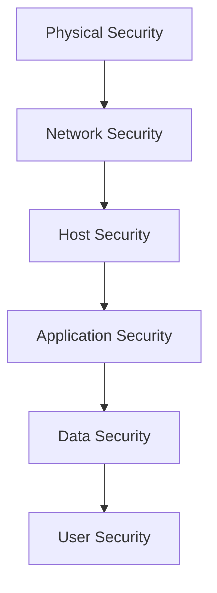

# Complete Security Guide for SDE2 Interviews
*Comprehensive reference covering security fundamentals, best practices, and common vulnerabilities*

## 📚 Table of Contents

1. [Security Fundamentals](#security-fundamentals)
2. [Authentication and Authorization](#authentication-and-authorization)
3. [OWASP Top 10 Vulnerabilities](#owasp-top-10-vulnerabilities)
4. [Cryptography Basics](#cryptography-basics)
5. [Secure Coding Practices](#secure-coding-practices)
6. [API Security](#api-security)
7. [Database Security](#database-security)
8. [Web Application Security](#web-application-security)
9. [Infrastructure Security](#infrastructure-security)
10. [Security Testing](#security-testing)
11. [Incident Response](#incident-response)
12. [Interview Questions](#interview-questions)

---

## 🛡️ Security Fundamentals

### CIA Triad

| Principle | Definition | Examples |
|-----------|------------|----------|
| **Confidentiality** | Information accessible only to authorized users | Encryption, Access controls |
| **Integrity** | Information remains unaltered | Hashing, Digital signatures |
| **Availability** | Information accessible when needed | Load balancing, Redundancy |

### Defense in Depth



### Security by Design Principles

1. **Least Privilege**: Minimum necessary access
2. **Fail Securely**: Secure defaults on failure
3. **Defense in Depth**: Multiple security layers
4. **Zero Trust**: Never trust, always verify
5. **Separation of Concerns**: Isolate security functions
6. **Keep it Simple**: Complexity increases attack surface

---

## 🔐 Authentication and Authorization

### Authentication Methods

#### Password-Based Authentication

```java
@Component
public class PasswordAuthenticator {
    private final PasswordEncoder passwordEncoder = new BCryptPasswordEncoder();
    
    public boolean authenticate(String username, String password) {
        User user = userRepository.findByUsername(username);
        if (user == null) {
            // Prevent username enumeration
            passwordEncoder.encode(password); // Time-constant operation
            return false;
        }
        
        return passwordEncoder.matches(password, user.getPasswordHash());
    }
    
    public String hashPassword(String plainPassword) {
        // BCrypt with salt - automatically handles salt generation
        return passwordEncoder.encode(plainPassword);
    }
}
```

#### Multi-Factor Authentication (MFA)

```java
@Service
public class MfaService {
    private final TotpGenerator totpGenerator = new TotpGenerator();
    
    public String generateSecret() {
        return totpGenerator.generateSecret();
    }
    
    public boolean validateTotp(String secret, String userCode) {
        String expectedCode = totpGenerator.generateCode(secret);
        
        // Time window tolerance (±30 seconds)
        return userCode.equals(expectedCode) ||
               userCode.equals(totpGenerator.generateCode(secret, -1)) ||
               userCode.equals(totpGenerator.generateCode(secret, 1));
    }
    
    public QrCode generateQrCode(String username, String secret) {
        String otpAuthUrl = String.format(
            "otpauth://totp/%s?secret=%s&issuer=MyApp",
            username, secret
        );
        return QrCodeGenerator.generate(otpAuthUrl);
    }
}
```

### JWT Token Security

#### Secure JWT Implementation

```java
@Component
public class JwtTokenProvider {
    private final String secretKey;
    private final long validityInMilliseconds;
    
    public JwtTokenProvider(
            @Value("${jwt.secret}") String secretKey,
            @Value("${jwt.validity}") long validity) {
        this.secretKey = Base64.getEncoder().encodeToString(secretKey.getBytes());
        this.validityInMilliseconds = validity;
    }
    
    public String createToken(String username, List<String> roles) {
        Claims claims = Jwts.claims().setSubject(username);
        claims.put("roles", roles);
        claims.put("iat", System.currentTimeMillis());
        
        Date now = new Date();
        Date validity = new Date(now.getTime() + validityInMilliseconds);
        
        return Jwts.builder()
            .setClaims(claims)
            .setIssuedAt(now)
            .setExpiration(validity)
            .signWith(SignatureAlgorithm.HS256, secretKey)
            .compact();
    }
    
    public boolean validateToken(String token) {
        try {
            Jwts.parser()
                .setSigningKey(secretKey)
                .parseClaimsJws(token);
            return true;
        } catch (JwtException | IllegalArgumentException e) {
            return false;
        }
    }
    
    public String getUsername(String token) {
        return Jwts.parser()
            .setSigningKey(secretKey)
            .parseClaimsJws(token)
            .getBody()
            .getSubject();
    }
}
```

#### Refresh Token Pattern

```java
@Entity
public class RefreshToken {
    @Id
    private String token;
    private String username;
    private LocalDateTime expiryDate;
    private boolean revoked;
    
    public boolean isExpired() {
        return LocalDateTime.now().isAfter(expiryDate);
    }
}

@Service
public class RefreshTokenService {
    
    public RefreshToken createRefreshToken(String username) {
        RefreshToken refreshToken = new RefreshToken();
        refreshToken.setToken(UUID.randomUUID().toString());
        refreshToken.setUsername(username);
        refreshToken.setExpiryDate(LocalDateTime.now().plusDays(7));
        
        return refreshTokenRepository.save(refreshToken);
    }
    
    public Optional<RefreshToken> findByToken(String token) {
        return refreshTokenRepository.findByToken(token);
    }
    
    public RefreshToken verifyExpiration(RefreshToken token) {
        if (token.isExpired()) {
            refreshTokenRepository.delete(token);
            throw new TokenRefreshException("Refresh token expired");
        }
        return token;
    }
}
```

### OAuth 2.0 Implementation

```java
@RestController
public class OAuthController {
    
    @PostMapping("/oauth/token")
    public ResponseEntity<TokenResponse> getToken(
            @RequestParam String grant_type,
            @RequestParam String client_id,
            @RequestParam String client_secret,
            @RequestParam(required = false) String username,
            @RequestParam(required = false) String password,
            @RequestParam(required = false) String refresh_token) {
        
        switch (grant_type) {
            case "password":
                return handlePasswordGrant(client_id, client_secret, username, password);
            case "refresh_token":
                return handleRefreshTokenGrant(client_id, client_secret, refresh_token);
            case "client_credentials":
                return handleClientCredentialsGrant(client_id, client_secret);
            default:
                throw new InvalidGrantTypeException("Unsupported grant type");
        }
    }
    
    private ResponseEntity<TokenResponse> handlePasswordGrant(
            String clientId, String clientSecret, String username, String password) {
        
        // Validate client credentials
        if (!clientService.validateClient(clientId, clientSecret)) {
            throw new InvalidClientException("Invalid client credentials");
        }
        
        // Authenticate user
        if (!authService.authenticate(username, password)) {
            throw new InvalidUserCredentialsException("Invalid user credentials");
        }
        
        // Generate tokens
        String accessToken = jwtTokenProvider.createAccessToken(username);
        RefreshToken refreshToken = refreshTokenService.createRefreshToken(username);
        
        return ResponseEntity.ok(new TokenResponse(accessToken, refreshToken.getToken()));
    }
}
```

### Role-Based Access Control (RBAC)

```java
@Entity
public class User {
    @Id
    private String id;
    private String username;
    
    @ManyToMany(fetch = FetchType.LAZY)
    @JoinTable(name = "user_roles",
        joinColumns = @JoinColumn(name = "user_id"),
        inverseJoinColumns = @JoinColumn(name = "role_id"))
    private Set<Role> roles = new HashSet<>();
}

@Entity
public class Role {
    @Id
    private String id;
    private String name;
    
    @ManyToMany(mappedBy = "roles")
    private Set<User> users = new HashSet<>();
    
    @ManyToMany(fetch = FetchType.LAZY)
    @JoinTable(name = "role_permissions",
        joinColumns = @JoinColumn(name = "role_id"),
        inverseJoinColumns = @JoinColumn(name = "permission_id"))
    private Set<Permission> permissions = new HashSet<>();
}

@Component
public class AuthorizationService {
    
    public boolean hasPermission(String username, String permission) {
        User user = userRepository.findByUsername(username);
        if (user == null) return false;
        
        return user.getRoles().stream()
            .flatMap(role -> role.getPermissions().stream())
            .anyMatch(perm -> perm.getName().equals(permission));
    }
    
    @PreAuthorize("hasRole('ADMIN') or @authorizationService.hasPermission(authentication.name, 'USER_READ')")
    public List<User> getAllUsers() {
        return userRepository.findAll();
    }
}
```

---

## 🚨 OWASP Top 10 Vulnerabilities

### 1. Injection Attacks

#### SQL Injection Prevention

```java
// Vulnerable code
@Repository
public class VulnerableUserRepository {
    
    @Autowired
    private JdbcTemplate jdbcTemplate;
    
    // DON'T DO THIS - Vulnerable to SQL injection
    public User findByUsername(String username) {
        String sql = "SELECT * FROM users WHERE username = '" + username + "'";
        return jdbcTemplate.queryForObject(sql, User.class);
    }
}

// Secure implementation
@Repository
public class SecureUserRepository {
    
    @Autowired
    private JdbcTemplate jdbcTemplate;
    
    // Use parameterized queries
    public User findByUsername(String username) {
        String sql = "SELECT * FROM users WHERE username = ?";
        return jdbcTemplate.queryForObject(sql, new Object[]{username}, User.class);
    }
    
    // Or use JPA with @Query
    @Query("SELECT u FROM User u WHERE u.username = :username")
    Optional<User> findByUsernameJPA(@Param("username") String username);
}
```

#### NoSQL Injection Prevention

```java
@Service
public class MongoUserService {
    
    @Autowired
    private MongoTemplate mongoTemplate;
    
    // Vulnerable - accepts raw JSON
    public List<User> findUsersVulnerable(String queryJson) {
        // Don't parse raw JSON queries from user input
        BasicDBObject query = BasicDBObject.parse(queryJson);
        return mongoTemplate.find(new BasicQuery(query), User.class);
    }
    
    // Secure - use parameterized queries
    public List<User> findUsersByRole(String role) {
        Query query = new Query(Criteria.where("role").is(role));
        return mongoTemplate.find(query, User.class);
    }
    
    // Secure - validate and sanitize input
    public List<User> findUsersByMultipleCriteria(UserSearchCriteria criteria) {
        Query query = new Query();
        
        if (StringUtils.hasText(criteria.getUsername())) {
            // Escape special regex characters
            String safeUsername = Pattern.quote(criteria.getUsername());
            query.addCriteria(Criteria.where("username").regex(safeUsername, "i"));
        }
        
        if (StringUtils.hasText(criteria.getRole())) {
            // Use exact match for role
            query.addCriteria(Criteria.where("role").is(criteria.getRole()));
        }
        
        return mongoTemplate.find(query, User.class);
    }
}
```

### 2. Broken Authentication

#### Secure Session Management

```java
@Configuration
@EnableWebSecurity
public class SecurityConfig extends WebSecurityConfigurerAdapter {
    
    @Override
    protected void configure(HttpSecurity http) throws Exception {
        http
            .sessionManagement()
                .sessionCreationPolicy(SessionCreationPolicy.IF_REQUIRED)
                .maximumSessions(1) // Limit concurrent sessions
                .maxSessionsPreventsLogin(false)
                .sessionRegistry(sessionRegistry())
                .and()
            .sessionFixation().migrateSession() // Prevent session fixation
            .invalidSessionUrl("/login?expired")
            .and()
            .rememberMe()
                .key("uniqueAndSecret") // Use strong secret
                .tokenValiditySeconds(86400)
                .userDetailsService(userDetailsService);
    }
    
    @Bean
    public SessionRegistry sessionRegistry() {
        return new SessionRegistryImpl();
    }
}
```

#### Password Security

```java
@Component
public class PasswordValidator {
    
    private static final String PASSWORD_PATTERN = 
        "^(?=.*[0-9])(?=.*[a-z])(?=.*[A-Z])(?=.*[@#$%^&+=])(?=\\S+$).{8,}$";
    
    private static final Pattern pattern = Pattern.compile(PASSWORD_PATTERN);
    
    public boolean isValidPassword(String password) {
        if (password == null || password.length() < 8) {
            return false;
        }
        
        return pattern.matcher(password).matches() &&
               !isCommonPassword(password) &&
               !containsUserInfo(password);
    }
    
    private boolean isCommonPassword(String password) {
        // Check against list of common passwords
        Set<String> commonPasswords = Set.of(
            "password123", "admin123", "qwerty", "123456789"
        );
        return commonPasswords.contains(password.toLowerCase());
    }
    
    public PasswordStrength calculateStrength(String password) {
        int score = 0;
        
        if (password.length() >= 8) score++;
        if (password.length() >= 12) score++;
        if (password.matches(".*[0-9].*")) score++;
        if (password.matches(".*[a-z].*")) score++;
        if (password.matches(".*[A-Z].*")) score++;
        if (password.matches(".*[@#$%^&+=].*")) score++;
        
        return PasswordStrength.fromScore(score);
    }
}
```

### 3. Sensitive Data Exposure

#### Data Encryption at Rest

```java
@Component
public class DataEncryption {
    
    private final AESUtil aesUtil;
    
    public DataEncryption(@Value("${encryption.key}") String key) {
        this.aesUtil = new AESUtil(key);
    }
    
    // Encrypt sensitive data before saving
    @EventListener
    public void handleUserPrePersist(UserPrePersistEvent event) {
        User user = event.getUser();
        
        // Encrypt PII fields
        if (user.getSsn() != null) {
            user.setSsn(aesUtil.encrypt(user.getSsn()));
        }
        if (user.getCreditCardNumber() != null) {
            user.setCreditCardNumber(aesUtil.encrypt(user.getCreditCardNumber()));
        }
    }
    
    // Decrypt sensitive data after loading
    @EventListener  
    public void handleUserPostLoad(UserPostLoadEvent event) {
        User user = event.getUser();
        
        if (user.getSsn() != null) {
            user.setSsn(aesUtil.decrypt(user.getSsn()));
        }
        if (user.getCreditCardNumber() != null) {
            user.setCreditCardNumber(aesUtil.decrypt(user.getCreditCardNumber()));
        }
    }
}

@Converter
public class SensitiveDataConverter implements AttributeConverter<String, String> {
    
    @Autowired
    private AESUtil aesUtil;
    
    @Override
    public String convertToDatabaseColumn(String plainText) {
        return plainText == null ? null : aesUtil.encrypt(plainText);
    }
    
    @Override
    public String convertToEntityAttribute(String encryptedText) {
        return encryptedText == null ? null : aesUtil.decrypt(encryptedText);
    }
}
```

#### Data Masking

```java
@JsonInclude(JsonInclude.Include.NON_NULL)
public class UserDTO {
    private String id;
    private String username;
    private String email;
    
    @JsonProperty(access = JsonProperty.Access.WRITE_ONLY)
    private String password;
    
    @JsonSerialize(using = SensitiveDataSerializer.class)
    private String ssn;
    
    @JsonSerialize(using = CreditCardMaskingSerializer.class)
    private String creditCardNumber;
}

public class SensitiveDataSerializer extends JsonSerializer<String> {
    @Override
    public void serialize(String value, JsonGenerator gen, SerializerProvider serializers) 
            throws IOException {
        if (value != null && value.length() > 4) {
            String masked = "*".repeat(value.length() - 4) + value.substring(value.length() - 4);
            gen.writeString(masked);
        } else {
            gen.writeString("****");
        }
    }
}
```

### 4. XML External Entities (XXE)

#### Secure XML Processing

```java
@Component
public class SecureXmlProcessor {
    
    public Document parseXmlSecurely(String xmlInput) throws Exception {
        DocumentBuilderFactory factory = DocumentBuilderFactory.newInstance();
        
        // Disable external entity processing
        factory.setFeature("http://apache.org/xml/features/disallow-doctype-decl", true);
        factory.setFeature("http://xml.org/sax/features/external-general-entities", false);
        factory.setFeature("http://xml.org/sax/features/external-parameter-entities", false);
        factory.setFeature("http://apache.org/xml/features/nonvalidating/load-external-dtd", false);
        
        // Disable XInclude processing
        factory.setXIncludeAware(false);
        
        // Disable expansion of entity reference nodes
        factory.setExpandEntityReferences(false);
        
        DocumentBuilder builder = factory.newDocumentBuilder();
        return builder.parse(new ByteArrayInputStream(xmlInput.getBytes()));
    }
    
    public Object parseWithJackson(String xmlInput) throws IOException {
        XmlMapper mapper = new XmlMapper();
        
        // Configure secure XML processing
        mapper.configure(FromXmlParser.Feature.PROCESS_XSI_ATTRIBUTES, false);
        
        return mapper.readValue(xmlInput, MyClass.class);
    }
}
```

### 5. Broken Access Control

#### Method-Level Security

```java
@RestController
@RequestMapping("/api/users")
@PreAuthorize("hasRole('USER')")
public class UserController {
    
    @GetMapping("/{id}")
    @PreAuthorize("@userService.canAccessUser(authentication.name, #id)")
    public ResponseEntity<User> getUser(@PathVariable String id) {
        User user = userService.findById(id);
        return ResponseEntity.ok(user);
    }
    
    @PutMapping("/{id}")
    @PreAuthorize("@userService.canModifyUser(authentication.name, #id)")
    public ResponseEntity<User> updateUser(
            @PathVariable String id, 
            @RequestBody UserUpdateRequest request) {
        
        User updated = userService.updateUser(id, request);
        return ResponseEntity.ok(updated);
    }
    
    @DeleteMapping("/{id}")
    @PreAuthorize("hasRole('ADMIN') or @userService.isOwner(authentication.name, #id)")
    public ResponseEntity<Void> deleteUser(@PathVariable String id) {
        userService.deleteUser(id);
        return ResponseEntity.noContent().build();
    }
}

@Service
public class UserService {
    
    public boolean canAccessUser(String currentUser, String targetUserId) {
        // Users can access their own data, admins can access any
        return currentUser.equals(targetUserId) || 
               hasRole(currentUser, "ADMIN");
    }
    
    public boolean canModifyUser(String currentUser, String targetUserId) {
        // Only the user themselves or admin can modify
        return currentUser.equals(targetUserId) || 
               hasRole(currentUser, "ADMIN");
    }
}
```

### 6. Security Misconfiguration

#### Secure Headers Configuration

```java
@Configuration
@EnableWebSecurity
public class SecurityHeadersConfig {
    
    @Bean
    public SecurityFilterChain filterChain(HttpSecurity http) throws Exception {
        http
            .headers(headers -> headers
                // Prevent clickjacking
                .frameOptions().deny()
                
                // XSS protection
                .contentTypeOptions().and()
                .xssProtection().and()
                
                // HSTS
                .httpStrictTransportSecurity(hstsConfig -> 
                    hstsConfig
                        .maxAgeInSeconds(31536000)
                        .includeSubdomains(true))
                
                // CSP
                .contentSecurityPolicy("default-src 'self'; script-src 'self'; style-src 'self' 'unsafe-inline'")
            );
        
        return http.build();
    }
}
```

### 7. Cross-Site Scripting (XSS)

#### XSS Prevention

```java
@Component
public class XssProtection {
    
    private final Policy policy;
    
    public XssProtection() {
        this.policy = new PolicyFactory()
            .allowElements("b", "i", "em", "strong", "p", "br")
            .allowUrlProtocols("http", "https")
            .allowAttributes("href").onElements("a")
            .toFactory();
    }
    
    public String sanitizeHtml(String input) {
        if (input == null) return null;
        return policy.sanitize(input);
    }
    
    public String escapeHtml(String input) {
        if (input == null) return null;
        return StringEscapeUtils.escapeHtml4(input);
    }
}

// Custom validator for XSS prevention
@Constraint(validatedBy = NoXssValidator.class)
@Target({ElementType.FIELD, ElementType.PARAMETER})
@Retention(RetentionPolicy.RUNTIME)
public @interface NoXss {
    String message() default "Input contains potentially malicious content";
    Class<?>[] groups() default {};
    Class<? extends Payload>[] payload() default {};
}

public class NoXssValidator implements ConstraintValidator<NoXss, String> {
    
    private static final Pattern XSS_PATTERN = Pattern.compile(
        "<script[^>]*>.*?</script>|javascript:|on\\w+\\s*=", 
        Pattern.CASE_INSENSITIVE | Pattern.DOTALL
    );
    
    @Override
    public boolean isValid(String value, ConstraintValidatorContext context) {
        if (value == null) return true;
        return !XSS_PATTERN.matcher(value).find();
    }
}
```

### 8. Insecure Deserialization

#### Safe Deserialization

```java
@Component
public class SecureDeserialization {
    
    // Use safe deserialization with whitelisting
    public Object deserializeSecurely(byte[] data, Class<?> expectedClass) {
        try (ObjectInputStream ois = new ObjectInputStream(new ByteArrayInputStream(data))) {
            
            // Override resolveClass to whitelist allowed classes
            ObjectInputStream secureOis = new ObjectInputStream(new ByteArrayInputStream(data)) {
                @Override
                protected Class<?> resolveClass(ObjectStreamClass desc) 
                        throws IOException, ClassNotFoundException {
                    
                    String className = desc.getName();
                    
                    // Whitelist safe classes
                    if (isSafeClass(className)) {
                        return super.resolveClass(desc);
                    }
                    
                    throw new SecurityException("Deserialization of " + className + " is not allowed");
                }
            };
            
            Object obj = secureOis.readObject();
            
            // Validate the deserialized object
            if (!expectedClass.isInstance(obj)) {
                throw new SecurityException("Deserialized object is not of expected type");
            }
            
            return obj;
            
        } catch (IOException | ClassNotFoundException e) {
            throw new RuntimeException("Deserialization failed", e);
        }
    }
    
    private boolean isSafeClass(String className) {
        // Whitelist of safe classes
        Set<String> safeClasses = Set.of(
            "java.lang.String",
            "java.lang.Integer",
            "java.util.ArrayList",
            "com.mycompany.SafeDataClass"
        );
        
        return safeClasses.contains(className) || 
               className.startsWith("com.mycompany.dto.");
    }
    
    // Use JSON instead of Java serialization when possible
    public <T> T deserializeFromJson(String json, Class<T> clazz) {
        ObjectMapper mapper = new ObjectMapper();
        
        // Configure safe deserialization
        mapper.configure(DeserializationFeature.FAIL_ON_UNKNOWN_PROPERTIES, true);
        mapper.enableDefaultTyping(ObjectMapper.DefaultTyping.NON_FINAL, JsonTypeInfo.As.PROPERTY);
        
        try {
            return mapper.readValue(json, clazz);
        } catch (JsonProcessingException e) {
            throw new RuntimeException("JSON deserialization failed", e);
        }
    }
}
```

### 9. Using Components with Known Vulnerabilities

#### Dependency Security Scanning

```xml
<!-- Maven plugin for vulnerability scanning -->
<plugin>
    <groupId>org.owasp</groupId>
    <artifactId>dependency-check-maven</artifactId>
    <version>7.1.1</version>
    <executions>
        <execution>
            <goals>
                <goal>check</goal>
            </goals>
        </execution>
    </executions>
    <configuration>
        <failBuildOnCVSS>7</failBuildOnCVSS>
        <suppressionFiles>
            <suppressionFile>owasp-dependency-check-suppression.xml</suppressionFile>
        </suppressionFiles>
    </configuration>
</plugin>
```

```java
// Component for tracking and managing dependencies
@Component
public class DependencySecurityManager {
    
    private final Set<String> approvedDependencies = Set.of(
        "org.springframework:spring-core:5.3.21",
        "com.fasterxml.jackson.core:jackson-core:2.13.3"
    );
    
    @EventListener
    public void checkDependencySecurity(ApplicationStartedEvent event) {
        // Log all dependencies for security review
        logDependencies();
        
        // Check for known vulnerabilities
        scanForVulnerabilities();
    }
    
    private void scanForVulnerabilities() {
        // Integration with security scanning tools
        // Can be integrated with OWASP Dependency Check API
    }
}
```

### 10. Insufficient Logging & Monitoring

#### Security Logging

```java
@Component
public class SecurityLogger {
    
    private final Logger securityLogger = LoggerFactory.getLogger("SECURITY");
    private final ObjectMapper objectMapper = new ObjectMapper();
    
    public void logAuthenticationSuccess(String username, HttpServletRequest request) {
        SecurityEvent event = SecurityEvent.builder()
            .type("AUTHENTICATION_SUCCESS")
            .username(username)
            .ipAddress(getClientIpAddress(request))
            .userAgent(request.getHeader("User-Agent"))
            .timestamp(Instant.now())
            .build();
        
        securityLogger.info("Authentication success: {}", toJson(event));
    }
    
    public void logAuthenticationFailure(String username, String reason, HttpServletRequest request) {
        SecurityEvent event = SecurityEvent.builder()
            .type("AUTHENTICATION_FAILURE")
            .username(username)
            .reason(reason)
            .ipAddress(getClientIpAddress(request))
            .userAgent(request.getHeader("User-Agent"))
            .timestamp(Instant.now())
            .build();
        
        securityLogger.warn("Authentication failure: {}", toJson(event));
    }
    
    public void logSuspiciousActivity(String activity, String username, HttpServletRequest request) {
        SecurityEvent event = SecurityEvent.builder()
            .type("SUSPICIOUS_ACTIVITY")
            .activity(activity)
            .username(username)
            .ipAddress(getClientIpAddress(request))
            .timestamp(Instant.now())
            .build();
        
        securityLogger.error("Suspicious activity detected: {}", toJson(event));
        
        // Trigger alerting system
        alertingService.sendSecurityAlert(event);
    }
    
    private String getClientIpAddress(HttpServletRequest request) {
        String xForwardedFor = request.getHeader("X-Forwarded-For");
        if (xForwardedFor != null && !xForwardedFor.isEmpty()) {
            return xForwardedFor.split(",")[0].trim();
        }
        return request.getRemoteAddr();
    }
}
```

---

## 🔐 Cryptography Basics

### Symmetric Encryption (AES)

```java
@Component
public class AESEncryption {
    
    private final SecretKeySpec secretKey;
    
    public AESEncryption(@Value("${encryption.key}") String key) {
        this.secretKey = new SecretKeySpec(key.getBytes(), "AES");
    }
    
    public String encrypt(String plainText) {
        try {
            Cipher cipher = Cipher.getInstance("AES/GCM/NoPadding");
            cipher.init(Cipher.ENCRYPT_MODE, secretKey);
            
            byte[] iv = cipher.getIV();
            byte[] cipherText = cipher.doFinal(plainText.getBytes(StandardCharsets.UTF_8));
            
            // Prepend IV to ciphertext
            byte[] encryptedWithIv = new byte[iv.length + cipherText.length];
            System.arraycopy(iv, 0, encryptedWithIv, 0, iv.length);
            System.arraycopy(cipherText, 0, encryptedWithIv, iv.length, cipherText.length);
            
            return Base64.getEncoder().encodeToString(encryptedWithIv);
            
        } catch (Exception e) {
            throw new CryptographyException("Encryption failed", e);
        }
    }
    
    public String decrypt(String encryptedText) {
        try {
            byte[] encryptedWithIv = Base64.getDecoder().decode(encryptedText);
            
            Cipher cipher = Cipher.getInstance("AES/GCM/NoPadding");
            
            // Extract IV
            byte[] iv = Arrays.copyOfRange(encryptedWithIv, 0, 12); // GCM uses 12-byte IV
            byte[] cipherText = Arrays.copyOfRange(encryptedWithIv, 12, encryptedWithIv.length);
            
            GCMParameterSpec gcmSpec = new GCMParameterSpec(128, iv);
            cipher.init(Cipher.DECRYPT_MODE, secretKey, gcmSpec);
            
            byte[] plainText = cipher.doFinal(cipherText);
            return new String(plainText, StandardCharsets.UTF_8);
            
        } catch (Exception e) {
            throw new CryptographyException("Decryption failed", e);
        }
    }
}
```

### Asymmetric Encryption (RSA)

```java
@Component
public class RSAEncryption {
    
    private final KeyPair keyPair;
    
    public RSAEncryption() {
        this.keyPair = generateKeyPair();
    }
    
    private KeyPair generateKeyPair() {
        try {
            KeyPairGenerator keyGen = KeyPairGenerator.getInstance("RSA");
            keyGen.initialize(2048); // Use at least 2048 bits
            return keyGen.generateKeyPair();
        } catch (NoSuchAlgorithmException e) {
            throw new CryptographyException("Failed to generate RSA key pair", e);
        }
    }
    
    public String encrypt(String plainText, PublicKey publicKey) {
        try {
            Cipher cipher = Cipher.getInstance("RSA/OAEP/SHA-256");
            cipher.init(Cipher.ENCRYPT_MODE, publicKey);
            
            byte[] encrypted = cipher.doFinal(plainText.getBytes(StandardCharsets.UTF_8));
            return Base64.getEncoder().encodeToString(encrypted);
            
        } catch (Exception e) {
            throw new CryptographyException("RSA encryption failed", e);
        }
    }
    
    public String decrypt(String encryptedText, PrivateKey privateKey) {
        try {
            Cipher cipher = Cipher.getInstance("RSA/OAEP/SHA-256");
            cipher.init(Cipher.DECRYPT_MODE, privateKey);
            
            byte[] encrypted = Base64.getDecoder().decode(encryptedText);
            byte[] decrypted = cipher.doFinal(encrypted);
            
            return new String(decrypted, StandardCharsets.UTF_8);
            
        } catch (Exception e) {
            throw new CryptographyException("RSA decryption failed", e);
        }
    }
}
```

### Digital Signatures

```java
@Component
public class DigitalSignature {
    
    public String sign(String data, PrivateKey privateKey) {
        try {
            Signature signature = Signature.getInstance("SHA256withRSA");
            signature.initSign(privateKey);
            signature.update(data.getBytes(StandardCharsets.UTF_8));
            
            byte[] signatureBytes = signature.sign();
            return Base64.getEncoder().encodeToString(signatureBytes);
            
        } catch (Exception e) {
            throw new CryptographyException("Digital signature failed", e);
        }
    }
    
    public boolean verify(String data, String signatureString, PublicKey publicKey) {
        try {
            Signature signature = Signature.getInstance("SHA256withRSA");
            signature.initVerify(publicKey);
            signature.update(data.getBytes(StandardCharsets.UTF_8));
            
            byte[] signatureBytes = Base64.getDecoder().decode(signatureString);
            return signature.verify(signatureBytes);
            
        } catch (Exception e) {
            throw new CryptographyException("Signature verification failed", e);
        }
    }
}
```

### Hashing and Password Security

```java
@Component
public class HashingService {
    
    private final SecureRandom secureRandom = new SecureRandom();
    
    public String hashPassword(String password) {
        // Use BCrypt with automatic salt generation
        return BCrypt.hashpw(password, BCrypt.gensalt(12));
    }
    
    public boolean verifyPassword(String password, String hash) {
        return BCrypt.checkpw(password, hash);
    }
    
    public String hashData(String data) {
        try {
            MessageDigest digest = MessageDigest.getInstance("SHA-256");
            byte[] hash = digest.digest(data.getBytes(StandardCharsets.UTF_8));
            return Base64.getEncoder().encodeToString(hash);
        } catch (NoSuchAlgorithmException e) {
            throw new CryptographyException("SHA-256 not available", e);
        }
    }
    
    public String hashWithSalt(String data, String salt) {
        try {
            MessageDigest digest = MessageDigest.getInstance("SHA-256");
            digest.update(salt.getBytes(StandardCharsets.UTF_8));
            byte[] hash = digest.digest(data.getBytes(StandardCharsets.UTF_8));
            return Base64.getEncoder().encodeToString(hash);
        } catch (NoSuchAlgorithmException e) {
            throw new CryptographyException("SHA-256 not available", e);
        }
    }
    
    public String generateSalt() {
        byte[] salt = new byte[16];
        secureRandom.nextBytes(salt);
        return Base64.getEncoder().encodeToString(salt);
    }
}
```

---

## 🔒 Secure Coding Practices

### Input Validation

```java
@Component
public class InputValidator {
    
    private static final Pattern EMAIL_PATTERN = Pattern.compile(
        "^[A-Za-z0-9+_.-]+@[A-Za-z0-9.-]+\\.[A-Za-z]{2,}$"
    );
    
    private static final Pattern PHONE_PATTERN = Pattern.compile(
        "^\\+?[1-9]\\d{1,14}$" // E.164 format
    );
    
    public void validateEmail(String email) {
        if (email == null || email.trim().isEmpty()) {
            throw new ValidationException("Email is required");
        }
        
        if (email.length() > 254) {
            throw new ValidationException("Email too long");
        }
        
        if (!EMAIL_PATTERN.matcher(email).matches()) {
            throw new ValidationException("Invalid email format");
        }
    }
    
    public void validatePassword(String password) {
        if (password == null || password.length() < 8) {
            throw new ValidationException("Password must be at least 8 characters");
        }
        
        if (password.length() > 128) {
            throw new ValidationException("Password too long");
        }
        
        // Check for required character types
        boolean hasUpper = password.matches(".*[A-Z].*");
        boolean hasLower = password.matches(".*[a-z].*");
        boolean hasDigit = password.matches(".*\\d.*");
        boolean hasSpecial = password.matches(".*[@#$%^&+=!].*");
        
        if (!(hasUpper && hasLower && hasDigit && hasSpecial)) {
            throw new ValidationException(
                "Password must contain uppercase, lowercase, digit, and special character"
            );
        }
    }
    
    public String sanitizeInput(String input) {
        if (input == null) return null;
        
        // Remove null bytes
        input = input.replaceAll("\0", "");
        
        // Limit length
        if (input.length() > 1000) {
            input = input.substring(0, 1000);
        }
        
        // Remove or escape dangerous characters
        return input.trim();
    }
}
```

### Output Encoding

```java
@Component
public class OutputEncoder {
    
    public String encodeForHtml(String input) {
        if (input == null) return null;
        
        return input
            .replace("&", "&amp;")
            .replace("<", "&lt;")
            .replace(">", "&gt;")
            .replace("\"", "&quot;")
            .replace("'", "&#x27;")
            .replace("/", "&#x2F;");
    }
    
    public String encodeForHtmlAttribute(String input) {
        if (input == null) return null;
        
        StringBuilder encoded = new StringBuilder();
        for (char c : input.toCharArray()) {
            if (Character.isLetterOrDigit(c)) {
                encoded.append(c);
            } else {
                encoded.append("&#").append((int) c).append(";");
            }
        }
        return encoded.toString();
    }
    
    public String encodeForJavaScript(String input) {
        if (input == null) return null;
        
        return input
            .replace("\\", "\\\\")
            .replace("\"", "\\\"")
            .replace("'", "\\'")
            .replace("\n", "\\n")
            .replace("\r", "\\r")
            .replace("\t", "\\t");
    }
    
    public String encodeForUrl(String input) {
        if (input == null) return null;
        
        try {
            return URLEncoder.encode(input, StandardCharsets.UTF_8);
        } catch (Exception e) {
            throw new RuntimeException("URL encoding failed", e);
        }
    }
}
```

### Secure File Handling

```java
@Service
public class SecureFileService {
    
    private static final Set<String> ALLOWED_EXTENSIONS = Set.of(
        ".jpg", ".jpeg", ".png", ".gif", ".pdf", ".txt", ".doc", ".docx"
    );
    
    private static final long MAX_FILE_SIZE = 10 * 1024 * 1024; // 10MB
    
    @Value("${file.upload.directory}")
    private String uploadDirectory;
    
    public String saveFile(MultipartFile file) {
        validateFile(file);
        
        String originalFilename = file.getOriginalFilename();
        String safeFilename = generateSafeFilename(originalFilename);
        String fullPath = Paths.get(uploadDirectory, safeFilename).toString();
        
        // Ensure the file path is within the upload directory
        if (!isPathSafe(fullPath)) {
            throw new SecurityException("Invalid file path");
        }
        
        try {
            file.transferTo(new File(fullPath));
            return safeFilename;
        } catch (IOException e) {
            throw new RuntimeException("File save failed", e);
        }
    }
    
    private void validateFile(MultipartFile file) {
        if (file.isEmpty()) {
            throw new ValidationException("File is empty");
        }
        
        if (file.getSize() > MAX_FILE_SIZE) {
            throw new ValidationException("File too large");
        }
        
        String filename = file.getOriginalFilename();
        if (filename == null || filename.trim().isEmpty()) {
            throw new ValidationException("Invalid filename");
        }
        
        String extension = getFileExtension(filename).toLowerCase();
        if (!ALLOWED_EXTENSIONS.contains(extension)) {
            throw new ValidationException("File type not allowed");
        }
        
        // Check file content type
        String contentType = file.getContentType();
        if (!isAllowedContentType(contentType)) {
            throw new ValidationException("Invalid file content type");
        }
    }
    
    private String generateSafeFilename(String originalFilename) {
        String extension = getFileExtension(originalFilename);
        String baseName = originalFilename.substring(0, originalFilename.lastIndexOf('.'));
        
        // Remove dangerous characters
        baseName = baseName.replaceAll("[^a-zA-Z0-9._-]", "_");
        
        // Add timestamp to prevent conflicts
        String timestamp = String.valueOf(System.currentTimeMillis());
        
        return baseName + "_" + timestamp + extension;
    }
    
    private boolean isPathSafe(String path) {
        try {
            Path filePath = Paths.get(path).toRealPath();
            Path uploadPath = Paths.get(uploadDirectory).toRealPath();
            
            return filePath.startsWith(uploadPath);
        } catch (IOException e) {
            return false;
        }
    }
}
```

---

## 🌐 API Security

### Rate Limiting

```java
@Component
public class RateLimiter {
    
    private final RedisTemplate<String, String> redisTemplate;
    private final Map<String, TokenBucket> buckets = new ConcurrentHashMap<>();
    
    public boolean isAllowed(String clientId, String endpoint) {
        String key = clientId + ":" + endpoint;
        
        // Try Redis first for distributed rate limiting
        if (isAllowedDistributed(key)) {
            return true;
        }
        
        // Fallback to local rate limiting
        return isAllowedLocal(key);
    }
    
    private boolean isAllowedDistributed(String key) {
        try {
            String script = """
                local key = KEYS[1]
                local capacity = tonumber(ARGV[1])
                local tokens = tonumber(ARGV[2])
                local interval = tonumber(ARGV[3])
                
                local bucket = redis.call('HMGET', key, 'tokens', 'last_refill')
                local current_tokens = tonumber(bucket[1]) or capacity
                local last_refill = tonumber(bucket[2]) or redis.call('TIME')[1]
                
                local now = redis.call('TIME')[1]
                local time_passed = now - last_refill
                local new_tokens = math.min(capacity, current_tokens + (time_passed / interval) * tokens)
                
                if new_tokens >= 1 then
                    redis.call('HMSET', key, 'tokens', new_tokens - 1, 'last_refill', now)
                    redis.call('EXPIRE', key, interval * 2)
                    return 1
                else
                    redis.call('HMSET', key, 'tokens', new_tokens, 'last_refill', now)
                    redis.call('EXPIRE', key, interval * 2)
                    return 0
                end
                """;
                
            Long result = redisTemplate.execute((RedisCallback<Long>) connection -> 
                connection.eval(script.getBytes(), ReturnType.INTEGER, 1, 
                    key.getBytes(), "100".getBytes(), "10".getBytes(), "60".getBytes()));
                    
            return result != null && result == 1;
            
        } catch (Exception e) {
            // Redis unavailable, fall back to local rate limiting
            return false;
        }
    }
    
    private boolean isAllowedLocal(String key) {
        TokenBucket bucket = buckets.computeIfAbsent(key, 
            k -> new TokenBucket(100, 10, Duration.ofMinutes(1)));
        
        return bucket.tryAcquire();
    }
}

@RestControllerAdvice
public class RateLimitingInterceptor implements HandlerInterceptor {
    
    @Autowired
    private RateLimiter rateLimiter;
    
    @Override
    public boolean preHandle(HttpServletRequest request, HttpServletResponse response, 
                           Object handler) throws Exception {
        
        String clientId = getClientId(request);
        String endpoint = request.getRequestURI();
        
        if (!rateLimiter.isAllowed(clientId, endpoint)) {
            response.setStatus(HttpStatus.TOO_MANY_REQUESTS.value());
            response.setHeader("Retry-After", "60");
            response.getWriter().write("{\"error\":\"Rate limit exceeded\"}");
            return false;
        }
        
        return true;
    }
    
    private String getClientId(HttpServletRequest request) {
        // Try to get client ID from JWT token
        String token = extractTokenFromRequest(request);
        if (token != null) {
            return jwtTokenProvider.getClientId(token);
        }
        
        // Fallback to IP address
        return getClientIpAddress(request);
    }
}
```

### API Authentication

```java
@Component
public class ApiKeyAuthenticator {
    
    private final ApiKeyRepository apiKeyRepository;
    private final RedisTemplate<String, String> redisTemplate;
    
    public boolean isValidApiKey(String apiKey) {
        if (apiKey == null || apiKey.length() < 32) {
            return false;
        }
        
        // Check cache first
        String cacheKey = "apikey:" + apiKey;
        String cachedResult = redisTemplate.opsForValue().get(cacheKey);
        
        if ("valid".equals(cachedResult)) {
            return true;
        } else if ("invalid".equals(cachedResult)) {
            return false;
        }
        
        // Check database
        Optional<ApiKey> apiKeyEntity = apiKeyRepository.findByKey(apiKey);
        
        if (apiKeyEntity.isPresent() && apiKeyEntity.get().isActive()) {
            // Cache positive result for 5 minutes
            redisTemplate.opsForValue().set(cacheKey, "valid", Duration.ofMinutes(5));
            
            // Update last used timestamp
            apiKeyEntity.get().setLastUsed(LocalDateTime.now());
            apiKeyRepository.save(apiKeyEntity.get());
            
            return true;
        } else {
            // Cache negative result for 1 minute
            redisTemplate.opsForValue().set(cacheKey, "invalid", Duration.ofMinutes(1));
            return false;
        }
    }
    
    public ApiKey generateApiKey(String clientName, Set<String> scopes) {
        String key = generateSecureApiKey();
        String hashedKey = hashApiKey(key);
        
        ApiKey apiKey = new ApiKey();
        apiKey.setKeyHash(hashedKey);
        apiKey.setClientName(clientName);
        apiKey.setScopes(scopes);
        apiKey.setActive(true);
        apiKey.setCreatedAt(LocalDateTime.now());
        
        apiKeyRepository.save(apiKey);
        
        // Return key only once - it won't be stored in plain text
        apiKey.setKey(key);
        return apiKey;
    }
    
    private String generateSecureApiKey() {
        SecureRandom secureRandom = new SecureRandom();
        byte[] keyBytes = new byte[32];
        secureRandom.nextBytes(keyBytes);
        return Base64.getUrlEncoder().withoutPadding().encodeToString(keyBytes);
    }
    
    private String hashApiKey(String apiKey) {
        return BCrypt.hashpw(apiKey, BCrypt.gensalt(12));
    }
}
```

---

## ❓ Interview Questions

### Fundamental Security Questions

**Q: Explain the difference between authentication and authorization.**

A: 
- **Authentication**: Verifies *who* you are (identity verification)
  - Examples: Username/password, biometrics, tokens
- **Authorization**: Determines *what* you can access (permission verification) 
  - Examples: Role-based access control, permissions, ACLs

```java
// Authentication
if (authService.authenticate(username, password)) {
    // User identity verified
}

// Authorization
@PreAuthorize("hasRole('ADMIN') or @userService.canAccessResource(authentication.name, #resourceId)")
public Resource getResource(String resourceId) {
    // User authorized to access this resource
}
```

**Q: What is the OWASP Top 10 and why is it important?**

A: The OWASP Top 10 is a list of the most critical security risks to web applications, updated every 3-4 years. It's important because:

1. **Industry Standard**: Widely recognized security baseline
2. **Risk Awareness**: Helps developers understand common threats
3. **Compliance**: Many security standards reference OWASP Top 10
4. **Prioritization**: Helps focus security efforts on highest-impact vulnerabilities

Latest OWASP Top 10 (2021):
1. Broken Access Control
2. Cryptographic Failures  
3. Injection
4. Insecure Design
5. Security Misconfiguration
6. Vulnerable and Outdated Components
7. Identification and Authentication Failures
8. Software and Data Integrity Failures
9. Security Logging and Monitoring Failures
10. Server-Side Request Forgery (SSRF)

**Q: How would you prevent SQL injection attacks?**

A: Multiple layers of defense:

```java
// 1. Parameterized queries (most important)
@Query("SELECT u FROM User u WHERE u.email = :email")
Optional<User> findByEmail(@Param("email") String email);

// 2. Input validation
public void validateEmail(String email) {
    if (!EMAIL_PATTERN.matcher(email).matches()) {
        throw new ValidationException("Invalid email format");
    }
}

// 3. Least privilege database access
// Create database user with minimum required permissions
// GRANT SELECT, INSERT, UPDATE ON user_table TO app_user;

// 4. Web Application Firewall (WAF)
// Deploy WAF to detect and block SQL injection attempts

// 5. Regular security testing
@Test
void shouldRejectSqlInjection() {
    String maliciousInput = "'; DROP TABLE users; --";
    
    assertThrows(ValidationException.class, () -> 
        userService.findByEmail(maliciousInput));
}
```

### Advanced Security Questions

**Q: Design a secure authentication system for a microservices architecture.**

A: Multi-layered approach with JWT and refresh tokens:

```java
// 1. Authentication Service
@Service
public class AuthenticationService {
    
    public AuthResponse authenticate(LoginRequest request) {
        // Validate credentials
        if (!passwordEncoder.matches(request.getPassword(), user.getPasswordHash())) {
            throw new AuthenticationException("Invalid credentials");
        }
        
        // Generate tokens
        String accessToken = jwtProvider.createAccessToken(user.getId(), user.getRoles());
        RefreshToken refreshToken = refreshTokenService.createRefreshToken(user.getId());
        
        return new AuthResponse(accessToken, refreshToken.getToken());
    }
}

// 2. API Gateway with JWT validation
@Component
public class JwtAuthenticationFilter extends OncePerRequestFilter {
    
    @Override
    protected void doFilterInternal(HttpServletRequest request, 
                                  HttpServletResponse response, 
                                  FilterChain filterChain) {
        
        String token = extractTokenFromRequest(request);
        
        if (token != null && jwtProvider.validateToken(token)) {
            UserDetails userDetails = jwtProvider.getUserDetailsFromToken(token);
            
            UsernamePasswordAuthenticationToken auth = 
                new UsernamePasswordAuthenticationToken(
                    userDetails, null, userDetails.getAuthorities());
                    
            SecurityContextHolder.getContext().setAuthentication(auth);
        }
        
        filterChain.doFilter(request, response);
    }
}

// 3. Service-to-service communication
@Component
public class ServiceTokenProvider {
    
    public String getServiceToken(String targetService) {
        // Use client credentials grant for service-to-service
        return oauthClient.getToken(
            GrantType.CLIENT_CREDENTIALS, 
            targetService
        );
    }
}
```

**Q: How would you implement secure session management?**

A: Comprehensive session security:

```java
@Configuration
public class SessionSecurityConfig {
    
    @Bean
    public HttpSessionIdResolver httpSessionIdResolver() {
        // Use header-based session ID (more secure than cookies for APIs)
        return HeaderHttpSessionIdResolver.xAuthToken();
    }
    
    @Bean
    public SessionRepository<MapSession> sessionRepository() {
        // Use Redis for distributed session storage
        RedisIndexedSessionRepository repository = 
            new RedisIndexedSessionRepository(redisTemplate);
            
        // Configure security settings
        repository.setDefaultMaxInactiveInterval(Duration.ofMinutes(30));
        repository.setRedisKeyNamespace("myapp:session");
        
        return repository;
    }
    
    @EventListener
    public void handleSessionDestroyed(SessionDestroyedEvent event) {
        // Clean up session-related resources
        String sessionId = event.getSession().getId();
        cleanupService.cleanupSession(sessionId);
        
        // Log security event
        securityLogger.logSessionDestroyed(sessionId);
    }
}

// Session security interceptor
@Component
public class SessionSecurityInterceptor implements HandlerInterceptor {
    
    @Override
    public boolean preHandle(HttpServletRequest request, 
                           HttpServletResponse response, 
                           Object handler) {
        
        HttpSession session = request.getSession(false);
        if (session != null) {
            // Check for session fixation
            if (isSessionFixationAttack(session, request)) {
                session.invalidate();
                throw new SecurityException("Session fixation detected");
            }
            
            // Update last activity timestamp
            session.setAttribute("lastActivity", System.currentTimeMillis());
            
            // Check for concurrent sessions
            if (hasTooManyConcurrentSessions(session)) {
                session.invalidate();
                throw new SecurityException("Too many concurrent sessions");
            }
        }
        
        return true;
    }
}
```

**Q: Design a system to detect and prevent security attacks in real-time.**

A: Multi-layered security monitoring system:

```java
// 1. Attack Detection Service
@Service
public class AttackDetectionService {
    
    private final Map<String, AtomicInteger> requestCounts = new ConcurrentHashMap<>();
    private final Map<String, LocalDateTime> lastRequests = new ConcurrentHashMap<>();
    
    @EventListener
    public void handleRequest(RequestEvent event) {
        String clientId = event.getClientId();
        String endpoint = event.getEndpoint();
        
        // Detect brute force attacks
        if (isBruteForceAttack(clientId, endpoint)) {
            triggerAlert("BRUTE_FORCE", clientId, event);
            blockClient(clientId, Duration.ofMinutes(15));
        }
        
        // Detect anomalous patterns
        if (isAnomalousPattern(event)) {
            triggerAlert("ANOMALOUS_PATTERN", clientId, event);
        }
        
        // Update metrics
        updateMetrics(event);
    }
    
    private boolean isBruteForceAttack(String clientId, String endpoint) {
        if (!isAuthenticationEndpoint(endpoint)) return false;
        
        String key = clientId + ":" + endpoint;
        AtomicInteger count = requestCounts.computeIfAbsent(key, k -> new AtomicInteger(0));
        
        // More than 5 failed login attempts in 5 minutes
        if (count.incrementAndGet() > 5) {
            LocalDateTime firstAttempt = lastRequests.get(key);
            if (firstAttempt != null && 
                Duration.between(firstAttempt, LocalDateTime.now()).toMinutes() <= 5) {
                return true;
            }
        }
        
        return false;
    }
}

// 2. Real-time Alerting
@Component
public class SecurityAlerting {
    
    private final WebSocketTemplate webSocketTemplate;
    private final EmailService emailService;
    private final SlackService slackService;
    
    public void triggerAlert(String alertType, String clientId, RequestEvent event) {
        SecurityAlert alert = SecurityAlert.builder()
            .type(alertType)
            .clientId(clientId)
            .timestamp(Instant.now())
            .severity(calculateSeverity(alertType))
            .details(event)
            .build();
        
        // Send real-time notification to security dashboard
        webSocketTemplate.convertAndSend("/topic/security-alerts", alert);
        
        // Send email for high-severity alerts
        if (alert.getSeverity() == Severity.HIGH) {
            emailService.sendSecurityAlert(alert);
        }
        
        // Send Slack notification
        slackService.sendAlert(alert);
        
        // Store in database for analysis
        securityAlertRepository.save(alert);
    }
}

// 3. Automated Response System
@Service
public class AutomatedResponseService {
    
    @EventListener
    public void handleSecurityAlert(SecurityAlertEvent event) {
        SecurityAlert alert = event.getAlert();
        
        switch (alert.getType()) {
            case "BRUTE_FORCE":
                handleBruteForceAttack(alert);
                break;
            case "SQL_INJECTION":
                handleSqlInjectionAttack(alert);
                break;
            case "XSS_ATTEMPT":
                handleXssAttack(alert);
                break;
        }
    }
    
    private void handleBruteForceAttack(SecurityAlert alert) {
        // Block IP address
        firewallService.blockIp(alert.getClientId(), Duration.ofHours(1));
        
        // Increase authentication delays for this IP
        authService.addDelay(alert.getClientId(), Duration.ofSeconds(30));
        
        // Notify security team
        securityNotificationService.notifyTeam(alert);
    }
}
```

### System Design Security Questions

**Q: How would you secure a payment processing system?**

A: Comprehensive security architecture:

```java
// 1. PCI DSS Compliance
@Service
public class PaymentProcessor {
    
    // Never store full credit card numbers
    public PaymentResult processPayment(PaymentRequest request) {
        // Tokenize credit card data
        String token = tokenizationService.tokenize(request.getCreditCardNumber());
        
        // Use encrypted communication
        PaymentGatewayRequest gatewayRequest = PaymentGatewayRequest.builder()
            .token(token)
            .amount(request.getAmount())
            .currency(request.getCurrency())
            .merchantId(getMerchantId())
            .build();
        
        // Process through secure gateway
        return paymentGateway.process(gatewayRequest);
    }
}

// 2. End-to-End Encryption
@Component
public class PaymentEncryption {
    
    public EncryptedPayload encryptPaymentData(PaymentData data) {
        // Use customer's public key for encryption
        PublicKey customerKey = keyService.getCustomerPublicKey(data.getCustomerId());
        
        // Encrypt sensitive data
        String encryptedData = rsaEncryption.encrypt(
            objectMapper.writeValueAsString(data), 
            customerKey
        );
        
        // Sign with merchant's private key
        String signature = digitalSignature.sign(
            encryptedData, 
            keyService.getMerchantPrivateKey()
        );
        
        return new EncryptedPayload(encryptedData, signature);
    }
}

// 3. Fraud Detection
@Service
public class FraudDetectionService {
    
    public FraudScore calculateFraudScore(PaymentRequest request) {
        FraudScore score = new FraudScore();
        
        // Check velocity patterns
        if (hasHighVelocity(request.getCustomerId())) {
            score.addRisk(RiskFactor.HIGH_VELOCITY, 25);
        }
        
        // Check geographic anomalies
        if (isGeographicAnomaly(request)) {
            score.addRisk(RiskFactor.GEOGRAPHIC_ANOMALY, 20);
        }
        
        // Check amount patterns
        if (isUnusualAmount(request)) {
            score.addRisk(RiskFactor.UNUSUAL_AMOUNT, 15);
        }
        
        // Check device fingerprinting
        if (isNewDevice(request.getDeviceFingerprint())) {
            score.addRisk(RiskFactor.NEW_DEVICE, 10);
        }
        
        return score;
    }
}
```

---

## 🏷️ Tags

#security #authentication #authorization #owasp #cryptography #secure-coding #api-security #web-security #vulnerability #penetration-testing #security-testing #incident-response #compliance #pci-dss #gdpr #sde2

## 📚 Related Topics

- [[Testing-Guide|Security Testing Practices]]
- [[API-Design-Guide|Secure API Design]]  
- [[DevOps-Guide|DevSecOps and Infrastructure Security]]
- [[03-Java-Concurrency/Complete-Java-Concurrency-Guide|Thread Safety and Secure Concurrency]]
- [[02-System-Design/Complete-HLD-Guide|Secure System Architecture]]