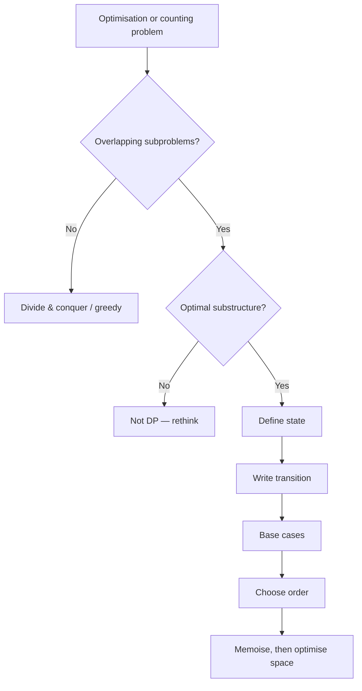

# Dynamic Programming Fundamentals

## Why It Matters

The most feared interview topic, and the one with the most mechanical solution process. DP is not creativity — it is a four-step recipe applied consistently.

## Core Idea

DP applies when a problem has:

1. **Optimal substructure** — the optimal solution is built from optimal solutions to subproblems
2. **Overlapping subproblems** — the same subproblem recurs many times

Without overlap, it's plain divide-and-conquer. Without optimal substructure, DP is invalid.

## The Four-Step Recipe

| Step | Question | Example (Coin Change) |
|---|---|---|
| 1. State | What uniquely identifies a subproblem? | `dp[a]` = min coins to make amount `a` |
| 2. Transition | How does a state depend on smaller states? | `dp[a] = min(dp[a - c] + 1)` for each coin `c` |
| 3. Base case | What is trivially known? | `dp[0] = 0` |
| 4. Order | In what order are states safe to compute? | ascending `a` |

**Write these four lines down before coding.** Interviewers grade this explicitly.

## Memoisation vs Tabulation

| | Memoisation (top-down) | Tabulation (bottom-up) |
|---|---|---|
| Direction | Recursive, from the goal | Iterative, from base cases |
| Computes | Only reachable states | All states |
| Space | Recursion stack + table | Table only |
| Easier to write | Yes — mirrors the recurrence | No |
| Easier to space-optimise | No | Yes |

**Interview strategy:** write the recursion first, add a cache (that's memoisation), then convert to a table only if asked to optimise space.

```java
// Memoisation skeleton
Integer[] memo = new Integer[n + 1];
int solve(int i) {
    if (i <= base) return baseValue;
    if (memo[i] != null) return memo[i];
    return memo[i] = combine(solve(i - 1), solve(i - 2));
}
```

## Space Optimisation

If `dp[i]` only depends on `dp[i-1]` and `dp[i-2]`, you need two variables, not an array:

```java
int prev2 = 0, prev1 = 1;
for (int i = 2; i <= n; i++) {
    int cur = prev1 + prev2;
    prev2 = prev1; prev1 = cur;
}
```

For 2D DP depending only on the previous row, keep two rows — O(n) instead of O(m·n).

## The Major DP Families

| Family | State | Examples |
|---|---|---|
| Linear / 1D | `dp[i]` = answer ending at or using first `i` | Climbing Stairs, House Robber, Decode Ways |
| Knapsack | `dp[i][w]` = using first `i` items, capacity `w` | Subset Sum, Partition Equal, Target Sum |
| Two sequences | `dp[i][j]` = prefixes of both strings | LCS, Edit Distance, Regex Match |
| Interval | `dp[i][j]` = answer on range `[i, j]` | Burst Balloons, Matrix Chain, Palindrome Partition |
| Grid | `dp[r][c]` = answer at cell | Unique Paths, Minimum Path Sum |
| State machine | `dp[i][state]` | Stock problems with cooldown/limit |
| Tree DP | `dp[node][state]` via post-order DFS | House Robber III, Tree Diameter |
| Bitmask | `dp[mask]` for n ≤ 20 | TSP, Assignment |
| Digit DP | `dp[pos][tight][state]` | Count numbers with property |

## Visual Diagram



## Interview Explanation

> "Let me define the state: `dp[i][w]` is the maximum value using the first i items with capacity w. The transition is `dp[i][w] = max(dp[i-1][w], value[i] + dp[i-1][w - weight[i]])` — either skip the item or take it. Base case `dp[0][*] = 0`. I'll compute in increasing i, and since each row depends only on the previous row, I can reduce space to O(W)."

## Common Mistakes

- Jumping to a table before writing the recurrence
- State that doesn't capture everything needed (missing a dimension) — the classic bug
- Wrong iteration order, reading a state before it's computed
- Reversing the inner loop direction in space-optimised 0/1 knapsack (must go backward)
- Not handling unreachable states (use a sentinel like `Integer.MAX_VALUE` and guard against overflow when adding)

## Related Topics

- [Knapsack Patterns](Knapsack%20Patterns.md)
- DP on Strings *(not yet written)*
- [Pattern Confusion Matrix](Pattern%20Confusion%20Matrix.md)

## Revision Summary

State, transition, base case, order. Write the recursion, cache it, then optimise space. Identify which of the nine families the problem belongs to.

## Quick Recall

- Optimal substructure + overlapping subproblems = DP
- Always write the four lines before coding
- Memoise first, tabulate only for space
- 0/1 knapsack space-optimised: iterate capacity **backward**
- Unbounded knapsack: iterate capacity **forward**
