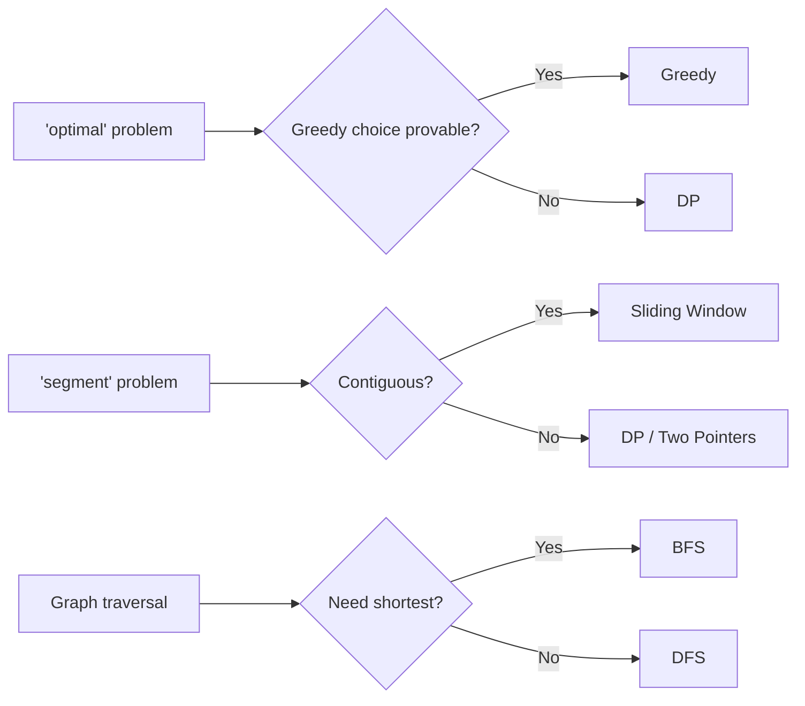

# Pattern Confusion Matrix

> The ten pattern pairs candidates mix up. Each has a single decisive test.

## Why It Matters

Most wrong approaches in interviews aren't ignorance — they're misclassification. You knew both patterns; you picked the wrong one. These ten pairs cause the majority of those errors.

## 1. Dynamic Programming vs Greedy

| DP | Greedy |
|---|---|
| Overlapping subproblems | Independent choices |
| Must consider all subproblems | Local optimum = global optimum |
| Never commits early | Commits and never reconsiders |
| Coin Change | Jump Game |

**Decisive test:** Can a locally optimal choice provably lead to the global optimum?

**Counterexample to memorize:** coins `[1,3,4]`, amount `6`. Greedy takes 4+1+1 = 3 coins. Optimal is 3+3 = 2 coins. Greedy fails; DP is required.

## 2. BFS vs DFS

| BFS | DFS |
|---|---|
| Shortest path (unweighted) | All paths, connectivity |
| Level-order | Depth-first |
| Queue | Stack / recursion |
| Rotting Oranges | Number of Islands |

**Decisive test:** Do you need the *shortest* path? Yes → BFS. BFS guarantees shortest **only** on unweighted graphs.

## 3. Sliding Window vs Two Pointers

| Sliding Window | Two Pointers |
|---|---|
| Contiguous segment | Any pair/triplet |
| Window grows and shrinks | Pointers converge or diverge |
| Longest Substring Without Repeating | Two Sum II, 3Sum |

**Decisive test:** Is the answer a *contiguous segment* of variable size? Yes → sliding window.

## 4. Subarray vs Subsequence

| Subarray | Subsequence |
|---|---|
| Contiguous | Non-contiguous, order preserved |
| Sliding window, prefix sum, Kadane | DP, two pointers |
| Maximum Sum Subarray | Longest Increasing Subsequence |

**Decisive test:** Must elements be adjacent? This single word changes the entire pattern family. Read it carefully.

## 5. Backtracking vs DFS

| DFS | Backtracking |
|---|---|
| Traverse a structure | Generate all solutions |
| Visits each node once | Explores paths, undoes state |
| Connected Components | Subsets, N-Queens |

**Decisive test:** Are you *generating* possibilities or *traversing* an existing structure?

## 6. Hash Map vs Sorting

| Hash Map | Sorting |
|---|---|
| O(n) time, O(n) space | O(n log n) time, O(1) extra |
| Lookup and counting | Ordering, enables two pointers |
| Two Sum | 3Sum |

**Decisive test:** Is extra space restricted, or do you need ordering downstream? Then sort.

## 7. Binary Search vs Binary Search on Answer

| Binary Search | Binary Search on Answer |
|---|---|
| Search an existing sorted array | Search the *space of possible answers* |
| Target is an element | Target is a value satisfying a predicate |
| Search in Rotated Array | Koko Eating Bananas |

**Decisive test:** "Minimize the maximum" or "maximize the minimum" → binary search on answer. Verify the predicate is monotonic.

## 8. 0/1 Knapsack vs Unbounded Knapsack

| 0/1 | Unbounded |
|---|---|
| Each item used ≤ once | Items reusable |
| Inner loop iterates backward | Inner loop iterates forward |
| Partition Equal Subset Sum | Coin Change |

**Decisive test:** Can you reuse an item? The loop direction in the space-optimized version is the only code difference — and it is the most common bug.

## 9. Topological Sort vs Plain DFS

| DFS | Topological Sort |
|---|---|
| Any graph | DAG only |
| Detect cycle | Produce an ordering |
| Course Schedule I | Course Schedule II |

**Decisive test:** Is there a dependency ordering to *output*? Yes → topological sort.

## 10. Heap vs Quickselect for Kth Element

| Heap | Quickselect |
|---|---|
| O(n log k) | O(n) average, O(n²) worst |
| Handles streaming data | Needs the full array in memory |
| Stable, simple | Faster in practice, destroys input order |

**Decisive test:** Is data streaming or is k small? → heap. One-shot on a full array with no order requirement? → quickselect.

## Visual Diagram

## Common Mistakes

- Using greedy without testing the greedy choice property — always try to construct a counterexample first.
- Assuming BFS gives shortest path on a *weighted* graph. It does not.
- Forgetting to undo state in backtracking, producing polluted results.
- Reversing the loop direction in space-optimized knapsack.

## Related Topics

- [Pattern Recognition Framework](Pattern%20Recognition%20Framework.md)
- [Dynamic Programming Fundamentals](Dynamic%20Programming%20Fundamentals.md)
- [Binary Search on Answer](Binary%20Search%20on%20Answer.md)

## Revision Summary

Ten pairs, ten one-line tests. If you can state the decisive test for each pair from memory, misclassification stops being your failure mode.

## Quick Recall

- Greedy needs a proof; DP does not
- Contiguous → window; non-contiguous → DP
- Shortest + unweighted → BFS
- Generating → backtracking; traversing → DFS
- "Minimize the maximum" → binary search on answer
