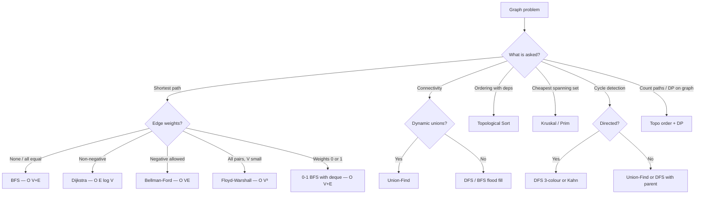

# Graph Algorithm Selection

## Why It Matters

Graph problems are common and the algorithms are standard — the failure mode is picking the wrong one. This note is a decision procedure, not a tutorial.

## Selection Decision Tree

## Fast Lookup

| Requirement | Algorithm | Complexity |
|---|---|---|
| Shortest path, unweighted | BFS | O(V + E) |
| Shortest path, non-negative weights | Dijkstra | O((V + E) log V) |
| Shortest path, negative weights | Bellman–Ford | O(V·E) |
| Negative cycle detection | Bellman–Ford, extra pass | O(V·E) |
| All-pairs shortest path | Floyd–Warshall | O(V³) |
| Weights only 0 or 1 | 0-1 BFS (deque) | O(V + E) |
| At most k edges | Bellman–Ford, k rounds | O(k·E) |
| Connected components | DFS / BFS / Union-Find | O(V + E) |
| Dynamic connectivity | Union-Find | O(α(n)) per op |
| Dependency ordering | Kahn or DFS topo | O(V + E) |
| MST | Kruskal / Prim | O(E log E) |
| Bipartite check | BFS 2-colouring | O(V + E) |
| Bridges / articulation points | Tarjan | O(V + E) |
| Strongly connected components | Tarjan / Kosaraju | O(V + E) |
| Eulerian path/circuit | Hierholzer | O(E) |

## The Rule That Resolves "Is This DP?"

If the graph is a **DAG**, shortest/longest path is DP over a topological order. If it has cycles, you need Dijkstra/Bellman–Ford instead, because "longest path with cycles" is NP-hard.

## When Dijkstra Is Not Allowed — Say This Aloud

Dijkstra is greedy: it finalises a node the moment it is popped, assuming no cheaper route can appear later. A **negative edge** breaks that assumption, because a later path could reduce the cost. That is exactly why Bellman–Ford relaxes all edges V−1 times instead.

Stating this earns credit even if you never implement Bellman–Ford.

## Do I Revisit Nodes?

| Algorithm | Revisit rule |
|---|---|
| BFS (unweighted) | Never — first visit is optimal |
| Dijkstra | Skip if popped distance > recorded distance (stale entry) |
| Bellman–Ford | Always relax all edges, V−1 rounds |
| DFS (path finding) | Revisit allowed; unmark on backtrack |
| Dijkstra with state (e.g. k stops) | Key the visited set on `(node, state)`, not `node` |

**The `(node, state)` insight** is what makes "Cheapest Flights Within K Stops" work. A node may legitimately be visited again with fewer stops used.

## Early Termination

Dijkstra may stop as soon as the target is popped — it is finalised then. BFS may stop on first reaching the target. Bellman–Ford may **not** stop early unless a full round produces no relaxation.

## Common Mistakes

- Using BFS for shortest path on a weighted graph
- Using Dijkstra with negative edges
- Marking visited at enqueue vs dequeue inconsistently in Dijkstra (use the stale-check instead)
- Forgetting that "longest path" on a general graph is NP-hard — it's only tractable on a DAG
- Keying visited on `node` when the problem has an extra state dimension

## Related Topics

- [BFS and DFS](BFS%20and%20DFS.md)
- [Union Find](Union%20Find.md)
- [Topological Sort](Topological%20Sort.md)

## Revision Summary

Weights decide the shortest-path algorithm; DAG-ness decides whether it's DP; extra constraints mean your visited key needs an extra dimension.

## Quick Recall

- Unweighted → BFS; non-negative → Dijkstra; negative → Bellman–Ford
- 0/1 weights → deque BFS
- k-constraint → Bellman–Ford rounds or `(node, k)` state
- DAG → topological order + DP
- Longest path on a cyclic graph → NP-hard
