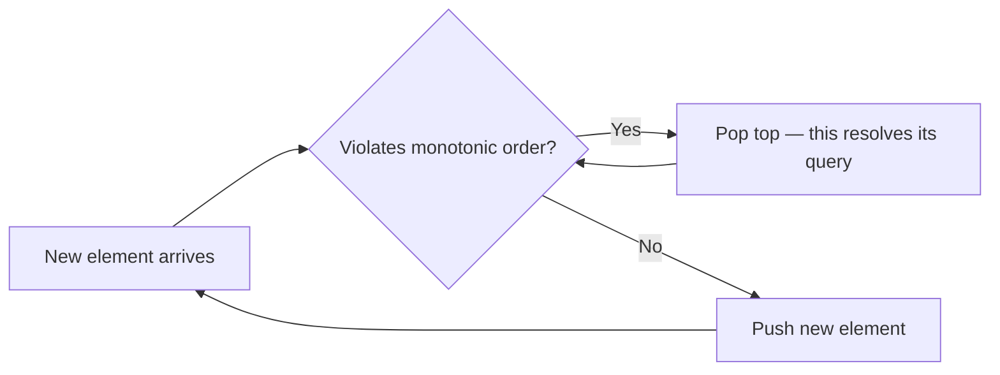

# Monotonic Stack

## Why It Matters

Solves the entire "next/previous greater/smaller element" family in O(n), plus histogram and rain-water problems that otherwise look O(n²).

## Core Idea

Keep a stack whose elements are always in increasing (or decreasing) order. When a new element violates the order, pop — and **each pop is an answered query**.

Each element is pushed once and popped at most once → O(n) amortised despite the inner `while`.

## Which Direction?

| You want | Stack holds | Pop when |
|---|---|---|
| Next **greater** element | decreasing | `new > top` |
| Next **smaller** element | increasing | `new < top` |
| Previous greater | decreasing (scan same direction, answer before push) | `new >= top` |
| Previous smaller | increasing | `new <= top` |

**Memory aid:** you pop the elements that the new value "beats". If you want the next *greater*, you pop everything smaller — so the stack stays *decreasing*.

## Template — Next Greater Element

```java
int[] res = new int[n];
Arrays.fill(res, -1);
Deque<Integer> stack = new ArrayDeque<>();   // holds indices
for (int i = 0; i < n; i++) {
    while (!stack.isEmpty() && arr[i] > arr[stack.peek()]) {
        res[stack.pop()] = arr[i];           // arr[i] is the answer for that index
    }
    stack.push(i);
}
```

Store **indices**, not values — you usually need the distance.

## Largest Rectangle in Histogram

```java
Deque<Integer> st = new ArrayDeque<>();
int best = 0;
for (int i = 0; i <= n; i++) {
    int h = (i == n) ? 0 : heights[i];       // sentinel flushes the stack
    while (!st.isEmpty() && h < heights[st.peek()]) {
        int height = heights[st.pop()];
        int left = st.isEmpty() ? -1 : st.peek();
        best = Math.max(best, height * (i - left - 1));
    }
    st.push(i);
}
```

**The width formula is the whole trick:** when popping index `j`, the rectangle of height `heights[j]` extends from just after the new stack top to just before `i`. Width is `i - st.peek() - 1`.

## Visual Diagram



## Key Problems

| Problem | Stack type |
|---|---|
| Next Greater Element I / II | Decreasing |
| Daily Temperatures | Decreasing (store indices) |
| Largest Rectangle in Histogram | Increasing + sentinel |
| Maximal Rectangle | Histogram per row |
| Trapping Rain Water | Decreasing (or two pointers) |
| Remove K Digits | Increasing, greedy |
| Sum of Subarray Minimums | Increasing, count contributions |
| Online Stock Span | Decreasing |

## Circular Arrays

For "Next Greater Element II" (circular), iterate `2n` times with `i % n` and only push during the first pass.

## Advantages

- O(n) time where the brute force is O(n²)
- O(n) space, often much less in practice

## Limitations

- Only applies when the query is about the *nearest* element satisfying a comparison
- Requires care with strict vs non-strict comparison when duplicates exist

## Common Mistakes

- Storing values instead of indices, losing distance information
- Wrong stack direction — derive it from "what does the new element beat?"
- Forgetting the sentinel in histogram problems, leaving elements unpopped
- Using `>` vs `>=` inconsistently with duplicates, double-counting

## Related Topics

- [Monotonic Queue](Monotonic%20Queue.md)
- [Complexity Analysis](Complexity%20Analysis.md)

## Revision Summary

"Next greater/smaller" → monotonic stack of indices. Popping resolves a query. Amortised O(n). Histogram width is `i - stack.peek() - 1`.

## Quick Recall

- Next greater → decreasing stack
- Next smaller → increasing stack
- Always store indices
- Sentinel value flushes the stack at the end
- Amortised O(n): each element pushed and popped once
