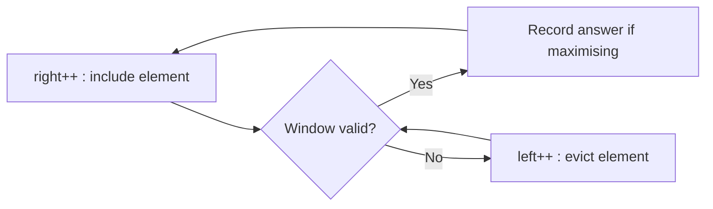

# Sliding Window

## Why It Matters

The default answer for any "contiguous subarray/substring with property X" question. Turns O(n·k) or O(n²) into O(n).

## Core Idea

Maintain a window `[left, right]`. Expand `right` to include elements; shrink `left` while the window violates the constraint. Each index enters and leaves the window at most once → O(n).

## Recognition

The word **subarray**, **substring**, **contiguous**, or **window** plus an optimisation or constraint ("longest", "shortest", "at most k", "exactly k", "sum equals").

## Two Variants

### Fixed Window (size k)
```java
int sum = 0, best = Integer.MIN_VALUE;
for (int r = 0; r < n; r++) {
    sum += arr[r];
    if (r >= k) sum -= arr[r - k];   // evict
    if (r >= k - 1) best = Math.max(best, sum);
}
```

### Variable Window (shrink while invalid)
```java
int l = 0, best = 0;
Map<Character, Integer> count = new HashMap<>();
for (int r = 0; r < s.length(); r++) {
    count.merge(s.charAt(r), 1, Integer::sum);
    while (invalid(count)) {                 // shrink until valid
        char c = s.charAt(l++);
        if (count.merge(c, -1, Integer::sum) == 0) count.remove(c);
    }
    best = Math.max(best, r - l + 1);
}
```

## The "Exactly K" Trick

There is no clean window for *exactly* k. Use:

```
exactly(k) = atMost(k) - atMost(k - 1)
```

`atMost` is a standard shrinking window. This converts a hard problem into two easy ones. Memorise it — it appears in "Subarrays with K Different Integers" and "Binary Subarrays With Sum".

## Minimum Window Template

For *minimum* windows, record the answer **inside** the shrink loop, not after it:

```java
while (valid(count)) {
    if (r - l + 1 < bestLen) { bestLen = r - l + 1; bestStart = l; }
    char c = s.charAt(l++);
    count.merge(c, -1, Integer::sum);
}
```

## Visual Diagram



## Key Problems

| Problem | Variant |
|---|---|
| Maximum Average Subarray I | Fixed |
| Longest Substring Without Repeating Characters | Variable, max |
| Minimum Window Substring | Variable, min |
| Longest Repeating Character Replacement | Variable + max-frequency trick |
| Permutation in String | Fixed + frequency match |
| Subarrays with K Different Integers | atMost(k) − atMost(k−1) |
| Sliding Window Maximum | Monotonic deque, not plain window |
| Fruit Into Baskets | Variable, at most 2 distinct |

## Advantages

- O(n) time, O(k) space where k is the alphabet or distinct-count bound
- Single pass, cache-friendly

## Limitations

- **Requires contiguity.** Subsequence problems need DP instead.
- Breaks with negative numbers when the constraint is "sum ≥ target" — the window is no longer monotonic. Use prefix sum + monotonic deque or a hash map instead.

## Common Questions

- *Why is it O(n) when there is a nested while loop?* — `left` only ever increases, and total increments across the whole run are ≤ n. Amortised O(n).
- *What breaks with negative numbers?* — expanding the window no longer monotonically increases the sum, so shrinking is not guaranteed to restore validity.
- *How do you handle "exactly k"?* — `atMost(k) − atMost(k−1)`.

## Common Mistakes

- Recording the answer outside the shrink loop for *minimum* window problems
- Not removing zero-count keys from the map, breaking `map.size()` as a distinct-count check
- Applying a sliding window to a problem with negative numbers and a sum-based constraint
- Confusing subsequence with substring

## Related Topics

- [Two Pointers](Two%20Pointers.md)
- [Prefix Sum](Prefix%20Sum.md)
- [Monotonic Queue](Monotonic%20Queue.md)

## Revision Summary

Expand right, shrink left while invalid. Maximum → record after shrinking; minimum → record inside shrinking. Exactly k → difference of two atMost windows.

## Quick Recall

- "contiguous" + "longest/shortest" → sliding window
- Amortised O(n): left only moves forward
- exactly(k) = atMost(k) − atMost(k−1)
- Negative numbers break sum-based windows
