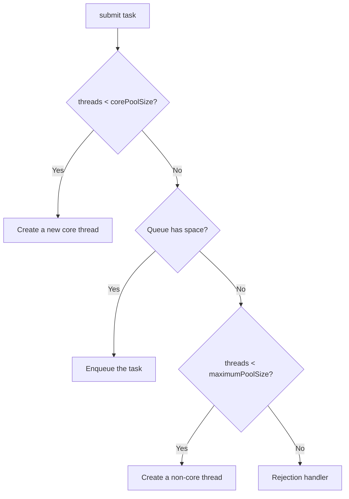

# Executors and Thread Pools

## Why It Matters

Nobody creates raw threads in production. Pool sizing and queue choice are real design decisions with real outage consequences.

## Why Pool At All

Thread creation costs ~1 MB of stack plus an OS syscall. Unbounded thread creation under load causes `OutOfMemoryError: unable to create new native thread`. Pools bound concurrency and amortise creation.

## ThreadPoolExecutor — The Real Constructor

```java
new ThreadPoolExecutor(
    corePoolSize,       // kept alive even when idle
    maximumPoolSize,    // hard ceiling
    keepAliveTime, unit,// idle timeout for threads above core
    workQueue,          // where tasks wait
    threadFactory,      // naming — critical for debugging
    rejectedExecutionHandler
);
```

### The Submission Algorithm (asked constantly)



**The queue fills before extra threads are created.** So with an **unbounded queue, `maximumPoolSize` is never reached** — it's dead configuration. This surprises most candidates.

## Why the Executors Factory Methods Are Dangerous

| Factory | Hidden problem |
|---|---|
| `newFixedThreadPool(n)` | Unbounded `LinkedBlockingQueue` → tasks pile up → **OOM** |
| `newSingleThreadExecutor()` | Same unbounded queue |
| `newCachedThreadPool()` | Unbounded **thread** creation → OOM under load |
| `newScheduledThreadPool(n)` | Unbounded `DelayedWorkQueue` |

**Always construct `ThreadPoolExecutor` explicitly with a bounded queue and a named thread factory.** Google's Java style guide and Alibaba's standard both mandate this — it's a strong signal to mention.

## Rejection Policies

| Policy | Behaviour | Use when |
|---|---|---|
| `AbortPolicy` (default) | Throws `RejectedExecutionException` | You want to know immediately |
| `CallerRunsPolicy` | Runs the task on the submitting thread | **Natural backpressure** — slows the producer |
| `DiscardPolicy` | Silently drops | Never (invisible data loss) |
| `DiscardOldestPolicy` | Drops the oldest queued task | Stale-data streams only |

`CallerRunsPolicy` is usually the right production default: the submitter is throttled instead of the system collapsing.

## Pool Sizing

| Workload | Formula |
|---|---|
| CPU-bound | `N_cpu + 1` |
| I/O-bound | `N_cpu × (1 + waitTime / serviceTime)` |

For an I/O-bound task waiting 90% of the time on 8 cores: `8 × (1 + 9) = 80` threads.

**Never share one pool between CPU-bound and I/O-bound work** — slow I/O tasks starve fast CPU tasks. Use separate, isolated pools (a bulkhead).

## Future vs CompletableFuture

`Future.get()` **blocks**, which defeats the purpose of async execution:

```java
Future<String> f = executor.submit(task);
String s = f.get();     // blocks the calling thread
```

`Future` cannot be composed, chained, or completed manually. Use `CompletableFuture` for anything beyond fire-and-forget.

## Shutdown

```java
executor.shutdown();                                   // no new tasks; finish queued
if (!executor.awaitTermination(30, TimeUnit.SECONDS)) {
    executor.shutdownNow();                            // interrupt running tasks
    executor.awaitTermination(10, TimeUnit.SECONDS);
}
```

`shutdownNow()` **interrupts** tasks — it only works if your tasks honour interruption. Non-daemon pool threads prevent JVM exit, so forgetting shutdown hangs the application.

## Exception Handling — The Silent Killer

```java
executor.execute(task);   // uncaught exception → thread dies, handler invoked
Future<?> f = executor.submit(task);   // exception CAPTURED in the Future
```

**With `submit`, an exception is swallowed unless you call `f.get()`.** This is one of the most common production bugs — tasks fail silently forever. Either always inspect the `Future`, or wrap the task body in try/catch, or set an `UncaughtExceptionHandler` on the thread factory.

## ScheduledThreadPoolExecutor

| Method | Behaviour |
|---|---|
| `schedule` | Once, after a delay |
| `scheduleAtFixedRate` | Every `period`, **regardless of task duration** — can pile up |
| `scheduleWithFixedDelay` | `delay` **after** the previous task ends — never overlaps |

**A task that throws cancels all future executions silently.** Always catch inside the scheduled task.

## Common Mistakes

- Using `Executors.newFixedThreadPool` in production
- Expecting `maximumPoolSize` to matter with an unbounded queue
- Not naming threads — makes thread dumps useless
- Ignoring the `Future` returned by `submit`
- Forgetting `shutdown()`, leaving the JVM alive
- Sharing one pool across workload types

## Related Topics

- [CompletableFuture](CompletableFuture.md)
- [Threads and Lifecycle](Threads%20and%20Lifecycle.md)
- Concurrency Problem Patterns *(not yet written)*

## Revision Summary

Core threads → queue → extra threads → rejection. Unbounded queues make `maximumPoolSize` meaningless and risk OOM. Size by workload type, isolate pools, name threads, and never ignore the Future from `submit`.

## Quick Recall

- Queue fills **before** new threads spawn
- Bounded queue + `CallerRunsPolicy` = backpressure
- CPU-bound → `N+1`; I/O-bound → `N × (1 + wait/service)`
- `submit` swallows exceptions into the Future
- `scheduleAtFixedRate` can overlap; `WithFixedDelay` cannot
