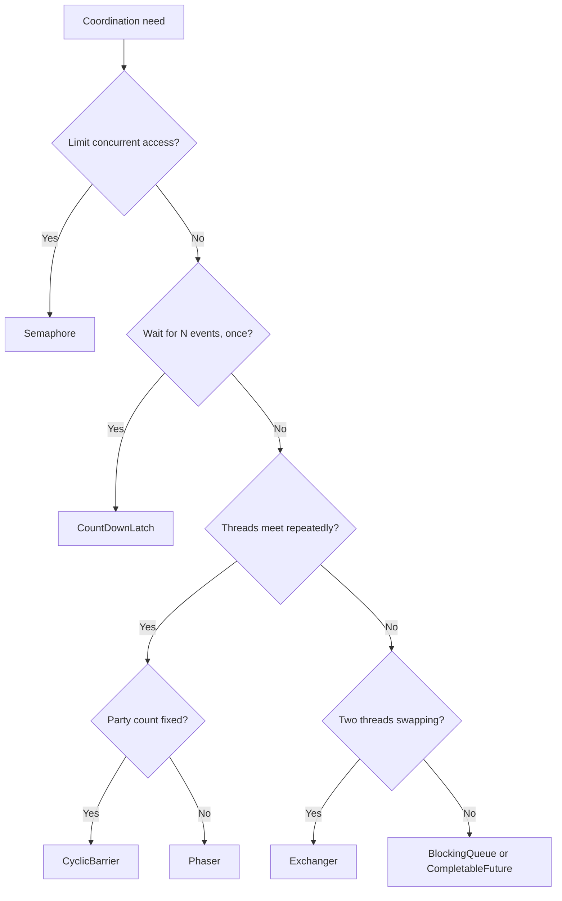

# Synchronizers

## Why It Matters

`java.util.concurrent` gives you five coordination primitives that cover almost every "make threads wait for each other" requirement. Reaching for one instead of hand-rolling `wait`/`notify` is the correct instinct, and interviewers check for it.

## The Five

| Synchronizer | Purpose | Reusable |
|---|---|---|
| **`CountDownLatch`** | Wait for N events — a one-shot gate | **No** |
| **`CyclicBarrier`** | N threads meet, then all proceed | **Yes** |
| **`Semaphore`** | Limit concurrent access to N permits | Yes |
| `Phaser` | Flexible multi-phase barrier with dynamic parties | Yes |
| `Exchanger` | Two threads swap objects | Yes |

## CountDownLatch

A counter that only counts down. Threads wait until it reaches zero.

```java
CountDownLatch latch = new CountDownLatch(taskCount);

for (var task : tasks) {
    executor.submit(() -> {
        try { task.run(); }
        finally { latch.countDown(); }      // countDown in FINALLY
    });
}

if (!latch.await(30, TimeUnit.SECONDS)) {   // ALWAYS use the timeout variant
    throw new TimeoutException("tasks did not complete");
}
```

**Two rules that matter:**

1. **`countDown()` must be in a `finally`.** An exception otherwise leaves the latch permanently short of zero, and every waiter blocks forever.
2. **Always use `await(timeout, unit)`.** An untimed `await()` can hang the application with no diagnostic.

**Two common shapes:**

```java
// A) Wait for N workers to finish  — latch initialised to N
// B) Start gun: hold N workers, release together — latch initialised to 1
CountDownLatch start = new CountDownLatch(1);
// workers: start.await();  then do work
start.countDown();          // release all simultaneously
```

Shape B is how you write a concurrency stress test — it maximises the chance of a real race by starting everyone at once.

**Cannot be reset.** Once at zero it stays there — that's `CyclicBarrier`'s job.

## CyclicBarrier

N threads wait for each other; when the last arrives, all are released and the barrier **resets**.

```java
CyclicBarrier barrier = new CyclicBarrier(4, () -> mergeResults());  // barrier action

// each of 4 threads
computePartition();
barrier.await();      // blocks until all 4 arrive; then mergeResults() runs once
continueToNextPhase();
```

**The barrier action runs on the last thread to arrive**, before any are released — useful for merging phase results.

**`BrokenBarrierException`** is thrown to every waiter if one thread is interrupted, times out, or the barrier is reset. **A broken barrier stays broken until `reset()`** — you cannot ignore it.

## CountDownLatch vs CyclicBarrier

A standard interview question:

| | `CountDownLatch` | `CyclicBarrier` |
|---|---|---|
| Who waits | **One or more threads wait for others** | **Threads wait for each other** |
| Counting | Counts **down** | Counts arrivals **up** to N |
| Reusable | **No** | **Yes** |
| Action on completion | None | **Barrier action** |
| Countdown thread | May be a different thread | The waiting threads themselves |

**One line:** a latch is a one-way gate opened by external events; a barrier is a rendezvous point that resets.

## Semaphore

Maintains a set of permits. Acquire blocks when none remain.

```java
Semaphore permits = new Semaphore(10);          // 10 concurrent

permits.acquire();
try { useLimitedResource(); }
finally { permits.release(); }                  // release in FINALLY, always
```

**`release()` outside `finally` permanently leaks a permit.** After enough exceptions the semaphore reaches zero and everything blocks forever — a slow-motion outage that's hard to diagnose because the code "worked" for weeks.

| Method | Behaviour |
|---|---|
| `acquire()` | Block until a permit is available |
| **`tryAcquire()`** | **Return false immediately** — no blocking |
| `tryAcquire(timeout, unit)` | Bounded wait |
| `acquire(n)` / `release(n)` | Multiple permits at once |
| `new Semaphore(n, true)` | **Fair** — FIFO, prevents starvation, lower throughput |

**A `Semaphore(1)` is a mutex — but not a reentrant one.** Acquiring twice from the same thread deadlocks. Use `ReentrantLock` if reentrancy is needed.

**Semaphores are not owned.** Any thread may release a permit it didn't acquire — which is a feature (one thread produces permits, another consumes) and a hazard (accidental over-release increases the limit).

**The modern use: bounding concurrency with virtual threads.**
```java
Semaphore limit = new Semaphore(50);   // downstream can take 50 concurrent calls
// spawn a million virtual threads, but only 50 hit the service at once
```
Since you no longer size a thread pool to limit concurrency, a semaphore expresses the actual constraint. See [Virtual Threads and Structured Concurrency](Virtual%20Threads%20and%20Structured%20Concurrency.md).

## Phaser

A barrier with **dynamic party count** and multiple phases.

```java
Phaser phaser = new Phaser(1);          // register self

for (var task : tasks) {
    phaser.register();                  // parties can JOIN dynamically
    executor.submit(() -> {
        doPhaseOne();
        phaser.arriveAndAwaitAdvance(); // phase 1 barrier
        doPhaseTwo();
        phaser.arriveAndDeregister();   // leave
    });
}
phaser.arriveAndDeregister();
```

**Use when the number of participants changes at runtime**, or when you need many phases. `CyclicBarrier` fixes the party count at construction.

Rarely needed. If a `CyclicBarrier` fits, use it — `Phaser` is more flexible and correspondingly easier to misuse.

## Exchanger

Two threads swap objects at a rendezvous point.

```java
Exchanger<Buffer> exchanger = new Exchanger<>();

// Producer:  full = exchanger.exchange(full);    // hands over full, receives empty
// Consumer:  empty = exchanger.exchange(empty);  // hands over empty, receives full
```

Niche — buffer swapping in pipeline processing. **Exactly two threads**, both blocking until the other arrives. Mentioned for completeness; you'll rarely use it.

## Choosing



**Often none of them is the right answer.** For "run these tasks and wait for all results", `CompletableFuture.allOf` or structured concurrency is clearer than a latch. For producer-consumer, a `BlockingQueue` beats hand-rolled coordination.

## AbstractQueuedSynchronizer

All of these are built on **AQS** — a framework providing a FIFO wait queue and an atomic `int` state, with subclasses defining what the state means.

| Synchronizer | AQS state means |
|---|---|
| `ReentrantLock` | Hold count |
| `Semaphore` | Available permits |
| `CountDownLatch` | Remaining count |
| `ReentrantReadWriteLock` | Read count (high bits) + write count (low bits) |

**AQS uses CAS on the state plus a CLH-variant queue of parked threads.** Knowing that all of `java.util.concurrent`'s locks share one mechanism is a good depth answer — and it explains why they behave consistently around interruption, timeouts and fairness.

## Common Mistakes

- `countDown()` or `release()` outside a `finally`
- Untimed `await()` — hangs with no diagnostic
- Expecting a `CountDownLatch` to be reusable
- Ignoring `BrokenBarrierException`
- Using `Semaphore(1)` where reentrancy is needed
- Hand-rolling `wait`/`notify` when a synchronizer exists
- Over-releasing a semaphore, silently raising the limit
- Using a latch where `CompletableFuture.allOf` is clearer

## Related Topics

- [Synchronisation and Locks](Synchronisation%20and%20Locks.md)
- [Concurrent Collections](Concurrent%20Collections.md)
- [CompletableFuture](CompletableFuture.md)
- [Concurrency Problem Patterns](Concurrency%20Problem%20Patterns.md)

## Revision Summary

`CountDownLatch` is a one-shot gate; `CyclicBarrier` is a reusable rendezvous with a barrier action; `Semaphore` bounds concurrent access. Always decrement or release in a `finally`, and always use timed `await`. All are built on AQS, which combines an atomic state word with a FIFO wait queue.

## Quick Recall

- **Latch: counts down, one-shot, others wait for events**
- **Barrier: threads wait for each other, resets, has a barrier action**
- `countDown()` / `release()` in **`finally`**, always
- **Always timed `await`**
- `Semaphore(1)` is a **non-reentrant** mutex
- Semaphores are unowned — any thread can release
- **Semaphore is how you bound concurrency with virtual threads**
- `BrokenBarrierException` stays broken until `reset()`
- All built on **AQS**: atomic state + FIFO queue
