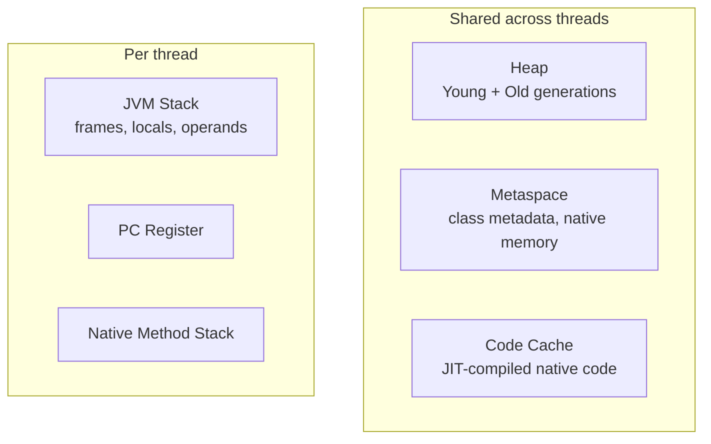

# JVM Architecture and Memory Areas

## Why It Matters

Explains OutOfMemoryError variants, StackOverflowError, and why some objects are cheap. Standard mid-to-senior backend question territory.

## Runtime Memory Areas



| Area | Shared? | Holds | Failure mode |
|---|---|---|---|
| Heap | Yes | All objects and arrays | `OutOfMemoryError: Java heap space` |
| Metaspace | Yes | Class metadata | `OutOfMemoryError: Metaspace` |
| Code cache | Yes | JIT output | `CodeCache is full` → falls back to interpreter |
| Stack | **No** | Frames, locals, partial results | `StackOverflowError` |
| PC register | No | Current instruction address | — |

## Heap Layout

```
Young Generation:  [ Eden | Survivor S0 | Survivor S1 ]
Old Generation:    [ tenured objects ]
```

- New objects go to **Eden**
- A minor GC copies survivors between S0/S1, incrementing an age counter
- Objects surviving enough cycles (`-XX:MaxTenuringThreshold`, default 15) are **promoted** to Old
- Large objects may go straight to Old

**The generational hypothesis:** most objects die young. This is why collecting Eden is cheap — it copies only the few survivors rather than tracing the dead.

## PermGen vs Metaspace

Java 7 and earlier used **PermGen**, a fixed-size heap region for class metadata — a common source of `OutOfMemoryError: PermGen space` in apps with many classloaders (redeploying web apps).

Java 8 replaced it with **Metaspace**, allocated in **native memory** and auto-growing by default (`-XX:MaxMetaspaceSize` caps it). This is a frequent interview question.

## String Pool

String literals are interned in a pool inside the **heap** (moved out of PermGen in Java 7).

```java
String a = "hello";               // pooled
String b = "hello";               // same reference
String c = new String("hello");   // new object on the heap
a == b;            // true
a == c;            // false
a == c.intern();   // true
```

Always compare strings with `.equals()`, never `==`.

## Stack vs Heap

| | Stack | Heap |
|---|---|---|
| Stores | Primitives, references, frames | Objects, arrays |
| Lifetime | Method invocation | Until unreachable |
| Thread-safety | Inherently thread-confined | Shared, needs synchronisation |
| Allocation cost | Pointer bump, very cheap | More expensive, GC-managed |
| Size control | `-Xss` | `-Xms` / `-Xmx` |

## Key JVM Flags

| Flag | Purpose |
|---|---|
| `-Xms` / `-Xmx` | Initial / maximum heap |
| `-Xss` | Thread stack size |
| `-XX:MaxMetaspaceSize` | Cap metaspace |
| `-XX:+UseG1GC` | Select the collector |
| `-XX:+HeapDumpOnOutOfMemoryError` | Dump for post-mortem analysis |
| `-XX:MaxTenuringThreshold` | Promotion age |

Setting `-Xms` equal to `-Xmx` avoids resize pauses in production — a good detail to mention.

## Diagnosing Problems

| Symptom | Likely cause | Tool |
|---|---|---|
| `OutOfMemoryError: heap space` | Leak or undersized heap | Heap dump + Eclipse MAT |
| `OutOfMemoryError: Metaspace` | Classloader leak | `jcmd VM.metaspace` |
| `StackOverflowError` | Deep/infinite recursion | Read the stack trace |
| Long pauses | GC tuning | GC logs, `-Xlog:gc*` |
| High CPU, low throughput | JIT deopt or GC thrash | `jcmd`, async-profiler |

## Common Mistakes

- Saying "PermGen" for Java 8+
- Claiming all objects are heap-allocated — escape analysis can stack-allocate (see [JIT and Escape Analysis](JIT%20and%20Escape%20Analysis.md))
- Confusing stack size with heap size
- Believing `System.gc()` forces collection — it's only a hint

## Related Topics

- [Garbage Collection](Garbage%20Collection.md)
- [Class Loading](Class%20Loading.md)
- [JIT and Escape Analysis](JIT%20and%20Escape%20Analysis.md)

## Revision Summary

Heap and metaspace are shared; stacks are per-thread. Young generation exploits the generational hypothesis. Metaspace replaced PermGen in Java 8 and lives in native memory.

## Quick Recall

- Eden → Survivor → Old
- Metaspace = native memory, replaced PermGen in Java 8
- StackOverflowError = per-thread stack; OOM = heap
- String pool lives in the heap since Java 7
- Set `-Xms` = `-Xmx` in production
