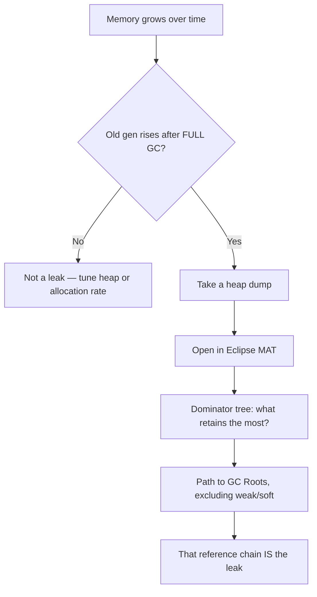

# Java Memory Leaks

## Why It Matters

Java has garbage collection, so people assume leaks are impossible. They're just a different shape: **an unintended strong reference keeping objects reachable**. This is a standard production-debugging question.

## The Definition

**A Java memory leak is an object you no longer need that is still reachable from a GC root.** The collector is working correctly — you told it the object is still in use.

**GC roots:** stack locals of live threads, static fields, JNI references, active thread objects, and the class loader graph.

**Symptom pattern:** old-generation occupancy rises after each *full* GC and never comes back down. That monotonic staircase is the signature — an application under load with a stable working set should plateau.

## The Nine Patterns

### 1. Static collections

```java
public class Cache {
    private static final Map<String, User> CACHE = new HashMap<>();   // grows forever
    public static void put(String k, User v) { CACHE.put(k, v); }
}
```

A `static` field is a GC root. Nothing is ever removed, so the map grows until the heap is exhausted.

**Fix:** bound it. Use Caffeine or Guava with a size limit and eviction, or a `LinkedHashMap` with `removeEldestEntry`.

**This is the most common leak in application code.**

### 2. ThreadLocal in a pooled thread

```java
private static final ThreadLocal<Context> CTX = new ThreadLocal<>();

void handleRequest() {
    CTX.set(new Context(...));
    process();
    // MISSING: CTX.remove()
}
```

The pool thread outlives the request. `ThreadLocalMap` uses **weak keys but strong values**, so the value survives until the entry is cleaned — which may never happen.

**Two problems:** memory growth, and **data leaking between requests** — a security issue, not just a performance one.

```java
try { CTX.set(ctx); process(); }
finally { CTX.remove(); }      // ALWAYS
```

With virtual threads, prefer [scoped values](../Concurrency/Virtual%20Threads%20and%20Structured%20Concurrency.md) — their lifetime is bounded by construction.

### 3. Unregistered listeners

```java
eventBus.register(this);   // never unregistered
```

The bus holds a strong reference forever. If `this` is a large object — or an inner class holding one — the whole graph is pinned.

**Fix:** unregister in a lifecycle hook, use weak references in the registry, or return an `AutoCloseable` subscription:
```java
try (var sub = bus.subscribe(listener)) { ... }   // auto-unregisters
```

### 4. Non-static inner classes

```java
class DataHolder {
    private byte[] huge = new byte[100_000_000];
    class Listener implements EventListener { }   // holds DataHolder via this$0
}
```

The listener pins 100 MB it never touches. **Make nested classes `static` unless they need the enclosing instance.** See [Nested and Inner Classes](../OOP/Nested%20and%20Inner%20Classes.md).

### 5. Unclosed resources

```java
InputStream in = new FileInputStream(f);   // never closed
```

Leaks the file descriptor and any buffers. **Always try-with-resources.**

Also applies to `Connection`, `Statement`, `ResultSet`, HTTP clients, and executors — a non-shutdown `ExecutorService` keeps non-daemon threads alive, preventing JVM exit entirely.

### 6. Mutated keys in a hash structure

```java
Set<List<String>> set = new HashSet<>();
List<String> key = new ArrayList<>();
set.add(key);
key.add("x");              // hashCode changed
set.remove(key);           // FAILS — wrong bucket
```

The entry is stranded: unreachable through the API, but still strongly referenced by the set. **It can never be removed and never be collected.**

**Use immutable keys.** See [equals and hashCode](../Language%20Core/Equals%20and%20HashCode.md).

### 7. Substring in old Java

Before Java 7u6, `String.substring` shared the parent's `char[]`. Taking a 10-character substring of a 10 MB string retained all 10 MB.

**Fixed long ago** (substring now copies), but it's a good illustration of retention-by-sharing, and it still occurs in custom code that slices arrays without copying.

### 8. ClassLoader leaks

The hardest to diagnose. In an app server or plugin system, a redeployed application's classloader should be collected. If **any** object from that classloader is referenced from outside — a static field in a shared library, a `ThreadLocal` on a pooled thread, a JDBC driver registered in `DriverManager`, a shutdown hook — **the entire classloader and every class it loaded is retained**.

**Symptom:** `OutOfMemoryError: Metaspace` after several redeploys.

**Common culprits:** JDBC drivers, logging frameworks holding a context, and `ThreadLocal`s on container-managed threads.

### 9. Unbounded queues and caches

```java
BlockingQueue<Task> q = new LinkedBlockingQueue<>();   // UNBOUNDED
```

If producers outpace consumers, the queue grows until OOM. **Always bound queues** — that converts a memory failure into backpressure. Same for `Executors.newFixedThreadPool`, which uses an unbounded queue internally.

## Diagnosis



**Tools:**

| Tool | Use |
|---|---|
| **`jcmd <pid> GC.heap_info`** | Quick occupancy check |
| `jmap -histo:live <pid>` | Object counts by class — cheap first look |
| **`jcmd <pid> GC.heap_dump file.hprof`** | Capture a dump |
| **Eclipse MAT** | **Dominator tree and path-to-GC-roots — the primary tool** |
| JFR / async-profiler | Allocation profiling — *what allocates*, not what retains |
| `-XX:+HeapDumpOnOutOfMemoryError` | **Always set this in production** |

**The dominator tree is the key concept:** it shows, for each object, the total memory that would be freed if it were collected. The leak is almost always the largest dominator you didn't expect.

**Then use "Path to GC Roots, excluding weak/soft references"** — that chain names the exact field holding the reference.

**Allocation profiling answers a different question.** A high allocation rate is a GC-pressure problem; a leak is a retention problem. Don't confuse the two.

## Prevention

| Practice | Detail |
|---|---|
| **Bound every cache** | Size or TTL, always |
| **`try-with-resources`** everywhere | Never manual close |
| **`ThreadLocal.remove()` in `finally`** | Or use scoped values |
| **`static` nested classes** by default | Avoid `this$0` |
| Unregister listeners in lifecycle hooks | Or use weak registries |
| **Bound every queue and pool** | Backpressure over OOM |
| Immutable map/set keys | Avoid stranded entries |
| Shut down executors | Non-daemon threads block exit |
| `-XX:+HeapDumpOnOutOfMemoryError` | Post-mortem is impossible without it |

## What Is Not a Leak

| Observation | Reality |
|---|---|
| Heap grows to `-Xmx` | **Normal** — GC runs when needed, not when convenient |
| `free` shows low memory | **Page cache** — the kernel using spare RAM |
| Old gen high but stable after full GC | Working set, not a leak |
| Memory not returned to the OS | Most collectors don't uncommit; ZGC and Shenandoah can |

**"Memory keeps growing" is not evidence of a leak.** The evidence is growth that survives a full GC.

## Common Mistakes

- Assuming GC makes leaks impossible
- Diagnosing from allocation profiles instead of retention
- No heap dump configured, so an OOM is unanalysable
- Static collections with no eviction
- `ThreadLocal` without `remove()` in a pooled environment
- Non-static inner classes in long-lived registries
- Unbounded queues
- Confusing a container `OOMKilled` (exit 137) with a Java `OutOfMemoryError`

## Related Topics

- [Garbage Collection](../Garbage%20Collection/Garbage%20Collection.md)
- [Reference Types and Cleaners](Reference%20Types%20and%20Cleaners.md)
- [Nested and Inner Classes](../OOP/Nested%20and%20Inner%20Classes.md)
- [Performance Tuning and Profiling](../Performance/Performance%20Tuning%20and%20Profiling.md)

## Revision Summary

A Java leak is an unintended strong reference from a GC root. The common sources are static collections, `ThreadLocal` in pooled threads, unregistered listeners, non-static inner classes, unclosed resources, mutated hash keys, classloader retention, and unbounded queues. Diagnose with a heap dump and MAT's dominator tree plus path-to-GC-roots.

## Quick Recall

- Leak = **unintended strong reference**, not a GC failure
- Signature: **old gen rises after each full GC**
- Top causes: static collections, **`ThreadLocal` in pools**, listeners, inner classes
- `ThreadLocalMap`: **weak keys, strong values** → must `remove()`
- Mutated hash key = stranded, unremovable entry
- Classloader leak → `OutOfMemoryError: Metaspace` after redeploys
- **MAT dominator tree + path to GC roots** finds it
- Allocation profiling ≠ retention analysis
- **Always set `-XX:+HeapDumpOnOutOfMemoryError`**
