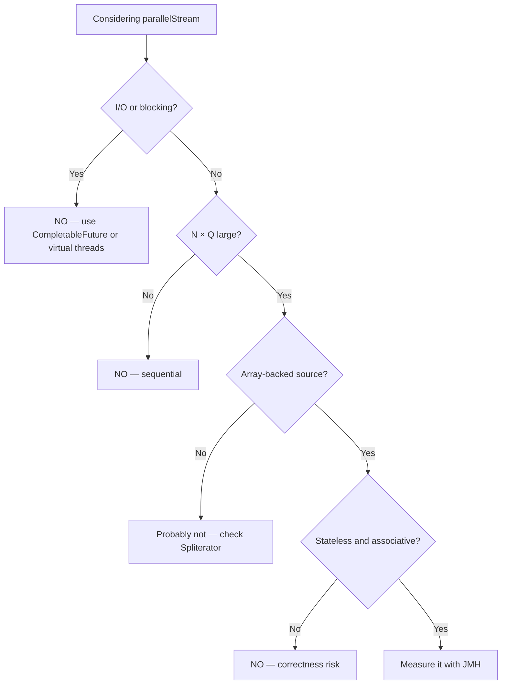

# Parallel Streams and Spliterators

## Why It Matters

`parallelStream()` looks like free performance and frequently isn't. Understanding `Spliterator` explains why some sources parallelise well and others are actively worse than sequential.

## Spliterator — The Splitting Iterator

Every stream is backed by a `Spliterator`: an iterator that can also **split itself in two**.

```java
public interface Spliterator<T> {
    boolean tryAdvance(Consumer<? super T> action);   // one element
    Spliterator<T> trySplit();                        // split off a prefix
    long estimateSize();                              // how many remain
    int characteristics();                            // hints
}
```

**`trySplit` is what makes parallelism possible.** The framework recursively splits until chunks are small enough, hands each to a Fork/Join task, then merges.

Returning `null` from `trySplit` means "can't split" — the stream then runs sequentially no matter what you asked for.

## Characteristics

Hints that let the pipeline skip work:

| Characteristic | Meaning | Enables |
|---|---|---|
| **`SIZED`** | Exact size known | **Even splitting, array pre-sizing** |
| `SUBSIZED` | Splits are also `SIZED` | Better balance |
| `ORDERED` | Encounter order matters | Required for `findFirst` |
| `SORTED` | Already sorted | `sorted()` becomes a no-op |
| `DISTINCT` | No duplicates | `distinct()` becomes a no-op |
| `NONNULL` | No nulls | Skips checks |
| `IMMUTABLE` | Source won't change | No defensive copying |

**`SIZED` is the important one.** Without it the framework can't split evenly, so it guesses — producing unbalanced work and poor scaling.

**`distinct()` on a `DISTINCT` stream is free**, and `sorted()` on a `SORTED` stream is free. That's why `TreeSet.stream().sorted()` costs nothing.

## Why Some Sources Parallelise Badly

| Source | Split quality | Why |
|---|---|---|
| **Arrays, `ArrayList`** | **Excellent** | O(1) index split, `SIZED`, `SUBSIZED` |
| `IntStream.range` | **Excellent** | Arithmetic split |
| `HashSet`, `HashMap` | Good | Splits by bucket ranges |
| `TreeMap` | Moderate | Splits by subtree |
| **`LinkedList`** | **Terrible** | Must **traverse** to find the midpoint |
| **`Stream.iterate`** | **Terrible** | Each element depends on the previous — inherently sequential |
| `BufferedReader.lines` | Poor | Unknown size, must scan for line breaks |
| `Files.lines` | Poor–moderate | Better on memory-mapped files |

**`LinkedList.parallelStream()` is almost always slower than sequential.** Splitting requires walking the list, so you pay O(n) traversal to enable parallelism that then has poor locality.

**`Stream.iterate(0, i -> i + 1)` cannot be parallelised meaningfully** — computing element *n* requires element *n−1*. Use `IntStream.range` instead, which splits arithmetically.

## When Parallelism Actually Helps

**All of these must hold:**

| Condition | Why |
|---|---|
| **Large N** | Rule of thumb: 10,000+ elements |
| **CPU-bound work per element** | Otherwise framework overhead dominates |
| **Splittable source** | Array-backed and `SIZED` |
| **Stateless, associative operations** | Required for correctness |
| **No I/O or blocking** | Would starve the shared common pool |
| **Cheap merge** | An expensive combine erases the gain |

**The NQ model:** parallelism pays off when **N × Q** is large, where N is the element count and Q is the cost per element. A million cheap operations may not beat sequential; a thousand expensive ones will.

## The Common Pool Problem

`parallelStream()` uses `ForkJoinPool.commonPool()` — **shared JVM-wide**, sized `cores − 1`.

```java
list.parallelStream().map(url -> httpGet(url)).toList();   // BLOCKS common-pool threads
```

**On 8 cores that's 7 threads.** Eight blocking calls starve every other parallel stream and every library using the pool.

**Never do I/O in a parallel stream.**

**To use a dedicated pool:**
```java
ForkJoinPool pool = new ForkJoinPool(4);
List<R> results = pool.submit(() -> list.parallelStream().map(f).toList()).get();
```
A parallel stream uses the pool of the calling thread — a useful and slightly obscure trick.

**For I/O-bound fan-out, use `CompletableFuture` with an explicit executor, or virtual threads.** See [Virtual Threads and Structured Concurrency](../Concurrency/Virtual%20Threads%20and%20Structured%20Concurrency.md).

## Correctness Traps

### Shared mutable state

```java
List<String> out = new ArrayList<>();
list.parallelStream().forEach(out::add);      // RACE — ArrayList isn't thread-safe

List<String> out = list.parallelStream().collect(toList());   // correct
```

**`collect` handles this properly** — each thread accumulates into its own container, then containers are merged.

### Non-associative operations

```java
stream.reduce(0, (a, b) -> a - b);      // subtraction isn't associative
// sequential and parallel give DIFFERENT results
```

**Silently wrong**, not an exception. The same applies to a custom collector's combiner.

### Ordering costs

| Operation | Parallel cost |
|---|---|
| `findAny` | **Cheap** |
| `findFirst` | Expensive — must respect encounter order |
| `forEach` | Cheap, **no order guarantee** |
| `forEachOrdered` | Expensive — serialises the terminal stage |
| `sorted`, `distinct`, `limit`, `skip` | Expensive on an ordered stream — need buffering |

**`unordered()` can dramatically speed up a parallel pipeline** when order genuinely doesn't matter:
```java
stream.unordered().parallel().distinct()   // distinct no longer preserves first-occurrence
```

**`limit` on a parallel ordered stream is particularly bad** — it must compute more than needed and discard, because it can't know which elements come first until they're all ordered.

## Measuring, Not Guessing

**Parallel streams are frequently slower.** Overheads: splitting, task scheduling, cache-line contention, and merging.

**Use [JMH](../Performance/Performance%20Tuning%20and%20Profiling.md), not a `nanoTime` loop.** Without warm-up you measure the interpreter; without a blackhole the JIT deletes your code.

**Typical result: sequential wins below ~10,000 elements for trivial per-element work.** That covers most collections in most applications.

## Writing a Custom Spliterator

Rarely needed, but it's how you make a custom data structure parallelise well:

```java
class ChunkSpliterator implements Spliterator<Row> {
    public Spliterator<Row> trySplit() {
        if (remaining() < THRESHOLD) return null;      // too small to split
        int mid = lo + (hi - lo) / 2;
        var prefix = new ChunkSpliterator(lo, mid);
        this.lo = mid;
        return prefix;
    }
    public int characteristics() { return SIZED | SUBSIZED | ORDERED | NONNULL; }
    public long estimateSize() { return hi - lo; }
}
```

**Report `SIZED` and `SUBSIZED` honestly.** Lying produces unbalanced splits and worse performance than reporting nothing.

**Return `null` from `trySplit` below a threshold** — splitting to single elements costs more than it saves.

## The Decision



## Common Mistakes

- I/O in a parallel stream
- `parallelStream` on a `LinkedList` or `Stream.iterate`
- Mutating shared state in `forEach`
- Non-associative reduce or combiner
- Using `findFirst` where `findAny` would do
- Assuming parallel is faster without measuring
- Lying about `Spliterator` characteristics
- `limit` on a parallel ordered stream

## Related Topics

- [Streams](Streams.md)
- [Collectors and Advanced Streams](Collectors%20and%20Advanced%20Streams.md)
- [Fork Join and Parallel Execution](../Concurrency/Fork%20Join%20and%20Parallel%20Execution.md)
- [Performance Tuning and Profiling](../Performance/Performance%20Tuning%20and%20Profiling.md)

## Revision Summary

Streams parallelise via `Spliterator.trySplit`, so array-backed `SIZED` sources split well while linked and generated sources split badly or not at all. Parallel streams use the shared common pool, so blocking I/O starves the JVM. Correctness requires stateless, associative operations, and ordered operations cost extra. Measure with JMH — sequential usually wins below ten thousand elements.

## Quick Recall

- **`trySplit` enables parallelism; returning `null` means sequential**
- **`SIZED`/`SUBSIZED` enable even splitting** — the most important characteristics
- `SORTED`/`DISTINCT` make those operations free
- **`LinkedList` and `Stream.iterate` split terribly**
- **Never I/O in a parallel stream** — it's the shared common pool
- Submit into a custom `ForkJoinPool` to isolate
- Non-associative reduce is **silently wrong** in parallel
- `findAny` cheap, `findFirst` expensive; `unordered()` can help a lot
- **NQ model** — measure with JMH; sequential usually wins under ~10K
