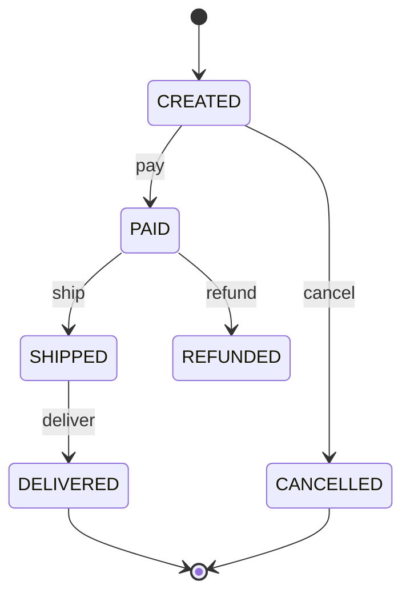

# State

## Why It Matters

The answer whenever behaviour depends on a lifecycle: orders, trips, vending machines, document workflows. Also the cleanest way to eliminate a nest of status conditionals.

## The Problem

```java
void insertCoin() {
    if (state == IDLE) { ... }
    else if (state == HAS_COIN) { throw ...; }
    else if (state == DISPENSING) { throw ...; }
    else if (state == SOLD_OUT) { ... }
}
// …and the same chain repeated in selectItem(), dispense(), refund()
```

Every method repeats the same branching, and adding a state means editing all of them.

## The Solution

Make each state a class holding the behaviour for that state.

```java
interface VendingState {
    VendingState insertCoin(VendingMachine m);
    VendingState selectItem(VendingMachine m, String code);
}

class IdleState implements VendingState {
    public VendingState insertCoin(VendingMachine m) { return new HasCoinState(); }
    public VendingState selectItem(VendingMachine m, String c) {
        throw new IllegalStateException("Insert a coin first");
    }
}

class VendingMachine {
    private VendingState state = new IdleState();
    public void insertCoin()  { state = state.insertCoin(this); }
    public void selectItem(String c) { state = state.selectItem(this, c); }
}
```

**Returning the next state from each method is the cleanest formulation** — transitions are explicit and the machine just reassigns.

## Enum With Behaviour — Often Better In Java

```java
enum OrderState {
    CREATED   { OrderState pay()    { return PAID; }
                OrderState cancel() { return CANCELLED; } },
    PAID      { OrderState ship()   { return SHIPPED; } },
    SHIPPED   { OrderState deliver(){ return DELIVERED; } },
    DELIVERED, CANCELLED;

    OrderState pay()     { throw new IllegalStateException("pay from " + this); }
    OrderState cancel()  { throw new IllegalStateException("cancel from " + this); }
    OrderState ship()    { throw new IllegalStateException("ship from " + this); }
    OrderState deliver() { throw new IllegalStateException("deliver from " + this); }
}
```

Exhaustive, serialisable, no allocation, and the default methods make invalid transitions fail loudly. **Suggesting this in a Java interview is a strong signal.**

## Transition Table Alternative

For many states and events, a declarative table beats either:

```java
Map<Pair<State, Event>, State> TRANSITIONS = Map.of(
    Pair.of(CREATED, PAY),  PAID,
    Pair.of(PAID, SHIP),    SHIPPED
);
```
Easy to validate, visualise, and test exhaustively. Mention it when the state count is large.

## Diagram



**Draw this in an LLD interview.** It communicates the design faster than code and exposes missing transitions immediately.

## State vs Strategy

| | State | Strategy |
|---|---|---|
| Who changes it | **The object itself** | The client |
| States know each other | **Yes** — each returns the next | No |
| Models | A lifecycle / transition graph | Interchangeable algorithms |
| Changes over time | **Yes, by design** | Usually fixed per context |

## Where To Put Transition Logic

| Option | Trade-off |
|---|---|
| **In each state** (as above) | Cohesive; but states know their successors |
| In the context | States stay dumb; context accumulates a big switch |
| In a transition table | Declarative and testable; extra indirection |

For interviews, the first is standard; mention the table for large machines.

## Real Uses

Order and payment lifecycles, TCP connection states, thread states, document approval workflows, game character states, media players, `Matcher` internals, Spring Statemachine.

## Limitations

- Class per state
- Transition logic can scatter
- Overkill for two states — a boolean is fine

## Common Questions

- *State vs Strategy?* — the object transitions itself vs the client chooses.
- *Where do transitions live?* — in the states, the context, or a table; name the trade-off.
- *How do you prevent invalid transitions?* — throw from the base/default implementation.
- *How would you persist state?* — store the enum name or a state id, never a serialised object.

## Common Mistakes

- Keeping `if (status == ...)` chains and calling it State
- Not guarding invalid transitions
- Mutable shared state objects (make them stateless or per-instance)
- Forgetting terminal states have no outgoing transitions

## Related Topics

- [Strategy](Strategy.md)
- [Command](Command.md)
- [LLD Delivery Framework](LLD%20Delivery%20Framework.md)

## Revision Summary

One class (or enum constant) per state, each holding that state's behaviour and returning the next state. Removes repeated status conditionals and makes invalid transitions fail loudly. Draw the state diagram in the interview.

## Quick Recall

- Repeated `if (status == ...)` across methods → State
- Each state returns the next
- Java enum with abstract methods is often best
- Default methods throw on invalid transitions
- Object transitions itself (vs Strategy: client picks)
