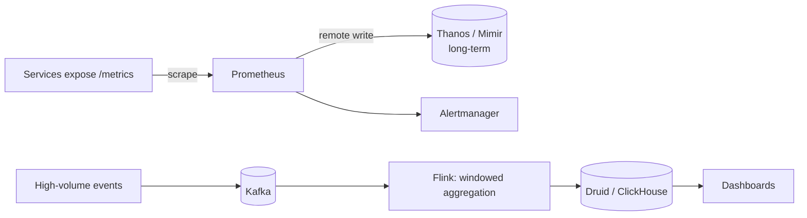

# Time Series and Analytics Databases

## Why It Matters

Metrics, IoT telemetry, and event analytics have an access pattern that general-purpose databases handle badly. Any monitoring, ad-analytics, or observability design touches this.

## What Makes Time Series Different

| Property | Consequence |
|---|---|
| **Append-only** | Almost no updates or deletes |
| **Time-ordered** | Writes arrive roughly in timestamp order |
| **Extremely high write volume** | Millions of points/sec is normal |
| **Queries are range scans over time** | Rarely point lookups |
| **Recent data is hot** | Old data is queried rarely, if ever |
| **Values are highly correlated** | Adjacent readings differ slightly → **compresses extremely well** |

**Compression is the biggest win.** Facebook's Gorilla paper showed time-series data compressing to **~1.4 bytes per point** — roughly 12× — using delta-of-delta encoding on timestamps and XOR encoding on values. That's why purpose-built stores beat Postgres here by an order of magnitude on storage.

## Core Techniques

| Technique | Effect |
|---|---|
| **Columnar storage** | Read only the columns a query needs; adjacent values compress together |
| **Delta-of-delta encoding** | Regular intervals compress to almost nothing |
| **XOR encoding for floats** | Similar consecutive values share most bits |
| **Time partitioning (chunks)** | Drop old data by dropping a partition — instant, no tombstones |
| **Downsampling / rollups** | Keep 1-second data for a day, 1-minute for a month, 1-hour for a year |
| **Retention policies** | Automatic expiry per tier |

**Downsampling plus retention is the operational core.** Nobody queries per-second data from six months ago, and storing it is pure cost.

## The Options

| Database | Model | Best for |
|---|---|---|
| **TimescaleDB** | Postgres extension — hypertables | **Full SQL, joins, existing Postgres** |
| **Prometheus** | Pull-based, own TSDB | Infrastructure monitoring, alerting |
| **InfluxDB** | Purpose-built | High-cardinality IoT |
| **ClickHouse** | Columnar OLAP | **Very fast analytical queries over huge volumes** |
| **Apache Druid** | Real-time OLAP | Sub-second aggregations on streaming data |
| Apache Pinot | Real-time OLAP | User-facing analytics at low latency |

**TimescaleDB is the pragmatic default** if you already run Postgres — you keep SQL, joins, and your existing tooling, and gain automatic time partitioning, compression, and continuous aggregates.

**ClickHouse and Druid are for analytical query volume**, not just storage. Druid and Pinot are specifically built for *user-facing* dashboards where p99 must stay under a second.

## OLTP vs OLAP

| | OLTP | OLAP |
|---|---|---|
| Workload | Many small reads/writes by key | **Few large scans and aggregations** |
| Storage | **Row-oriented** | **Column-oriented** |
| Rows touched | One or a few | Millions |
| Columns touched | All | **A few** |
| Examples | Postgres, MySQL | ClickHouse, Snowflake, BigQuery, Redshift |

**Why columnar wins for analytics:** `SELECT avg(price) FROM sales` reads one column. Row storage forces the engine to read every column of every row; columnar reads only what's needed, and the values compress far better because they're the same type and highly similar.

**Never run analytics on the OLTP primary.** A long analytical scan holds a snapshot open, blocks vacuum, causes bloat, and competes for buffer cache. Replicate to a separate analytical store.

## Cardinality — The Failure Mode

**Cardinality = the number of unique time series** = the product of all label/tag value combinations.

```
metric: http_requests_total
labels: {method: 5, status: 10, endpoint: 200, instance: 100}
→ 5 × 10 × 200 × 100 = 1,000,000 distinct series
```

Add `user_id` as a label and it explodes to millions or billions. **This is the single most common way monitoring systems are destroyed** — Prometheus OOMs, ingestion stalls, and queries time out.

**Rules:**
- **Never use unbounded values as labels** — user ID, request ID, email, session ID, full URL
- Keep label cardinality bounded and small
- High-cardinality dimensions belong in a log or trace store (Loki, Elasticsearch), not a metrics store

**Naming the cardinality explosion unprompted is a strong signal** — it's the practical failure everyone who has operated Prometheus has hit.

## Prometheus Specifics

**Pull-based** — Prometheus scrapes targets rather than receiving pushes.

| Benefit | Detail |
|---|---|
| Target health is implicit | A failed scrape *is* the down signal |
| No client-side buffering needed | The server controls the rate |
| Easy local testing | Just hit the `/metrics` endpoint |

**Push gateway** exists for short-lived batch jobs that die before being scraped — but it's an exception, not the norm.

**Prometheus is not durable long-term storage.** For retention beyond weeks, remote-write to Thanos, Cortex, or Mimir.

## The Four Golden Signals

For any service, monitor:

1. **Latency** — and always as percentiles, never averages
2. **Traffic** — requests per second
3. **Errors** — rate and ratio
4. **Saturation** — how full the constrained resource is

**Percentiles cannot be averaged.** A fleet-wide p99 requires merging histograms or [t-digest sketches](Data%20Structures%20for%20Big%20Data.md) from each host — averaging per-host p99s is mathematically meaningless.

## Design Sketch: Metrics Pipeline



**Two paths, deliberately separated:** low-cardinality metrics for alerting, high-volume events for analytics. Mixing them is what causes cardinality explosions.

## Common Mistakes

- High-cardinality labels
- Running analytics against the OLTP primary
- Averaging percentiles
- No downsampling or retention policy — unbounded storage growth
- Using a general-purpose row store for high-volume time series
- Treating Prometheus as durable long-term storage
- Using `DELETE` instead of dropping time partitions

## Related Topics

- [PostgreSQL](PostgreSQL.md)
- [Data Structures for Big Data](Data%20Structures%20for%20Big%20Data.md)
- [Stream Processing and Flink](Stream%20Processing%20and%20Flink.md)
- [SQL vs NoSQL](SQL%20vs%20NoSQL.md)

## Revision Summary

Time series is append-only, time-ordered, and highly compressible — delta-of-delta and XOR encoding reach ~1.4 bytes per point. Partition by time so old data is dropped rather than deleted, downsample aggressively, and keep label cardinality bounded. Columnar OLAP stores handle analytical scans; never run them on the OLTP primary.

## Quick Recall

- Append-only, time-ordered, compresses ~12×
- Drop time partitions instead of deleting rows
- Downsample: seconds → minutes → hours
- **Cardinality explosion is the killer — no unbounded labels**
- Columnar for analytics; row for OLTP
- Prometheus pulls; remote-write for long-term retention
- Golden signals: latency, traffic, errors, saturation
- **Percentiles cannot be averaged**
