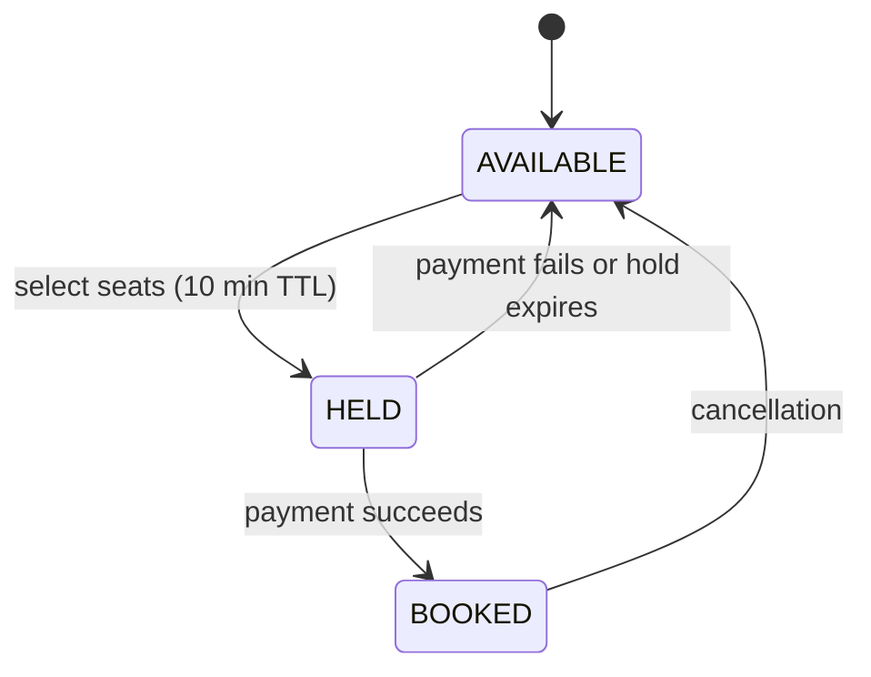
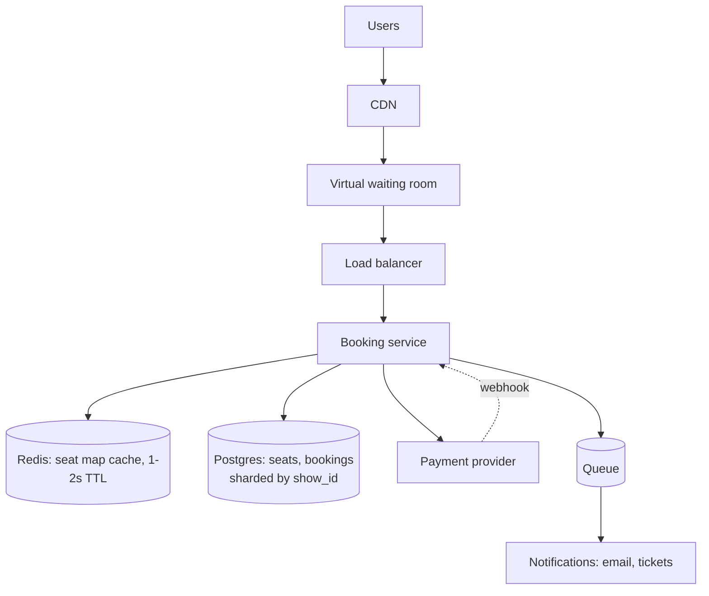

# Design Ticket Booking (BookMyShow / Ticketmaster)

> The canonical **contention** design. Everything hinges on preventing double-booking under extreme concurrency for a small, fixed inventory.

## Requirements

**Functional**
- Browse events, venues, and available seats
- **Hold** a seat while the user pays
- Confirm booking on payment success; release on failure or timeout
- Cancel and refund

**Non-functional**
- **A seat must never be double-booked** — this is the hard constraint
- Handle flash sales: 100,000 users for 10,000 seats within seconds
- Reads (browsing) vastly outnumber writes
- Holds must expire reliably

**Note the shape:** this is not a scale problem, it's a **contention** problem. Total inventory is tiny; concurrent demand for the same rows is enormous.

## Estimation

```
Popular event: 10,000 seats, 100,000 concurrent users
Seat-map reads: 100,000 users × refresh every 2s = 50,000 reads/sec
Booking attempts: bursty — potentially 10,000+/sec in the first seconds
Data volume: trivial (millions of rows, not billions)
```

**Reads dominate by orders of magnitude, but writes are pathologically contended.** Say this — it frames the whole design.

## Data Model

Relational is correct here. You need real transactions.

```sql
seats (
  seat_id      uuid PRIMARY KEY,
  show_id      uuid,
  row_label    text,
  seat_number  int,
  status       text,          -- AVAILABLE | HELD | BOOKED
  held_by      uuid NULL,
  hold_expires timestamptz NULL,
  version      bigint,
  UNIQUE (show_id, row_label, seat_number)
);
CREATE INDEX ON seats (show_id, status);

bookings (booking_id, user_id, show_id, seat_ids[], status, idempotency_key UNIQUE, created_at);
```

**Postgres, not Cassandra.** Cassandra's last-write-wins would silently double-book. This is exactly the workload relational databases exist for, and choosing correctly is a signal.

## The Core Problem: Preventing Double-Booking

### Wrong — read then write
```java
Seat s = repo.findById(seatId);
if (s.status == AVAILABLE) {        // ← two threads both pass here
    s.status = HELD;
    repo.save(s);
}
```
Classic check-then-act race.

### Right — conditional update
```sql
UPDATE seats
   SET status='HELD', held_by=?, hold_expires=now() + interval '10 minutes'
 WHERE seat_id = ANY(?) AND status='AVAILABLE';
-- rows updated < requested → someone else won → fail the whole request
```

**One statement, atomic, no explicit lock.** The database's row-level locking does the work. If fewer rows updated than requested, roll back and tell the user.

### Multi-seat bookings and deadlock

A user booking seats A5 and A6 while another books A6 and A5 can deadlock if locks are acquired in different orders.

**Fix: always acquire in a deterministic order** — `ORDER BY seat_id` — so no cycle can form. Same lock-ordering rule as application code.

### Optimistic vs pessimistic here

| | Use |
|---|---|
| **Optimistic** (version/status check) | **Default** — most seat selections don't collide |
| **Pessimistic** (`SELECT ... FOR UPDATE`) | Only for the final confirm step, if needed |

Even in a flash sale, 100,000 users spread across 10,000 seats means most individual seats have low contention. **Optimistic is right; say why.**

## Hold → Confirm → Expire



**Expiry — the design decision worth raising.**

| Approach | Trade-off |
|---|---|
| **Lazy expiry** | Treat `HELD` with `hold_expires < now()` as available in every query. **No background job, no clock coordination, degrades gracefully.** |
| Background sweeper | Cleaner data, but a job that must always run |
| Redis TTL | Fast, but the source of truth diverges from the database |

**Lazy expiry is the better interview answer** — the condition goes into the `WHERE` clause and correctness never depends on a cron job running:

```sql
WHERE status='AVAILABLE'
   OR (status='HELD' AND hold_expires < now())
```

Run a sweeper too, but only for tidiness — correctness shouldn't depend on it.

## Handling The Flash Sale

Two distinct problems:

**1. Read load on the seat map** — 50,000 reads/sec of mostly-static data.

- Cache the seat map in Redis with a **1–2 second TTL**
- Accept staleness: a user may click a seat that was just taken, and the conditional update rejects them cleanly
- **This is fine.** Trying to make the seat map strongly consistent under this load is the wrong goal — the *booking* is authoritative, not the display.

**2. Write thundering herd** — 100,000 users hitting checkout simultaneously.

- **Virtual waiting room** — admit users in batches; everyone else sees a queue position. Ticketmaster does exactly this.
- Rate limit per user to stop scripted bulk attempts
- Bound the database connection pool so the surge doesn't exhaust it

**The virtual waiting room is the answer interviewers are looking for.** You cannot make a database handle 100,000 simultaneous contended writes; you shape the demand instead.

## Payment Integration

```
1. Hold seats (10 min)
2. Create payment intent with an idempotency key
3. Redirect to the payment provider
4. Webhook: success → confirm booking; failure → release hold
5. Timeout → hold expires lazily
```

**Never hold a database transaction across the payment call.** The hold is a *row status*, not an open transaction — otherwise a 3-minute payment holds locks for 3 minutes and the connection pool dies.

**The webhook must be idempotent** — providers retry. Use the payment intent ID as the idempotency key.

**Reconciliation job** for the ambiguous case: payment succeeded but the webhook never arrived. Poll the provider for holds that expired with a pending payment. This is the [Two Generals Problem](Two%20Generals%20Problem.md) in production.

## Architecture



**Shard by `show_id`** — all seats for a show live together, so a booking touches one shard. Different shows spread across shards naturally.

## Deep Dives To Be Ready For

| Question | Answer |
|---|---|
| **Two users click the same seat simultaneously?** | Conditional update; one gets 0 rows and a clean "seat taken" |
| **Payment succeeds after the hold expires?** | Reconciliation job; refund, or reissue if still available — a business decision |
| **Best-available seat selection?** | Server picks contiguous seats; reduces contention because users aren't all clicking the same "good" seat |
| **Preventing bots?** | CAPTCHA, per-user limits, device fingerprinting, waiting room |
| **Seat map consistency?** | Deliberately eventually consistent; the booking write is the source of truth |
| **Multi-region?** | Shard by show; keep a show's data in one region — events are geographically local anyway |

**"Shows are geographically local, so no show needs multi-region writes" is a strong simplification** to volunteer.

## Failure Modes

| Failure | Behaviour |
|---|---|
| Redis down | Seat map reads hit Postgres — slower, still correct |
| Payment webhook lost | Hold expires; reconciliation catches successful payments |
| Booking service crashes mid-hold | Hold expires lazily; seat returns automatically |
| Database primary fails | Failover; in-flight holds survive (they're committed rows) |

**Because holds are committed rows rather than in-memory locks, no component crash can leak a seat permanently.** That property is worth stating explicitly.

## Common Mistakes

- Read-then-write instead of a conditional update
- Holding a transaction open across the payment call
- Cassandra or another LWW store for inventory
- Relying solely on a sweeper for expiry
- Trying to make the seat map strongly consistent
- No idempotency on the payment webhook
- Ignoring lock ordering for multi-seat bookings
- No plan for the flash-sale write surge

## Related Topics

- [Transactions and Isolation Levels](Transactions%20and%20Isolation%20Levels.md)
- [Concurrency in LLD](Concurrency%20in%20LLD.md)
- [Scaling Writes](Scaling%20Writes.md)
- [Idempotent Consumers](Idempotent%20Consumers.md)

## Revision Summary

A contention problem, not a scale problem. Use a relational database with a single conditional `UPDATE` to hold seats atomically, lazy expiry so correctness never depends on a background job, and a virtual waiting room to shape flash-sale demand. Never hold a transaction across the payment call, and reconcile lost webhooks.

## Quick Recall

- **Conditional `UPDATE ... WHERE status='AVAILABLE'`** — never read-then-write
- Postgres, not Cassandra — LWW would double-book
- Hold → Confirm → Expire, with **lazy expiry in the `WHERE` clause**
- Order seat locks deterministically to avoid deadlock
- Seat map cache is deliberately stale; the booking write is authoritative
- **Virtual waiting room** shapes the flash-sale surge
- Payment webhook idempotent + reconciliation for lost callbacks
- Shard by `show_id`
