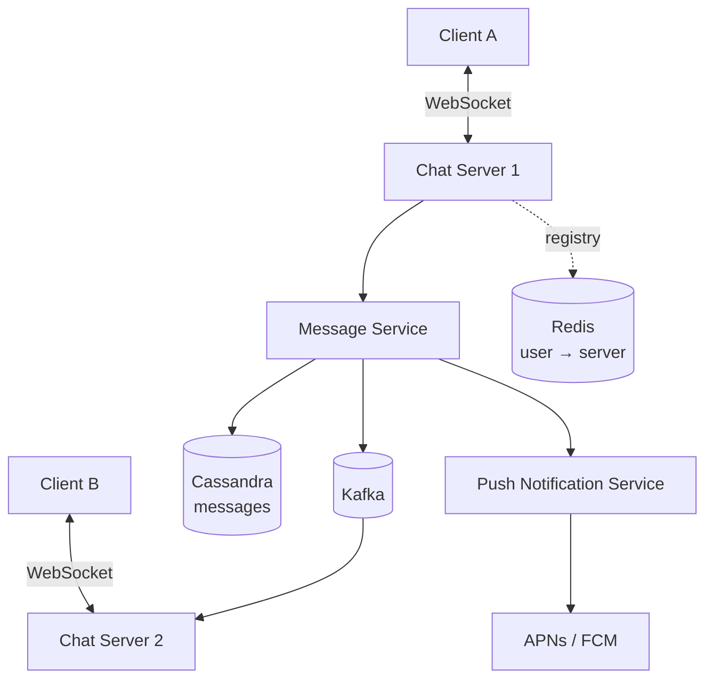

# Design a Chat System

> The canonical real-time design. Tests connection management, message ordering, and delivery guarantees together.

## Requirements

**Functional**
- 1:1 messaging and group chat
- Online/offline presence
- Message history
- Delivery receipts (sent / delivered / read)
- Push notifications when offline

**Non-functional**
- Low latency (< 200 ms end to end)
- **Messages must not be lost**
- Ordered within a conversation
- 50M DAU, ~10M concurrent connections

## Estimation

```
50M DAU × 40 messages/day = 2B messages/day
2B / 10⁵ ≈ 25,000 messages/sec, peak ~75,000

Concurrent connections: ~10M
At 50K connections/node → ~200 chat servers

Storage: 2B × 200 B = 400 GB/day → ~150 TB/year
```

**200 chat servers holding 10M connections reframes the problem:** this is a connection-management and routing problem more than a messaging one.

## Architecture



## Transport: WebSocket

Bidirectional and low-latency, so **WebSocket** rather than SSE. Fallback to long polling where blocked.

Operational requirements:
- **Heartbeat every 30 s** — proxies kill idle connections
- **Exponential backoff with jitter** on reconnect, or a server restart causes a reconnect storm
- Auth via token in the first message (browsers can't set custom headers on the WebSocket handshake)

## Connection Registry

To deliver a message you must find the recipient's server:

```
Redis:  user:123 → chat-server-7   (TTL 60s, refreshed by heartbeat)
```

The TTL is what makes stale entries self-correcting when a server dies without cleanup.

## Message Flow

1. A sends over its WebSocket to Chat Server 1
2. Server 1 assigns a **message ID** and **persists it first**
3. Server 1 acks to A (`sent`)
4. Look up B in the registry → chat-server-7
5. Publish to Kafka topic partitioned by conversation id
6. Server 7 consumes and pushes over B's WebSocket
7. B acks → `delivered`; B opens the chat → `read`

**Persist before acking.** If you ack first and then crash, the message is silently lost. This ordering is the single most important correctness decision, and interviewers look for it.

## Message IDs and Ordering

Requirements: unique, **sortable by time**, generated without coordination.

**Snowflake:** `[41-bit timestamp][10-bit machine][12-bit sequence]`

- Time-sortable, so ordering is implicit in the ID
- No coordination between servers
- ~4M IDs/sec per machine

**Do not use client timestamps for ordering** — clocks are wrong, and clients lie. Order by server-assigned ID.

**Ordering guarantee:** within a conversation only. Partition Kafka by `conversation_id` so all messages for a conversation flow through one partition and stay ordered. Cross-conversation ordering is meaningless and shouldn't be promised.

## Data Model

**Cassandra**, because the access pattern is a write-heavy, time-ordered range scan per conversation:

```
messages
  PARTITION KEY: conversation_id
  CLUSTERING KEY: message_id DESC        -- newest first
  columns: sender_id, content, created_at
```

This gives "fetch the last 50 messages in this conversation" as a **single sequential partition read** — the ideal Cassandra pattern.

```
user_conversations
  PARTITION KEY: user_id
  CLUSTERING KEY: last_message_at DESC
```

Powers the conversation list, which is the most-hit screen in any chat app.

**Why not a relational database?** 25,000 writes/sec sustained with no updates and no joins is exactly the LSM-tree workload Cassandra is built for.

## Group Chat

| Group size | Approach |
|---|---|
| Small (< 500) | **Fan-out on write** — push to each member |
| Large (thousands) | **Fan-out on read** — members poll or subscribe on open |

Same hybrid trade-off as a social feed. A 10,000-member group broadcasting to every member on every message is 10,000 writes per message.

## Offline Delivery

Redis Pub/Sub and WebSocket both drop messages for disconnected users. Because messages are **persisted first**:

1. On reconnect the client sends its **last received message ID**
2. The server returns everything after it
3. If the user is offline entirely, trigger a **push notification** via APNs/FCM

**"Persist first, push as an optimisation, backfill from last-seen ID on reconnect"** is the answer that demonstrates you understand the transport is best-effort.

## Presence

- Client heartbeats every 30 s
- `presence:user:123 → online` in Redis with a 60 s TTL, refreshed by the heartbeat
- Missed heartbeats → key expires → offline, automatically

**The fan-out problem:** a user with 5,000 contacts coming online triggers 5,000 presence notifications. Mitigate by only pushing presence for conversations currently open on a client, and batching updates.

**Presence is eventually consistent and slightly stale** — say so; precise presence isn't worth the cost.

## Deep Dives To Be Ready For

| Question | Answer |
|---|---|
| **End-to-end encryption?** | Signal protocol; server stores ciphertext only. Kills server-side search and breaks multi-device without key sharing. |
| **Media (images/video)?** | Presigned URL direct to blob storage; message carries only the reference |
| **Read receipts at scale?** | Batch and debounce; per-message receipts in a large group are a write amplification disaster |
| **Message search?** | Elasticsearch alongside Cassandra, fed by CDC. Impossible with E2E encryption. |
| **Deleting messages?** | Tombstone; propagate the deletion event to clients |
| **Multi-device?** | Per-device delivery cursors, not one per user |
| **Exactly-once delivery?** | Doesn't exist. Client-generated message IDs make retries idempotent and deduplicate. |

## Failure Modes

| Failure | Behaviour |
|---|---|
| Chat server dies | Its 50K clients reconnect (with backoff) to other servers; registry TTL clears stale entries |
| Kafka lag | Delivery delayed; messages already persisted, so nothing is lost |
| Cassandra node down | Quorum reads/writes tolerate it (RF=3, W=2, R=2) |
| Redis registry down | Fall back to broadcasting to all servers — degraded but functional |

## Common Mistakes

- Acking before persisting
- Ordering by client timestamp
- Promising global message ordering
- No heartbeat, so dead connections linger
- No reconnect backoff → reconnect storm after a deploy
- Treating WebSocket delivery as durable
- Ignoring the group-chat fan-out problem
- No push notification path for offline users

## Related Topics

- [Real-Time Updates](Real%20Time%20Updates.md)
- [Kafka Deep Dive](Kafka%20Deep%20Dive.md)
- [Consistency Models](Consistency%20Models.md)
- [Back of the Envelope Estimation](Back%20of%20the%20Envelope%20Estimation.md)

## Revision Summary

WebSocket connections spread across ~200 servers, with a Redis registry mapping user to server and Kafka partitioned by conversation for routing and ordering. Persist before acking, use Snowflake IDs for time-sortable ordering, store in Cassandra partitioned by conversation, and backfill from a last-seen ID on reconnect.

## Quick Recall

- WebSocket + heartbeat + backoff reconnect
- Redis registry `user → server` with TTL
- **Persist, ack, then route** — never ack first
- Snowflake IDs; never trust client clocks
- Kafka partitioned by `conversation_id` → ordering per conversation
- Cassandra: partition by conversation, cluster by message ID DESC
- Offline → push notification; reconnect → backfill from last ID
