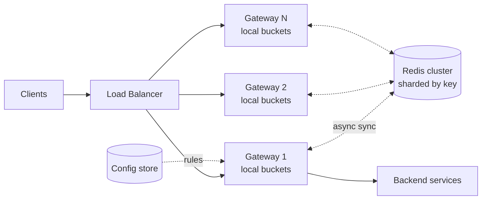

# Design a Distributed Rate Limiter

> Deceptively deep. The whole interview is the tension between accuracy, latency, and availability across many nodes.

## Requirements

**Functional**
- Limit requests per client (user, API key, IP) to N per time window
- Different limits per endpoint and per tier
- Return 429 with `Retry-After` when exceeded

**Non-functional**
- **Latency overhead < 10 ms** — it sits in front of every request
- 1M requests/sec across the fleet
- Highly available — the limiter must not become the outage
- Reasonably accurate; small over-admission is acceptable

## Estimation

```
1M req/sec across ~100 gateway nodes = 10,000 req/sec per node
Unique keys: 10M users
State per key: ~50 bytes → 500 MB — fits comfortably in memory

Centralised Redis: 1M ops/sec → needs ~10 Redis nodes, and adds a network hop
```

**That last line drives the design.** A network hop on every request is 0.5–1 ms and a hard dependency on Redis. Whether you accept it is the central decision.

## Algorithm Choice

| Algorithm | Memory | Burst | Accuracy |
|---|---|---|---|
| Fixed window | O(1) | **2× at boundaries** | Poor |
| Sliding window log | O(requests) | Exact | Perfect |
| **Sliding window counter** | O(1) | Good | **Good approximation** |
| **Token bucket** | O(1) | **Controlled bursts** | Good |
| Leaky bucket | O(queue) | Smoothed | Good |

**Token bucket** for user-facing APIs — real traffic is bursty, and allowing a short burst while bounding the average is what users actually want.

**Sliding window counter** when you must enforce a strict "N per minute" with minimal memory.

**Fixed window's 2× boundary burst is the standard follow-up** — a client can send the full quota at 0:59 and again at 1:00.

### Token bucket state
```
{ tokens: float, lastRefill: timestamp }
```
Refill is computed **lazily** on access — no background timer:
```
elapsed = now - lastRefill
tokens = min(capacity, tokens + elapsed * refillRate)
```

## The Three Architectures

### 1. Centralised (Redis)

Every node checks a shared Redis instance.

**Must be atomic** — `GET` then `INCR` races across nodes:

```lua
-- token bucket in Lua, executes atomically
local bucket = redis.call('HMGET', KEYS[1], 'tokens', 'ts')
local tokens = tonumber(bucket[1]) or capacity
local ts     = tonumber(bucket[2]) or now
tokens = math.min(capacity, tokens + (now - ts) * rate)
if tokens < 1 then return 0 end
redis.call('HMSET', KEYS[1], 'tokens', tokens - 1, 'ts', now)
redis.call('EXPIRE', KEYS[1], ttl)
return 1
```

| | |
|---|---|
| Accuracy | **High** |
| Latency | **+0.5–1 ms per request** |
| Availability | **Redis is a hard dependency** |
| Scale | Shard by key; hot keys are a risk |

### 2. Local Only

Each node enforces `limit / nodeCount`.

| | |
|---|---|
| Latency | **Zero** |
| Accuracy | **Poor** — uneven load balancing means some nodes reject while others have headroom |
| Availability | Perfect |

Breaks badly when a client's requests aren't evenly distributed, which is common with keep-alive connections.

### 3. Local + Async Sync — the production answer

Each node keeps a local bucket and **reconciles with a shared counter every 100–500 ms**.

```
Request → check local bucket (zero latency)
       → allow/deny immediately
Background: every 200ms, push local consumption to Redis,
            pull global state, adjust local allowance
```

| | |
|---|---|
| Latency | **Zero on the request path** |
| Accuracy | Good — bounded over-admission during the sync interval |
| Availability | **Degrades gracefully** — Redis loss means local-only enforcement |

**Over-admission is bounded by `nodes × requests-per-sync-interval`.** For most APIs, briefly allowing 1,050 instead of 1,000 is irrelevant; a hard Redis dependency in front of every request is not.

**This is the design to propose, with the trade-off stated explicitly.**

## Architecture



## Key Design Decisions

| Decision | Choice |
|---|---|
| **Where** | API gateway — one place, protects everything behind it |
| **Key by** | Authenticated user/API key; IP only as an anonymous fallback |
| **Granularity** | `{key}:{endpoint}:{window}` — different limits per endpoint |
| **Storage** | Redis, sharded by rate-limit key |
| **Config** | Separate store, hot-reloaded — rule changes must not need a deploy |

**Keying by IP alone is weak** — NAT means thousands of users share an IP, and attackers rotate addresses. Use identity where available.

## Fail Open Or Fail Closed

When Redis is unreachable:

| Choice | When |
|---|---|
| **Fail open** (allow) | User-facing reads — a limiter outage shouldn't be a site outage |
| **Fail closed** (reject) | Expensive or dangerous operations — payments, LLM calls, bulk exports |

**There is no universally right answer**, and interviewers ask precisely because of that. State the trade-off and pick per endpoint class.

With the local+sync design you get a third option: **fall back to local-only enforcement**, which is strictly better than either extreme.

## Hot Keys

One abusive client concentrates traffic on a single Redis shard.

- Shard by the full rate-limit key, so different users spread naturally
- For a genuinely hot single key, the local bucket already absorbs most of the load
- Consider a separate tier for known high-volume clients

## Response

```http
HTTP/1.1 429 Too Many Requests
X-RateLimit-Limit: 1000
X-RateLimit-Remaining: 0
X-RateLimit-Reset: 1699999999
Retry-After: 30
```

**`Retry-After` is mandatory.** Without it, well-behaved clients retry immediately and amplify the overload you're trying to control.

Return rate-limit headers on **successful** responses too — clients can then self-throttle before hitting the limit.

## Deep Dives To Be Ready For

| Question | Answer |
|---|---|
| **Distributed accuracy?** | Bounded over-admission = nodes × per-sync consumption; tighten by shortening the interval |
| **Multi-region?** | Regional limits with async global reconciliation; strict global limits need cross-region consensus and the latency isn't worth it |
| **Different tiers?** | Rule lookup by plan, cached locally with a short TTL |
| **Burst allowance?** | Token bucket capacity > refill rate × 1s |
| **Preventing retry storms?** | `Retry-After` + jitter guidance; consider a circuit breaker on repeat offenders |
| **Rate limit by cost, not count?** | Deduct a weighted number of tokens per request — essential for GraphQL and LLM APIs |

**Cost-based limiting is the modern variant worth raising** — one expensive query shouldn't count the same as a cheap one.

## Failure Modes

| Failure | Behaviour |
|---|---|
| Redis down | Local-only enforcement; over-admission grows but service continues |
| Gateway node added | Its local allowance is learned on the next sync |
| Config store down | Serve cached rules; never block on config |
| Clock skew across nodes | Token refill drifts — use monotonic time for elapsed calculations |

## Common Mistakes

- `GET` then `INCR` — non-atomic across nodes
- Fixed window without acknowledging the boundary burst
- Forgetting `EXPIRE`, so counters live forever
- Keying by IP only
- No `Retry-After`
- Not deciding fail-open vs fail-closed
- Placing the limiter behind the expensive work rather than in front

## Related Topics

- [Rate Limiting](Rate%20Limiting.md)
- [Redis](Redis.md)
- [API Gateway](API%20Gateway.md)
- [Circuit Breaker](Circuit%20Breaker.md)

## Revision Summary

Token bucket at the API gateway, keyed by identity. Local buckets with asynchronous reconciliation to Redis keep the request path free of network calls while bounding over-admission. Use Lua for atomicity when checking centrally, always return `Retry-After`, and decide fail-open versus fail-closed per endpoint class.

## Quick Recall

- Token bucket for bursty user traffic; sliding window counter for strict limits
- Centralised = accurate but a hard dependency; local = fast but inaccurate
- **Local + async sync is the production answer**
- Redis checks must be atomic → Lua
- Over-admission ≈ nodes × per-interval consumption
- Fail open for reads, closed for expensive writes
- `Retry-After` always; headers on success too
- Cost-based limiting for GraphQL and LLM APIs
