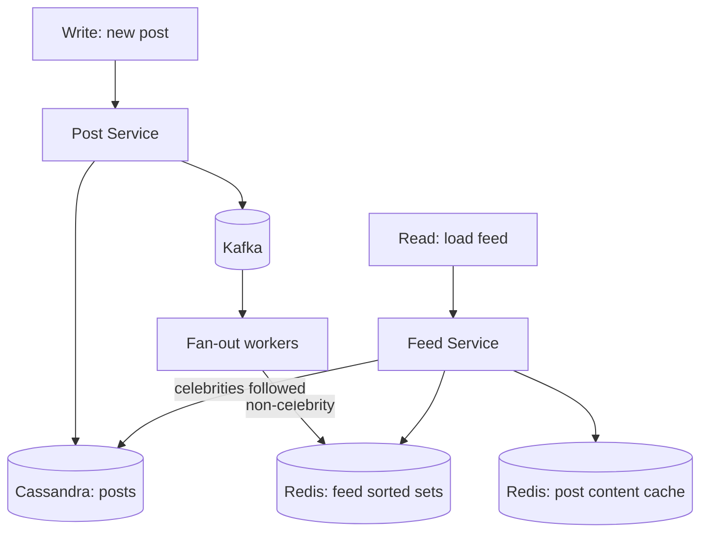

# Design a News Feed

> Twitter, Instagram, Facebook. The interview exists to make you confront the celebrity fan-out problem — get there fast.

## Requirements

**Functional**
- Post content
- View a feed of posts from people you follow, newest first
- Follow / unfollow

**Non-functional**
- Feed load < 200 ms
- **Read-heavy: ~100:1**
- Eventual consistency is acceptable (a few seconds of lag is invisible)
- 300M DAU

## Estimation

```
300M DAU × 2 posts/day    = 600M posts/day → ~7,000 writes/sec, peak ~20,000
300M DAU × 20 feed loads  = 6B reads/day  → ~70,000 reads/sec, peak ~200,000

Average following: 200
Naive fan-out on write: 7,000 × 200 = 1.4M feed writes/sec
```

**That 1.4M/sec figure is the whole problem.** State it early — it justifies everything that follows.

## The Two Approaches

### Fan-out on Write (Push)

On posting, write the post ID into every follower's precomputed feed.

```
POST → for each follower: LPUSH feed:{followerId} postId
```

| | |
|---|---|
| Read | **O(1)** — the feed is already built |
| Write | **O(followers)** |
| Storage | High — duplicated per follower |
| Fails on | **Celebrities** — 100M followers means 100M writes for one post |

### Fan-out on Read (Pull)

Build the feed at read time by querying everyone you follow.

| | |
|---|---|
| Read | **O(following)** — slow, ~200 queries per feed load |
| Write | **O(1)** |
| Storage | Minimal |
| Fails on | **Every read** — 200,000 reads/sec × 200 queries is impossible |

## The Hybrid — The Expected Answer

**Push for ordinary users, pull for celebrities.**

```
Post by a user with < 10,000 followers  → fan out to follower feeds
Post by a user with ≥ 10,000 followers  → do NOT fan out

Feed load:
  1. Read precomputed feed        (fast, covers ~99% of content)
  2. Query the few celebrities you follow  (usually 0–5)
  3. Merge by timestamp, return
```

**Why this works:** almost nobody has 10,000 followers, so almost all posts still fan out cheaply. Almost everyone follows only a handful of celebrities, so the pull side is a handful of queries. Both bad cases are avoided.

**Say the threshold is tunable and would be set from the actual follower distribution.** That's the difference between reciting the pattern and understanding it.

## Feed Storage

Redis sorted set per user, scored by timestamp:

```
ZADD feed:{userId} {timestamp} {postId}
ZREVRANGE feed:{userId} 0 49          -- newest 50
ZREMRANGEBYRANK feed:{userId} 0 -1001 -- cap at 1000 entries
```

**Store post IDs, not post content.** Content is fetched separately from a cache. Otherwise editing or deleting a post requires rewriting millions of feed entries.

**Cap the feed length.** Nobody scrolls past ~1,000 items; beyond that, fall back to a slower query. This bounds storage from unbounded to `300M × 1000 × 8 bytes ≈ 2.4 TB` — large but tractable, and mostly cold.

## Data Model

```
posts          (Cassandra)
  PARTITION KEY: post_id                      -- point lookup by id

user_posts     (Cassandra)
  PARTITION KEY: user_id
  CLUSTERING KEY: created_at DESC             -- a user's own timeline, and the pull path

follows        (Cassandra, denormalised BOTH ways)
  followers_by_user: PARTITION user_id → follower_ids   -- for fan-out
  following_by_user: PARTITION user_id → followee_ids   -- for pull
```

**Storing the follow graph in both directions is deliberate denormalisation.** Fan-out needs "who follows me"; the pull path needs "who do I follow". A single table can only serve one efficiently.

## Architecture



**Fan-out is asynchronous through Kafka.** The post write returns as soon as the post is durable; fan-out happens in the background. A celebrity post fanning out to millions must never block the author's request.

## Ranking

Chronological is the simple version. Real feeds rank by predicted engagement:

```
score = w1·recency + w2·affinity(viewer, author) + w3·engagement_rate + w4·content_type
```

**The scaling insight:** you cannot score millions of candidates at read time. It's a two-stage funnel — **candidate generation** (cheap, retrieves ~500 posts) then **ranking** (expensive ML model on those 500 only).

Mentioning the two-stage funnel signals familiarity with how real feeds work.

## Pagination

**Cursor-based, never offset.**

```
GET /feed?cursor={lastPostId}&limit=20
```

Offset pagination breaks on an insert-heavy feed: new posts shift everything down, so page 2 repeats items from page 1. The cursor anchors to a stable position.

## Deep Dives To Be Ready For

| Question | Answer |
|---|---|
| **New follow — backfill their posts?** | Usually don't; the feed fills naturally. Or backfill asynchronously with a bounded job. |
| **Unfollow?** | Don't rewrite the feed; filter at read time, or let it age out |
| **Deleted post?** | Filter at read time by checking a tombstone; rewriting millions of feeds isn't viable |
| **Feed for an inactive user?** | Don't fan out to users inactive for 30+ days — huge saving; build on demand when they return |
| **Fan-out worker falls behind?** | Kafka lag; feeds get stale. Prioritise queues by author reach; scale consumers. |
| **Read-your-writes?** | Insert your own post into your feed synchronously on the client or at read time |

**"Skip fan-out for inactive users" is one of the highest-leverage optimisations** — a large fraction of accounts are dormant, and each avoided fan-out is pure saving.

## Failure Modes

| Failure | Behaviour |
|---|---|
| Redis feed cache lost | Rebuild from `user_posts` on demand — degraded latency, no data loss |
| Fan-out workers down | Posts still durable; feeds go stale until workers recover |
| Cassandra node down | Quorum (RF=3, W=2, R=2) tolerates it |
| Celebrity posts simultaneously | Fan-out is skipped for them by design — no thundering herd |

**Feed data is derived, not authoritative.** Losing it is a latency incident, not a data loss incident — a good point to make.

## Common Mistakes

- Pure fan-out on write with no celebrity handling
- Pure fan-out on read at 200,000 reads/sec
- Storing post content in every follower's feed
- Unbounded feed length
- Synchronous fan-out blocking the post request
- Offset pagination
- Fanning out to dormant accounts
- Not stating the 1.4M writes/sec figure that motivates the whole design

## Related Topics

- [Scaling Reads](Scaling%20Reads.md)
- [Redis](Redis.md)
- [Kafka Deep Dive](Kafka%20Deep%20Dive.md)
- [Back of the Envelope Estimation](Back%20of%20the%20Envelope%20Estimation.md)

## Revision Summary

Naive fan-out on write is 1.4M feed writes/sec; fan-out on read is 200 queries per feed load. The hybrid pushes for ordinary users and pulls for celebrities. Store post IDs in capped Redis sorted sets, denormalise the follow graph both ways, fan out asynchronously via Kafka, and skip dormant users.

## Quick Recall

- Push = O(followers) write, O(1) read; pull = the reverse
- **Hybrid**: push below the follower threshold, pull above it
- Redis sorted set of **post IDs**, capped at ~1,000
- Follow graph denormalised in both directions
- Fan-out async via Kafka, never blocking the post
- Skip fan-out for inactive users
- Cursor pagination; feed data is derived and rebuildable
