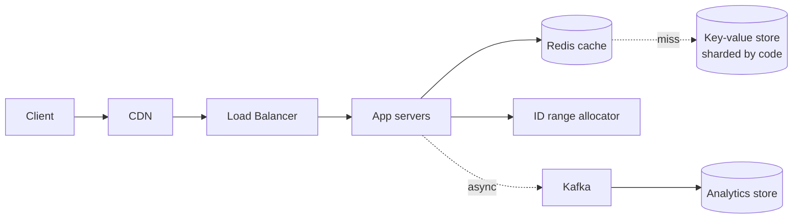

# Design a URL Shortener

> The standard warm-up. Easy to pass, easy to be forgettable in. The differentiation is in ID generation and the read path.

## Requirements

**Functional**
- Shorten a long URL → short code
- Redirect a short code → original URL
- Optional: custom aliases, expiry, click analytics

**Non-functional**
- **Read-heavy: ~100:1** (the defining property)
- Redirect latency < 100 ms
- High availability — a dead shortener breaks every link ever issued
- Codes must not be guessable if privacy matters

## Estimation

```
100M new URLs/day    → 100M / 10⁵ ≈ 1,200 writes/sec, peak ~3,000
100:1 read ratio     → 120,000 reads/sec, peak ~300,000

Storage: 500 B/record × 100M = 50 GB/day → ~18 TB/year
Hot set: 20% of URLs serve 80% of reads → 10 GB/day working set → FITS IN RAM
```

**The conclusion that shapes everything:** the working set fits in memory, so a cache absorbs almost all reads. State this.

## Short Code Length

Base62 (`a-z A-Z 0-9`):

| Length | Combinations |
|---|---|
| 6 | 62⁶ ≈ 56 billion |
| 7 | 62⁷ ≈ 3.5 trillion |

At 100M/day, 7 characters lasts ~95 years. **Choose 7.**

## ID Generation — The Real Question

| Approach | Pros | Cons |
|---|---|---|
| **Hash the URL (MD5/SHA, truncate)** | Deterministic, dedupes identical URLs | **Collisions** need check-and-retry — an extra DB read per write |
| **Random generation** | Simple, unguessable | Collision check required; gets slower as space fills |
| **Auto-increment + Base62** | No collisions, shortest codes | **Sequential = guessable and enumerable**; the counter is a bottleneck |
| **Counter ranges per server** | No coordination per write, no collisions | Gaps on server restart |
| **Snowflake ID** | Distributed, no coordination, time-sortable | Longer codes; sequential |

**The recommended answer: pre-allocated counter ranges.**

A coordination service (ZooKeeper, or a DB row with `UPDATE ... RETURNING`) hands each app server a block of 1M IDs. The server allocates locally with zero coordination until the block is exhausted.

- No per-write network call
- No collisions by construction
- Restarts waste at most one block — irrelevant given 3.5 trillion codes

**To defeat enumeration**, don't emit the raw counter. Apply a reversible permutation (Feistel network or multiply by a large coprime modulo 62⁷) so consecutive IDs produce scattered codes. **This is the detail that separates a good answer from a standard one** — you keep collision-freedom *and* unguessability.

## Data Model

```
urls
  short_code   CHAR(7)  PRIMARY KEY
  long_url     TEXT
  user_id      BIGINT
  created_at   TIMESTAMP
  expires_at   TIMESTAMP NULL
```

Access pattern is a pure point lookup by `short_code` → **any key-value store works**. DynamoDB or Cassandra fit naturally; Postgres is fine too if sharded by `short_code`.

**Shard by `short_code`** — it's high-cardinality, uniformly distributed (after permutation), and matches the only query.

## API

```
POST /api/v1/urls        {longUrl, customAlias?, expiresAt?} → {shortUrl}
GET  /{shortCode}                                            → 301/302 redirect
GET  /api/v1/urls/{code}/stats                               → click analytics
```

**301 vs 302 — a guaranteed follow-up:**

| | 301 Permanent | 302 Found |
|---|---|---|
| Browser caches | **Yes, aggressively** | No |
| Subsequent requests | **Never reach you** | Always reach you |
| Analytics | **Lost after the first visit** | Complete |
| Can change the target later | Effectively no | Yes |

**Use 302** if you need click analytics or mutable targets — which is nearly always. Use 301 only when you want to shed read load and don't care about tracking.

## Architecture



## The Read Path

This is where the design is won:

1. **CDN / edge cache** — a 302 with a short TTL can be cached at the edge; most redirects never reach origin
2. **Redis** — 10 GB working set, ~100K ops/sec per node, cache-aside
3. **Database** — only on a genuine miss

Codes are immutable once created, so **cache invalidation is a non-problem**. Set a long TTL. Say this — it's a rare case where caching is genuinely easy, and noticing it is a good signal.

## Analytics Without Slowing Redirects

Never write to a database on the redirect path — that turns a 5 ms operation into 50 ms.

**Fire an event to Kafka asynchronously** and aggregate downstream (Flink, or batch). The redirect returns immediately.

For approximate unique-visitor counts, **HyperLogLog** gives ~0.8% error in 12 KB per code.

## Deep Dives To Be Ready For

| Question | Answer |
|---|---|
| **Custom aliases?** | Separate namespace or a reserved prefix; unique constraint; check availability at write time |
| **Expiry?** | `expires_at` column; lazy check on read plus a background sweeper. TTL in Redis. |
| **Prevent abuse?** | Rate limit per user/IP; scan destinations against a malware blocklist; CAPTCHA |
| **One URL shortened twice?** | Decide: dedupe (hash-based) or allow duplicates (better for per-user analytics). Usually allow. |
| **Deleting a code?** | Tombstone rather than delete, so it's never reissued |
| **Global users?** | Multi-region read replicas; codes are immutable so async replication is safe |
| **Hot code (viral link)?** | CDN handles it; add local in-process caching on app servers |

**"Codes are immutable, so async cross-region replication has no consistency risk" is a strong point** — most systems can't say that.

## Failure Modes

| Failure | Behaviour |
|---|---|
| Redis down | Degraded latency, DB serves reads — **must not fail** |
| ID allocator down | Writes fail; reads unaffected. Buffer a spare block per server. |
| One shard down | Only codes on that shard fail — partial availability |
| Analytics pipeline down | Redirects unaffected; events buffer in Kafka |

**Reads must survive the loss of writes.** A shortener that can't issue new links is inconvenient; one that can't resolve existing links is broken.

## Common Mistakes

- Hashing with collision-retry and not mentioning the extra read
- Sequential codes without addressing enumeration
- 301 redirects while also promising click analytics
- Synchronous analytics writes on the redirect path
- Over-engineering — this genuinely doesn't need microservices
- Not stating that the working set fits in memory

## Related Topics

- [Back of the Envelope Estimation](Back%20of%20the%20Envelope%20Estimation.md)
- [Caching](Caching.md)
- [Partitioning and Sharding](Partitioning%20and%20Sharding.md)
- [CDN](CDN.md)

## Revision Summary

Read-heavy point lookup with an in-memory working set. Use pre-allocated counter ranges plus a reversible permutation for collision-free unguessable 7-character Base62 codes. 302 for analytics, cache aggressively (codes are immutable), and push click events asynchronously to Kafka.

## Quick Recall

- 100:1 read:write; working set fits in RAM
- Base62, 7 chars = 3.5 trillion
- Counter ranges + Feistel permutation = no collisions, not enumerable
- 302 for analytics; 301 sheds load but loses tracking
- Codes immutable → caching and async replication are trivially safe
- Analytics async via Kafka, never on the redirect path
