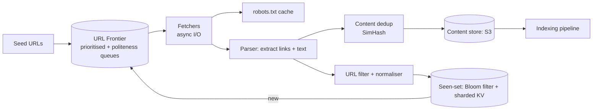

# Design a Web Crawler

> Tests politeness, deduplication at scale, and prioritisation. The naive answer — BFS with a visited set — falls apart immediately.

## Requirements

**Functional**
- Crawl the web starting from seed URLs
- Extract and follow links
- Store page content for downstream indexing
- Respect `robots.txt`
- Recrawl pages as they change

**Non-functional**
- **1B pages/month** (~400 pages/sec sustained)
- **Politeness** — never overwhelm a single domain
- Extensible to new content types
- Robust to malformed HTML, traps, and slow servers

## Estimation

```
1B pages/month ÷ 2.6M sec = ~400 pages/sec sustained; peak ~1,000/sec

Page size ~500 KB raw, ~100 KB compressed text
1B × 100 KB = 100 TB/month of stored content

URLs seen: ~10B (many more URLs than crawled pages)
URL storage: 10B × 100 B = 1 TB just for the seen-set
```

**The 1 TB seen-set is the number that shapes the design** — you can't hold it in one machine's memory, which forces either sharding or a probabilistic filter.

## Architecture



## The URL Frontier — The Heart Of The Design

Not a simple queue. It must satisfy two competing constraints simultaneously:

1. **Priority** — crawl important pages first
2. **Politeness** — never hit one domain too fast

**The standard structure (Mercator-style) uses two queue layers:**

```
Front queues  (prioritisation)   — one queue per priority level
                 ↓ biased selection
Back queues   (politeness)       — one queue PER HOST
                 ↓
Heap keyed by "next allowed fetch time" per host
```

**One back queue per host is the mechanism that guarantees politeness** — a worker takes the host whose next-allowed-time has passed, fetches one page, then reschedules that host for `now + delay`.

**Delay should be adaptive:** `max(robots crawl-delay, k × last_response_time)`. A slow server gets crawled more gently — using its own response time as the signal is the elegant detail.

**Politeness is per-host, not per-IP** by default — but many hosts share an IP (shared hosting, CDNs), so IP-level limits matter too.

## Deduplication — Two Distinct Problems

### 1. URL deduplication ("have I seen this URL?")

**Normalise first**, or you'll crawl the same page many times:
- Lowercase scheme and host
- Remove default ports, fragments (`#...`), and tracking params (`utm_*`)
- Sort query parameters
- Resolve relative paths

**Then check the seen-set.** At 10B URLs:

```
Bloom filter in memory (fast reject) → sharded KV store (authoritative)
```

**A Bloom filter alone is not sufficient** — false positives mean pages are never crawled, silently. Use it as a fast negative check, and confirm positives against the store. Getting this asymmetry right is the signal.

Shard the store by `hash(domain)` so a host's URLs live together.

### 2. Content deduplication ("have I seen this content?")

Different URLs frequently serve identical content — mirrors, print versions, session-ID variants. Roughly 30% of the web is near-duplicate.

| Technique | Detects |
|---|---|
| MD5/SHA of content | **Exact** duplicates only |
| **SimHash** | **Near-duplicates** — small edits produce a similar hash |
| MinHash / LSH | Set-similarity at scale |

**SimHash is the right answer:** documents differing by a few words produce hashes within a small Hamming distance, so you can detect near-duplicates by bucketed lookup rather than pairwise comparison.

## Politeness And robots.txt

```
1. Fetch and cache /robots.txt per host (TTL ~24h)
2. Honour Disallow rules and Crawl-delay
3. Send a descriptive User-Agent with a contact URL
4. Back off on 429 and 5xx
```

**Cache `robots.txt` aggressively** — fetching it per URL would double your request volume and be its own politeness violation.

**Respect it even when it costs you coverage.** Beyond ethics, ignoring it gets you IP-banned.

## Prioritisation

Not all pages are equal.

| Signal | Effect |
|---|---|
| **PageRank / in-link count** | Important pages first |
| **Change frequency** | News recrawled hourly; static pages monthly |
| Domain authority | Trusted domains prioritised |
| Depth from seed | Prefer shallow pages |
| Freshness of the last crawl | Older = higher priority |

**Adaptive recrawl** is the interesting part: track how often a page actually changed, and adjust its interval. Crawling an unchanged page daily wastes budget; crawling a news site weekly misses everything.

**Use `If-Modified-Since` / `ETag`** — a 304 response costs almost nothing and tells you the page is unchanged.

## The Traps

This is where the design gets interesting, and interviewers probe it.

| Trap | Defence |
|---|---|
| **Infinite calendars** (`/calendar?month=999999`) | Depth limits, URL-length limits, per-domain page caps |
| **Dynamically generated URL spaces** | Cap unique URLs per domain; detect low-value patterns |
| **Spider traps** — pages linking to themselves with varying params | URL normalisation; per-domain budgets |
| **Slow-loris servers** | Aggressive connection and read timeouts |
| **Huge files** | Content-Length check; abort mid-download beyond a cap |
| **Redirect loops** | Cap redirect chains (~5) |
| **Malformed HTML** | Lenient parser; never crash a worker |
| **Non-HTML content** | Check `Content-Type` before parsing |

**A per-domain page budget is the single most effective defence** — it bounds the damage from any trap without needing to detect the trap itself.

## Fetching Efficiently

- **Async I/O**, not thread-per-request. 1,000 concurrent fetches on threads would need 1 GB of stack; an event loop handles it in one process. See [Processes and Threads](Processes%20and%20Threads.md).
- **Cache DNS** — resolution is often the slowest step, and crawlers hammer it
- Connection pooling and keep-alive per host
- Geographic distribution — crawl from a region near the host

**DNS caching is a genuinely large win** and one candidates rarely mention.

## Storage

| Data | Store |
|---|---|
| Raw HTML | **S3**, compressed, partitioned by crawl date |
| Extracted text and metadata | Columnar store or search index |
| URL seen-set | Sharded KV (RocksDB, Cassandra) |
| Link graph | Adjacency lists for PageRank |
| Crawl state | Frontier persistence |

**Store the raw HTML.** Reparsing is far cheaper than recrawling when the extraction logic changes — and it will.

## Deep Dives To Be Ready For

| Question | Answer |
|---|---|
| **Distributed frontier?** | Shard by `hash(domain)` so one worker owns a host — politeness stays local, no coordination needed |
| **Worker crashes mid-fetch?** | URLs leased with a timeout; unacked leases return to the frontier |
| **How to detect the crawl is stuck?** | Monitor pages/sec, frontier size, and per-domain distribution |
| **Recrawl scheduling?** | Priority queue on `next_crawl_time`, adapted by observed change frequency |
| **JavaScript-rendered pages?** | Headless browser pool — 10–100× more expensive, so route only pages that need it |
| **Duplicate detection at 10B scale?** | SimHash with LSH bucketing; exact comparison only within a bucket |

**"Shard the frontier by domain so politeness needs no cross-worker coordination" is the key distributed insight.**

## Failure Modes

| Failure | Behaviour |
|---|---|
| Fetcher dies | Leased URLs expire and return to the frontier |
| Frontier node lost | Rebuild from the seen-set and link graph |
| A domain blocks us | Back off, respect it, mark the domain |
| Content store unavailable | Buffer locally; crawling continues |
| Trap consumes budget | Per-domain cap contains the damage |

## Common Mistakes

- A single global queue — no politeness guarantee
- Bloom filter as the sole seen-set (false positives silently skip pages)
- No URL normalisation
- Exact hashing only, missing near-duplicates
- Fetching `robots.txt` per URL
- Thread-per-request instead of async I/O
- No per-domain budget, so one trap consumes the crawl
- Not storing raw HTML, forcing recrawls when parsing changes

## Related Topics

- [Data Structures for Big Data](Data%20Structures%20for%20Big%20Data.md)
- [Elasticsearch](Elasticsearch.md)
- [Messaging Fundamentals](Messaging%20Fundamentals.md)
- [Processes and Threads](Processes%20and%20Threads.md)

## Revision Summary

The URL frontier is the design: front queues for priority, one back queue per host for politeness, scheduled by next-allowed-fetch time. Normalise URLs, use a Bloom filter as a fast negative check over an authoritative sharded store, and SimHash for near-duplicate content. Bound every domain with a page budget to contain traps.

## Quick Recall

- Frontier = **priority front queues + per-host back queues**
- Politeness delay adapts to the server's own response time
- Normalise URLs before dedup
- Bloom filter rejects fast; **authoritative store confirms**
- SimHash catches near-duplicates; exact hashes don't
- Cache `robots.txt` and DNS aggressively
- **Per-domain page budget** contains every trap
- Shard the frontier by domain — politeness needs no coordination
- Store raw HTML; reparsing beats recrawling
