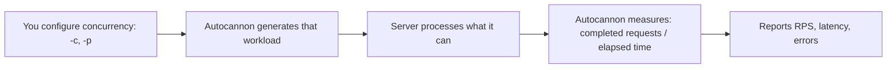
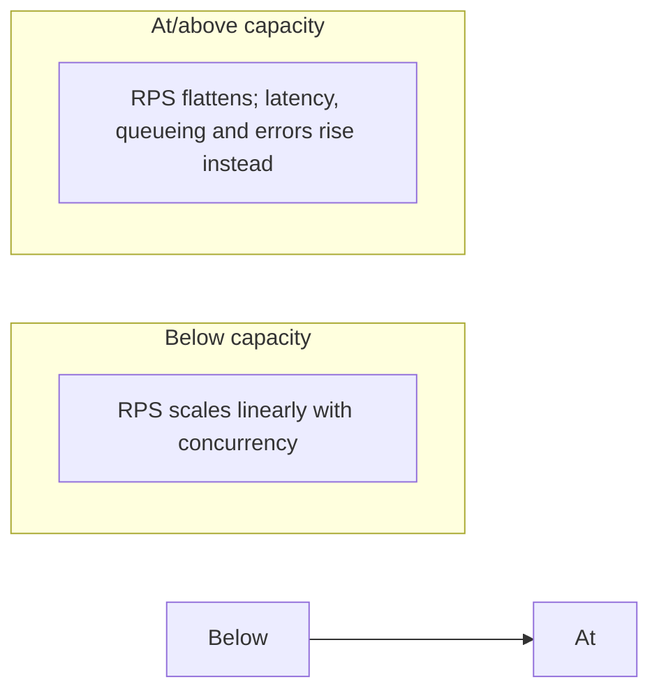

# Load Testing, Concurrency and Little's Law

## Why It Matters

Candidates routinely misread load-test output. A tool like Autocannon doesn't know a server's throughput ceiling in advance and isn't "looking it up" — it generates a workload from settings you choose, then reports what actually completed. Understanding that distinction, plus how `RPS ≈ Concurrency / Latency` (Little's Law), is what lets you design a load test that actually finds a server's capacity instead of just measuring your own request rate.

## The Core Confusion To Resolve

A load test does **not** do this:

```
Autocannon: "Let me determine server capacity."
Server:     "I can handle 5,000 RPS."
Autocannon: "Okay, I'll send 5,000."
```

It does this:



**RPS is an observed outcome, not a lookup.** If you only send 100 req/sec, you measure ~100 RPS even if the server could do 10,000 — you've underloaded it, not discovered its ceiling. Load tests must generate enough concurrent load to *saturate* the server before the reported RPS means anything about its true capacity.

## Autocannon's Two Independent Concurrency Knobs

| Flag | Meaning | Default |
|---|---|---|
| `-c` (**connections**) | How many concurrent **TCP connections** to open | — |
| `-p` (**pipelining**) | How many HTTP requests can be **outstanding on one connection** at once | **1** |

```bash
autocannon -c 100 http://localhost:3000        # 100 connections × 1 in-flight request each ≈ 100 in flight
autocannon -c 10  -p 10 http://localhost:3000  # 10 connections × 10 in-flight requests each ≈ 100 in flight
```

Leaving `-p` unset just means pipelining defaults to 1 — Autocannon doesn't probe the server first to pick a value; it simply runs with whatever `-c`/`-p` you gave it and continuously replaces each completed request with a new one to sustain that concurrency level.

**Important: `connections × pipelining` gives you maximum *requests in flight*, not RPS.** Whether that translates into a large or small RPS number depends entirely on per-request latency:

| In-flight requests | Per-request latency | Resulting RPS (approx.) |
|---|---|---|
| 1,000 | 1 s | ~1,000 |
| 1,000 | 100 ms | ~10,000 |
| 1,000 | 2 s | ~500 |

## Why Concurrency Drives RPS: Little's Law

With only **one** request in flight at a time, throughput is capped at `1 / latency` — a 100 ms API tops out around 10 RPS no matter how long you run it. Concurrency is what lets you have many requests' worth of that 100 ms wait overlapping simultaneously.

The useful mental model (Little's Law in practice):

```
RPS ≈ Concurrency / Average Latency
```

Example: concurrency = 100, latency = 100 ms (0.1 s) → `100 / 0.1 = 1,000 RPS`.

Ramping concurrency against a server capped at ~5,000 RPS:

| Concurrency | RPS | Latency |
|---|---|---|
| 1 | ~10 | 100 ms |
| 10 | ~100 | 100 ms |
| 100 | ~1,000 | 100 ms |
| 500 | ~4,500 | 110 ms |
| 1,000 | ~5,000 | 140–200 ms |
| 2,000 | **~5,000 (flat)** | **500 ms (climbing)** |

## Saturation: Where RPS Stops Scaling



Once concurrency exceeds what the server can actually process in parallel, adding more concurrent requests doesn't raise RPS further — the server can't magically process faster. Instead, requests queue, **latency climbs**, and eventually timeouts/errors appear. **This flattening — RPS plateauing while latency/errors rise as you keep increasing load — is the evidence that you've found a bottleneck**, not a specific number you look up.

## Why Use Pipelining At All? Connections Aren't Free

`-c 1000 -p 1` and `-c 100 -p 10` can both produce ~1,000 requests in flight, but they exercise different things:

| | Connections (`-c`) | Pipelining (`-p`) |
|---|---|---|
| Stresses | TCP connection setup/teardown, server connection limits, file descriptors, **TLS handshake overhead (HTTPS)**, connection pools, load-balancer behaviour | How many HTTP requests the server queues/processes per connection |
| Cost | Higher — each connection has real overhead | Lower — reuses one connection for more work |

Pipelining lets you push more requests in flight **without** paying for thousands of TCP connections — useful when you want to stress request-handling capacity specifically, not connection-handling capacity. Because the two knobs stress different things, `-c 1000 -p 1` and `-c 100 -p 10` are genuinely different tests even at equal "concurrency."

**Caveat: HTTP pipelining is not HTTP/2 multiplexing.** If the target is an HTTP/2 server, don't apply the `connections × pipelining` mental model directly — HTTP/2's stream multiplexing behaves differently.

## A Port Is Not A One-Request-At-A-Time Queue

A server listening on, say, port 3000 can serve many simultaneous clients — the port is an entrance, not a single-file queue. A TCP connection is uniquely identified by the 4-tuple:

```
(source IP, source port, destination IP, destination port)
```

Client A (`10.0.0.1:50001`) and Client B (`10.0.0.2:50002`) can both connect to `10.0.0.10:3000` simultaneously — they differ in source IP/port, so the OS tracks them as distinct connections even though the destination port is identical.

## Whether The App Processes Them Concurrently Depends On Its Architecture

| Model | Behaviour | Example |
|---|---|---|
| **Event loop** | One thread; I/O operations (DB queries, etc.) are issued and left outstanding without blocking the thread; many can be "in flight" concurrently on a single thread | **Node.js** |
| **Thread-per-request** | A worker-thread pool executes requests; concurrently *executing* requests are capped at the pool size — excess requests queue until a worker frees up | **Spring Boot / Tomcat** |

Exact queuing/connection-limit/executor behaviour is configuration-dependent in both cases, but the architectural difference is real: Node's concurrency ceiling is about outstanding I/O, not thread count, while a Java/Tomcat server's concurrency ceiling is bounded by worker-thread pool size (see [Processes and Threads](../../10%20Operating%20Systems/Processes%20and%20Threads/Processes%20and%20Threads.md) for the general thread-pool-sizing math, and [Spring Web and Boot Internals](../../14%20Spring%20Boot/Spring%20Web%20and%20Boot%20Internals.md) for MVC's thread-per-request model and why virtual threads change this ceiling).

Autocannon's own behaviour mirrors the event-loop pattern from the client side: it keeps roughly `-c` requests continuously active, replenishing each one with a new request as soon as it completes, which is how it sustains a steady target concurrency and produces a stable aggregate rate.

## The Restaurant Mental Model

| Restaurant | Load test |
|---|---|
| Entrance | Port — doesn't limit you to one customer at a time |
| Customers currently inside/being served | Concurrency |
| Time to serve one order | Latency |
| Orders completed per minute | RPS |
| Sending 1 customer/min | Underloading — doesn't reveal true capacity |
| Gradually raising arrivals until service slows | The actual load-testing method |

## The Simplest Way To Remember It

```
CONNECTIONS  → how many TCP "roads" you have
PIPELINING   → how many requests you put on each road at once
CONCURRENCY  → connections × pipelining ≈ how much work is in flight (a ceiling, not a rate)
LATENCY      → how long one request takes
RPS          → how much work is actually completed per second (RPS ≈ Concurrency / Latency)
```

## Common Mistakes

- Assuming Autocannon (or any load tester) determines server capacity in advance rather than measuring what it observes
- Assuming `connections × pipelining = RPS` — it's the ceiling on requests in flight, not the throughput
- Sending too little load and mistaking the result for the server's maximum (underloading)
- Treating `-c 1000 -p 1` and `-c 100 -p 10` as equivalent tests just because both give ~1,000 in flight — they stress connections vs per-connection request queuing differently
- Applying the `connections × pipelining` model to an HTTP/2 target, where multiplexing behaves differently from HTTP/1.1 pipelining
- Assuming a port limits a server to one request at a time
- Assuming all server architectures handle concurrent connections the same way (event loop vs thread-per-request are genuinely different ceilings)
- Increasing concurrency past the saturation point and expecting RPS to keep climbing, instead of reading the latency/error increase as the actual signal

## Related Topics

- [Back of the Envelope Estimation](Back%20of%20the%20Envelope%20Estimation.md) — the theoretical-capacity counterpart to measuring it empirically here
- [Networking Essentials](../../11%20Networking/Fundamentals/Networking%20Essentials.md) — TCP handshake cost, why connection reuse matters
- [Processes and Threads](../../10%20Operating%20Systems/Processes%20and%20Threads/Processes%20and%20Threads.md) — thread-per-connection vs event-loop vs virtual-thread ceilings
- [Spring Web and Boot Internals](../../14%20Spring%20Boot/Spring%20Web%20and%20Boot%20Internals.md) — Tomcat's thread-per-request model, MVC vs WebFlux
- [Performance Tuning and Profiling](../../02%20Java/Performance/Performance%20Tuning%20and%20Profiling.md) — diagnosing *why* a server saturates where it does

## Revision Summary

A load-testing tool doesn't know a server's capacity beforehand — it generates a workload from your concurrency settings (`connections × pipelining`, a ceiling on requests in flight, not a rate) and reports what it measured: completed requests divided by elapsed time. The relationship between load and throughput is Little's Law in practice — `RPS ≈ Concurrency / Latency` — so RPS scales with concurrency only until the server saturates, after which RPS flattens and latency/errors rise instead; that inflection is what reveals true capacity, not a number you look up. Connections and pipelining stress different things (connection overhead vs per-connection request queuing) so they aren't interchangeable, and none of this applies to HTTP/2, which multiplexes rather than pipelines. Separately, a port doesn't limit a server to one request at a time — TCP connections are distinguished by the full 4-tuple — and how many requests a server actually executes concurrently depends on its architecture: an event loop (Node.js) overlaps I/O on one thread, while thread-per-request servers (Spring Boot/Tomcat) cap concurrent execution at the worker pool size.

## Quick Recall

- Load testers **measure** RPS; they don't predict server capacity in advance
- `-c` = TCP connections; `-p` = requests pipelined per connection (default 1)
- `connections × pipelining` = **max requests in flight, not RPS**
- **RPS ≈ Concurrency / Latency** — the practical form of Little's Law
- Past saturation: RPS flattens, **latency and errors rise** — that's the capacity signal
- `-c 1000 -p 1` ≠ `-c 100 -p 10` even at equal in-flight count — different overhead (connections vs per-connection queuing)
- **Pipelining ≠ HTTP/2 multiplexing** — don't reuse the mental model there
- A port is not a single-request queue — TCP connections are identified by the **4-tuple** (src IP, src port, dst IP, dst port)
- **Node.js** = event loop, I/O overlaps on one thread; **Spring Boot/Tomcat** = thread-per-request, capped by worker pool size
- Underloading (sending less than the server can handle) just measures your own send rate, not the ceiling
