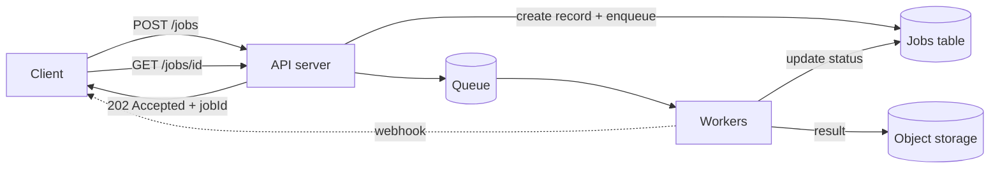

# Managing Long-Running Tasks

## Why It Matters

Video transcoding, report generation, bulk imports, ML inference — anything exceeding a request timeout needs this pattern. It also appears as a sub-problem in most large designs.

## Why Synchronous Fails

| Constraint | Reality |
|---|---|
| Load balancer timeout | ALB default 60s |
| Browser timeout | ~2 minutes |
| Held resources | A thread and connection tied up for the whole duration |
| Retry behaviour | A timeout leaves the client unsure whether the work happened |
| Scaling | You scale web servers for compute, not for concurrency |

**Rule of thumb: anything over ~1 second should be considered for async; anything over 10 seconds must be.**

## The Pattern



```http
POST /v1/reports
→ 202 Accepted
  Location: /v1/reports/job_abc123
  { "jobId": "job_abc123", "status": "PENDING" }

GET /v1/reports/job_abc123
→ { "status": "PROCESSING", "progress": 45 }
→ { "status": "COMPLETE", "resultUrl": "https://..." }
```

**`202 Accepted` with a status URL is the correct HTTP semantic** — it says "received, not finished".

## Job State Machine

```
PENDING → PROCESSING → COMPLETE
                     → FAILED → (retry) → PENDING
        → CANCELLED
```

Persist the job record **before** enqueuing. If you enqueue first and then crash, the client has a job ID for a job that doesn't exist in your database — and you can't report its status.

**Store, in the job record:** status, attempt count, timestamps, worker ID, error detail, and the result location.

## Notifying The Client

| Mechanism | Trade-off |
|---|---|
| **Polling** | Simple, works everywhere; wasteful, adds latency |
| **Long polling** | Fewer requests, faster notification; holds connections |
| **Webhook** | Efficient, immediate; requires a public endpoint, **needs retries and signing** |
| **WebSocket / SSE** | Real-time progress; connection management overhead |

**Polling with exponential backoff is the pragmatic default.** Start at 1s, back off to 30s, and include a `Retry-After` hint.

**Webhooks need their own reliability design:** signed payloads (HMAC), retries with backoff, idempotency for the receiver, and a DLQ. A webhook is an API you're calling — treat it like one.

## Idempotency And Duplicate Work

At-least-once queue delivery means a job may be delivered twice. Two protections:

1. **Idempotency key on submission** — the same request doesn't create two jobs
2. **Idempotent execution** — processing the same job twice produces the same result

```sql
-- Claim the job atomically; only one worker wins
UPDATE jobs SET status='PROCESSING', worker_id=?, started_at=now()
WHERE id=? AND status='PENDING';
-- 0 rows updated → another worker already claimed it
```

**The conditional update is the claim mechanism** — no distributed lock required.

## Handling Worker Crashes

A worker that dies mid-job leaves it stuck in PROCESSING forever.

| Mechanism | Detail |
|---|---|
| **Visibility timeout** | SQS-style: the message reappears if not acknowledged in time |
| **Lease with heartbeat** | The worker extends its claim periodically; a stale lease is reclaimable |
| **Reaper job** | Sweep for PROCESSING jobs older than N and reset them |

**Long jobs must extend their visibility timeout or lease**, or the queue will redeliver the job while the first worker is still running it — producing duplicate work and, worse, duplicate side effects.

**Make jobs resumable where possible** — checkpoint progress so a retry restarts from the last checkpoint rather than from the beginning. For a 4-hour transcode, this is the difference between a 5-minute and a 4-hour recovery.

## Progress Reporting

For jobs of meaningful duration, users need progress. Update a progress field periodically — but **throttle the writes** (every few percent, not every item), or the progress updates become their own database load.

For a job processing a million records, writing progress per record generates a million writes to support a progress bar.

## Priority And Fairness

| Problem | Solution |
|---|---|
| Urgent jobs stuck behind bulk work | **Separate queues per priority**, with dedicated workers |
| One tenant floods the queue | **Per-tenant queues or quotas** — fair scheduling |
| Long jobs starve short ones | Separate queues by expected duration |

**A single shared queue means one large customer's bulk import delays every other customer.** Per-tenant fairness is the answer, and raising it unprompted is a strong signal.

## Scaling Workers

- **Scale on queue depth or age**, not CPU — queue lag is the true demand signal
- **Oldest-message age is the better metric** than depth: a depth of 10,000 that's draining is fine; a depth of 100 that's an hour old is not
- Bound concurrency to protect downstream dependencies
- Use spot instances for interruptible work — but only if jobs are resumable

## Cancellation

Genuinely hard: the job may be queued, running on an unknown worker, or already complete.

**Practical approach:** set a `CANCELLED` status; workers check it at checkpoints and abort. This makes cancellation cooperative and best-effort — say so rather than implying it's instant.

## Common Mistakes

- Enqueuing before persisting the job record
- No visibility-timeout extension for long jobs
- Non-idempotent job execution
- Polling without backoff
- Webhooks without retries or signatures
- One shared queue for all tenants and priorities
- Scaling workers on CPU rather than queue age
- Unthrottled progress updates

## Related Topics

- [Handling Large Blobs](Handling%20Large%20Blobs.md)
- [Messaging Fundamentals](Messaging%20Fundamentals.md)
- [Idempotent Consumers](Idempotent%20Consumers.md)
- [Multi-Step Processes and Saga](Multi%20Step%20Processes%20and%20Saga.md)

## Revision Summary

Return 202 with a job ID immediately, persist the job record before enqueuing, and let workers claim it with a conditional update. Extend leases for long jobs, make execution idempotent and resumable, separate queues by priority and tenant, and scale on queue age.

## Quick Recall

- `202 Accepted` + status URL
- **Persist the job before enqueuing**
- Conditional `UPDATE ... WHERE status='PENDING'` is the claim
- Extend visibility timeout / lease, or the job gets redelivered
- Checkpoint so retries resume rather than restart
- Separate queues per priority and per tenant
- Scale on **queue age**, not CPU
- Cancellation is cooperative, not instant
