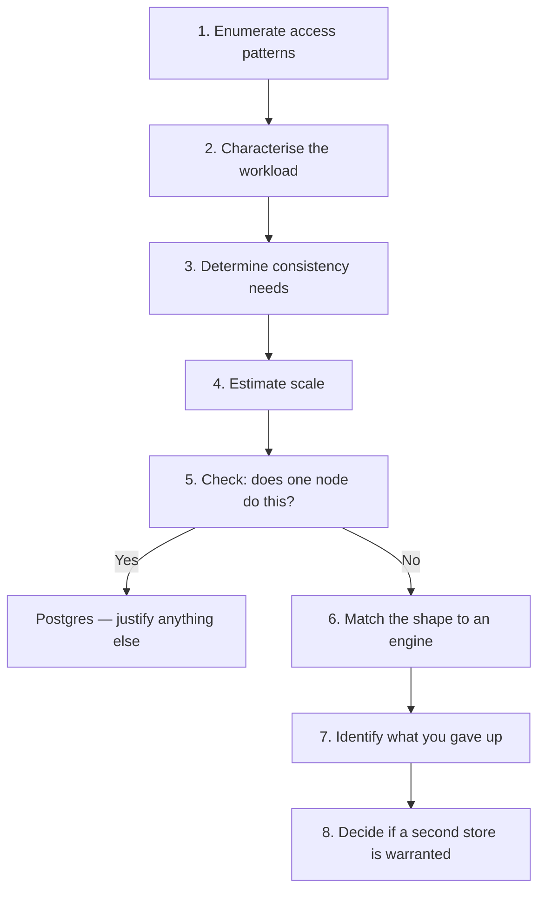
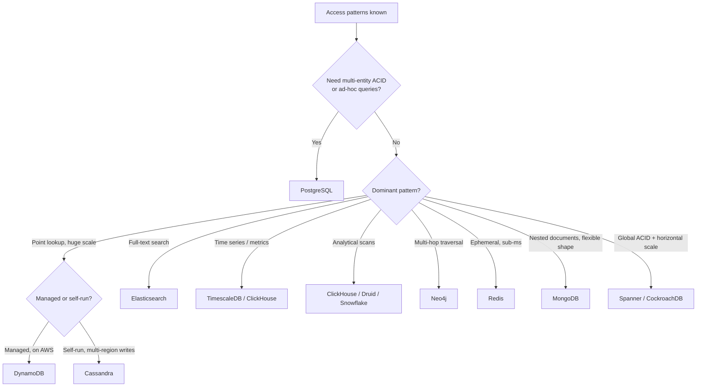

# Choosing the Right Database

> The single most consequential decision in a system design interview, and the one most candidates make backwards. This is the full procedure.

## The Core Principle

**Design from access patterns, not from entities.**

The instinct is to draw a schema — users, orders, products — and then pick a database that stores it. That is backwards. Start from **the queries you must serve**, because a database's job is to answer *those queries* at *that scale* with *that consistency*.

> "Let me list the access patterns before I choose a store."

Saying that sentence in an interview immediately separates you from candidates who answer "I'd use Postgres" or "I'd use Cassandra" before knowing what the system does.

## The Procedure



**Step 5 is the one people skip.** A single modern Postgres node handles 5,000–20,000 writes/sec and terabytes of data. Most interview systems fit. Distributing when you don't need to is a design error, and recognising that is a strong signal.

---

## Step 1 — Enumerate Access Patterns

Write them down explicitly. For each, capture:

| Attribute | Why it matters |
|---|---|
| **Shape** | Point lookup, range scan, join, aggregate, full-text, traversal |
| **Selector** | Which field(s) identify the rows |
| **Frequency** | Queries per second |
| **Latency budget** | p99 target |
| **Result size** | One row, a page, a million rows |

Example for a ride-hailing system:

```
A1. Get trip by trip_id                    point lookup     10K/s   <10ms
A2. List a rider's trips, newest first     range scan       2K/s    <100ms
A3. Find drivers within 3km                geospatial       50K/s   <50ms
A4. Update driver location                 point write      250K/s  <20ms
A5. Daily revenue by city                  aggregation      10/s    <5s
```

**Five patterns, and they don't all want the same database.** A4 is a write-heavy point update, A3 is geospatial, A5 is analytical. That's the observation that drives everything.

**The dominant access pattern wins.** In this example A4 (250K writes/sec of ephemeral location data) dominates — so location goes in Redis, and trips go somewhere transactional.

---

## Step 2 — Characterise the Workload

### Read:write ratio

| Ratio | Implication |
|---|---|
| **Read-heavy (10:1+)** | Replicas, caching, denormalisation, materialised views |
| Balanced | Standard OLTP, single primary |
| **Write-heavy (1:1 or write-dominant)** | LSM-based store, sharding, batching, queues |

**Always ask for this.** It changes the answer more than almost anything else.

### Query shape

| Shape | Wants |
|---|---|
| Point lookup by key | Any KV store — hash index is sufficient |
| **Range scan on a sort key** | B-tree or LSM with a clustering key |
| **Multi-entity joins** | Relational |
| **Ad-hoc / unknown queries** | **Relational** — schema doesn't constrain the query |
| Aggregation over huge volumes | Columnar OLAP |
| Full-text | Inverted index |
| Multi-hop relationship traversal | Graph |
| Geospatial proximity | Spatial index (PostGIS, geohash, H3) |

**The "ad-hoc" row is the one that most often decides it.** Relational databases let you ask questions you didn't anticipate. NoSQL stores make you design the schema *around* the queries — fast when you know them, painful when they change.

### Data shape

| Shape | Implication |
|---|---|
| Highly relational, many joins | Relational |
| Aggregate-oriented (self-contained documents) | Document store |
| Wide, sparse, dynamic columns | Wide-column |
| Simple key → blob | KV |
| Time-ordered append-only | Time series |
| Highly connected | Graph |

### Volume and growth

| Volume | Implication |
|---|---|
| < 100 GB | **One node, comfortably** |
| 100 GB – 1 TB | One node with good indexes |
| 1–10 TB | One node possible; partitioning helps |
| **> 10 TB** | Sharding or a distributed store |
| Unbounded append (logs, events) | Time-series or object storage + OLAP |

---

## Step 3 — Determine Consistency Requirements

**Per access pattern, not for the whole system.** Different data has different needs, and conflating them leads to over-engineering.

| Requirement | Example | Needs |
|---|---|---|
| **Linearizable** | Account balance, inventory count, seat booking | Single-primary relational, or consensus-backed |
| **Read-your-writes** | User sees their own post | Session routing to primary; cheap |
| **Monotonic reads** | Data doesn't vanish on refresh | Sticky session to one replica |
| **Eventual** | Feed, recommendations, view counts | Anything |
| **Transactional across entities** | Order + payment + inventory | Relational, or a saga |

**The question that cuts through it:** *what is the business cost if this read is 500 ms stale?*

- Feed: nothing → eventual
- Product price on the checkout page: real → strong
- Inventory count during a flash sale: severe → strong, with locking

**Most systems need strong consistency for a small subset and eventual for everything else.** Identifying that subset is the skill.

---

## Step 4 — Estimate Scale

Rough numbers, aggressively rounded. See [Back of the Envelope Estimation](Back%20of%20the%20Envelope%20Estimation.md).

```
Writes/sec, peak       → does one node handle it?
Reads/sec, peak        → how many replicas or how much cache?
Storage over N years   → does it fit on one machine?
Hot working set        → does it fit in RAM?
```

**Capacity reference:**

| Store | Sustained throughput |
|---|---|
| PostgreSQL (one node) | 5–20K writes/sec, ~50K reads/sec |
| MySQL (one node) | Similar |
| **Cassandra (per node)** | **10–50K writes/sec** |
| DynamoDB | Effectively unlimited (you pay for it) |
| Redis (one node) | ~100K ops/sec |
| MongoDB (one node) | 10–30K writes/sec |
| Elasticsearch (per node) | 10–50K docs/sec indexing |

**If the working set fits in RAM, say so** — it means caching will be very effective and you may not need a distributed store at all.

---

## Step 5 — The Single-Node Check

**Ask explicitly: does this fit on one machine?**

If yes:
> "At 3,000 writes per second and 400 GB over five years, this fits comfortably on a single Postgres node with read replicas. I'd start there and shard later if growth demands it. Distributing now would cost me joins and transactions for no benefit."

**This is a strong answer, not a weak one.** Candidates who reach for Cassandra at 1,000 QPS are demonstrating pattern-matching. Interviewers are assessing judgement.

---

## Step 6 — Match Shape to Engine

### The decision tree



### The underlying reason: storage engine

Almost every performance characteristic traces back to **B-tree vs LSM tree**.

| | **B-tree** | **LSM tree** |
|---|---|---|
| Writes | In-place update, **random I/O**, read-modify-write | **Append to memtable, sequential flush** |
| Write throughput | Moderate | **High** |
| Reads | **One tree traversal** | Check memtable + several SSTables |
| Read helper | — | Bloom filters skip SSTables |
| Space | Compact | Higher until compaction |
| Background cost | Minimal | **Compaction I/O** |
| Used by | Postgres, MySQL InnoDB, MongoDB (WiredTiger) | **Cassandra, RocksDB, ScyllaDB, LevelDB** |

**"Choosing Cassandra for a write-heavy workload is really choosing an LSM tree"** — saying this shows you understand the mechanism rather than the marketing.

**Compaction is the LSM cost to name:** background merging consumes I/O and can cause latency spikes. It's the price of cheap writes.

---

## Step 7 — Database Profiles

### PostgreSQL — the default

**Choose when:** transactions, joins, ad-hoc queries, or you're unsure.

| Strength | Detail |
|---|---|
| Genuine ACID | Multi-row transactions, foreign keys, constraints |
| **Extension ecosystem** | PostGIS (geospatial), pgvector (embeddings), TimescaleDB (time series), pg_trgm (fuzzy) |
| JSONB | Schemaless columns **with GIN indexes** |
| Rich indexes | B-tree, GIN, GiST, BRIN, partial, expression |
| Full-text search | Often sufficient without Elasticsearch |

**Avoid when:** sustained writes far beyond one node, or petabyte analytics.

**The strongest argument: one system covers relational, document, geospatial, time-series, vector, and full-text.** Every additional datastore is operational cost, a consistency boundary, and a failure mode.

### Cassandra

**Choose when:** very high write volume, known access patterns, multi-region active-active, linear scale-out.

| Constraint | Detail |
|---|---|
| **One table per query** | Denormalisation is expected, not a smell |
| Partition key in every query | No ad-hoc filtering |
| **No joins, no aggregation** | Do it in the application or a stream processor |
| **Last-write-wins** | Concurrent writes silently lost |
| Bounded partitions | Add a time bucket; target <100 MB |
| Tombstones | **Queue-like delete-heavy workloads are an anti-pattern** |

**Avoid when:** access patterns are unknown or changing, you need transactions, or the data volume doesn't justify the operational cost.

### DynamoDB

**Choose when:** on AWS, want zero operations, predictable single-digit-ms latency, spiky traffic.

| Constraint | Detail |
|---|---|
| **Partition key in every query** | Design keys around access patterns |
| GSIs eventually consistent | Never read-your-writes through a GSI |
| LSIs at table creation only | Cannot be added later |
| 400 KB item limit | Large blobs go to S3 |
| **Never `Scan`** | If you need one, the key design is wrong |
| Cost | **Can exceed self-managed Cassandra at very high sustained throughput** |

**Conditional writes** (`attribute_not_exists`) give idempotency and optimistic locking for free.

### MongoDB

**Choose when:** aggregate-oriented documents, evolving schema, developer velocity matters.

Multi-document ACID since 4.0. Good aggregation pipeline. **But** — Postgres JSONB covers most "we need a document database" cases without giving up relational capability. Be prepared to justify why not Postgres.

### Redis

**Choose when:** caching, sessions, rate limiting, leaderboards, ephemeral real-time state, pub-sub.

**Never as a primary durable store.** Even AOF `always` has loss windows. Use for data you can rebuild.

### Elasticsearch

**Choose when:** full-text search, faceted filtering, log analytics.

**Never as the source of truth.** Keep a primary store and feed it via CDC. Near-real-time (1s refresh), no transactions, updates are delete+reindex.

### Time series (TimescaleDB, ClickHouse, Druid)

**Choose when:** metrics, IoT, event analytics, append-only time-ordered data.

Compresses ~12× via delta-of-delta and XOR encoding. Time partitioning means **dropping old partitions instead of deleting rows**. Watch cardinality.

### Graph (Neo4j)

**Choose when:** multi-hop traversal is the *dominant* pattern — fraud rings, recommendations, social graphs beyond two hops.

**Two hops is a join.** Only reach for a graph database when traversal depth is variable or large. Most "social network" designs don't need one.

### NewSQL (Spanner, CockroachDB)

**Choose when:** you genuinely need horizontal scale **and** ACID **and** global distribution.

Pays latency for consistency (Spanner's commit-wait is ~7 ms). Expensive. Justified for financial systems spanning regions.

---

## Step 8 — Name What You Gave Up

**Every choice costs something. Stating the cost unprompted is a senior signal.**

| Choice | Given up |
|---|---|
| Cassandra / DynamoDB | Joins, ad-hoc queries, transactions, aggregation |
| Sharding | Cross-shard joins and transactions, global secondary indexes |
| Eventual consistency | Read-your-writes without extra work |
| Denormalisation | Update complexity, storage, consistency risk |
| Elasticsearch | Consistency with the source of truth; it's derived |
| Redis | Durability |
| Graph DB | Ecosystem maturity, operational familiarity |

> "Going with Cassandra means no joins and no transactions, so order-and-payment consistency moves into a saga. I'm accepting that because write volume is the binding constraint."

---

## Step 9 — Polyglot Persistence

Multiple stores are normal, but **each one must be justified**.

```
PostgreSQL    → orders, users, payments        (source of truth, ACID)
Redis         → sessions, cache, rate limits   (ephemeral, sub-ms)
Elasticsearch → product search                 (derived, via CDC)
S3            → images, documents              (blobs)
ClickHouse    → analytics                      (derived, via CDC)
```

**Rules:**

1. **One source of truth.** Everything else is derived.
2. **Derive via CDC**, not dual writes — dual writes drift. See [Transactional Outbox](Transactional%20Outbox.md).
3. **Every store is operational cost** — monitoring, backups, on-call, expertise.
4. **Don't add one for a hypothetical requirement.**

**Adding a datastore should feel expensive.** Three is common; seven usually means someone added one per feature.

---

## Common Scenarios → Answers

| System | Primary | Why | Supporting |
|---|---|---|---|
| **URL shortener** | DynamoDB / Cassandra | Pure point lookup, huge read volume | Redis cache, CDN |
| **Social feed** | Cassandra (posts) + Redis (feeds) | Write-heavy, time-ordered | Postgres for users |
| **Chat** | Cassandra | Write-heavy, partition by conversation, range scan | Redis for presence |
| **E-commerce orders** | **PostgreSQL** | Transactions, inventory, joins | ES for search, Redis for cart |
| **Ticket booking** | **PostgreSQL** | Contention, no double-booking | Redis for seat-map cache |
| **Ad click aggregator** | Kafka → Druid/ClickHouse | Streaming aggregation, analytical queries | S3 raw events |
| **Ride hailing** | Redis (locations) + Postgres (trips) | 250K writes/s ephemeral vs transactional | PostGIS or H3 |
| **Metrics platform** | Prometheus / TimescaleDB | Time series, compression, downsampling | Object store long-term |
| **Payments ledger** | **PostgreSQL** (or Spanner multi-region) | Linearizable, auditable, ACID | — |
| **Document collaboration** | Postgres + CRDT state | Transactional metadata, mergeable content | Redis for presence |
| **Recommendations** | Feature store + vector DB | Similarity search | Postgres for source data |

**Note how often PostgreSQL is the right answer.** That's not laziness — it's that most systems need transactions and flexible queries more than they need extreme scale.

---

## How To Say It In An Interview

> "The dominant access pattern is fetching a conversation's recent messages — a range scan on a known partition key, at 25,000 writes per second. That's write-heavy with a fixed query shape, so an LSM-based store fits: I'd use Cassandra, partitioned by `conversation_id` and clustered by `message_id` descending, which makes 'last 50 messages' a single sequential partition read.
>
> The trade is no joins and no transactions, so user profile data stays in Postgres and I denormalise the sender name into the message. I'm also accepting last-write-wins, which is fine here because messages are immutable once written.
>
> If message volume were an order of magnitude lower, I'd keep this in Postgres and avoid the second system entirely."

**That answer contains:** the dominant pattern, the workload characterisation, the engine reasoning, the schema, the trade-off, and the counterfactual. That's the full shape.

---

## Red Flags Interviewers Listen For

| Signal | What it suggests |
|---|---|
| Naming a database before the requirements | Pattern-matching, not reasoning |
| "NoSQL scales better" | Doesn't understand the actual trade |
| Cassandra at 1,000 QPS | No sense of capacity |
| Modelling relationally in Cassandra | Doesn't understand query-first modelling |
| Never mentioning trade-offs | Not thinking about consequences |
| Five datastores for a simple system | No sense of operational cost |
| Not asking the read:write ratio | Missing the most important input |

---

## Common Mistakes

- Choosing before enumerating access patterns
- Ignoring whether one node suffices
- Treating "NoSQL" as one thing rather than naming the family
- Assuming NoSQL means no transactions (outdated)
- Normalising in a wide-column store
- Using Elasticsearch or Redis as a source of truth
- Adding a datastore per feature
- Dual-writing instead of CDC
- Not naming what the choice costs

## Related Topics

- [SQL vs NoSQL](SQL%20vs%20NoSQL.md)
- [Storage Engines](Storage%20Engines.md)
- [Database Comparison Reference](Database%20Comparison%20Reference.md)
- [Partitioning and Sharding](Partitioning%20and%20Sharding.md)
- [CAP and PACELC](CAP%20and%20PACELC.md)

## Revision Summary

Enumerate access patterns, characterise the workload (read:write, query shape, data shape, volume), determine consistency per pattern, estimate scale, and check whether one node suffices before distributing. Match the dominant pattern to a storage engine, name what you gave up, and justify every additional store. PostgreSQL is the default; everything else needs a reason.

## Quick Recall

- **Access patterns first, always** — say it out loud
- **Always ask the read:write ratio**
- Ad-hoc queries → relational; known patterns → NoSQL
- **Does it fit on one node?** Usually yes — say so
- Write-heavy → LSM (Cassandra, RocksDB); read-heavy → B-tree
- Consistency is **per access pattern**, not system-wide
- Name what you gave up, unprompted
- One source of truth; derive the rest via **CDC**
- Every extra datastore is operational cost
