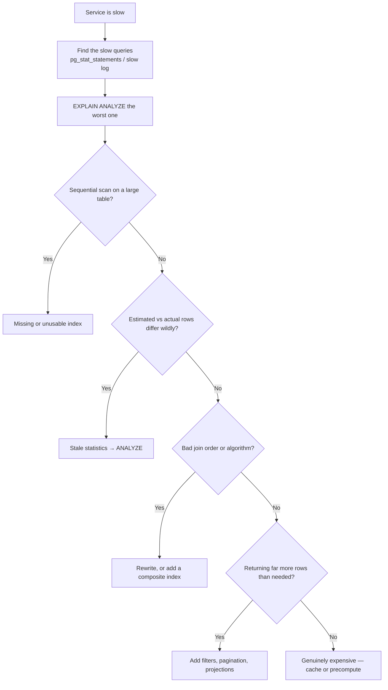

# Query Optimisation

> How to diagnose and fix a slow query. The most common cause of "the service is slow" in any system with a database.

## Why It Matters

Before adding a cache, a replica, or a shard, the question is always: *is the query itself slow, and why?* A missing index is a 100× win that costs nothing.

## The Diagnostic Sequence



**Start with `pg_stat_statements`** (or MySQL's slow query log). It ranks queries by total time — which surfaces the query that runs 10,000 times at 5 ms ahead of the one that runs once at 2 seconds. **Total time, not per-call time, is what matters.**

## Reading An Execution Plan

```sql
EXPLAIN (ANALYZE, BUFFERS) SELECT ...;
```

**`ANALYZE` actually runs the query** and reports real timings. `EXPLAIN` alone only estimates.

| Node | Meaning | Concern |
|---|---|---|
| **Seq Scan** | Full table scan | Fine on small tables; **red flag on large ones** |
| Index Scan | Traverse index, fetch rows | Good |
| **Index Only Scan** | Answered entirely from the index | **Best case** |
| Bitmap Heap Scan | Collect row IDs, fetch in physical order | Good for many matches |
| **Nested Loop** | For each outer row, probe inner | Good when the outer side is **small** |
| **Hash Join** | Build a hash of one side | Good for large unsorted inputs |
| **Merge Join** | Both sides sorted, merge | Good when inputs are already ordered |
| Sort | Explicit sort | Check `Sort Method: external merge` — spilling to disk |
| Materialize / Memoize | Caching intermediate results | Usually fine |

### The single most useful signal

```
Seq Scan on orders  (cost=0.00..25000 rows=1000 width=64)
                    (actual time=0.02..450 rows=980000 loops=1)
                                            ^^^^^^^^^^^^
```

**Estimated 1,000 rows, actual 980,000.** A large discrepancy means the planner is working from wrong statistics, so every downstream decision — join order, join algorithm, index choice — is likely wrong too.

**Fix: `ANALYZE tablename`.** If it recurs, increase the statistics target on that column or check for correlated columns the planner can't model.

**Nested Loop with a huge outer row count is the classic symptom** — the planner expected a handful of rows and chose a loop, but got a million.

## Why An Index Isn't Used

| Cause | Example | Fix |
|---|---|---|
| **Function on the column** | `WHERE YEAR(created) = 2024` | **Rewrite as a range**, or expression index |
| Implicit type cast | `WHERE varchar_col = 123` | Match types |
| **Leading wildcard** | `LIKE '%abc'` | Trigram index (`pg_trgm`) or full-text |
| **Not the leftmost prefix** | Index `(a,b,c)`, query on `b` | Reorder or add an index |
| Low selectivity | `WHERE active = true` (90% true) | A scan genuinely is cheaper |
| Stale statistics | — | `ANALYZE` |
| `OR` across columns | `WHERE a=1 OR b=2` | `UNION ALL` of two indexed queries |
| Small table | — | Correct — a scan is faster |

**The function-on-column rewrite is the highest-value fix to know:**

```sql
-- Cannot use an index on created
WHERE YEAR(created) = 2024

-- Uses the index
WHERE created >= '2024-01-01' AND created < '2025-01-01'
```

**Sargable** ("Search ARGument ABLE") is the term — a predicate that can use an index. Wrapping the column in anything makes it non-sargable.

## Composite Index Design

**Leftmost prefix rule:** index `(a, b, c)` serves queries on `a`, `(a,b)`, and `(a,b,c)` — **not** `b`, `c`, or `(b,c)`.

**Column ordering rules:**

1. **Equality columns first**
2. **Range columns last**
3. Among equality columns, highest selectivity first
4. `ORDER BY` columns after equality, matching sort direction

```sql
-- WHERE status = ? AND created_at > ? ORDER BY created_at
CREATE INDEX ON orders (status, created_at);   -- equality, then range
```

**A range predicate stops the index being useful for anything after it.** With `(a,b,c)` and `WHERE a=1 AND b>5 AND c=3`, the `c` condition cannot use the index — rows must be filtered after retrieval.

**Covering index** eliminates the second lookup:
```sql
CREATE INDEX ON orders (status, created_at) INCLUDE (customer_id, total);
```
The query is answered from the index alone — an **Index Only Scan**, the best possible plan.

## Common Query Rewrites

| Slow | Faster | Why |
|---|---|---|
| `SELECT *` | Select needed columns | Enables index-only scans; less I/O |
| `OFFSET 100000` | **Cursor / keyset pagination** | Offset scans and discards |
| `COUNT(*)` on a huge table | Approximate count, or a maintained counter | Exact count scans everything |
| `NOT IN (subquery)` | `NOT EXISTS` | `NOT IN` breaks on NULLs and optimises poorly |
| `IN (huge list)` | Join against a temp table or `VALUES` | Planner handles joins better |
| Correlated subquery per row | Join or window function | Avoids per-row execution |
| `DISTINCT` to fix duplicates | Fix the join | `DISTINCT` hides a modelling bug |
| `LIKE '%x%'` | Trigram index or full-text | Leading wildcard is unindexable |

### Keyset pagination — the important one

```sql
-- SLOW: scans and discards 100,000 rows
SELECT * FROM orders ORDER BY id LIMIT 20 OFFSET 100000;

-- FAST: index seek straight to the position
SELECT * FROM orders WHERE id > :last_id ORDER BY id LIMIT 20;
```

**Offset is O(offset); keyset is O(limit).** It's also *correct* under concurrent inserts, where offset pagination repeats or skips rows. See [API Design](API%20Design.md).

## The N+1 Problem

The dominant application-level cause of database slowness.

```
1 query for orders  +  N queries for each order's customer  =  N+1
```

Usually introduced by an ORM's lazy loading. **100 orders becomes 101 round trips** — 20 ms becomes 4 seconds.

**Fixes:** `JOIN FETCH`, `@EntityGraph`, batch loading, or a DTO projection. See [JPA and Hibernate](JPA%20and%20Hibernate.md).

**Detect it by counting queries per request**, not by reading code. If you've never logged the SQL your ORM generates, you have N+1 problems you don't know about.

## Join Algorithms

| Algorithm | Cost | Best when |
|---|---|---|
| **Nested Loop** | O(n × m), or O(n × log m) with an index | Outer side is **small** |
| **Hash Join** | O(n + m), needs memory for the hash | Large unsorted inputs |
| **Merge Join** | O(n + m), needs both sides sorted | Inputs already sorted (indexed) |

**The planner picks based on estimated row counts.** Wrong estimates mean the wrong algorithm — which is why stale statistics cause dramatic slowdowns rather than mild ones.

**`work_mem` matters:** a hash join or sort that exceeds it spills to disk. Look for `Sort Method: external merge Disk: 50000kB` in the plan.

## When The Query Is Genuinely Expensive

Once the query is optimal and still slow:

| Option | Use |
|---|---|
| **Materialised view** | Precompute the join or aggregate; refresh on schedule |
| **Summary table** | Maintained incrementally on write |
| **Cache the result** | If staleness is acceptable |
| **Move to an OLAP store** | Analytical scans don't belong on the OLTP primary |
| Partition the table | Prune by time or tenant |
| Denormalise | Trade write cost for read speed |

**Analytics on the OLTP primary is a design error**, not a tuning problem. A long scan holds a snapshot open, blocks vacuum, causes bloat, and competes for buffer cache.

## Operational Practices

| Practice | Detail |
|---|---|
| **Enable `pg_stat_statements`** | The first thing to turn on |
| Log slow queries | `log_min_duration_statement = 200ms` |
| **Set `statement_timeout`** | A runaway query must not run forever |
| Monitor index usage | `pg_stat_user_indexes` — **drop unused indexes**; they tax every write |
| `CREATE INDEX CONCURRENTLY` | Avoids locking writes on a large table |
| Review plans before shipping | Especially for new queries on large tables |

**Every index taxes every write.** Ten indexes means ten B-tree updates per insert. Unused indexes are pure cost — measure and drop them.

## Common Mistakes

- Adding a cache before checking for a missing index
- Never running `EXPLAIN`
- Ignoring the estimated-versus-actual row discrepancy
- Functions on indexed columns
- Wrong composite index column order
- Offset pagination
- `SELECT *` everywhere
- N+1 from an ORM, unnoticed
- Indexing every column
- Running analytics on the primary

## Related Topics

- [Database Indexing](Database%20Indexing.md)
- [Storage Engines](Storage%20Engines.md)
- [JPA and Hibernate](JPA%20and%20Hibernate.md)
- [Performance Tuning and Profiling](Performance%20Tuning%20and%20Profiling.md)

## Revision Summary

Find the worst query by total time, run `EXPLAIN ANALYZE`, and compare estimated to actual rows — a large gap means stale statistics and a bad plan. Check for sequential scans, non-sargable predicates, and wrong composite index ordering. Use keyset pagination, fix N+1, and precompute only when the query is already optimal.

## Quick Recall

- **`pg_stat_statements` ranks by total time**, not per-call
- `EXPLAIN ANALYZE` — **estimated vs actual rows is the key signal**
- Seq Scan on a large table = missing or unusable index
- **Function on a column kills the index** — rewrite as a range
- Composite index: **equality first, range last**; leftmost prefix rule
- Covering index → Index Only Scan
- **Keyset pagination, never OFFSET**
- N+1: count queries per request
- Drop unused indexes — every index taxes writes
