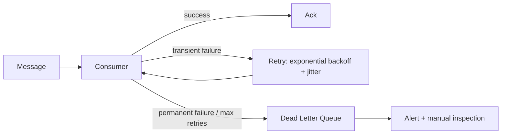

# Messaging Fundamentals

## Why It Matters

Choosing between a queue, a log, and a synchronous call is a design decision with long consequences. Interviewers check whether you reach for Kafka reflexively.

## Why Asynchronous At All

| Benefit | Detail |
|---|---|
| **Temporal decoupling** | The consumer can be down; the broker holds the message |
| **Load levelling** | The queue absorbs bursts the consumer can't handle in real time |
| **Independent scaling** | Producer and consumer scale separately |
| **Retry for free** | Failed processing redelivers rather than losing the request |
| **Fan-out** | One event, many independent consumers |

**The cost:** eventual consistency, harder debugging, duplicate handling, and no natural backpressure to the producer.

## Queue vs Log vs Pub-Sub

| | **Queue** | **Log** | **Pub-Sub topic** |
|---|---|---|---|
| Message consumed by | **One** consumer | **Every** consumer group | Every subscriber |
| After consumption | Deleted | **Retained** for the retention period | Deleted (unless durable subs) |
| Replay | No | **Yes — reset the offset** | No |
| Ordering | Per queue (weak with concurrency) | **Per partition** | Weak |
| Examples | SQS, RabbitMQ queue | **Kafka**, Pulsar, Kinesis | SNS, Redis Pub/Sub |

**The distinction that matters:** a queue is *work distribution* (one worker should do this task); a log is *event distribution* (everyone who cares should see this fact). Choosing wrongly produces either duplicated work or missed events.

## Choosing A Broker

| Need | Choice |
|---|---|
| Replay, high throughput, many independent consumers | **Kafka** |
| Simple decoupling on AWS with zero operational burden | **SQS** |
| Complex routing, priorities, per-message TTL/delay | **RabbitMQ** |
| Fan-out to many endpoint types | SNS (often SNS → SQS) |
| Low-latency ephemeral broadcast | Redis Pub/Sub |
| Managed streaming on AWS | Kinesis |

**Don't default to Kafka.** It's operationally heavy, and "decouple two services at 500 messages/sec" is an SQS problem. Saying so demonstrates judgement — reaching for Kafka at every scale demonstrates pattern-matching.

## Delivery Semantics

| Semantic | Mechanism | Reality |
|---|---|---|
| At-most-once | Ack **before** processing | Messages lost on crash |
| **At-least-once** | Ack **after** processing | **The practical default** — duplicates guaranteed |
| Exactly-once | Broker-level dedup + transactions | **Doesn't exist end-to-end** |

**Exactly-once never crosses the broker boundary.** Kafka's exactly-once covers Kafka-to-Kafka only. The moment your consumer writes to a database or calls an external API, you need [idempotency](Idempotent%20Consumers.md).

## Ordering

Ordering and parallelism are in direct tension:

| Approach | Ordering | Throughput |
|---|---|---|
| One consumer, one queue | **Total order** | Low |
| Many consumers, one queue | **None** | High |
| **Partition by key** | **Per key** | **High** |
| FIFO queue with message groups (SQS FIFO) | Per group | Moderate |

**Partition by entity ID.** All events for order #123 land in one partition and stay ordered relative to each other, while different orders process in parallel. This is the standard answer and it's what Kafka's key-based partitioning is for.

**Never promise global ordering across a topic.** It requires a single partition and single consumer — you've built a bottleneck.

## Backpressure

The producer usually can't tell it's overwhelming consumers. Options:

| Mechanism | Effect |
|---|---|
| **Bounded queue** | Producer blocks or is rejected when full |
| Rate limiting at the producer | Prevents overload proactively |
| Consumer autoscaling | Adds capacity instead of pushing back |
| **Load shedding** | Drop low-priority messages explicitly |

**An unbounded queue converts a throughput problem into an out-of-memory crash.** Always bound it, and decide what happens when it fills.

## Retries and Dead Letter Queues

- **Transient** (timeout, 503) → retry with backoff **and jitter**
- **Permanent** (malformed, validation failure) → straight to the DLQ; retrying wastes capacity
- **Always alert on DLQ depth** — a silent DLQ is invisible data loss

**Poison messages:** one message that always fails will block its Kafka partition forever, since offsets advance sequentially. Bound retries and move on.

**Kafka has no built-in retry queue** — implement retry topics with increasing delays, or handle it in-consumer (which blocks the partition).

## Message Design

| Rule | Why |
|---|---|
| **Include a unique message ID** | Enables consumer-side deduplication |
| **Include a timestamp** | Ordering, lag measurement, debugging |
| **Include a schema version** | Consumers evolve independently |
| **Keep payloads small** | Large blobs → store in S3, send the reference (claim-check pattern) |
| **Past-tense event names** | `OrderPlaced`, not `PlaceOrder` |
| Include a correlation/trace ID | Distributed tracing across the broker |

**The claim-check pattern** — putting large payloads in object storage and sending only a pointer — is worth naming when a design involves images or video.

## Monitoring

| Metric | Meaning |
|---|---|
| **Consumer lag** | The single most important metric — how far behind consumers are |
| Queue depth | Backlog size |
| DLQ depth | Failures needing attention |
| Processing time p99 | Consumer health |
| Redelivery rate | Rising rate signals a systemic problem |

**Alert on consumer lag trend, not absolute value.** A steady lag of 10,000 may be fine; a lag growing linearly means consumers can't keep up and will never recover without intervention.

## Common Mistakes

- Defaulting to Kafka regardless of scale
- Unbounded queues
- Promising global ordering
- Claiming exactly-once end to end
- No jitter on retry backoff
- Retrying permanent failures
- No DLQ, or a DLQ nobody monitors
- Large payloads instead of the claim-check pattern

## Related Topics

- [Kafka Deep Dive](Kafka%20Deep%20Dive.md)
- [Idempotent Consumers](Idempotent%20Consumers.md)
- [Event Driven Architecture](Event%20Driven%20Architecture.md)
- [Two Generals Problem](Two%20Generals%20Problem.md)

## Revision Summary

A queue distributes work to one consumer; a log distributes events to all and supports replay. At-least-once is the practical guarantee, so consumers must be idempotent. Partition by entity ID to get ordering with parallelism. Bound queues, jitter retries, monitor DLQ depth and consumer lag trend.

## Quick Recall

- Queue = one consumer; log = all groups, replayable
- Don't default to Kafka — SQS is often correct
- At-least-once + idempotent consumer = practical exactly-once
- Order per **key/partition**, never globally
- Bounded queues; jitter on backoff
- Alert on lag **trend**
- Claim-check for large payloads
