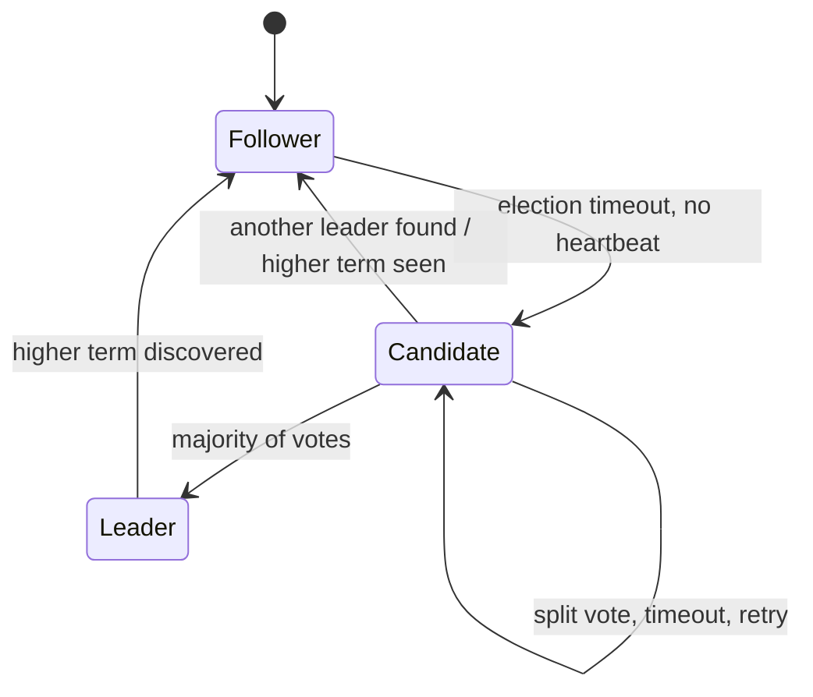

# Consensus Algorithms

## Why It Matters

Underpins leader election, configuration stores, and strongly consistent databases. Interviewers ask about Raft to test whether you understand *why* systems like etcd and ZooKeeper exist.

## The Problem

Get N nodes to agree on a value (or a sequence of values) despite crashes and network delays, such that:

- **Agreement** — no two nodes decide differently
- **Validity** — the decided value was proposed by someone
- **Termination** — every non-faulty node eventually decides

**FLP impossibility:** in a fully asynchronous system, no deterministic algorithm guarantees all three with even one faulty process. Real systems sidestep this with timeouts and randomisation — sacrificing guaranteed termination for overwhelming practical likelihood.

## Raft — Designed for Understandability

Three roles: **Follower**, **Candidate**, **Leader**.

### Leader Election
- Each node has a randomised election timeout (e.g. 150–300 ms). **Randomisation prevents perpetual split votes.**
- On timeout, a follower increments the **term**, becomes a candidate, and requests votes
- A node votes once per term, and only for a candidate whose log is **at least as up to date** as its own
- A majority wins

**Terms act as a logical clock.** Any node seeing a higher term immediately steps down — this is how stale leaders are neutralised.

### Log Replication
1. The leader appends the client command to its log
2. Sends `AppendEntries` to all followers
3. Once a **majority** have persisted it, the entry is **committed**
4. The leader applies it to the state machine and responds to the client
5. Followers apply it once they learn the commit index

**Only a majority is needed** — this is why a 5-node cluster survives 2 failures and still commits quickly.

### Safety
The election restriction (a candidate's log must be at least as current) guarantees a new leader already contains every committed entry. No committed entry is ever lost.

## Raft vs Paxos vs ZAB

| | Raft | Multi-Paxos | ZAB |
|---|---|---|---|
| Understandability | **Designed for it** | Notoriously hard | Moderate |
| Leader | Strong, mandatory | Optional | Strong |
| Used by | etcd, Consul, CockroachDB, TiKV, KRaft | Chubby, Spanner | ZooKeeper |

Raft and Multi-Paxos are equivalent in power. Raft won on comprehensibility, which is why almost every new system chooses it.

## Quorum Arithmetic

Tolerating `f` failures requires `2f + 1` nodes:

| Nodes | Majority | Failures tolerated |
|---|---|---|
| 3 | 2 | 1 |
| 5 | 3 | 2 |
| 7 | 4 | 3 |

**Always use an odd number.** 4 nodes have the same fault tolerance as 3 (both tolerate 1) but need one more ack, so they're strictly worse.

**Larger clusters are not better** — write latency rises with quorum size. Three or five is standard.

## Byzantine Fault Tolerance

Raft and Paxos assume **crash faults** — nodes stop, but never lie. **Byzantine** faults include malicious or arbitrarily wrong behaviour, requiring `3f + 1` nodes (PBFT).

Only relevant for blockchains and adversarial environments. **Inside your own datacentre, crash-fault tolerance is the right assumption** — say this if asked why Raft doesn't handle Byzantine faults.

## What Uses Consensus

| System | Purpose |
|---|---|
| etcd / Consul | Kubernetes state, service discovery, config |
| ZooKeeper | Leader election, distributed locks, coordination |
| Kafka (KRaft) | Broker metadata |
| CockroachDB / Spanner / TiDB | Per-range replication |
| Chubby | Google's lock service |

**Consensus is expensive** — every write costs a majority round trip. Use it for *metadata and coordination*, not for the high-volume data path. Systems put consensus on the control plane and cheaper replication on the data plane.

## Common Mistakes

- Using an even number of nodes
- Putting consensus in the hot data path
- Assuming Raft handles malicious nodes
- Believing a bigger cluster is more available — it's more durable but slower
- Ignoring that a minority partition becomes **unavailable** (this is what makes these systems CP)

## Related Topics

- [CAP and PACELC](CAP%20and%20PACELC.md)
- [Two Generals Problem](Two%20Generals%20Problem.md)
- [Database Replication](Database%20Replication.md)

## Revision Summary

Raft elects a leader with randomised timeouts and replicates a log, committing once a majority persists an entry. `2f + 1` nodes tolerate `f` failures. Consensus belongs on the control plane, not the data path.

## Quick Recall

- Raft roles: Follower → Candidate → Leader
- Randomised timeouts prevent split votes
- Term = logical clock; higher term wins
- Commit = majority persisted
- 3 nodes → 1 failure; 5 → 2; always odd
- Crash-fault, not Byzantine
