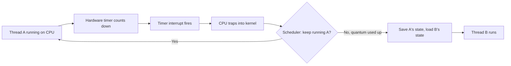
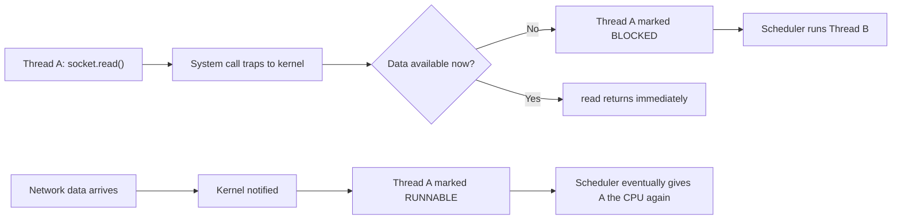
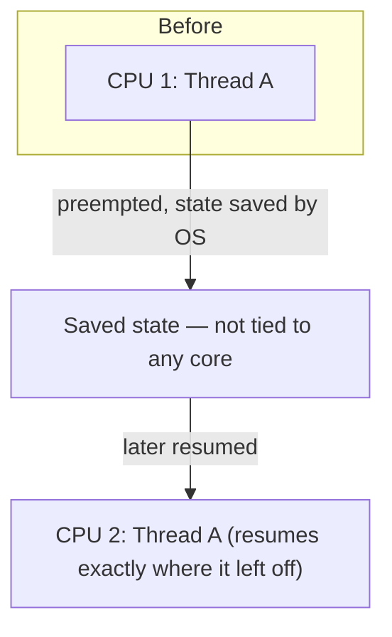

# Preemption, Blocking and Thread Migration

## Why It Matters

A running thread stops executing for one of two *independent* reasons, and interviewers probe whether you conflate them. It also underlies a subtler point: a thread's execution state belongs to the thread, not to any specific CPU core, which is why threads migrate between cores. This is the mechanical layer beneath [Processes and Threads](../Processes%20and%20Threads/Processes%20and%20Threads.md) (costs) and [Scheduling and Deadlocks](Scheduling%20and%20Deadlocks.md) (policy).

## Two Independent Reasons A Thread Stops

| | Preemption | Blocking |
|---|---|---|
| Trigger | **Hardware timer interrupt** | Thread's own I/O request has no data ready |
| Who decides | **The OS scheduler, forcibly** | The thread itself, voluntarily |
| Is the thread capable of continuing? | **Yes** — it's mid-computation | No — it has nothing useful to do |
| Needs a special code point (e.g. I/O call)? | **No — can happen between any two instructions** | Yes — a blocking system call |
| Also called | Time-slicing, context switch by force | Sleeping, waiting, parking |

**The key misconception this corrects:** a thread does *not* need to reach an I/O operation to be switched out. A tight CPU-bound loop with zero I/O can still be preempted mid-instruction-stream.

## Mechanism 1: Preemption (Timer Interrupt)



The timer is the OS's way of saying: *"You've run long enough — time to reconsider who runs next."* The OS saves enough of Thread A's state to resume it later (instruction pointer, registers, stack pointer, scheduling state), then loads Thread B's state and continues.

## Mechanism 2: Blocking (I/O Wait)



Here Thread A *voluntarily* enters a waiting state — it cannot proceed until data arrives, so the OS doesn't waste CPU time on it. This is not preemption; it's blocking (sometimes "sleeping").

## How Does The CPU "Recognize" I/O?

It doesn't — the CPU has no concept of "network I/O." `socket.read()` is a library call that eventually issues a **system call**, which is a trap into kernel mode (the same mode-switch mechanism covered in [Processes and Threads → User Mode vs Kernel Mode](../Processes%20and%20Threads/Processes%20and%20Threads.md)). The *kernel's* device/network subsystem is what understands the request needs external data, and it's the kernel that decides to mark the thread BLOCKED.

```
Java → socket.read() → JVM → system call → OS → network subsystem → hardware
```

## Execution State Belongs To The Thread, Not The CPU

What gets saved and restored on every switch:

| Saved state | |
|---|---|
| Instruction pointer | Where to resume |
| CPU registers | Working values |
| Stack pointer | Call frame position |
| Scheduling state | Runnable / blocked / priority, etc. |

This state is stored by the OS/kernel — it is **not** tied to any particular physical CPU. The CPU is just hardware that executes whatever state is currently loaded into it. **The thread is the schedulable entity; the CPU/core is the resource it runs on.**

## Thread Migration Across Cores

Because state travels with the thread, a thread does **not** have to resume on the same logical CPU it last ran on.



Thread A doesn't restart — it continues from the exact saved instruction pointer, even on a completely different core.

## Why Schedulers Still Try Not To Migrate: CPU Affinity

If Thread A ran on CPU 1, its frequently-used data likely sits in CPU 1's L1/L2 cache. Move it to CPU 2 and that cache is cold — cache misses, slower execution, until CPU 2's cache warms up.

**So schedulers apply a soft preference (CPU affinity):** keep a thread on the core it last ran on if that's still a reasonable choice, but migrate it when there's a clearly better option (e.g. its old core is busy and another is idle). Affinity is an optimization, not a guarantee.

## Mental Model

Think of a thread as a book with a bookmark. Whichever CPU is "reading" stops at the bookmark when interrupted; any CPU — the same one or a different one — can later pick the book back up and continue from that exact bookmark. The bookmark (execution state) is what persists; the reader (CPU) is interchangeable.

## Common Mistakes

- Assuming a CPU-bound thread can only be switched out at an I/O call — preemption needs no I/O and can happen mid-instruction
- Treating "preemption" and "blocking" as the same mechanism — one is forced by the scheduler, the other is voluntary
- Assuming the CPU itself understands I/O semantics — that classification happens in the kernel, after a syscall trap
- Assuming a thread always resumes on the same core it last ran on — it can migrate; same-core is only a cache-locality preference

## Related Topics

- [Processes and Threads](../Processes%20and%20Threads/Processes%20and%20Threads.md) — context-switch cost breakdown, user/kernel mode, system calls
- [Scheduling and Deadlocks](Scheduling%20and%20Deadlocks.md) — preemptive vs cooperative scheduling, CFS, priority inversion
- [Virtual Threads and Structured Concurrency](../../02%20Java/Concurrency/Virtual%20Threads%20and%20Structured%20Concurrency.md) — the JVM's user-mode analogue: unmounting a virtual thread on blocking, without an OS-level context switch

## Revision Summary

A thread stops running for one of two independent reasons: the hardware timer interrupts it and the OS forcibly switches it out (preemption — no I/O needed, can happen between any two instructions), or the thread itself makes a blocking system call and voluntarily parks because it has nothing to do until data arrives (blocking). The CPU has no concept of I/O; a blocking call is just a trap into kernel mode, and it's the kernel that classifies the request and decides to park the thread. What actually gets saved and restored is the thread's execution state (instruction pointer, registers, stack pointer) — this state, not any physical core, is the true schedulable unit, so a thread can resume on a different logical CPU than the one it last used. Schedulers prefer to keep a thread on its previous core for cache locality (CPU affinity), but will migrate it whenever that's the better choice.

## Quick Recall

- Two independent stop reasons: **preemption** (timer interrupt, forced, no I/O needed) vs **blocking** (voluntary, nothing to do)
- Preemption can happen **mid-instruction-stream** — no special code point required
- Blocking = syscall traps to kernel → kernel parks the thread until the resource is ready
- The **CPU doesn't understand I/O** — the kernel classifies the trapped syscall and decides to block
- **Execution state (IP, registers, stack) belongs to the thread**, not the CPU — that's what makes threads schedulable across cores
- A thread **can resume on a different logical CPU** after being unblocked or unpreempted
- Schedulers prefer same-core resumption for **cache locality (CPU affinity)**, but it's a preference, not a rule
