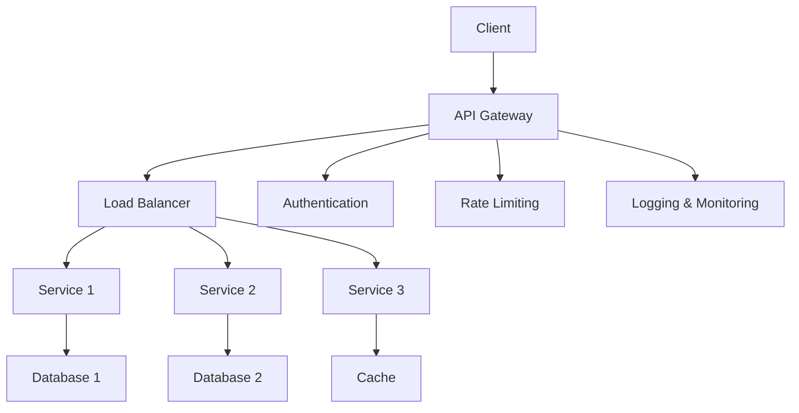

# Complete API Design Guide for SDE2 Interviews
*Comprehensive reference covering REST APIs, GraphQL, gRPC, and API architecture patterns*

## 📚 Table of Contents

1. [API Design Fundamentals](#api-design-fundamentals)
2. [REST API Design](#rest-api-design)
3. [GraphQL](#graphql)
4. [gRPC and Protocol Buffers](#grpc-and-protocol-buffers)
5. [API Security](#api-security)
6. [API Versioning](#api-versioning)
7. [API Documentation](#api-documentation)
8. [API Testing](#api-testing)
9. [API Gateway and Management](#api-gateway-and-management)
10. [Performance and Scalability](#performance-and-scalability)
11. [Error Handling and Status Codes](#error-handling-and-status-codes)
12. [Interview Questions](#interview-questions)

---

## 🎯 API Design Fundamentals

### API Design Principles

| Principle | Description | Implementation |
|-----------|-------------|----------------|
| **Consistency** | Uniform patterns across endpoints | Standard naming, response formats |
| **Simplicity** | Easy to understand and use | Clear resource modeling, intuitive URLs |
| **Flexibility** | Accommodate various use cases | Filtering, pagination, field selection |
| **Security** | Protect against common threats | Authentication, authorization, input validation |
| **Performance** | Efficient data transfer | Caching, compression, pagination |
| **Reliability** | Handle errors gracefully | Proper status codes, retry mechanisms |

### API Architecture Patterns



### API Types Comparison

| API Type | Protocol | Data Format | Use Case | Performance |
|----------|----------|-------------|----------|-------------|
| **REST** | HTTP | JSON/XML | Web services, CRUD operations | Good |
| **GraphQL** | HTTP | JSON | Complex data fetching, mobile apps | Variable |
| **gRPC** | HTTP/2 | Protocol Buffers | Microservices, high performance | Excellent |
| **WebSocket** | WebSocket | Various | Real-time communication | Excellent |
| **SOAP** | HTTP/HTTPS | XML | Enterprise integration | Poor |

---

## 🔄 REST API Design

### RESTful Resource Design

#### Resource Identification

```java
// Good: Resource-oriented URLs
GET    /api/v1/users                    // Get all users
GET    /api/v1/users/123                // Get specific user
POST   /api/v1/users                    // Create new user
PUT    /api/v1/users/123                // Update entire user
PATCH  /api/v1/users/123                // Partial update
DELETE /api/v1/users/123                // Delete user

// Nested resources
GET    /api/v1/users/123/orders         // Get user's orders
POST   /api/v1/users/123/orders         // Create order for user
GET    /api/v1/users/123/orders/456     // Get specific order

// Bad: Action-oriented URLs (avoid these)
GET    /api/v1/getUser?id=123
POST   /api/v1/createUser
POST   /api/v1/deleteUser?id=123
```

#### HTTP Methods and Semantics

```java
@RestController
@RequestMapping("/api/v1/users")
@Validated
public class UserController {
    
    @GetMapping
    public ResponseEntity<PagedResponse<UserDTO>> getUsers(
            @RequestParam(defaultValue = "0") int page,
            @RequestParam(defaultValue = "20") int size,
            @RequestParam(required = false) String search,
            @RequestParam(required = false) String sort) {
        
        Pageable pageable = PageRequest.of(page, size, parseSort(sort));
        Page<User> users = userService.findUsers(search, pageable);
        
        PagedResponse<UserDTO> response = PagedResponse.<UserDTO>builder()
            .content(users.getContent().stream()
                .map(userMapper::toDTO)
                .collect(Collectors.toList()))
            .page(users.getNumber())
            .size(users.getSize())
            .totalElements(users.getTotalElements())
            .totalPages(users.getTotalPages())
            .build();
            
        return ResponseEntity.ok(response);
    }
    
    @GetMapping("/{id}")
    public ResponseEntity<UserDTO> getUser(@PathVariable Long id) {
        User user = userService.findById(id)
            .orElseThrow(() -> new UserNotFoundException("User not found with id: " + id));
            
        return ResponseEntity.ok(userMapper.toDTO(user));
    }
    
    @PostMapping
    public ResponseEntity<UserDTO> createUser(
            @Valid @RequestBody CreateUserRequest request,
            HttpServletRequest httpRequest) {
        
        User user = userService.createUser(request);
        UserDTO userDTO = userMapper.toDTO(user);
        
        URI location = ServletUriComponentsBuilder
            .fromCurrentRequest()
            .path("/{id}")
            .buildAndExpand(user.getId())
            .toUri();
            
        return ResponseEntity.created(location).body(userDTO);
    }
    
    @PutMapping("/{id}")
    public ResponseEntity<UserDTO> updateUser(
            @PathVariable Long id,
            @Valid @RequestBody UpdateUserRequest request) {
        
        User user = userService.updateUser(id, request);
        return ResponseEntity.ok(userMapper.toDTO(user));
    }
    
    @PatchMapping("/{id}")
    public ResponseEntity<UserDTO> patchUser(
            @PathVariable Long id,
            @RequestBody JsonPatch patch) {
        
        User user = userService.patchUser(id, patch);
        return ResponseEntity.ok(userMapper.toDTO(user));
    }
    
    @DeleteMapping("/{id}")
    public ResponseEntity<Void> deleteUser(@PathVariable Long id) {
        userService.deleteUser(id);
        return ResponseEntity.noContent().build();
    }
}
```

### Request/Response Design

#### Standard Response Format

```java
@Data
@Builder
public class ApiResponse<T> {
    private boolean success;
    private String message;
    private T data;
    private List<String> errors;
    private Map<String, Object> metadata;
    private long timestamp;
    
    public static <T> ApiResponse<T> success(T data) {
        return ApiResponse.<T>builder()
            .success(true)
            .data(data)
            .timestamp(System.currentTimeMillis())
            .build();
    }
    
    public static <T> ApiResponse<T> success(T data, String message) {
        return ApiResponse.<T>builder()
            .success(true)
            .message(message)
            .data(data)
            .timestamp(System.currentTimeMillis())
            .build();
    }
    
    public static <T> ApiResponse<T> error(String message, List<String> errors) {
        return ApiResponse.<T>builder()
            .success(false)
            .message(message)
            .errors(errors)
            .timestamp(System.currentTimeMillis())
            .build();
    }
}

// Usage in controller
@PostMapping("/users")
public ResponseEntity<ApiResponse<UserDTO>> createUser(@Valid @RequestBody CreateUserRequest request) {
    UserDTO user = userService.createUser(request);
    ApiResponse<UserDTO> response = ApiResponse.success(user, "User created successfully");
    return ResponseEntity.status(HttpStatus.CREATED).body(response);
}
```

#### Pagination and Filtering

```java
@Data
@Builder
public class PagedResponse<T> {
    private List<T> content;
    private int page;
    private int size;
    private long totalElements;
    private int totalPages;
    private boolean first;
    private boolean last;
    private boolean hasNext;
    private boolean hasPrevious;
    
    public static <T> PagedResponse<T> of(Page<T> page) {
        return PagedResponse.<T>builder()
            .content(page.getContent())
            .page(page.getNumber())
            .size(page.getSize())
            .totalElements(page.getTotalElements())
            .totalPages(page.getTotalPages())
            .first(page.isFirst())
            .last(page.isLast())
            .hasNext(page.hasNext())
            .hasPrevious(page.hasPrevious())
            .build();
    }
}

// Advanced filtering
@GetMapping("/users")
public ResponseEntity<PagedResponse<UserDTO>> getUsers(
        @RequestParam(defaultValue = "0") int page,
        @RequestParam(defaultValue = "20") int size,
        @RequestParam(required = false) String search,
        @RequestParam(required = false) List<String> status,
        @RequestParam(required = false) @DateTimeFormat(iso = DateTimeFormat.ISO.DATE) LocalDate createdAfter,
        @RequestParam(required = false) @DateTimeFormat(iso = DateTimeFormat.ISO.DATE) LocalDate createdBefore,
        @RequestParam(defaultValue = "createdAt,desc") String[] sort) {
    
    UserFilter filter = UserFilter.builder()
        .search(search)
        .statuses(status)
        .createdAfter(createdAfter)
        .createdBefore(createdBefore)
        .build();
        
    Sort sorting = Sort.by(parseSortParameters(sort));
    Pageable pageable = PageRequest.of(page, size, sorting);
    
    Page<UserDTO> users = userService.findUsers(filter, pageable);
    return ResponseEntity.ok(PagedResponse.of(users));
}
```

### HATEOAS (Hypermedia as the Engine of Application State)

```java
@Data
public class UserDTO extends RepresentationModel<UserDTO> {
    private Long id;
    private String username;
    private String email;
    private String status;
    
    // Add HATEOAS links
    public UserDTO addLinks() {
        add(linkTo(methodOn(UserController.class).getUser(id)).withSelfRel());
        add(linkTo(methodOn(UserController.class).getUsers(0, 20, null, null)).withRel("users"));
        
        if ("ACTIVE".equals(status)) {
            add(linkTo(methodOn(UserController.class).deactivateUser(id)).withRel("deactivate"));
        } else {
            add(linkTo(methodOn(UserController.class).activateUser(id)).withRel("activate"));
        }
        
        return this;
    }
}

// Example response with HATEOAS links
{
  "id": 123,
  "username": "john_doe",
  "email": "john@example.com",
  "status": "ACTIVE",
  "_links": {
    "self": { "href": "/api/v1/users/123" },
    "users": { "href": "/api/v1/users" },
    "deactivate": { "href": "/api/v1/users/123/deactivate" },
    "orders": { "href": "/api/v1/users/123/orders" }
  }
}
```

---

## 🔍 GraphQL

### GraphQL Schema Design

```graphql
# schema.graphql
scalar DateTime
scalar JSON

type Query {
  user(id: ID!): User
  users(
    first: Int = 10
    after: String
    filter: UserFilter
    orderBy: UserOrderBy
  ): UserConnection!
  
  post(id: ID!): Post
  posts(
    first: Int = 10
    after: String
    filter: PostFilter
  ): PostConnection!
}

type Mutation {
  createUser(input: CreateUserInput!): CreateUserPayload!
  updateUser(id: ID!, input: UpdateUserInput!): UpdateUserPayload!
  deleteUser(id: ID!): DeleteUserPayload!
  
  createPost(input: CreatePostInput!): CreatePostPayload!
  likePost(postId: ID!): LikePostPayload!
}

type Subscription {
  userUpdated(userId: ID!): User!
  postLiked(postId: ID!): Post!
}

type User {
  id: ID!
  username: String!
  email: String!
  profile: UserProfile
  posts(first: Int, after: String): PostConnection!
  followers(first: Int, after: String): UserConnection!
  following(first: Int, after: String): UserConnection!
  createdAt: DateTime!
  updatedAt: DateTime!
}

type UserProfile {
  firstName: String
  lastName: String
  bio: String
  avatarUrl: String
  website: String
}

type Post {
  id: ID!
  title: String!
  content: String!
  author: User!
  likes: Int!
  comments(first: Int, after: String): CommentConnection!
  tags: [String!]!
  createdAt: DateTime!
  updatedAt: DateTime!
}

# Connection types for pagination
type UserConnection {
  edges: [UserEdge!]!
  pageInfo: PageInfo!
  totalCount: Int!
}

type UserEdge {
  node: User!
  cursor: String!
}

type PageInfo {
  hasNextPage: Boolean!
  hasPreviousPage: Boolean!
  startCursor: String
  endCursor: String
}

# Input types
input UserFilter {
  search: String
  status: UserStatus
  createdAfter: DateTime
  createdBefore: DateTime
}

input CreateUserInput {
  username: String!
  email: String!
  password: String!
  profile: UserProfileInput
}

input UpdateUserInput {
  username: String
  email: String
  profile: UserProfileInput
}

input UserProfileInput {
  firstName: String
  lastName: String
  bio: String
  website: String
}

# Enums
enum UserStatus {
  ACTIVE
  INACTIVE
  SUSPENDED
}

enum UserOrderBy {
  CREATED_AT_ASC
  CREATED_AT_DESC
  USERNAME_ASC
  USERNAME_DESC
}
```

### GraphQL Resolvers

```java
@Component
public class UserResolver implements GraphQLQueryResolver, GraphQLMutationResolver {
    
    @Autowired
    private UserService userService;
    
    @Autowired
    private DataLoader<Long, User> userDataLoader;
    
    // Query resolvers
    public User user(Long id) {
        return userService.findById(id)
            .orElseThrow(() -> new GraphQLException("User not found"));
    }
    
    public Connection<User> users(
            Integer first, 
            String after, 
            UserFilter filter, 
            UserOrderBy orderBy,
            DataFetchingEnvironment environment) {
        
        // Check if specific fields are requested to optimize query
        boolean includeProfile = isFieldRequested(environment, "edges/node/profile");
        boolean includePosts = isFieldRequested(environment, "edges/node/posts");
        
        Page<User> users = userService.findUsers(filter, first, after, orderBy, includeProfile);
        
        return Connection.fromPage(users);
    }
    
    // Mutation resolvers
    public CreateUserPayload createUser(CreateUserInput input) {
        User user = userService.createUser(input);
        return CreateUserPayload.builder()
            .user(user)
            .success(true)
            .build();
    }
    
    public UpdateUserPayload updateUser(Long id, UpdateUserInput input) {
        User user = userService.updateUser(id, input);
        return UpdateUserPayload.builder()
            .user(user)
            .success(true)
            .build();
    }
    
    // Field resolvers to avoid N+1 queries
    public CompletableFuture<List<Post>> posts(User user, DataFetchingEnvironment env) {
        return postDataLoader.load(user.getId());
    }
    
    public CompletableFuture<UserProfile> profile(User user, DataFetchingEnvironment env) {
        return profileDataLoader.load(user.getId());
    }
    
    private boolean isFieldRequested(DataFetchingEnvironment env, String fieldPath) {
        return env.getSelectionSet().contains(fieldPath);
    }
}
```

### GraphQL DataLoader (N+1 Problem Solution)

```java
@Configuration
public class DataLoaderConfiguration {
    
    @Bean
    public DataLoader<Long, User> userDataLoader(UserService userService) {
        return DataLoader.newMappedDataLoader((Set<Long> userIds) -> {
            List<User> users = userService.findByIds(userIds);
            return users.stream()
                .collect(Collectors.toMap(User::getId, Function.identity()));
        });
    }
    
    @Bean
    public DataLoader<Long, List<Post>> userPostsDataLoader(PostService postService) {
        return DataLoader.newMappedDataLoader((Set<Long> userIds) -> {
            List<Post> posts = postService.findByUserIds(userIds);
            return posts.stream()
                .collect(Collectors.groupingBy(post -> post.getAuthor().getId()));
        });
    }
    
    @Bean
    public DataLoader<Long, UserProfile> profileDataLoader(UserProfileService profileService) {
        return DataLoader.newMappedDataLoader((Set<Long> userIds) -> {
            List<UserProfile> profiles = profileService.findByUserIds(userIds);
            return profiles.stream()
                .collect(Collectors.toMap(UserProfile::getUserId, Function.identity()));
        });
    }
}
```

### GraphQL Security and Validation

```java
@Component
public class GraphQLSecurityConfig {
    
    @EventListener
    public void onBeforeQuery(DataFetchingEnvironment environment) {
        // Depth limiting to prevent deeply nested queries
        int maxDepth = 10;
        int queryDepth = calculateQueryDepth(environment.getExecutionStepInfo());
        
        if (queryDepth > maxDepth) {
            throw new GraphQLException("Query too deep. Maximum depth allowed: " + maxDepth);
        }
        
        // Query complexity analysis
        int complexity = calculateQueryComplexity(environment);
        if (complexity > 1000) {
            throw new GraphQLException("Query too complex. Maximum complexity: 1000");
        }
        
        // Rate limiting per user
        String userId = getCurrentUserId(environment);
        if (!rateLimiter.tryAcquire(userId)) {
            throw new GraphQLException("Rate limit exceeded");
        }
    }
    
    @PreAuthorize("hasRole('USER')")
    public User getUser(Long id, DataFetchingEnvironment env) {
        String currentUserId = getCurrentUserId(env);
        
        // Users can only access their own data or public data
        if (!hasAccess(currentUserId, id)) {
            throw new GraphQLException("Access denied");
        }
        
        return userService.findById(id);
    }
    
    private int calculateQueryDepth(ExecutionStepInfo stepInfo) {
        // Implement query depth calculation
        return traverseAndCalculateDepth(stepInfo, 0);
    }
    
    private int calculateQueryComplexity(DataFetchingEnvironment env) {
        // Assign complexity scores to different fields
        Map<String, Integer> fieldComplexity = Map.of(
            "users", 10,
            "posts", 5,
            "comments", 3,
            "user", 1
        );
        
        // Calculate total complexity based on requested fields
        return env.getSelectionSet().getFields().stream()
            .mapToInt(field -> fieldComplexity.getOrDefault(field.getName(), 1))
            .sum();
    }
}
```

---

## ⚡ gRPC and Protocol Buffers

### Protocol Buffer Definition

```protobuf
// user_service.proto
syntax = "proto3";

package userservice.v1;

option java_package = "com.company.userservice.grpc";
option java_outer_classname = "UserServiceProto";

import "google/protobuf/timestamp.proto";
import "google/protobuf/empty.proto";

service UserService {
  rpc GetUser(GetUserRequest) returns (GetUserResponse);
  rpc CreateUser(CreateUserRequest) returns (CreateUserResponse);
  rpc UpdateUser(UpdateUserRequest) returns (UpdateUserResponse);
  rpc DeleteUser(DeleteUserRequest) returns (google.protobuf.Empty);
  rpc ListUsers(ListUsersRequest) returns (ListUsersResponse);
  rpc StreamUsers(StreamUsersRequest) returns (stream User);
  rpc BidirectionalUserChat(stream ChatMessage) returns (stream ChatMessage);
}

message User {
  int64 id = 1;
  string username = 2;
  string email = 3;
  UserStatus status = 4;
  UserProfile profile = 5;
  google.protobuf.Timestamp created_at = 6;
  google.protobuf.Timestamp updated_at = 7;
}

message UserProfile {
  string first_name = 1;
  string last_name = 2;
  string bio = 3;
  string avatar_url = 4;
  string website = 5;
}

enum UserStatus {
  USER_STATUS_UNSPECIFIED = 0;
  USER_STATUS_ACTIVE = 1;
  USER_STATUS_INACTIVE = 2;
  USER_STATUS_SUSPENDED = 3;
}

message GetUserRequest {
  int64 id = 1;
  repeated string field_mask = 2; // Specify which fields to return
}

message GetUserResponse {
  User user = 1;
}

message CreateUserRequest {
  string username = 1;
  string email = 2;
  string password = 3;
  UserProfile profile = 4;
}

message CreateUserResponse {
  User user = 1;
  bool success = 2;
  string message = 3;
}

message ListUsersRequest {
  int32 page_size = 1;
  string page_token = 2;
  UserFilter filter = 3;
  string order_by = 4;
}

message ListUsersResponse {
  repeated User users = 1;
  string next_page_token = 2;
  int32 total_count = 3;
}

message UserFilter {
  string search = 1;
  repeated UserStatus status = 2;
  google.protobuf.Timestamp created_after = 3;
  google.protobuf.Timestamp created_before = 4;
}

message StreamUsersRequest {
  UserFilter filter = 1;
  int32 batch_size = 2;
}

message ChatMessage {
  string user_id = 1;
  string message = 2;
  google.protobuf.Timestamp timestamp = 3;
}
```

### gRPC Server Implementation

```java
@GrpcService
public class UserGrpcService extends UserServiceGrpc.UserServiceImplBase {
    
    @Autowired
    private UserService userService;
    
    @Autowired
    private UserMapper userMapper;
    
    @Override
    public void getUser(GetUserRequest request, StreamObserver<GetUserResponse> responseObserver) {
        try {
            User user = userService.findById(request.getId())
                .orElseThrow(() -> Status.NOT_FOUND
                    .withDescription("User not found with id: " + request.getId())
                    .asRuntimeException());
            
            // Apply field mask if provided
            User filteredUser = applyFieldMask(user, request.getFieldMaskList());
            
            GetUserResponse response = GetUserResponse.newBuilder()
                .setUser(userMapper.toProto(filteredUser))
                .build();
                
            responseObserver.onNext(response);
            responseObserver.onCompleted();
            
        } catch (Exception e) {
            responseObserver.onError(Status.INTERNAL
                .withDescription("Internal server error")
                .withCause(e)
                .asRuntimeException());
        }
    }
    
    @Override
    public void createUser(CreateUserRequest request, StreamObserver<CreateUserResponse> responseObserver) {
        try {
            // Validate request
            validateCreateUserRequest(request);
            
            // Create user
            CreateUserCommand command = userMapper.toCommand(request);
            User createdUser = userService.createUser(command);
            
            CreateUserResponse response = CreateUserResponse.newBuilder()
                .setUser(userMapper.toProto(createdUser))
                .setSuccess(true)
                .setMessage("User created successfully")
                .build();
                
            responseObserver.onNext(response);
            responseObserver.onCompleted();
            
        } catch (ValidationException e) {
            responseObserver.onError(Status.INVALID_ARGUMENT
                .withDescription(e.getMessage())
                .asRuntimeException());
        } catch (Exception e) {
            responseObserver.onError(Status.INTERNAL
                .withDescription("Failed to create user")
                .withCause(e)
                .asRuntimeException());
        }
    }
    
    @Override
    public void listUsers(ListUsersRequest request, StreamObserver<ListUsersResponse> responseObserver) {
        try {
            UserFilter filter = userMapper.fromProto(request.getFilter());
            Pageable pageable = createPageable(request);
            
            Page<User> users = userService.findUsers(filter, pageable);
            
            ListUsersResponse response = ListUsersResponse.newBuilder()
                .addAllUsers(users.getContent().stream()
                    .map(userMapper::toProto)
                    .collect(Collectors.toList()))
                .setNextPageToken(generateNextPageToken(users))
                .setTotalCount((int) users.getTotalElements())
                .build();
                
            responseObserver.onNext(response);
            responseObserver.onCompleted();
            
        } catch (Exception e) {
            responseObserver.onError(Status.INTERNAL
                .withDescription("Failed to list users")
                .asRuntimeException());
        }
    }
    
    // Server streaming
    @Override
    public void streamUsers(StreamUsersRequest request, StreamObserver<User> responseObserver) {
        try {
            UserFilter filter = userMapper.fromProto(request.getFilter());
            int batchSize = request.getBatchSize() > 0 ? request.getBatchSize() : 100;
            
            userService.streamUsers(filter, batchSize, user -> {
                responseObserver.onNext(userMapper.toProto(user));
            });
            
            responseObserver.onCompleted();
            
        } catch (Exception e) {
            responseObserver.onError(Status.INTERNAL
                .withDescription("Failed to stream users")
                .asRuntimeException());
        }
    }
    
    // Bidirectional streaming
    @Override
    public StreamObserver<ChatMessage> bidirectionalUserChat(StreamObserver<ChatMessage> responseObserver) {
        return new StreamObserver<ChatMessage>() {
            @Override
            public void onNext(ChatMessage message) {
                // Process incoming message
                ChatMessage response = processChatMessage(message);
                responseObserver.onNext(response);
            }
            
            @Override
            public void onError(Throwable t) {
                responseObserver.onError(t);
            }
            
            @Override
            public void onCompleted() {
                responseObserver.onCompleted();
            }
        };
    }
    
    private void validateCreateUserRequest(CreateUserRequest request) {
        if (request.getUsername().isEmpty()) {
            throw new ValidationException("Username is required");
        }
        if (request.getEmail().isEmpty()) {
            throw new ValidationException("Email is required");
        }
        if (!isValidEmail(request.getEmail())) {
            throw new ValidationException("Invalid email format");
        }
    }
}
```

### gRPC Client Configuration

```java
@Configuration
public class GrpcClientConfiguration {
    
    @Value("${grpc.user-service.host}")
    private String userServiceHost;
    
    @Value("${grpc.user-service.port}")
    private int userServicePort;
    
    @Bean
    public NettyChannelBuilder userServiceChannelBuilder() {
        return NettyChannelBuilder.forAddress(userServiceHost, userServicePort)
            .keepAliveTime(30, TimeUnit.SECONDS)
            .keepAliveTimeout(5, TimeUnit.SECONDS)
            .keepAliveWithoutCalls(true)
            .maxInboundMessageSize(4 * 1024 * 1024) // 4MB
            .usePlaintext(); // Use TLS in production
    }
    
    @Bean
    public ManagedChannel userServiceChannel(NettyChannelBuilder channelBuilder) {
        return channelBuilder.build();
    }
    
    @Bean
    public UserServiceGrpc.UserServiceBlockingStub userServiceBlockingStub(ManagedChannel channel) {
        return UserServiceGrpc.newBlockingStub(channel)
            .withDeadlineAfter(10, TimeUnit.SECONDS);
    }
    
    @Bean
    public UserServiceGrpc.UserServiceStub userServiceAsyncStub(ManagedChannel channel) {
        return UserServiceGrpc.newStub(channel);
    }
    
    @PreDestroy
    public void cleanup() {
        if (userServiceChannel != null) {
            userServiceChannel.shutdown();
            try {
                if (!userServiceChannel.awaitTermination(5, TimeUnit.SECONDS)) {
                    userServiceChannel.shutdownNow();
                }
            } catch (InterruptedException e) {
                userServiceChannel.shutdownNow();
                Thread.currentThread().interrupt();
            }
        }
    }
}
```

---

## 🔒 API Security

### OAuth 2.0 Implementation

```java
@RestController
@RequestMapping("/oauth")
public class OAuthController {
    
    @Autowired
    private AuthenticationManager authenticationManager;
    
    @Autowired
    private JwtTokenProvider tokenProvider;
    
    @PostMapping("/token")
    public ResponseEntity<TokenResponse> getToken(@RequestBody TokenRequest request) {
        
        switch (request.getGrantType()) {
            case "authorization_code":
                return handleAuthorizationCodeGrant(request);
            case "refresh_token":
                return handleRefreshTokenGrant(request);
            case "client_credentials":
                return handleClientCredentialsGrant(request);
            case "password":
                return handlePasswordGrant(request);
            default:
                throw new UnsupportedGrantTypeException("Unsupported grant type: " + request.getGrantType());
        }
    }
    
    private ResponseEntity<TokenResponse> handleAuthorizationCodeGrant(TokenRequest request) {
        // Validate authorization code
        AuthorizationCode code = authCodeService.validateCode(
            request.getCode(), 
            request.getClientId(), 
            request.getRedirectUri()
        );
        
        // Generate tokens
        String accessToken = tokenProvider.createAccessToken(code.getUserId(), code.getScopes());
        String refreshToken = tokenProvider.createRefreshToken(code.getUserId());
        
        return ResponseEntity.ok(TokenResponse.builder()
            .accessToken(accessToken)
            .refreshToken(refreshToken)
            .tokenType("Bearer")
            .expiresIn(3600)
            .scope(String.join(" ", code.getScopes()))
            .build());
    }
    
    private ResponseEntity<TokenResponse> handleClientCredentialsGrant(TokenRequest request) {
        // Validate client credentials
        Client client = clientService.authenticate(request.getClientId(), request.getClientSecret());
        
        // Generate access token with client scopes
        String accessToken = tokenProvider.createClientAccessToken(client.getId(), client.getScopes());
        
        return ResponseEntity.ok(TokenResponse.builder()
            .accessToken(accessToken)
            .tokenType("Bearer")
            .expiresIn(3600)
            .scope(String.join(" ", client.getScopes()))
            .build());
    }
}
```

### API Key Authentication

```java
@Component
public class ApiKeyAuthenticationFilter extends OncePerRequestFilter {
    
    private static final String API_KEY_HEADER = "X-API-Key";
    private static final String API_KEY_PARAM = "api_key";
    
    @Autowired
    private ApiKeyService apiKeyService;
    
    @Override
    protected void doFilterInternal(HttpServletRequest request, 
                                  HttpServletResponse response, 
                                  FilterChain filterChain) throws ServletException, IOException {
        
        String apiKey = extractApiKey(request);
        
        if (apiKey != null) {
            try {
                ApiKeyDetails keyDetails = apiKeyService.validateApiKey(apiKey);
                
                if (keyDetails != null && keyDetails.isActive()) {
                    // Create authentication token
                    ApiKeyAuthenticationToken authToken = new ApiKeyAuthenticationToken(
                        keyDetails.getClientId(), 
                        keyDetails.getScopes()
                    );
                    
                    SecurityContextHolder.getContext().setAuthentication(authToken);
                    
                    // Update usage statistics
                    apiKeyService.recordUsage(keyDetails.getId(), request.getRequestURI());
                }
            } catch (Exception e) {
                logger.warn("API key validation failed", e);
            }
        }
        
        filterChain.doFilter(request, response);
    }
    
    private String extractApiKey(HttpServletRequest request) {
        // Try header first
        String apiKey = request.getHeader(API_KEY_HEADER);
        
        // Fallback to query parameter
        if (apiKey == null) {
            apiKey = request.getParameter(API_KEY_PARAM);
        }
        
        return apiKey;
    }
}
```

### Rate Limiting Implementation

```java
@Component
public class RateLimitingFilter implements Filter {
    
    private final RateLimiter rateLimiter;
    private final RedisTemplate<String, String> redisTemplate;
    
    public RateLimitingFilter(RedisTemplate<String, String> redisTemplate) {
        this.redisTemplate = redisTemplate;
        this.rateLimiter = RateLimiter.create(100.0); // 100 requests per second globally
    }
    
    @Override
    public void doFilter(ServletRequest request, ServletResponse response, FilterChain chain)
            throws IOException, ServletException {
        
        HttpServletRequest httpRequest = (HttpServletRequest) request;
        HttpServletResponse httpResponse = (HttpServletResponse) response;
        
        String clientId = getClientId(httpRequest);
        RateLimitConfig config = getRateLimitConfig(clientId);
        
        if (!isAllowed(clientId, config)) {
            httpResponse.setStatus(HttpStatus.TOO_MANY_REQUESTS.value());
            httpResponse.setHeader("Retry-After", "60");
            httpResponse.setContentType(MediaType.APPLICATION_JSON_VALUE);
            
            String errorResponse = """
                {
                    "error": "rate_limit_exceeded",
                    "message": "API rate limit exceeded",
                    "limit": %d,
                    "window": "%s"
                }
                """.formatted(config.getLimit(), config.getWindow());
                
            httpResponse.getWriter().write(errorResponse);
            return;
        }
        
        chain.doFilter(request, response);
    }
    
    private boolean isAllowed(String clientId, RateLimitConfig config) {
        String key = "rate_limit:" + clientId;
        String script = """
            local key = KEYS[1]
            local limit = tonumber(ARGV[1])
            local window = tonumber(ARGV[2])
            local current_time = tonumber(ARGV[3])
            
            local current = redis.call('GET', key)
            
            if current == false then
                redis.call('SET', key, 1)
                redis.call('EXPIRE', key, window)
                return 1
            end
            
            current = tonumber(current)
            
            if current < limit then
                redis.call('INCR', key)
                return 1
            else
                return 0
            end
            """;
            
        Long result = redisTemplate.execute((RedisCallback<Long>) connection ->
            connection.eval(script.getBytes(), ReturnType.INTEGER, 1,
                key.getBytes(),
                String.valueOf(config.getLimit()).getBytes(),
                String.valueOf(config.getWindowSeconds()).getBytes(),
                String.valueOf(System.currentTimeMillis() / 1000).getBytes()));
                
        return result != null && result == 1;
    }
}
```

---

## 📖 API Versioning

### Versioning Strategies

#### 1. URL Path Versioning

```java
// v1 controller
@RestController
@RequestMapping("/api/v1/users")
public class UserControllerV1 {
    
    @GetMapping("/{id}")
    public ResponseEntity<UserV1DTO> getUser(@PathVariable Long id) {
        User user = userService.findById(id);
        UserV1DTO dto = mapToV1DTO(user);
        return ResponseEntity.ok(dto);
    }
}

// v2 controller with enhanced features
@RestController
@RequestMapping("/api/v2/users")
public class UserControllerV2 {
    
    @GetMapping("/{id}")
    public ResponseEntity<UserV2DTO> getUser(
            @PathVariable Long id,
            @RequestParam(required = false) String include) {
        
        User user = userService.findById(id);
        UserV2DTO dto = mapToV2DTO(user, parseIncludeFields(include));
        return ResponseEntity.ok(dto);
    }
}
```

#### 2. Header-based Versioning

```java
@RestController
@RequestMapping("/api/users")
public class UserController {
    
    @GetMapping(value = "/{id}", headers = "API-Version=1")
    public ResponseEntity<UserV1DTO> getUserV1(@PathVariable Long id) {
        return handleGetUserV1(id);
    }
    
    @GetMapping(value = "/{id}", headers = "API-Version=2")
    public ResponseEntity<UserV2DTO> getUserV2(@PathVariable Long id) {
        return handleGetUserV2(id);
    }
    
    @GetMapping("/{id}")
    public ResponseEntity<UserDTO> getUserLatest(@PathVariable Long id) {
        // Default to latest version
        return handleGetUserV2(id);
    }
}
```

#### 3. Content Negotiation Versioning

```java
@RestController
@RequestMapping("/api/users")
public class UserController {
    
    @GetMapping(value = "/{id}", produces = "application/vnd.company.user-v1+json")
    public ResponseEntity<UserV1DTO> getUserV1(@PathVariable Long id) {
        return handleGetUserV1(id);
    }
    
    @GetMapping(value = "/{id}", produces = "application/vnd.company.user-v2+json")
    public ResponseEntity<UserV2DTO> getUserV2(@PathVariable Long id) {
        return handleGetUserV2(id);
    }
}
```

### Backward Compatibility Strategy

```java
@Component
public class ApiVersioningService {
    
    public UserDTO convertUserResponse(User user, String apiVersion) {
        switch (apiVersion) {
            case "1":
                return convertToV1(user);
            case "2":
                return convertToV2(user);
            default:
                return convertToLatest(user);
        }
    }
    
    private UserV1DTO convertToV1(User user) {
        return UserV1DTO.builder()
            .id(user.getId())
            .username(user.getUsername())
            .email(user.getEmail())
            // V1 didn't have profile information
            .build();
    }
    
    private UserV2DTO convertToV2(User user) {
        return UserV2DTO.builder()
            .id(user.getId())
            .username(user.getUsername())
            .email(user.getEmail())
            .profile(convertProfile(user.getProfile()))
            .preferences(convertPreferences(user.getPreferences()))
            .metadata(buildMetadata(user))
            .build();
    }
    
    public CreateUserRequest convertCreateUserRequest(CreateUserRequest request, String apiVersion) {
        if ("1".equals(apiVersion)) {
            // Convert V1 request to internal format
            return enhanceV1Request(request);
        }
        return request;
    }
    
    private CreateUserRequest enhanceV1Request(CreateUserRequest v1Request) {
        // Add default values for fields that didn't exist in V1
        return v1Request.toBuilder()
            .preferences(UserPreferences.getDefaultPreferences())
            .profile(UserProfile.builder()
                .displayName(v1Request.getUsername())
                .build())
            .build();
    }
}
```

---

## ❓ Interview Questions

### Fundamental API Questions

**Q: What are the key principles of RESTful API design?**

A: **REST (Representational State Transfer) Principles:**

1. **Stateless**: Each request contains all information needed to understand it
2. **Resource-Based**: URLs represent resources, not actions
3. **HTTP Methods**: Use appropriate HTTP verbs (GET, POST, PUT, DELETE)
4. **Uniform Interface**: Consistent naming conventions and response formats
5. **Layered System**: Client shouldn't know if connected directly to server
6. **Cacheable**: Responses should be cacheable when appropriate

```java
// Good RESTful design
GET    /api/v1/users           // Get all users
GET    /api/v1/users/123       // Get specific user
POST   /api/v1/users           // Create new user  
PUT    /api/v1/users/123       // Update entire user
PATCH  /api/v1/users/123       // Partial update
DELETE /api/v1/users/123       // Delete user

// Bad design (RPC-style)
GET    /api/v1/getUser?id=123
POST   /api/v1/createUser
POST   /api/v1/deleteUser
```

**Q: When would you choose GraphQL over REST?**

A: **GraphQL is better when:**

- **Over-fetching/Under-fetching**: Clients need different data sets
- **Multiple round trips**: REST requires multiple API calls for related data
- **Mobile applications**: Bandwidth and battery optimization crucial
- **Rapid development**: Frontend teams need flexibility
- **Complex data relationships**: Deeply nested or interconnected data

```graphql
# Single GraphQL query vs multiple REST calls
query {
  user(id: "123") {
    username
    email
    posts(first: 10) {
      title
      comments(first: 5) {
        content
        author {
          username
        }
      }
    }
  }
}
```

**REST is better when:**
- **Caching**: Simple HTTP caching mechanisms
- **File uploads**: Better support for binary data
- **Tooling**: More mature ecosystem
- **Team expertise**: Team familiar with REST patterns

**Q: How would you design pagination for a REST API?**

A: **Multiple pagination strategies:**

```java
// 1. Offset-based pagination (simple but can have issues with data changes)
GET /api/users?page=2&size=20&sort=createdAt,desc

// Response
{
  "content": [...],
  "page": 2,
  "size": 20,
  "totalElements": 1000,
  "totalPages": 50,
  "hasNext": true,
  "hasPrevious": true
}

// 2. Cursor-based pagination (stable, handles real-time changes)
GET /api/users?after=eyJjcmVhdGVkQXQiOiIyMDIzLTEwLTE1VDA5OjMwOjAwWiIsImlkIjoxMjN9&limit=20

// Response
{
  "data": [...],
  "pageInfo": {
    "hasNextPage": true,
    "hasPreviousPage": true,
    "startCursor": "eyJ...",
    "endCursor": "eyJ..."
  }
}

// 3. Keyset pagination (efficient for large datasets)
GET /api/users?since_id=123&limit=20
```

**Implementation:**

```java
@GetMapping("/users")
public ResponseEntity<PagedResponse<UserDTO>> getUsers(
        @RequestParam(defaultValue = "0") int page,
        @RequestParam(defaultValue = "20") int size,
        @RequestParam(required = false) String cursor,
        @RequestParam(defaultValue = "createdAt,desc") String[] sort) {
    
    if (cursor != null) {
        // Use cursor-based pagination
        return ResponseEntity.ok(userService.findUsersByCursor(cursor, size));
    } else {
        // Use offset-based pagination
        Pageable pageable = PageRequest.of(page, size, Sort.by(parseSort(sort)));
        return ResponseEntity.ok(userService.findUsers(pageable));
    }
}
```

### Advanced API Design Questions

**Q: Design a RESTful API for a social media platform.**

A: **Resource Hierarchy and Endpoints:**

```java
// Users
GET    /api/v1/users                    // List users
POST   /api/v1/users                    // Register user
GET    /api/v1/users/{id}               // Get user profile
PUT    /api/v1/users/{id}               // Update profile
DELETE /api/v1/users/{id}               // Delete account

// Posts
GET    /api/v1/posts                    // Get feed
POST   /api/v1/posts                    // Create post
GET    /api/v1/posts/{id}               // Get specific post
PUT    /api/v1/posts/{id}               // Edit post
DELETE /api/v1/posts/{id}               // Delete post

// User's posts
GET    /api/v1/users/{id}/posts         // Get user's posts
POST   /api/v1/users/{id}/posts         // Create post for user

// Comments (nested resource)
GET    /api/v1/posts/{id}/comments      // Get post comments
POST   /api/v1/posts/{id}/comments      // Add comment
PUT    /api/v1/comments/{id}            // Edit comment
DELETE /api/v1/comments/{id}            // Delete comment

// Likes (sub-resource actions)
POST   /api/v1/posts/{id}/likes         // Like post
DELETE /api/v1/posts/{id}/likes         // Unlike post
GET    /api/v1/posts/{id}/likes         // Get who liked

// Relationships
GET    /api/v1/users/{id}/followers     // Get followers
GET    /api/v1/users/{id}/following     // Get following
POST   /api/v1/users/{id}/follow        // Follow user
DELETE /api/v1/users/{id}/follow        // Unfollow user

// Search and Discovery
GET    /api/v1/search/users?q=john      // Search users
GET    /api/v1/search/posts?q=tech      // Search posts
GET    /api/v1/trending/posts           // Trending posts
GET    /api/v1/trending/hashtags        // Trending hashtags
```

**Advanced Features:**

```java
// Feed algorithm with personalization
GET /api/v1/users/{id}/feed?algorithm=chronological
GET /api/v1/users/{id}/feed?algorithm=recommendation

// Batch operations
POST /api/v1/posts/batch
{
  "operations": [
    {"method": "DELETE", "path": "/posts/123"},
    {"method": "PUT", "path": "/posts/124", "body": {...}}
  ]
}

// Real-time updates
GET /api/v1/users/{id}/notifications/stream   // Server-sent events
POST /api/v1/users/{id}/notifications/mark-read

// Content moderation
POST /api/v1/posts/{id}/report
GET /api/v1/admin/reported-content
POST /api/v1/admin/posts/{id}/moderate
```

**Q: How would you handle API rate limiting for different types of clients?**

A: **Multi-tier Rate Limiting Strategy:**

```java
@Component
public class TieredRateLimiter {
    
    private final RedisTemplate<String, String> redisTemplate;
    
    public boolean isAllowed(String clientId, String endpoint, ClientType clientType) {
        RateLimitTier tier = getRateLimitTier(clientType);
        
        return checkRateLimit(clientId, endpoint, tier) &&
               checkBurstLimit(clientId, tier) &&
               checkDailyQuota(clientId, tier);
    }
    
    private RateLimitTier getRateLimitTier(ClientType clientType) {
        return switch (clientType) {
            case FREE_TIER -> RateLimitTier.builder()
                .requestsPerMinute(100)
                .burstSize(20)
                .dailyQuota(10_000)
                .build();
                
            case PAID_TIER -> RateLimitTier.builder()
                .requestsPerMinute(1000)
                .burstSize(100)
                .dailyQuota(100_000)
                .build();
                
            case ENTERPRISE -> RateLimitTier.builder()
                .requestsPerMinute(10_000)
                .burstSize(1000)
                .dailyQuota(1_000_000)
                .build();
                
            case INTERNAL -> RateLimitTier.builder()
                .requestsPerMinute(100_000)
                .burstSize(10_000)
                .dailyQuota(Integer.MAX_VALUE)
                .build();
        };
    }
    
    // Endpoint-specific rate limits
    private Map<String, Integer> getEndpointMultipliers() {
        return Map.of(
            "/api/v1/search", 2,           // Search is more expensive
            "/api/v1/upload", 10,          // Uploads are very expensive  
            "/api/v1/users/*/posts", 3,    // Creating content is expensive
            "/api/v1/users/*/profile", 1   // Profile reads are cheap
        );
    }
}
```

**Rate Limiting Headers:**

```java
@Component
public class RateLimitHeadersInterceptor implements HandlerInterceptor {
    
    @Override
    public boolean preHandle(HttpServletRequest request, HttpServletResponse response, Object handler) {
        String clientId = getClientId(request);
        RateLimitStatus status = rateLimiter.getStatus(clientId);
        
        // Add rate limit headers
        response.setHeader("X-RateLimit-Limit", String.valueOf(status.getLimit()));
        response.setHeader("X-RateLimit-Remaining", String.valueOf(status.getRemaining()));
        response.setHeader("X-RateLimit-Reset", String.valueOf(status.getResetTime()));
        
        if (status.isExceeded()) {
            response.setStatus(HttpStatus.TOO_MANY_REQUESTS.value());
            response.setHeader("Retry-After", String.valueOf(status.getRetryAfter()));
            return false;
        }
        
        return true;
    }
}
```

**Q: Design an API versioning strategy that supports gradual migration.**

A: **Comprehensive Versioning Strategy:**

```java
// 1. Multi-strategy versioning support
@RestController
@RequestMapping("/api")
public class VersionedUserController {
    
    // URL path versioning (primary)
    @GetMapping("/v1/users/{id}")
    public ResponseEntity<UserV1DTO> getUserV1(@PathVariable Long id) {
        return handleGetUser(id, "1");
    }
    
    @GetMapping("/v2/users/{id}")  
    public ResponseEntity<UserV2DTO> getUserV2(@PathVariable Long id) {
        return handleGetUser(id, "2");
    }
    
    // Header versioning (fallback)
    @GetMapping(value = "/users/{id}", headers = "API-Version=1")
    public ResponseEntity<UserDTO> getUserWithHeader(@PathVariable Long id) {
        return handleGetUser(id, "1");
    }
    
    // Content negotiation versioning
    @GetMapping(value = "/users/{id}", produces = "application/vnd.company.user-v1+json")
    public ResponseEntity<UserDTO> getUserWithContentType(@PathVariable Long id) {
        return handleGetUser(id, "1");
    }
}

// 2. Version-agnostic service layer
@Service  
public class UserService {
    
    public UserResponse getUser(Long id, ApiVersion version) {
        User user = userRepository.findById(id);
        
        return switch (version) {
            case V1 -> convertToV1Response(user);
            case V2 -> convertToV2Response(user);
            case V3 -> convertToV3Response(user);
        };
    }
    
    // Handle backward compatibility
    private UserV1Response convertToV1Response(User user) {
        return UserV1Response.builder()
            .id(user.getId())
            .username(user.getUsername())
            .email(user.getEmail())
            // V1 didn't have these fields - omit them
            .build();
    }
    
    private UserV2Response convertToV2Response(User user) {
        return UserV2Response.builder()
            .id(user.getId())
            .username(user.getUsername())
            .email(user.getEmail())
            .profile(user.getProfile())
            // V2 added profile support
            .build();
    }
}

// 3. Migration support
@Component
public class ApiMigrationService {
    
    // Track API version usage
    public void recordApiUsage(String clientId, String version, String endpoint) {
        String key = String.format("api_usage:%s:%s:%s", clientId, version, endpoint);
        redisTemplate.opsForZSet().incrementScore("api_usage_stats", key, 1);
    }
    
    // Gradual migration warnings
    @EventListener
    public void handleV1Usage(ApiUsageEvent event) {
        if ("1".equals(event.getVersion()) && isDeprecationPeriod()) {
            // Send deprecation warning
            sendDeprecationNotice(event.getClientId(), event.getVersion());
            
            // Log for monitoring
            logger.warn("Deprecated API version {} used by client {}", 
                event.getVersion(), event.getClientId());
        }
    }
    
    // Migration assistance
    public MigrationGuide generateMigrationGuide(String fromVersion, String toVersion) {
        return MigrationGuide.builder()
            .fromVersion(fromVersion)
            .toVersion(toVersion)
            .breakingChanges(getBreakingChanges(fromVersion, toVersion))
            .migrationSteps(getMigrationSteps(fromVersion, toVersion))
            .codeExamples(getCodeExamples(fromVersion, toVersion))
            .build();
    }
}
```

---

## 🏷️ Tags

#api-design #rest #graphql #grpc #api-security #api-versioning #api-testing #api-gateway #api-documentation #openapi #swagger #microservices #web-services #sde2

## 📚 Related Topics

- [[Security-Guide|API Security Best Practices]]
- [[Testing-Guide|API Testing Strategies]]
- [[DevOps-Guide|API Gateway and Service Mesh]]
- [[Complete-HLD-Guide|API Architecture Patterns]]
- [[Complete-Java-Concurrency-Guide|Concurrent API Processing]]