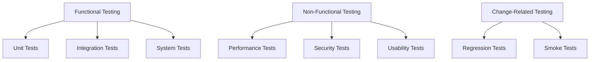
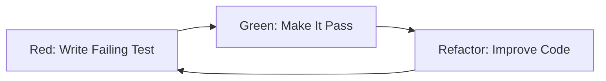

# Complete Testing Guide for SDE2 Interviews
*Comprehensive reference covering testing strategies, frameworks, and best practices*

## 📚 Table of Contents

1. [Testing Fundamentals](#testing-fundamentals)
2. [Testing Pyramid and Strategy](#testing-pyramid-and-strategy)
3. [Unit Testing](#unit-testing)
4. [Integration Testing](#integration-testing)
5. [System and E2E Testing](#system-and-e2e-testing)
6. [Test-Driven Development (TDD)](#test-driven-development-tdd)
7. [Mocking and Test Doubles](#mocking-and-test-doubles)
8. [Testing Frameworks](#testing-frameworks)
9. [Performance Testing](#performance-testing)
10. [Security Testing](#security-testing)
11. [Testing in Microservices](#testing-in-microservices)
12. [Best Practices and Anti-patterns](#best-practices-and-anti-patterns)
13. [Interview Questions](#interview-questions)

---

## 🔬 Testing Fundamentals

### Testing Types by Scope

| Test Type | Scope | Speed | Reliability | Maintenance |
|-----------|-------|-------|-------------|-------------|
| **Unit** | Single function/class | ⚡ Fast | 🎯 High | 🔧 Low |
| **Integration** | Multiple components | 🐌 Medium | 🎯 Medium | 🔧 Medium |
| **System/E2E** | Full application | 🐢 Slow | 🎲 Variable | 🔧 High |

### Testing Types by Purpose



### Key Testing Principles

1. **F.I.R.S.T Principles**
   - **Fast**: Tests should run quickly
   - **Independent**: Tests shouldn't depend on each other
   - **Repeatable**: Same result in any environment
   - **Self-Validating**: Clear pass/fail result
   - **Timely**: Written just before production code

2. **Testing Quadrants**

| Business Facing | Technology Facing |
|----------------|-------------------|
| **Manual/Exploratory** | **Automated Unit/Integration** |
| Usability Testing | Unit Tests |
| User Acceptance | Integration Tests |
| Alpha/Beta Testing | Component Tests |
| **Manual/Automated** | **Manual/Tools** |
| Functional Tests | Performance Tests |
| Story Tests | Security Tests |
| Prototypes | Load Tests |

---

## 🏗️ Testing Pyramid and Strategy

### The Testing Pyramid

```
        /\
       /  \
      / UI \ ← Few, Expensive, Slow
     /______\
    /        \
   /   API    \ ← More, Moderate Cost
  /____________\
 /              \
/  Unit Tests    \ ← Many, Cheap, Fast
/__________________\
```

### Pyramid Distribution (Ideal)

- **70% Unit Tests**: Fast, cheap, reliable
- **20% Integration Tests**: Medium cost, moderate speed
- **10% E2E Tests**: Expensive, slow, fragile

### Anti-pattern: Ice Cream Cone

```
Avoid this distribution:
- 10% Unit Tests
- 20% Integration Tests  
- 70% E2E Tests ← Too many expensive tests!
```

---

## 🧪 Unit Testing

### What Makes a Good Unit Test?

```java
// Good unit test example
@Test
public void calculateTotal_withValidItems_returnsCorrectSum() {
    // Arrange
    ShoppingCart cart = new ShoppingCart();
    cart.addItem(new Item("Book", 29.99));
    cart.addItem(new Item("Pen", 1.99));
    
    // Act
    double total = cart.calculateTotal();
    
    // Assert
    assertEquals(31.98, total, 0.01);
}
```

### Unit Test Structure (AAA Pattern)

1. **Arrange**: Set up test data and dependencies
2. **Act**: Execute the code under test
3. **Assert**: Verify the results

### JUnit 5 Essential Annotations

```java
@ExtendWith(MockitoExtension.class)
class CalculatorTest {
    
    @BeforeAll
    static void setUpClass() {
        // Run once before all tests
    }
    
    @BeforeEach
    void setUp() {
        // Run before each test
    }
    
    @Test
    @DisplayName("Should add two positive numbers correctly")
    void testAddition() {
        assertEquals(5, calculator.add(2, 3));
    }
    
    @ParameterizedTest
    @ValueSource(ints = {1, 2, 3})
    void testMultipleValues(int value) {
        assertTrue(value > 0);
    }
    
    @Test
    @Timeout(value = 2, unit = TimeUnit.SECONDS)
    void testPerformance() {
        // Test should complete within 2 seconds
    }
}
```

### Testing Exceptions

```java
@Test
void shouldThrowExceptionForNegativeInput() {
    IllegalArgumentException exception = assertThrows(
        IllegalArgumentException.class, 
        () -> calculator.divide(10, 0)
    );
    
    assertEquals("Division by zero", exception.getMessage());
}
```

### Testing with Dependencies

```java
@ExtendWith(MockitoExtension.class)
class OrderServiceTest {
    
    @Mock
    private PaymentService paymentService;
    
    @Mock
    private InventoryService inventoryService;
    
    @InjectMocks
    private OrderService orderService;
    
    @Test
    void processOrder_validOrder_returnsOrderId() {
        // Arrange
        Order order = new Order("item1", 2);
        when(inventoryService.isAvailable("item1", 2)).thenReturn(true);
        when(paymentService.charge(any())).thenReturn("payment123");
        
        // Act
        String orderId = orderService.processOrder(order);
        
        // Assert
        assertNotNull(orderId);
        verify(inventoryService).reserveItems("item1", 2);
        verify(paymentService).charge(any());
    }
}
```

---

## 🔗 Integration Testing

### Types of Integration Testing

#### Big Bang Integration
- Test all components together at once
- **Pros**: Simple approach
- **Cons**: Hard to isolate failures

#### Incremental Integration
- **Top-down**: Test from UI downward
- **Bottom-up**: Test from data layer upward
- **Sandwich/Hybrid**: Combine both approaches

### Spring Boot Integration Testing

```java
@SpringBootTest
@AutoConfigureTestDatabase(replace = AutoConfigureTestDatabase.Replace.NONE)
@Testcontainers
class UserRepositoryIntegrationTest {
    
    @Container
    static PostgreSQLContainer<?> postgres = new PostgreSQLContainer<>("postgres:13")
            .withDatabaseName("testdb")
            .withUsername("test")
            .withPassword("test");
    
    @DynamicPropertySource
    static void configureProperties(DynamicPropertyRegistry registry) {
        registry.add("spring.datasource.url", postgres::getJdbcUrl);
        registry.add("spring.datasource.username", postgres::getUsername);
        registry.add("spring.datasource.password", postgres::getPassword);
    }
    
    @Autowired
    private UserRepository userRepository;
    
    @Test
    void shouldSaveAndRetrieveUser() {
        // Arrange
        User user = new User("john@example.com", "John Doe");
        
        // Act
        User saved = userRepository.save(user);
        User retrieved = userRepository.findById(saved.getId()).orElse(null);
        
        // Assert
        assertThat(retrieved).isNotNull();
        assertThat(retrieved.getEmail()).isEqualTo("john@example.com");
    }
}
```

### API Integration Testing

```java
@SpringBootTest(webEnvironment = SpringBootTest.WebEnvironment.RANDOM_PORT)
class UserControllerIntegrationTest {
    
    @Autowired
    private TestRestTemplate restTemplate;
    
    @LocalServerPort
    private int port;
    
    @Test
    void createUser_validInput_returnsCreatedUser() {
        // Arrange
        CreateUserRequest request = new CreateUserRequest("jane@example.com", "Jane");
        
        // Act
        ResponseEntity<User> response = restTemplate.postForEntity(
            "/api/users", request, User.class
        );
        
        // Assert
        assertThat(response.getStatusCode()).isEqualTo(HttpStatus.CREATED);
        assertThat(response.getBody().getEmail()).isEqualTo("jane@example.com");
    }
}
```

### Contract Testing with Pact

```java
@ExtendWith(PactConsumerTestExt.class)
class UserServiceContractTest {
    
    @Pact(consumer = "user-service", provider = "notification-service")
    RequestResponsePact createNotificationPact(PactDslWithProvider builder) {
        return builder
            .given("user exists")
            .uponReceiving("send notification")
            .path("/api/notifications")
            .method("POST")
            .body("{\"userId\": \"123\", \"message\": \"Welcome!\"}")
            .willRespondWith()
            .status(200)
            .body("{\"notificationId\": \"abc123\"}")
            .toPact();
    }
    
    @Test
    @PactTestFor(providerName = "notification-service")
    void testNotificationContract(MockServer mockServer) {
        // Test implementation using mockServer
    }
}
```

---

## 🌐 System and E2E Testing

### End-to-End Testing Strategy

```java
@SpringBootTest(webEnvironment = SpringBootTest.WebEnvironment.DEFINED_PORT)
@Testcontainers
class E2EUserJourneyTest {
    
    @Container
    static GenericContainer<?> app = new GenericContainer<>("myapp:latest")
            .withExposedPorts(8080);
    
    private WebDriver driver;
    
    @BeforeEach
    void setUp() {
        driver = new ChromeDriver();
    }
    
    @Test
    void userCanCompleteFullPurchaseJourney() {
        // Navigate to homepage
        driver.get("http://localhost:8080");
        
        // Search for product
        WebElement searchBox = driver.findElement(By.id("search"));
        searchBox.sendKeys("laptop");
        searchBox.submit();
        
        // Select product
        driver.findElement(By.className("product-item")).click();
        
        // Add to cart
        driver.findElement(By.id("add-to-cart")).click();
        
        // Proceed to checkout
        driver.findElement(By.id("checkout")).click();
        
        // Fill checkout form
        driver.findElement(By.id("email")).sendKeys("test@example.com");
        driver.findElement(By.id("submit-order")).click();
        
        // Verify order confirmation
        WebElement confirmation = driver.findElement(By.id("order-confirmation"));
        assertThat(confirmation.getText()).contains("Order confirmed");
    }
    
    @AfterEach
    void tearDown() {
        if (driver != null) {
            driver.quit();
        }
    }
}
```

### API E2E Testing

```java
@TestMethodOrder(OrderAnnotation.class)
class UserAPIE2ETest {
    
    private static String userId;
    
    @Test
    @Order(1)
    void createUser() {
        given()
            .contentType(ContentType.JSON)
            .body("{\"email\": \"e2e@test.com\", \"name\": \"E2E User\"}")
        .when()
            .post("/api/users")
        .then()
            .statusCode(201)
            .body("email", equalTo("e2e@test.com"))
            .extract()
            .path("id");
    }
    
    @Test
    @Order(2)
    void getUserById() {
        given()
            .pathParam("id", userId)
        .when()
            .get("/api/users/{id}")
        .then()
            .statusCode(200)
            .body("email", equalTo("e2e@test.com"));
    }
    
    @Test
    @Order(3)
    void updateUser() {
        given()
            .contentType(ContentType.JSON)
            .pathParam("id", userId)
            .body("{\"name\": \"Updated Name\"}")
        .when()
            .put("/api/users/{id}")
        .then()
            .statusCode(200)
            .body("name", equalTo("Updated Name"));
    }
}
```

---

## 🔄 Test-Driven Development (TDD)

### TDD Cycle: Red-Green-Refactor



### TDD Example: Building a Calculator

#### Step 1: Red - Write Failing Test

```java
@Test
void shouldAddTwoNumbers() {
    Calculator calculator = new Calculator();
    int result = calculator.add(2, 3);
    assertEquals(5, result);
}
// This fails because Calculator doesn't exist
```

#### Step 2: Green - Make It Pass

```java
public class Calculator {
    public int add(int a, int b) {
        return a + b; // Simplest implementation
    }
}
// Test now passes
```

#### Step 3: Refactor - Improve (if needed)

```java
public class Calculator {
    public int add(int a, int b) {
        // Add validation if needed
        return a + b;
    }
}
```

### TDD Best Practices

1. **Write the smallest failing test**
2. **Make it pass with minimal code**
3. **Refactor without changing behavior**
4. **Test behavior, not implementation**
5. **Keep tests simple and focused**

### Outside-In TDD (London School)

```java
// Start with acceptance test
@Test
void userCanWithdrawMoney() {
    ATM atm = new ATM(mockBank);
    
    when(mockBank.hasAccount("123")).thenReturn(true);
    when(mockBank.getBalance("123")).thenReturn(100.0);
    
    WithdrawalResult result = atm.withdraw("123", 50.0);
    
    assertEquals(SUCCESSFUL, result.getStatus());
    verify(mockBank).debit("123", 50.0);
}

// Then implement collaborators
@Test
void bankShouldDebitAccount() {
    Bank bank = new Bank(mockAccountRepository);
    // ... implement step by step
}
```

---

## 🎭 Mocking and Test Doubles

### Types of Test Doubles

| Type | Purpose | Returns | Verifiable |
|------|---------|---------|------------|
| **Dummy** | Fill parameter lists | Nothing | No |
| **Fake** | Working implementation | Real responses | No |
| **Stub** | Provide canned answers | Predetermined | No |
| **Spy** | Record interactions | Real/stubbed | Yes |
| **Mock** | Verify behavior | Stubbed | Yes |

### Mockito Examples

#### Basic Mocking

```java
@Mock
private PaymentGateway paymentGateway;

@Test
void shouldProcessPayment() {
    // Stub method call
    when(paymentGateway.charge(anyDouble())).thenReturn("transaction123");
    
    // Execute
    String result = paymentService.processPayment(100.0);
    
    // Verify interaction
    verify(paymentGateway).charge(100.0);
    assertEquals("transaction123", result);
}
```

#### Argument Matchers

```java
@Test
void testWithArgumentMatchers() {
    when(paymentGateway.charge(
        eq(100.0),
        argThat(card -> card.getNumber().startsWith("4111"))
    )).thenReturn("success");
    
    verify(paymentGateway).charge(
        anyDouble(),
        any(CreditCard.class)
    );
}
```

#### Spying on Real Objects

```java
@Test
void shouldSpyOnRealObject() {
    List<String> list = new ArrayList<>();
    List<String> spy = spy(list);
    
    // Stub specific method
    doReturn("stubbed").when(spy).get(0);
    
    // Real method calls work
    spy.add("item");
    assertEquals(1, spy.size()); // Real behavior
    assertEquals("stubbed", spy.get(0)); // Stubbed behavior
}
```

#### Mocking Static Methods (Mockito 3.4+)

```java
@Test
void shouldMockStaticMethod() {
    try (MockedStatic<LocalDateTime> mockedTime = mockStatic(LocalDateTime.class)) {
        LocalDateTime fixedTime = LocalDateTime.of(2023, 1, 1, 12, 0);
        mockedTime.when(LocalDateTime::now).thenReturn(fixedTime);
        
        assertEquals(fixedTime, LocalDateTime.now());
    }
}
```

### Advanced Mocking Patterns

#### Partial Mocking with Spy

```java
@Test
void shouldPartiallyMockService() {
    UserService userService = spy(new UserService());
    
    // Stub only specific method
    doReturn(true).when(userService).isValidEmail(anyString());
    
    // Real methods still work
    User user = userService.createUser("invalid-email", "John");
    assertNotNull(user); // Email validation was bypassed
}
```

#### Custom Answer

```java
@Test
void shouldUseCustomAnswer() {
    when(repository.save(any(User.class))).thenAnswer(invocation -> {
        User user = invocation.getArgument(0);
        user.setId(UUID.randomUUID().toString());
        return user;
    });
}
```

---

## 🛠️ Testing Frameworks

### JUnit 5 (Jupiter) Advanced Features

#### Dynamic Tests

```java
@TestFactory
Collection<DynamicTest> dynamicTestsFromCollection() {
    return Arrays.asList(
        dynamicTest("Add test", () -> assertEquals(2, Math.addExact(1, 1))),
        dynamicTest("Multiply test", () -> assertEquals(4, Math.multiplyExact(2, 2)))
    );
}

@TestFactory
Stream<DynamicTest> dynamicTestsFromStream() {
    return Stream.of("apple", "banana", "orange")
        .map(fruit -> dynamicTest("Test " + fruit, 
            () -> assertTrue(fruit.length() > 0)));
}
```

#### Parameterized Tests

```java
@ParameterizedTest
@CsvSource({
    "1, 1, 2",
    "2, 3, 5", 
    "-1, 1, 0"
})
void testAddition(int a, int b, int expected) {
    assertEquals(expected, calculator.add(a, b));
}

@ParameterizedTest
@MethodSource("stringProvider")
void testWithMethodSource(String argument) {
    assertNotNull(argument);
}

static Stream<String> stringProvider() {
    return Stream.of("apple", "banana", "orange");
}
```

#### Custom Extensions

```java
public class DatabaseExtension implements BeforeEachCallback, AfterEachCallback {
    
    @Override
    public void beforeEach(ExtensionContext context) {
        // Setup database
        DatabaseManager.startTransaction();
    }
    
    @Override
    public void afterEach(ExtensionContext context) {
        // Cleanup database
        DatabaseManager.rollbackTransaction();
    }
}

@ExtendWith(DatabaseExtension.class)
class UserRepositoryTest {
    // Tests run in database transaction
}
```

### TestNG Features

```java
@Test(groups = {"smoke", "regression"})
public void testLogin() {
    // Test implementation
}

@Test(dependsOnMethods = {"testLogin"})
public void testDashboard() {
    // Runs only if testLogin passes
}

@DataProvider
public Object[][] loginData() {
    return new Object[][]{
        {"user1", "pass1"},
        {"user2", "pass2"}
    };
}

@Test(dataProvider = "loginData")
public void testLoginWithData(String username, String password) {
    // Test with different data sets
}
```

### AssertJ for Fluent Assertions

```java
@Test
void testWithAssertJ() {
    List<String> names = Arrays.asList("John", "Jane", "Bob");
    
    assertThat(names)
        .hasSize(3)
        .contains("John", "Jane")
        .doesNotContain("Alice")
        .allMatch(name -> name.length() >= 3);
    
    User user = new User("john@example.com", "John", 25);
    
    assertThat(user)
        .hasFieldOrPropertyWithValue("email", "john@example.com")
        .hasFieldOrPropertyWithValue("age", 25)
        .extracting(User::getName)
        .isEqualTo("John");
}
```

---

## ⚡ Performance Testing

### Types of Performance Testing

| Type | Purpose | Load Pattern |
|------|---------|-------------|
| **Load Testing** | Normal expected load | Steady increase |
| **Stress Testing** | Beyond normal capacity | Peak load |
| **Spike Testing** | Sudden load increases | Sharp spikes |
| **Volume Testing** | Large amounts of data | Sustained high |
| **Endurance Testing** | Extended periods | Long duration |

### JMH (Java Microbenchmark Harness)

```java
@BenchmarkMode(Mode.AverageTime)
@OutputTimeUnit(TimeUnit.NANOSECONDS)
@State(Scope.Thread)
public class CollectionBenchmark {
    
    private List<String> arrayList;
    private List<String> linkedList;
    
    @Setup
    public void setup() {
        arrayList = new ArrayList<>();
        linkedList = new LinkedList<>();
        
        for (int i = 0; i < 1000; i++) {
            String value = "item" + i;
            arrayList.add(value);
            linkedList.add(value);
        }
    }
    
    @Benchmark
    public String testArrayListAccess() {
        return arrayList.get(500);
    }
    
    @Benchmark
    public String testLinkedListAccess() {
        return linkedList.get(500);
    }
}
```

### Load Testing with JUnit

```java
@Test
@Timeout(value = 10, unit = TimeUnit.SECONDS)
void loadTest() throws InterruptedException {
    int numberOfThreads = 10;
    int numberOfRequests = 100;
    CountDownLatch latch = new CountDownLatch(numberOfThreads);
    ExecutorService executor = Executors.newFixedThreadPool(numberOfThreads);
    
    AtomicInteger successCount = new AtomicInteger(0);
    AtomicInteger errorCount = new AtomicInteger(0);
    
    for (int i = 0; i < numberOfThreads; i++) {
        executor.submit(() -> {
            try {
                for (int j = 0; j < numberOfRequests; j++) {
                    if (userService.getUser("user" + j) != null) {
                        successCount.incrementAndGet();
                    }
                }
            } catch (Exception e) {
                errorCount.incrementAndGet();
            } finally {
                latch.countDown();
            }
        });
    }
    
    latch.await();
    executor.shutdown();
    
    System.out.printf("Success: %d, Errors: %d%n", 
        successCount.get(), errorCount.get());
    
    assertTrue(successCount.get() > errorCount.get());
}
```

---

## 🔒 Security Testing

### Input Validation Testing

```java
@Test
void shouldRejectSQLInjection() {
    String maliciousInput = "'; DROP TABLE users; --";
    
    assertThrows(InvalidInputException.class, () -> 
        userService.findByName(maliciousInput));
}

@Test
void shouldRejectXSSAttempt() {
    String xssPayload = "<script>alert('xss')</script>";
    
    String sanitized = inputSanitizer.sanitize(xssPayload);
    
    assertThat(sanitized).doesNotContain("<script>");
    assertThat(sanitized).doesNotContain("alert");
}
```

### Authentication Testing

```java
@Test
void shouldRequireAuthentication() {
    given()
        .when()
        .get("/api/secure-endpoint")
        .then()
        .statusCode(401);
}

@Test
void shouldAcceptValidToken() {
    String token = authService.generateToken("user123");
    
    given()
        .header("Authorization", "Bearer " + token)
        .when()
        .get("/api/secure-endpoint")
        .then()
        .statusCode(200);
}
```

### Authorization Testing

```java
@Test
void shouldDenyAccessToUnauthorizedResource() {
    String userToken = authService.generateToken("regularuser");
    
    given()
        .header("Authorization", "Bearer " + userToken)
        .when()
        .get("/api/admin/users")
        .then()
        .statusCode(403);
}

@Test
void shouldAllowAccessWithCorrectRole() {
    String adminToken = authService.generateToken("admin");
    
    given()
        .header("Authorization", "Bearer " + adminToken)
        .when()
        .get("/api/admin/users")
        .then()
        .statusCode(200);
}
```

### Encryption Testing

```java
@Test
void shouldEncryptSensitiveData() {
    String plaintext = "sensitive-password";
    
    String encrypted = encryptionService.encrypt(plaintext);
    
    assertThat(encrypted).isNotEqualTo(plaintext);
    assertThat(encrypted).isNotEmpty();
    
    String decrypted = encryptionService.decrypt(encrypted);
    assertEquals(plaintext, decrypted);
}
```

---

## 🔄 Testing in Microservices

### Service Testing Strategy

```
┌─────────────────┐
│   Consumer      │ ◄─── Consumer Contract Tests
├─────────────────┤
│   API Gateway   │ ◄─── Integration Tests
├─────────────────┤
│   Service A     │ ◄─── Unit + Component Tests
├─────────────────┤
│   Service B     │ ◄─── Unit + Component Tests
├─────────────────┤
│   Database      │ ◄─── Data Layer Tests
└─────────────────┘
```

### Component Testing

```java
@SpringBootTest(webEnvironment = SpringBootTest.WebEnvironment.MOCK)
@AutoConfigureTestDatabase(replace = AutoConfigureTestDatabase.Replace.NONE)
@Testcontainers
class UserServiceComponentTest {
    
    @Container
    static PostgreSQLContainer<?> postgres = new PostgreSQLContainer<>("postgres:13");
    
    @Autowired
    private MockMvc mockMvc;
    
    @MockBean
    private NotificationService notificationService; // External dependency
    
    @Test
    void shouldCreateUserAndSendNotification() throws Exception {
        mockMvc.perform(post("/api/users")
                .contentType(MediaType.APPLICATION_JSON)
                .content("{\"email\":\"test@example.com\",\"name\":\"Test\"}"))
                .andExpect(status().isCreated())
                .andExpect(jsonPath("$.email").value("test@example.com"));
        
        verify(notificationService).sendWelcomeEmail("test@example.com");
    }
}
```

### Contract Testing with Spring Cloud Contract

```groovy
// contracts/user_contract.groovy
org.springframework.cloud.contract.spec.Contract.make {
    description "should return user by id"
    request {
        method 'GET'
        url '/api/users/123'
        headers {
            contentType(applicationJson())
        }
    }
    response {
        status OK()
        body([
            id: "123",
            email: "john@example.com",
            name: "John Doe"
        ])
        headers {
            contentType(applicationJson())
        }
    }
}
```

### Chaos Testing

```java
@Test
void shouldHandleServiceFailure() {
    // Simulate external service failure
    WireMock.stubFor(get(urlEqualTo("/external-api/users/123"))
        .willReturn(aResponse()
            .withStatus(500)
            .withFixedDelay(5000)));
    
    // Test circuit breaker behavior
    assertThrows(CircuitBreakerOpenException.class, () -> 
        userService.getExternalUserData("123"));
    
    // Verify fallback mechanism
    User fallbackUser = userService.getUserWithFallback("123");
    assertNotNull(fallbackUser);
    assertTrue(fallbackUser.isFromCache());
}
```

---

## ✅ Best Practices and Anti-patterns

### Testing Best Practices

#### ✅ DO

1. **Follow AAA Pattern**
   ```java
   @Test
   void shouldCalculateDiscount() {
       // Arrange
       Product product = new Product("Laptop", 1000.0);
       DiscountCalculator calculator = new DiscountCalculator();
       
       // Act
       double discount = calculator.calculateDiscount(product, 0.1);
       
       // Assert
       assertEquals(100.0, discount, 0.01);
   }
   ```

2. **Use Descriptive Test Names**
   ```java
   // Good
   @Test
   void shouldThrowExceptionWhenWithdrawalExceedsBalance() { }
   
   // Bad
   @Test
   void testWithdraw() { }
   ```

3. **Test One Thing at a Time**
   ```java
   @Test
   void shouldValidateEmailFormat() {
       assertThrows(InvalidEmailException.class, 
           () -> userService.validateEmail("invalid-email"));
   }
   
   @Test
   void shouldValidateEmailNotNull() {
       assertThrows(IllegalArgumentException.class, 
           () -> userService.validateEmail(null));
   }
   ```

4. **Use Test Data Builders**
   ```java
   public class UserTestDataBuilder {
       private String email = "default@example.com";
       private String name = "Default Name";
       
       public UserTestDataBuilder withEmail(String email) {
           this.email = email;
           return this;
       }
       
       public User build() {
           return new User(email, name);
       }
   }
   
   // Usage
   @Test
   void testUserCreation() {
       User user = new UserTestDataBuilder()
           .withEmail("test@example.com")
           .build();
   }
   ```

#### ❌ DON'T

1. **Don't Test Implementation Details**
   ```java
   // Bad - testing internal state
   @Test
   void shouldSetInternalCounter() {
       service.processOrder(order);
       assertEquals(1, service.getInternalCounter()); // Implementation detail
   }
   
   // Good - testing behavior
   @Test
   void shouldSendConfirmationAfterProcessing() {
       service.processOrder(order);
       verify(emailService).sendConfirmation(order.getCustomerEmail());
   }
   ```

2. **Don't Create Overly Complex Tests**
   ```java
   // Bad - too complex
   @Test
   void complexScenario() {
       // 50 lines of setup
       // Multiple assertions
       // Testing multiple behaviors
   }
   
   // Good - simple and focused
   @Test
   void shouldCalculateTotal() {
       assertEquals(100.0, cart.getTotal());
   }
   ```

3. **Don't Ignore Test Failures**
   ```java
   // Bad
   @Test
   @Disabled("Flaky test - TODO: fix later")
   void flakyTest() { }
   
   // Good - fix the root cause
   @Test
   void reliableTest() {
       // Properly setup and teardown resources
   }
   ```

### Test Maintenance

#### Reducing Test Fragility

```java
// Fragile - depends on exact order
@Test
void shouldReturnUsersInOrder() {
    List<User> users = userService.getAllUsers();
    assertEquals("Alice", users.get(0).getName());
    assertEquals("Bob", users.get(1).getName());
}

// Robust - tests the actual requirement
@Test
void shouldReturnUsersSortedByName() {
    List<User> users = userService.getAllUsers();
    
    assertThat(users)
        .extracting(User::getName)
        .isSorted();
}
```

#### Test Data Management

```java
// Use constants for test data
public class TestConstants {
    public static final String VALID_EMAIL = "test@example.com";
    public static final String INVALID_EMAIL = "invalid-email";
    public static final User SAMPLE_USER = new User(VALID_EMAIL, "Test User");
}

// Use factory methods
public class TestUserFactory {
    public static User createValidUser() {
        return new User("test@example.com", "Test User");
    }
    
    public static User createUserWithEmail(String email) {
        return new User(email, "Test User");
    }
}
```

---

## ❓ Interview Questions

### Fundamental Questions

**Q: What is the testing pyramid and why is it important?**

A: The testing pyramid is a strategy that suggests having:
- Many unit tests (fast, cheap, reliable)
- Fewer integration tests (moderate cost and speed)  
- Even fewer E2E tests (expensive, slow, fragile)

This maximizes test coverage while minimizing cost and execution time.

**Q: Explain the difference between mocks, stubs, and spies.**

A:
- **Mock**: Verifies interactions, expects specific method calls
- **Stub**: Provides predetermined responses, doesn't verify calls
- **Spy**: Wraps real object, can stub some methods while keeping others real

```java
// Mock - verifies behavior
verify(mockPaymentService).charge(100.0);

// Stub - provides responses  
when(stubPaymentService.charge(anyDouble())).thenReturn("success");

// Spy - partial mocking
PaymentService spy = spy(realPaymentService);
doReturn("stubbed").when(spy).validateCard(anyString());
```

**Q: What is TDD and what are its benefits?**

A: Test-Driven Development follows Red-Green-Refactor cycle:
1. Write failing test (Red)
2. Make it pass with minimal code (Green)  
3. Refactor while keeping tests green

Benefits:
- Better design through testable code
- Higher test coverage
- Confidence in refactoring
- Living documentation

### Advanced Questions

**Q: How would you test a distributed system?**

A: Multi-layered approach:

1. **Unit Tests**: Test individual services
2. **Contract Tests**: Verify service interactions (Pact)
3. **Component Tests**: Test service with real database but mock external services
4. **Integration Tests**: Test service interactions
5. **E2E Tests**: Full system workflow
6. **Chaos Engineering**: Test failure scenarios

```java
// Contract test example
@Pact(consumer = "order-service", provider = "inventory-service")
RequestResponsePact inventoryContract(PactDslWithProvider builder) {
    return builder
        .given("item is in stock")
        .uponReceiving("check inventory")
        .path("/api/inventory/laptop")
        .willRespondWith()
        .status(200)
        .body("{\"available\": true, \"quantity\": 10}")
        .toPact();
}
```

**Q: How do you handle flaky tests?**

A: Strategies to reduce flakiness:

1. **Identify Root Causes**:
   - Timing issues
   - Test dependencies
   - External service dependencies
   - Resource leaks

2. **Fix Strategies**:
   ```java
   // Replace Thread.sleep with proper waits
   WebDriverWait wait = new WebDriverWait(driver, Duration.ofSeconds(10));
   wait.until(ExpectedConditions.visibilityOfElementLocated(By.id("result")));
   
   // Use test containers for dependencies
   @Container
   static PostgreSQLContainer<?> postgres = new PostgreSQLContainer<>("postgres:13");
   
   // Proper cleanup
   @AfterEach
   void cleanup() {
       testDataRepository.deleteAll();
   }
   ```

**Q: Design a testing strategy for a microservices architecture.**

A: Comprehensive testing strategy:

```java
// 1. Service-level component tests
@SpringBootTest(webEnvironment = MOCK)
@MockBean(NotificationService.class) // Mock external dependencies
class OrderServiceComponentTest {
    // Test service in isolation
}

// 2. Contract testing
@ExtendWith(PactConsumerTestExt.class)
class OrderServiceContractTest {
    // Verify consumer-provider contracts
}

// 3. Integration testing with test containers
@Testcontainers
class OrderServiceIntegrationTest {
    @Container
    static GenericContainer<?> orderDb = new PostgreSQLContainer<>("postgres:13");
    
    @Container  
    static GenericContainer<?> inventoryService = new GenericContainer<>("inventory:latest");
}

// 4. E2E testing
@Test
void completeOrderJourney() {
    // Test full user journey across services
}
```

### System Design Testing Questions

**Q: How would you test a rate limiter?**

```java
@Test
void shouldEnforceRateLimit() throws InterruptedException {
    RateLimiter limiter = new RateLimiter(5, Duration.ofMinutes(1)); // 5 requests per minute
    
    // Allow first 5 requests
    for (int i = 0; i < 5; i++) {
        assertTrue(limiter.tryAcquire("user1"));
    }
    
    // 6th request should be denied
    assertFalse(limiter.tryAcquire("user1"));
    
    // Different user should still be allowed
    assertTrue(limiter.tryAcquire("user2"));
}

@Test
void shouldResetAfterTimeWindow() throws InterruptedException {
    RateLimiter limiter = new RateLimiter(1, Duration.ofSeconds(1));
    
    assertTrue(limiter.tryAcquire("user1"));
    assertFalse(limiter.tryAcquire("user1"));
    
    Thread.sleep(1100); // Wait for reset
    
    assertTrue(limiter.tryAcquire("user1"));
}
```

**Q: How would you test a caching system?**

```java
@Test
void shouldCacheResults() {
    Cache<String, User> cache = new LRUCache<>(100);
    when(userRepository.findById("123")).thenReturn(testUser);
    
    // First call hits repository
    User user1 = userService.getUser("123");
    verify(userRepository, times(1)).findById("123");
    
    // Second call hits cache
    User user2 = userService.getUser("123");
    verify(userRepository, times(1)).findById("123"); // Still only called once
    
    assertSame(user1, user2);
}

@Test
void shouldEvictLRUItems() {
    Cache<String, String> cache = new LRUCache<>(2);
    
    cache.put("key1", "value1");
    cache.put("key2", "value2");
    cache.put("key3", "value3"); // Should evict key1
    
    assertNull(cache.get("key1"));
    assertNotNull(cache.get("key2"));
    assertNotNull(cache.get("key3"));
}
```

---

## 🏷️ Tags

#testing #unit-testing #integration-testing #tdd #mocking #junit #testng #selenium #performance-testing #security-testing #microservices-testing #contract-testing #e2e-testing #test-automation #quality-assurance #sde2

## 📚 Related Topics

- [[Security-Guide|Security Best Practices]]
- [[DevOps-Guide|DevOps and CI/CD]]
- [[API-Design-Guide|API Design and Testing]]
- [[Complete-Java-Concurrency-Guide|Java Concurrency]]
- [[Complete-HLD-Guide|System Design Patterns]]