# Global Microservices Infrastructure — Complete Production Guide

> A deep-dive into how production systems manage users globally: from DNS resolution to database replication, covering every layer of the stack.

---

## Table of Contents

1. [High-Level Global Architecture](https://claude.ai/chat/8b7e4067-6009-4d7a-87a6-f8858ecd9170#1-high-level-global-architecture)
2. [How a User Request Reaches the Nearest Region](https://claude.ai/chat/8b7e4067-6009-4d7a-87a6-f8858ecd9170#2-how-a-user-request-reaches-the-nearest-region)
3. [GeoDNS and Anycast Routing](https://claude.ai/chat/8b7e4067-6009-4d7a-87a6-f8858ecd9170#3-geodns-and-anycast-routing)
4. [Edge Layer — CDN and Points of Presence (PoPs)](https://claude.ai/chat/8b7e4067-6009-4d7a-87a6-f8858ecd9170#4-edge-layer--cdn-and-points-of-presence-pops)
5. [Regional Load Balancer — In Front of the API Gateway](https://claude.ai/chat/8b7e4067-6009-4d7a-87a6-f8858ecd9170#5-regional-load-balancer--in-front-of-the-api-gateway)
6. [API Gateway — The Application Entry Point](https://claude.ai/chat/8b7e4067-6009-4d7a-87a6-f8858ecd9170#6-api-gateway--the-application-entry-point)
7. [Inside a Region — Microservices, Service Mesh, and Communication](https://claude.ai/chat/8b7e4067-6009-4d7a-87a6-f8858ecd9170#7-inside-a-region--microservices-service-mesh-and-communication)
8. [Database Architecture and Per-Service Data Ownership](https://claude.ai/chat/8b7e4067-6009-4d7a-87a6-f8858ecd9170#8-database-architecture-and-per-service-data-ownership)
9. [Cross-Region Data Replication Strategies](https://claude.ai/chat/8b7e4067-6009-4d7a-87a6-f8858ecd9170#9-cross-region-data-replication-strategies)
10. [Scaling Strategies — Horizontal, Vertical, and Auto](https://claude.ai/chat/8b7e4067-6009-4d7a-87a6-f8858ecd9170#10-scaling-strategies--horizontal-vertical-and-auto)
11. [Disaster Recovery and Failover](https://claude.ai/chat/8b7e4067-6009-4d7a-87a6-f8858ecd9170#11-disaster-recovery-and-failover)
12. [Observability Across Regions](https://claude.ai/chat/8b7e4067-6009-4d7a-87a6-f8858ecd9170#12-observability-across-regions)
13. [Complete Request Lifecycle — End to End](https://claude.ai/chat/8b7e4067-6009-4d7a-87a6-f8858ecd9170#13-complete-request-lifecycle--end-to-end)

---

## 1. High-Level Global Architecture

At the highest level, a production global system looks like this: users worldwide connect to the nearest edge location, which routes them into the closest regional data center. Each region is a self-contained deployment with its own microservices, databases, caches, and message brokers.

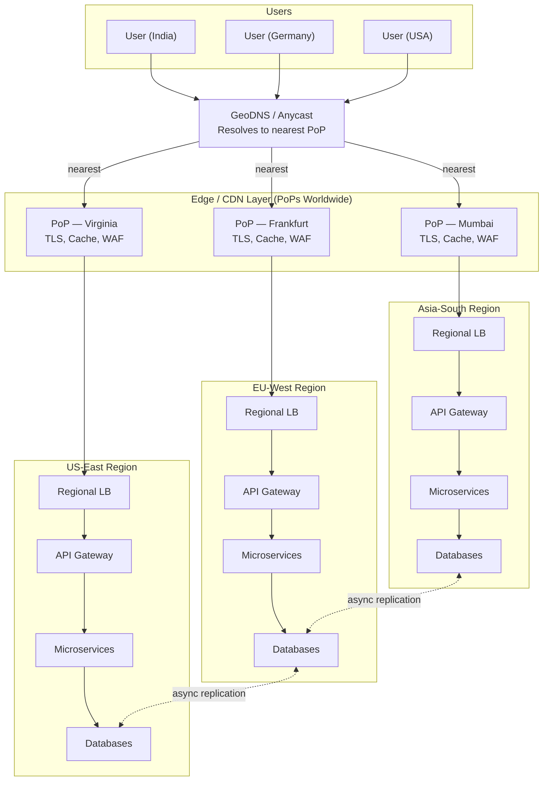
```mermaid
graph TB
    subgraph Users
        U1["User (India)"]
        U2["User (Germany)"]
        U3["User (USA)"]
    end

    DNS["GeoDNS / Anycast\nResolves to nearest PoP"]

    U1 --> DNS
    U2 --> DNS
    U3 --> DNS

    subgraph Edge["Edge / CDN Layer (PoPs Worldwide)"]
        P1["PoP — Mumbai\nTLS, Cache, WAF"]
        P2["PoP — Frankfurt\nTLS, Cache, WAF"]
        P3["PoP — Virginia\nTLS, Cache, WAF"]
    end

    DNS -->|nearest| P1
    DNS -->|nearest| P2
    DNS -->|nearest| P3

    subgraph R1["Asia-South Region"]
        LB1["Regional LB"] --> GW1["API Gateway"] --> MS1["Microservices"] --> DB1["Databases"]
    end
    subgraph R2["EU-West Region"]
        LB2["Regional LB"] --> GW2["API Gateway"] --> MS2["Microservices"] --> DB2["Databases"]
    end
    subgraph R3["US-East Region"]
        LB3["Regional LB"] --> GW3["API Gateway"] --> MS3["Microservices"] --> DB3["Databases"]
    end

    P1 --> LB1
    P2 --> LB2
    P3 --> LB3

    DB1 <-. "async replication" .-> DB2
    DB2 <-. "async replication" .-> DB3
```

**Key principle**: A user's request should be served entirely within their nearest region. Data stays regional (especially for GDPR/data sovereignty). Only metadata, configuration, and event streams replicate globally.

---

## 2. How a User Request Reaches the Nearest Region

The full request path involves multiple layers, each with a specific job. Here's the complete flow from a user's browser to the backend:

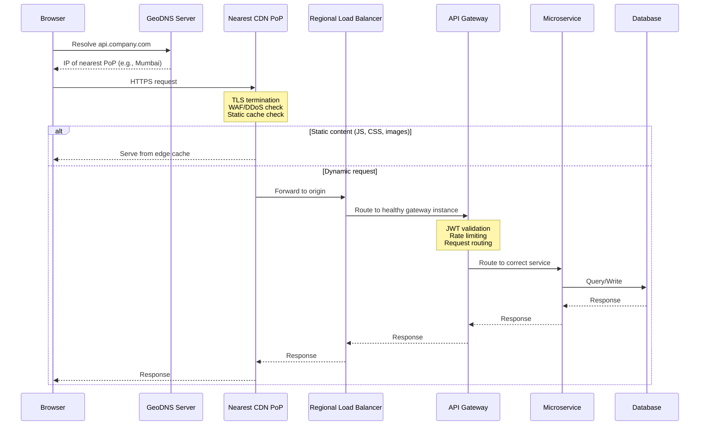
```mermaid
sequenceDiagram
    participant Browser
    participant DNS as GeoDNS Server
    participant PoP as Nearest CDN PoP
    participant LB as Regional Load Balancer
    participant GW as API Gateway
    participant SVC as Microservice
    participant DB as Database

    Browser->>DNS: Resolve api.company.com
    DNS-->>Browser: IP of nearest PoP (e.g., Mumbai)

    Browser->>PoP: HTTPS request
    Note over PoP: TLS termination<br/>WAF/DDoS check<br/>Static cache check

    alt Static content (JS, CSS, images)
        PoP-->>Browser: Serve from edge cache
    else Dynamic request
        PoP->>LB: Forward to origin
        LB->>GW: Route to healthy gateway instance
        Note over GW: JWT validation<br/>Rate limiting<br/>Request routing
        GW->>SVC: Route to correct service
        SVC->>DB: Query/Write
        DB-->>SVC: Response
        SVC-->>GW: Response
        GW-->>LB: Response
        LB-->>PoP: Response
        PoP-->>Browser: Response
    end
```

**Typical latency breakdown** (same-region request):

- DNS resolution: 1-5ms (cached), 20-50ms (cold)
- TLS handshake at PoP: 10-30ms
- PoP to origin: 5-20ms (same region)
- API Gateway processing: 1-5ms
- Service logic + DB: 10-50ms
- **Total: 50-150ms for a well-optimized system**

---

## 3. GeoDNS and Anycast Routing

### How GeoDNS Works

Standard DNS returns the same IP address regardless of who's asking. GeoDNS adds location awareness — it checks where the request is coming from and returns the IP of the nearest edge location.

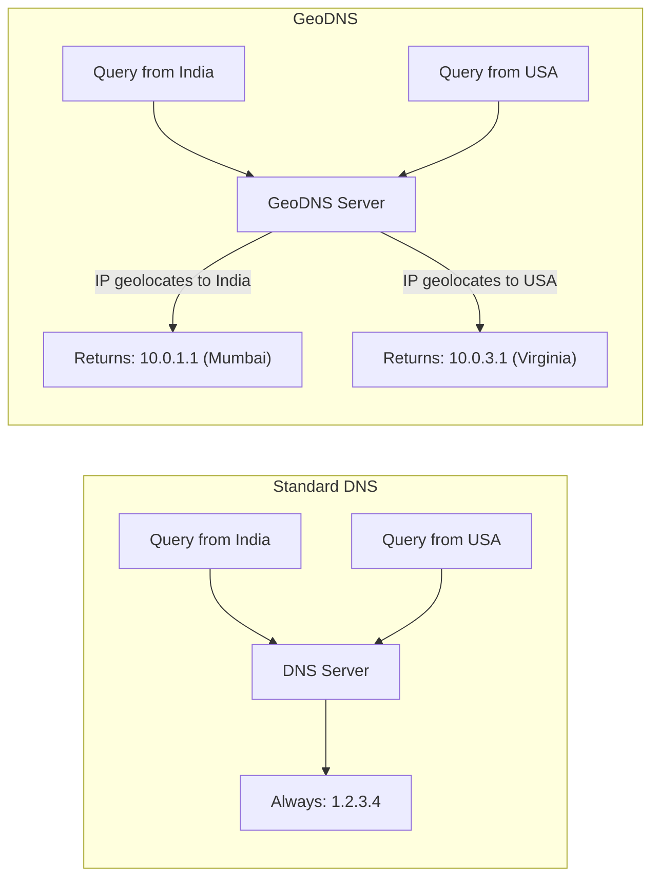
```mermaid
graph LR
    subgraph "Standard DNS"
        Q1["Query from India"] --> STD["DNS Server"]
        Q2["Query from USA"] --> STD
        STD --> IP1["Always: 1.2.3.4"]
    end

    subgraph "GeoDNS"
        Q3["Query from India"] --> GEO["GeoDNS Server"]
        Q4["Query from USA"] --> GEO
        GEO -->|"IP geolocates to India"| IP2["Returns: 10.0.1.1 (Mumbai)"]
        GEO -->|"IP geolocates to USA"| IP3["Returns: 10.0.3.1 (Virginia)"]
    end
```

### Resolution Steps

1. User's browser sends DNS query to their ISP's recursive resolver.
2. Recursive resolver contacts the authoritative nameserver for `api.company.com`.
3. The authoritative nameserver (e.g., AWS Route 53 with geolocation routing) checks the **source IP** of the resolver.
4. Based on the GeoIP database mapping, it returns the IP of the closest PoP/region.
5. Browser caches the IP for the TTL duration (typically 60-300 seconds).

### Anycast — The Alternative Approach

Instead of the DNS server deciding which IP to return, **anycast** advertises the **same IP** from multiple locations via BGP (Border Gateway Protocol). The internet's routing infrastructure naturally delivers the packet to the nearest location.

|Feature|GeoDNS|Anycast|
|---|---|---|
|Routing decision|At DNS resolution time|At network routing level (BGP)|
|Granularity|Country/region level|Closest BGP peer|
|Failover speed|TTL-dependent (60-300s)|Near-instant (BGP reconverges)|
|Used by|AWS Route 53, Azure Traffic Manager|Cloudflare, Google Cloud LB|
|Downside|Stale cache during failover|TCP session pinning challenges|

### Failover Behavior

When a PoP goes down:

- **GeoDNS**: Health checks detect failure → DNS records updated → but clients cache the old IP for TTL duration → 1-5 minute failover window.
- **Anycast**: BGP route is withdrawn → routing tables converge in seconds → near-instant failover.

**Production best practice**: Use anycast for the CDN/edge layer (fast failover matters most here) and GeoDNS for region-level routing decisions (where you need explicit control over which region handles a user).

---

## 4. Edge Layer — CDN and Points of Presence (PoPs)

The edge layer (CDN) is the first thing that touches the user's request after DNS resolution. Major providers (CloudFront, Cloudflare, Akamai, Fastly) operate 200-400+ PoPs globally.

### What a PoP Does

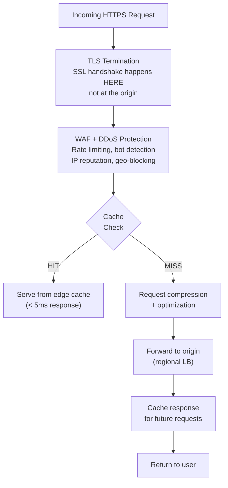
```mermaid
graph TB
    REQ["Incoming HTTPS Request"] --> TLS["TLS Termination\nSSL handshake happens HERE\nnot at the origin"]
    TLS --> WAF["WAF + DDoS Protection\nRate limiting, bot detection\nIP reputation, geo-blocking"]
    WAF --> CACHE{"Cache\nCheck"}
    CACHE -->|HIT| RESP1["Serve from edge cache\n(< 5ms response)"]
    CACHE -->|MISS| COMPRESS["Request compression\n+ optimization"]
    COMPRESS --> ORIGIN["Forward to origin\n(regional LB)"]
    ORIGIN --> STORE["Cache response\nfor future requests"]
    STORE --> RESP2["Return to user"]
```

### Key PoP Responsibilities

|Responsibility|What it does|Why it matters|
|---|---|---|
|**TLS Termination**|Handles SSL/TLS handshake|Eliminates round-trip to origin for handshake. User gets low-latency TLS.|
|**Static Caching**|Caches JS, CSS, images, API responses (if cacheable)|60-80% of requests never reach origin. Reduces load and latency.|
|**WAF/DDoS**|Blocks malicious traffic, SQL injection, XSS|Bad traffic is dropped at the edge, protecting origin servers.|
|**Compression**|Brotli/gzip compression of responses|Reduces bandwidth, speeds up transfer.|
|**HTTP/2-3 Multiplexing**|Handles modern protocols at the edge|Origin can use simpler HTTP/1.1 internally.|

### Cache Invalidation Strategies

- **TTL-based**: Set `Cache-Control: max-age=3600` — PoP serves cached content for 1 hour, then re-fetches.
- **Purge API**: When you deploy new code, call the CDN's purge API to invalidate specific paths or everything.
- **Stale-while-revalidate**: Serve stale content while fetching fresh content in the background — user never waits.
- **Cache tags**: Tag cached objects (e.g., `product-123`) and purge by tag when data changes.

---

## 5. Regional Load Balancer — In Front of the API Gateway

**Yes, there is always a load balancer in front of the API Gateway.** The API gateway itself runs as multiple instances (for high availability), and something needs to distribute traffic across them.

### L4 vs L7 Load Balancing

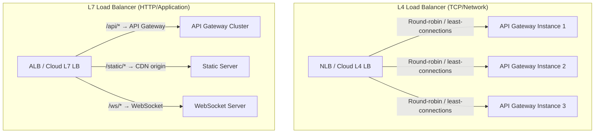
```mermaid
graph TB
    subgraph "L4 Load Balancer (TCP/Network)"
        L4["NLB / Cloud L4 LB"]
        L4 -->|"Round-robin / least-connections"| GW1["API Gateway Instance 1"]
        L4 -->|"Round-robin / least-connections"| GW2["API Gateway Instance 2"]
        L4 -->|"Round-robin / least-connections"| GW3["API Gateway Instance 3"]
    end

    subgraph "L7 Load Balancer (HTTP/Application)"
        L7["ALB / Cloud L7 LB"]
        L7 -->|"/api/* → API Gateway"| GW4["API Gateway Cluster"]
        L7 -->|"/static/* → CDN origin"| CDN["Static Server"]
        L7 -->|"/ws/* → WebSocket"| WS["WebSocket Server"]
    end
```

|Feature|L4 (TCP)|L7 (HTTP)|
|---|---|---|
|Operates at|TCP/UDP layer|HTTP layer|
|Routing by|IP + port|URL path, headers, cookies|
|TLS|Pass-through or terminate|Always terminates|
|Speed|Faster (less processing)|Slightly slower (parses HTTP)|
|Use case|High-throughput, simple distribution|Path-based routing, A/B testing|
|AWS product|NLB|ALB|
|GCP product|Network LB|HTTP(S) LB|

### Health Checks

The load balancer continuously pings gateway instances:

```
GET /health → 200 OK (healthy, keep sending traffic)
GET /health → 503     (unhealthy, remove from pool)
GET /health → timeout  (dead, remove from pool)
```

**Configuration**: Check interval 10s, unhealthy threshold 3 consecutive failures, healthy threshold 2 consecutive successes. This means a dead gateway is removed within 30 seconds.

### Session Affinity (Sticky Sessions)

Most microservice architectures are **stateless** — any gateway instance can handle any request. But if you need sticky sessions (e.g., WebSocket connections), the LB can use:

- Cookie-based affinity: LB sets a cookie pointing to a specific backend.
- IP hash: Same client IP always goes to the same backend.

**Best practice**: Avoid sticky sessions. Store session state in Redis so any instance can serve any user.

---

## 6. API Gateway — The Application Entry Point

The API Gateway is where your application logic begins. It's the single entry point for all client requests and handles cross-cutting concerns so individual microservices don't have to.

### API Gateway Responsibilities

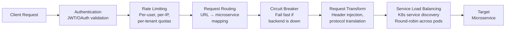
```mermaid
graph LR
    REQ["Client Request"] --> AUTH["Authentication\nJWT/OAuth validation"]
    AUTH --> RL["Rate Limiting\nPer-user, per-IP,\nper-tenant quotas"]
    RL --> ROUTE["Request Routing\nURL → microservice\nmapping"]
    ROUTE --> CB["Circuit Breaker\nFail fast if\nbackend is down"]
    CB --> TRANSFORM["Request Transform\nHeader injection,\nprotocol translation"]
    TRANSFORM --> LB["Service Load Balancing\nK8s service discovery\nRound-robin across pods"]
    LB --> SVC["Target\nMicroservice"]
```

### How the API Gateway Does Backend Load Balancing

This is a critical concept: the API gateway does **L7 intelligent routing** to microservices, which is fundamentally different from the L4 load balancer sitting in front of it.

**Step 1 — Route resolution**: Request for `GET /api/v2/orders/123` matches the route `/api/v2/orders/{id}` → mapped to `order-service`.

**Step 2 — Service discovery**: The gateway resolves `order-service` via:

- **Kubernetes DNS**: `order-service.production.svc.cluster.local` → list of pod IPs
- **Service registry (Consul/Eureka)**: Query for healthy instances of `order-service`
- **DNS SRV records**: Returns IP + port of available instances

**Step 3 — Load balancing algorithm**: The gateway picks one instance using:

- **Round-robin**: Default, simplest, works well for uniform requests
- **Least connections**: Routes to the instance handling the fewest active requests
- **Weighted**: Newer pods get less traffic during warm-up
- **Consistent hashing**: Same user always goes to the same pod (useful for local caching)

### Popular API Gateway Solutions

|Gateway|Type|Best for|
|---|---|---|
|**Kong**|Open-source + Enterprise|Kubernetes-native, plugin ecosystem|
|**Envoy**|Open-source (C++)|Ultra-high performance, service mesh integration|
|**AWS API Gateway**|Managed|Serverless/Lambda backends, simple setups|
|**NGINX Plus**|Commercial|Traditional infrastructure, proven reliability|
|**Traefik**|Open-source|Docker/K8s auto-discovery, simple config|
|**Spring Cloud Gateway**|Open-source (Java)|Java/Spring Boot microservice ecosystems|

### Rate Limiting at the Gateway

Rate limiting happens per-region at the gateway level. Typical strategies:

- **Fixed window**: 100 requests per minute per user (simple but allows bursts at window boundaries).
- **Sliding window**: Smooths out the burst problem by tracking requests over a rolling window.
- **Token bucket**: Allows short bursts while maintaining a long-term average rate.

**Storage**: Rate limit counters are stored in Redis (shared across all gateway instances in the region). A distributed rate limiter (like using Redis `INCR` with TTL) ensures consistency across gateway pods.

```
User X → Gateway Instance 1 → Redis INCR("rate:user-x") → count=45 → ALLOW
User X → Gateway Instance 3 → Redis INCR("rate:user-x") → count=101 → REJECT (429)
```

---

## 7. Inside a Region — Microservices, Service Mesh, and Communication

### Regional Architecture

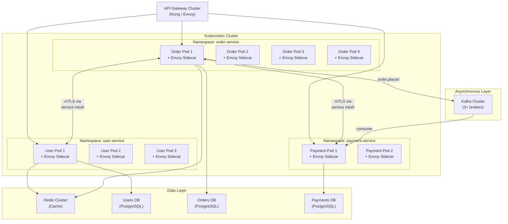
```mermaid
graph TB
    GW["API Gateway Cluster\n(Kong / Envoy)"]

    subgraph K8s["Kubernetes Cluster"]
        subgraph NS1["Namespace: user-service"]
            US1["User Pod 1\n+ Envoy Sidecar"]
            US2["User Pod 2\n+ Envoy Sidecar"]
            US3["User Pod 3\n+ Envoy Sidecar"]
        end
        subgraph NS2["Namespace: order-service"]
            OS1["Order Pod 1\n+ Envoy Sidecar"]
            OS2["Order Pod 2\n+ Envoy Sidecar"]
            OS3["Order Pod 3\n+ Envoy Sidecar"]
            OS4["Order Pod 4\n+ Envoy Sidecar"]
        end
        subgraph NS3["Namespace: payment-service"]
            PS1["Payment Pod 1\n+ Envoy Sidecar"]
            PS2["Payment Pod 2\n+ Envoy Sidecar"]
        end
    end

    GW --> US1
    GW --> OS1
    GW --> PS1

    OS1 <--> |"mTLS via\nservice mesh"| PS1
    OS1 <--> |"mTLS via\nservice mesh"| US1

    subgraph Async["Asynchronous Layer"]
        KAFKA["Kafka Cluster\n(3+ brokers)"]
    end

    OS1 -->|"order.placed"| KAFKA
    KAFKA -->|"consume"| PS1

    subgraph Data["Data Layer"]
        REDIS["Redis Cluster\n(Cache)"]
        UDB["Users DB\n(PostgreSQL)"]
        ODB["Orders DB\n(PostgreSQL)"]
        PDB["Payments DB\n(PostgreSQL)"]
    end

    US1 --> REDIS
    US1 --> UDB
    OS1 --> REDIS
    OS1 --> ODB
    PS1 --> PDB
```

### Service Mesh (Istio / Linkerd)

Every pod has an **Envoy sidecar proxy** injected alongside the application container. All inbound and outbound traffic flows through this sidecar. The service mesh provides:

|Feature|What it does|
|---|---|
|**mTLS**|Encrypts all service-to-service traffic. Zero-trust networking.|
|**Retries**|Automatic retry with exponential backoff on transient failures.|
|**Timeouts**|Per-route timeout policies (e.g., payment calls get 5s, catalog gets 500ms).|
|**Circuit breaking**|If Order service sees 50% error rate from Payment service, stop calling it.|
|**Traffic splitting**|Send 5% of traffic to canary deployment, 95% to stable.|
|**Observability**|Every sidecar emits metrics, traces, and access logs automatically.|

**Key point**: Service-to-service communication does NOT go through the API Gateway. It goes directly through the mesh (sidecar to sidecar). The API Gateway only handles external (north-south) traffic. The mesh handles internal (east-west) traffic.

### Synchronous vs Asynchronous Communication

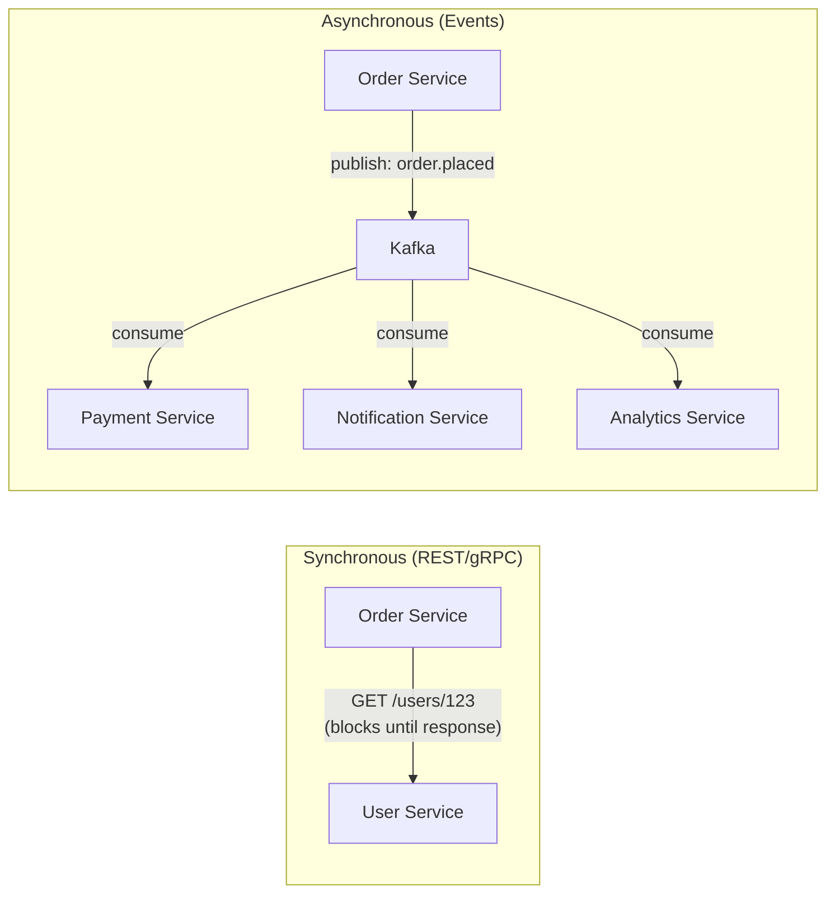
```mermaid
graph LR
    subgraph Sync["Synchronous (REST/gRPC)"]
        A["Order Service"] -->|"GET /users/123\n(blocks until response)"| B["User Service"]
    end

    subgraph Async["Asynchronous (Events)"]
        C["Order Service"] -->|"publish: order.placed"| K["Kafka"]
        K -->|"consume"| D["Payment Service"]
        K -->|"consume"| E["Notification Service"]
        K -->|"consume"| F["Analytics Service"]
    end
```

**When to use sync**: The caller needs the response to proceed. Example: Order service needs user's address from User service before creating an order.

**When to use async**: The caller doesn't need to wait. Example: After an order is placed, multiple downstream services (payment, notification, analytics) can process independently.

### Saga Pattern for Distributed Transactions

Since each service has its own database, you can't use traditional ACID transactions. The **Saga pattern** breaks a cross-service operation into a sequence of local transactions with compensating actions:

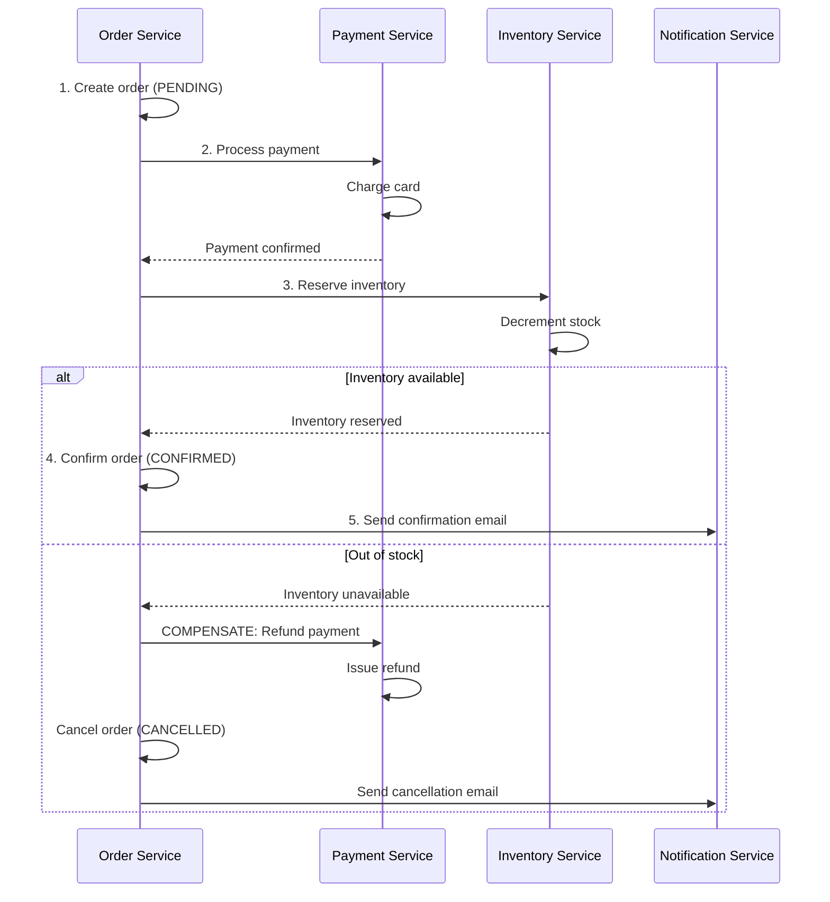
```mermaid
sequenceDiagram
    participant OS as Order Service
    participant PS as Payment Service
    participant IS as Inventory Service
    participant NS as Notification Service

    OS->>OS: 1. Create order (PENDING)
    OS->>PS: 2. Process payment
    PS->>PS: Charge card
    PS-->>OS: Payment confirmed

    OS->>IS: 3. Reserve inventory
    IS->>IS: Decrement stock

    alt Inventory available
        IS-->>OS: Inventory reserved
        OS->>OS: 4. Confirm order (CONFIRMED)
        OS->>NS: 5. Send confirmation email
    else Out of stock
        IS-->>OS: Inventory unavailable
        OS->>PS: COMPENSATE: Refund payment
        PS->>PS: Issue refund
        OS->>OS: Cancel order (CANCELLED)
        OS->>NS: Send cancellation email
    end
```

---

## 8. Database Architecture and Per-Service Data Ownership

### Database-Per-Service Pattern

Each microservice owns its database exclusively. No other service can directly access it.

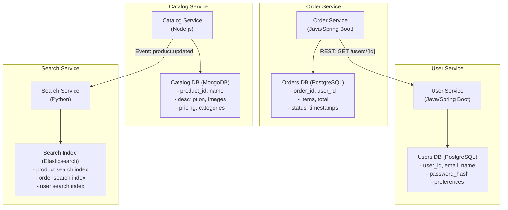
```mermaid
graph TB
    subgraph "User Service"
        US["User Service\n(Java/Spring Boot)"]
        UDB["Users DB (PostgreSQL)\n- user_id, email, name\n- password_hash\n- preferences"]
    end

    subgraph "Order Service"
        OS["Order Service\n(Java/Spring Boot)"]
        ODB["Orders DB (PostgreSQL)\n- order_id, user_id\n- items, total\n- status, timestamps"]
    end

    subgraph "Catalog Service"
        CS["Catalog Service\n(Node.js)"]
        CDB["Catalog DB (MongoDB)\n- product_id, name\n- description, images\n- pricing, categories"]
    end

    subgraph "Search Service"
        SS["Search Service\n(Python)"]
        SDB["Search Index (Elasticsearch)\n- product search index\n- order search index\n- user search index"]
    end

    US --> UDB
    OS --> ODB
    CS --> CDB
    SS --> SDB

    OS -->|"REST: GET /users/{id}"| US
    CS -->|"Event: product.updated"| SS
```

### Why Different Databases for Different Services?

|Service|Database|Reason|
|---|---|---|
|User / Order / Payment|**PostgreSQL**|ACID transactions, relational data, strong consistency|
|Catalog / Content|**MongoDB**|Flexible schema, nested documents (product variants)|
|Search|**Elasticsearch**|Full-text search, faceted filtering, fast reads|
|Session / Cache|**Redis**|Sub-millisecond reads, TTL-based expiry|
|Analytics / Events|**ClickHouse / BigQuery**|Columnar storage, fast aggregations on huge datasets|
|Time-series (metrics)|**TimescaleDB / InfluxDB**|Optimized for time-stamped write-heavy workloads|

### Read Replicas Within a Region

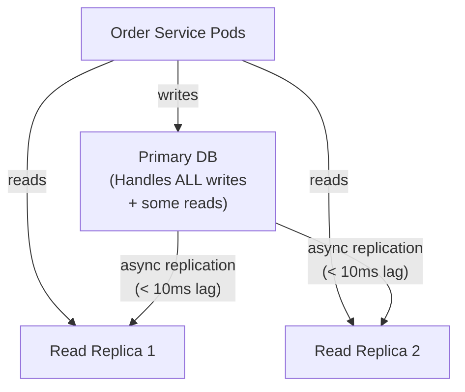
```mermaid
graph TB
    SVC["Order Service Pods"]
    PRIMARY["Primary DB\n(Handles ALL writes\n+ some reads)"]
    R1["Read Replica 1"]
    R2["Read Replica 2"]

    SVC -->|"writes"| PRIMARY
    SVC -->|"reads"| R1
    SVC -->|"reads"| R2
    PRIMARY -->|"async replication\n(< 10ms lag)"| R1
    PRIMARY -->|"async replication\n(< 10ms lag)"| R2
```

**Read-write splitting**: The application uses a connection pool that routes:

- All `INSERT/UPDATE/DELETE` → Primary
- All `SELECT` → Read replicas (round-robin)

**Read-your-own-writes**: After a user writes data, their subsequent reads are routed to the primary for a short window (e.g., 5 seconds) to avoid reading stale data from replicas.

---

## 9. Cross-Region Data Replication Strategies

This is the hardest part of global architecture. You need to balance consistency, latency, and data sovereignty.

### Pattern 1: Regional Primaries + Async Replication (Most Common)

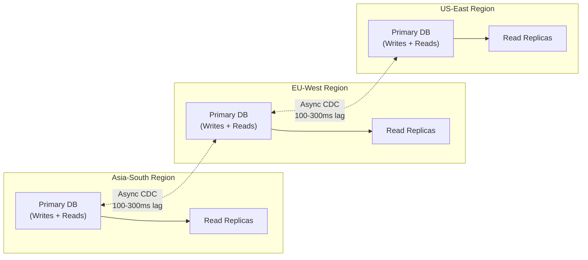
```mermaid
graph LR
    subgraph Asia["Asia-South Region"]
        A_PRIMARY["Primary DB\n(Writes + Reads)"]
        A_REPLICA["Read Replicas"]
        A_PRIMARY --> A_REPLICA
    end

    subgraph EU["EU-West Region"]
        E_PRIMARY["Primary DB\n(Writes + Reads)"]
        E_REPLICA["Read Replicas"]
        E_PRIMARY --> E_REPLICA
    end

    subgraph US["US-East Region"]
        U_PRIMARY["Primary DB\n(Writes + Reads)"]
        U_REPLICA["Read Replicas"]
        U_PRIMARY --> U_REPLICA
    end

    A_PRIMARY <-.->|"Async CDC\n100-300ms lag"| E_PRIMARY
    E_PRIMARY <-.->|"Async CDC\n100-300ms lag"| U_PRIMARY
```

**How it works**: Each region has its own primary. Writes happen locally (low latency). Changes are streamed to other regions via Change Data Capture (CDC) — tools like Debezium, AWS DMS, or custom binlog consumers.

**Tradeoff**: Eventual consistency across regions. A user writing in India may not see their data from a US endpoint for 100-300ms.

**Conflict resolution**: If two regions write to the same record simultaneously:

- **Last-write-wins (LWW)**: Timestamp-based, simple but can lose data.
- **Application-level conflict resolution**: Merge conflicting writes based on business logic.
- **CRDTs**: Conflict-free replicated data types — mathematically guaranteed to converge.

**Used by**: Netflix, Uber, most e-commerce platforms.

### Pattern 2: Globally Distributed Database (Spanner / CockroachDB)

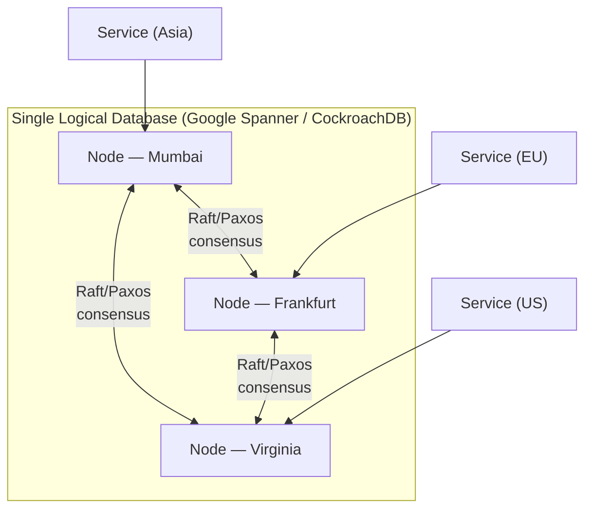
```mermaid
graph TB
    subgraph Spanner["Single Logical Database (Google Spanner / CockroachDB)"]
        N1["Node — Mumbai"]
        N2["Node — Frankfurt"]
        N3["Node — Virginia"]
        N1 <-->|"Raft/Paxos\nconsensus"| N2
        N2 <-->|"Raft/Paxos\nconsensus"| N3
        N1 <-->|"Raft/Paxos\nconsensus"| N3
    end

    S1["Service (Asia)"] --> N1
    S2["Service (EU)"] --> N2
    S3["Service (US)"] --> N3
```

**How it works**: One logical database, nodes in every region. A write requires consensus from a majority of nodes (Raft/Paxos). Google Spanner uses TrueTime (GPS + atomic clocks) for globally consistent timestamps.

**Tradeoff**: Strong consistency globally, but write latency = cross-region RTT (~150-300ms per write).

**Used by**: Google (AdWords, Play Store), financial systems requiring strong consistency.

### Pattern 3: Data Sharding by Region (Data Sovereignty)

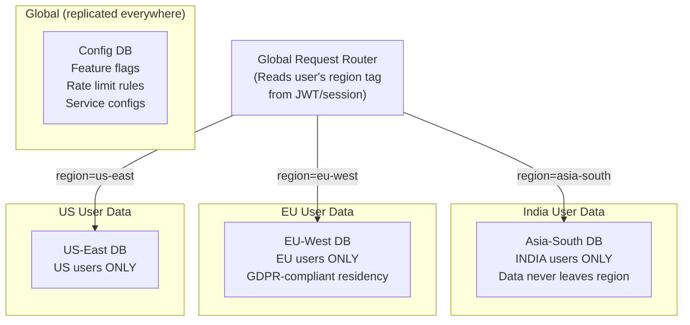
```mermaid
graph TB
    subgraph "India User Data"
        INDIA_DB["Asia-South DB\nINDIA users ONLY\nData never leaves region"]
    end
    subgraph "EU User Data"
        EU_DB["EU-West DB\nEU users ONLY\nGDPR-compliant residency"]
    end
    subgraph "US User Data"
        US_DB["US-East DB\nUS users ONLY"]
    end

    ROUTER["Global Request Router\n(Reads user's region tag\nfrom JWT/session)"]

    ROUTER -->|"region=asia-south"| INDIA_DB
    ROUTER -->|"region=eu-west"| EU_DB
    ROUTER -->|"region=us-east"| US_DB

    subgraph "Global (replicated everywhere)"
        CONFIG["Config DB\nFeature flags\nRate limit rules\nService configs"]
    end
```

**How it works**: User data is **pinned** to a region and never leaves. A Pune user's data lives exclusively in Asia-South. If a US admin needs to look up that user, the request is proxied to the Asia-South region.

**Data residency rules**:

- EU user data stays in EU (GDPR Article 44+).
- Only anonymized/aggregated data or metadata can replicate globally.
- Audit logs track every cross-region data access.

**Used by**: Stripe, Atlassian, most fintech, any company operating under GDPR/CCPA.

### Comparison Table

|Aspect|Pattern 1: Async Replication|Pattern 2: Global DB|Pattern 3: Regional Sharding|
|---|---|---|---|
|Write latency|Low (local primary)|High (cross-region consensus)|Low (local primary)|
|Read consistency|Eventual|Strong|Strong (within region)|
|Complexity|Medium|Low (DB handles it)|High (routing logic)|
|Data sovereignty|Possible but harder|Limited control|Native support|
|Conflict handling|Manual (LWW/CRDTs)|Automatic (consensus)|N/A (no conflicts)|
|Cost|Medium|High (Spanner is expensive)|Medium|
|Best for|Social media, e-commerce|Financial systems|Regulated industries|

---

## 10. Scaling Strategies — Horizontal, Vertical, and Auto

### Kubernetes Autoscaling Stack

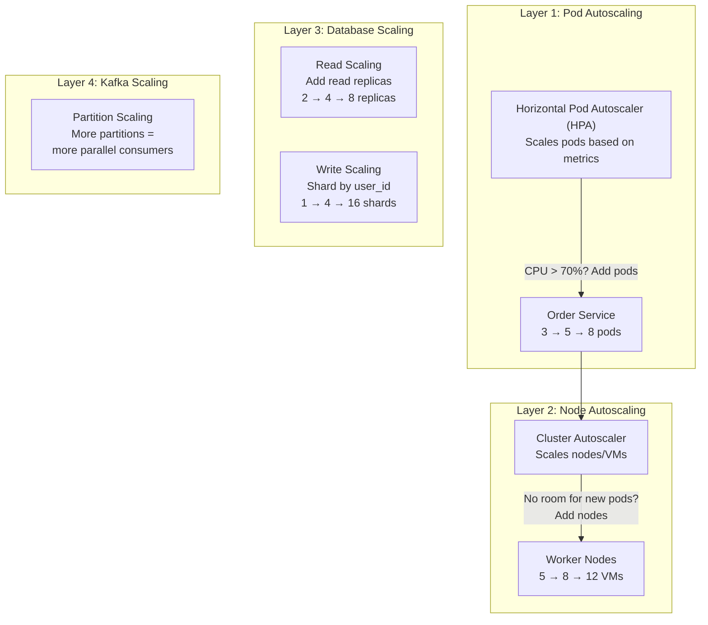
```mermaid
graph TB
    subgraph "Layer 1: Pod Autoscaling"
        HPA["Horizontal Pod Autoscaler (HPA)\nScales pods based on metrics"]
        HPA -->|"CPU > 70%? Add pods"| PODS["Order Service\n3 → 5 → 8 pods"]
    end

    subgraph "Layer 2: Node Autoscaling"
        CA["Cluster Autoscaler\nScales nodes/VMs"]
        CA -->|"No room for new pods?\nAdd nodes"| NODES["Worker Nodes\n5 → 8 → 12 VMs"]
    end

    subgraph "Layer 3: Database Scaling"
        DB_READ["Read Scaling\nAdd read replicas\n2 → 4 → 8 replicas"]
        DB_SHARD["Write Scaling\nShard by user_id\n1 → 4 → 16 shards"]
    end

    subgraph "Layer 4: Kafka Scaling"
        KAFKA_P["Partition Scaling\nMore partitions =\nmore parallel consumers"]
    end

    PODS --> CA
```

### Horizontal Pod Autoscaler (HPA)

HPA watches metrics and adjusts pod count:

```yaml
# Example HPA configuration
apiVersion: autoscaling/v2
kind: HorizontalPodAutoscaler
metadata:
  name: order-service-hpa
spec:
  scaleTargetRef:
    apiVersion: apps/v1
    kind: Deployment
    name: order-service
  minReplicas: 3
  maxReplicas: 20
  metrics:
    - type: Resource
      resource:
        name: cpu
        target:
          type: Utilization
          averageUtilization: 70
    - type: Pods
      pods:
        metric:
          name: http_requests_per_second
        target:
          type: AverageValue
          averageValue: "1000"
  behavior:
    scaleUp:
      stabilizationWindowSeconds: 60    # Wait 60s before scaling up
      policies:
        - type: Pods
          value: 4                       # Add max 4 pods per minute
          periodSeconds: 60
    scaleDown:
      stabilizationWindowSeconds: 300   # Wait 5 min before scaling down
```

### Database Scaling Strategies

**Read scaling** (simple): Add read replicas. Most apps are 90%+ reads.

**Write scaling** (complex): Shard the database.

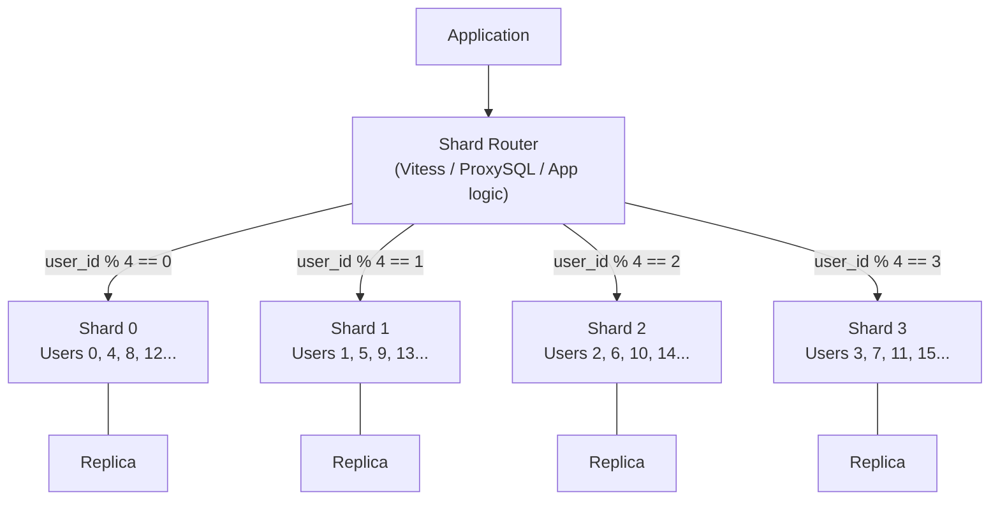
```mermaid
graph TB
    APP["Application"]
    ROUTER["Shard Router\n(Vitess / ProxySQL / App logic)"]

    APP --> ROUTER

    ROUTER -->|"user_id % 4 == 0"| S0["Shard 0\nUsers 0, 4, 8, 12..."]
    ROUTER -->|"user_id % 4 == 1"| S1["Shard 1\nUsers 1, 5, 9, 13..."]
    ROUTER -->|"user_id % 4 == 2"| S2["Shard 2\nUsers 2, 6, 10, 14..."]
    ROUTER -->|"user_id % 4 == 3"| S3["Shard 3\nUsers 3, 7, 11, 15..."]

    S0 --- S0R["Replica"]
    S1 --- S1R["Replica"]
    S2 --- S2R["Replica"]
    S3 --- S3R["Replica"]
```

**Sharding strategies**:

- **Hash-based** (`user_id % N`): Even distribution, but resharding is painful.
- **Range-based** (users 1-1M → Shard 0, 1M-2M → Shard 1): Easy to add shards, but hot spots if recent users are more active.
- **Directory-based**: A lookup table maps each user to a shard. Most flexible but adds a lookup hop.

**Tools**: Vitess (used by YouTube, Slack), Citus (PostgreSQL extension), CockroachDB (auto-sharding).

### Kafka Scaling

- More **partitions** = more parallel consumers (up to 1 consumer per partition per consumer group).
- More **brokers** = more storage and throughput.
- **Topic compaction** for state snapshots (keep only latest value per key).

---

## 11. Disaster Recovery and Failover

### Multi-Region Failover Architecture

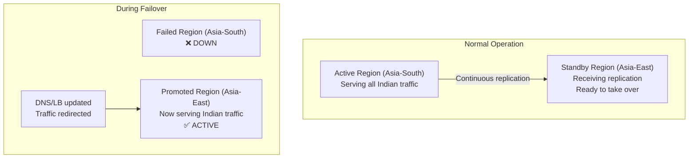
```mermaid
graph TB
    subgraph "Normal Operation"
        ACTIVE["Active Region (Asia-South)\nServing all Indian traffic"]
        STANDBY["Standby Region (Asia-East)\nReceiving replication\nReady to take over"]
        ACTIVE -->|"Continuous replication"| STANDBY
    end

    subgraph "During Failover"
        FAILED["Failed Region (Asia-South)\n❌ DOWN"]
        PROMOTED["Promoted Region (Asia-East)\nNow serving Indian traffic\n✅ ACTIVE"]
        DNS_UPDATE["DNS/LB updated\nTraffic redirected"]
        DNS_UPDATE --> PROMOTED
    end
```

### Recovery Strategies

|Strategy|RPO|RTO|Cost|Description|
|---|---|---|---|---|
|**Active-Active**|0 (eventual)|< 1 min|Highest|All regions serve traffic. Failover = stop routing to dead region.|
|**Active-Passive (hot standby)**|< 1 min|5-15 min|High|Standby receives replication, promoted on failure.|
|**Active-Passive (warm standby)**|< 5 min|15-30 min|Medium|Standby has infra but needs DB promotion + scaling.|
|**Backup & Restore**|Hours|Hours|Low|Restore from backups. Acceptable for non-critical services.|

**RPO** = Recovery Point Objective (how much data can you lose) **RTO** = Recovery Time Objective (how long until you're back up)

### What Triggers a Failover

1. **Health check failures**: Regional LB detects all instances unhealthy.
2. **Manual trigger**: On-call engineer initiates failover via runbook.
3. **Automated**: System detects sustained error rate > threshold for N minutes.

**Critical**: Automated failover needs a **split-brain prevention** mechanism. If the "dead" region is actually just network-partitioned, you can end up with two active primaries writing to the same data. Solutions: use a consensus quorum (3 regions, majority needed to be "active"), or a global lock service.

---

## 12. Observability Across Regions

### The Three Pillars

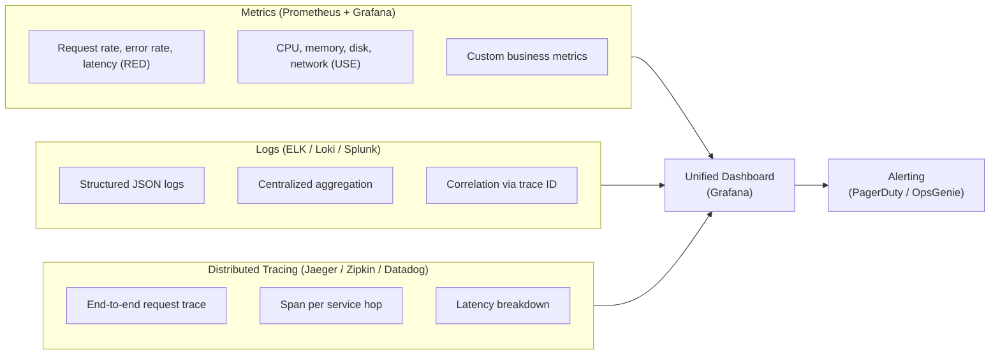
```mermaid
graph LR
    subgraph Metrics["Metrics (Prometheus + Grafana)"]
        M1["Request rate, error rate, latency (RED)"]
        M2["CPU, memory, disk, network (USE)"]
        M3["Custom business metrics"]
    end

    subgraph Logs["Logs (ELK / Loki / Splunk)"]
        L1["Structured JSON logs"]
        L2["Centralized aggregation"]
        L3["Correlation via trace ID"]
    end

    subgraph Traces["Distributed Tracing (Jaeger / Zipkin / Datadog)"]
        T1["End-to-end request trace"]
        T2["Span per service hop"]
        T3["Latency breakdown"]
    end

    Metrics --> DASH["Unified Dashboard\n(Grafana)"]
    Logs --> DASH
    Traces --> DASH
    DASH --> ALERT["Alerting\n(PagerDuty / OpsGenie)"]
```

### Key Metrics to Monitor Per Region

|Metric|Formula|Alert Threshold|
|---|---|---|
|Error rate|5xx responses / total requests|> 1% for 5 min|
|P99 latency|99th percentile response time|> 500ms for 5 min|
|Replication lag|Time since last replicated write|> 5 seconds|
|Pod restarts|Container restart count|> 3 in 10 min|
|Kafka consumer lag|Messages produced - messages consumed|> 10,000 messages|
|DB connection pool|Active / max connections|> 80% utilization|

### Cross-Region Tracing

A single user request might span multiple regions (e.g., a US admin querying an Indian user's data). Distributed tracing propagates a `trace-id` header across all hops:

```
trace-id: abc123
├── span: API Gateway (Mumbai) — 2ms
├── span: Order Service (Mumbai) — 15ms
│   ├── span: Redis Cache (Mumbai) — 0.5ms (MISS)
│   └── span: Orders DB (Mumbai) — 8ms
├── span: User Service (Mumbai) — 12ms
│   └── span: Users DB (Mumbai) — 6ms
└── total: 29ms
```

---

## 13. Complete Request Lifecycle — End to End

Here's what happens when a user in Pune clicks "Place Order":

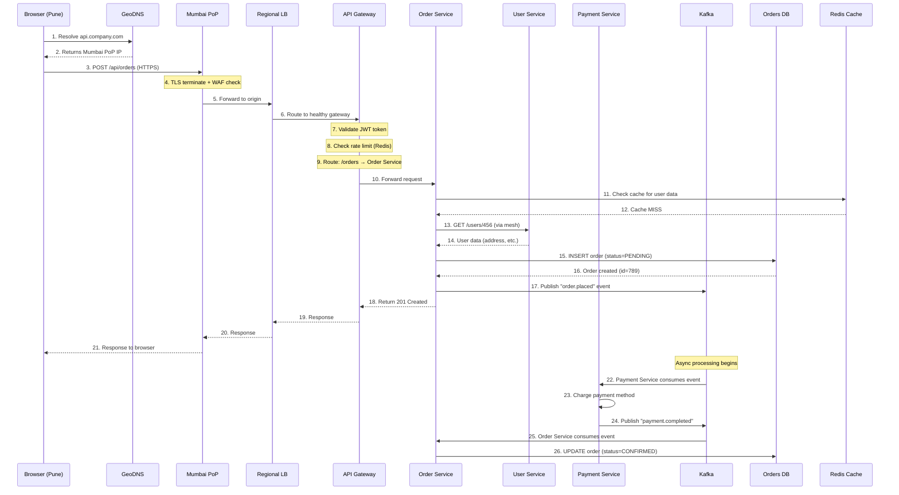
```mermaid
sequenceDiagram
    participant B as Browser (Pune)
    participant DNS as GeoDNS
    participant PoP as Mumbai PoP
    participant LB as Regional LB
    participant GW as API Gateway
    participant OS as Order Service
    participant US as User Service
    participant PS as Payment Service
    participant K as Kafka
    participant DB as Orders DB
    participant R as Redis Cache

    B->>DNS: 1. Resolve api.company.com
    DNS-->>B: 2. Returns Mumbai PoP IP

    B->>PoP: 3. POST /api/orders (HTTPS)
    Note over PoP: 4. TLS terminate + WAF check

    PoP->>LB: 5. Forward to origin
    LB->>GW: 6. Route to healthy gateway

    Note over GW: 7. Validate JWT token
    Note over GW: 8. Check rate limit (Redis)
    Note over GW: 9. Route: /orders → Order Service

    GW->>OS: 10. Forward request
    OS->>R: 11. Check cache for user data
    R-->>OS: 12. Cache MISS

    OS->>US: 13. GET /users/456 (via mesh)
    US-->>OS: 14. User data (address, etc.)

    OS->>DB: 15. INSERT order (status=PENDING)
    DB-->>OS: 16. Order created (id=789)

    OS->>K: 17. Publish "order.placed" event
    OS-->>GW: 18. Return 201 Created
    GW-->>LB: 19. Response
    LB-->>PoP: 20. Response
    PoP-->>B: 21. Response to browser

    Note over K: Async processing begins
    K->>PS: 22. Payment Service consumes event
    PS->>PS: 23. Charge payment method
    PS->>K: 24. Publish "payment.completed"
    K->>OS: 25. Order Service consumes event
    OS->>DB: 26. UPDATE order (status=CONFIRMED)
```

### Latency Breakdown

|Step|Latency|Cumulative|
|---|---|---|
|DNS resolution (cached)|1-5ms|5ms|
|TLS handshake at PoP|10-30ms|35ms|
|PoP → Regional LB|5-15ms|50ms|
|API Gateway processing|1-5ms|55ms|
|Order Service → User Service (mesh)|5-10ms|65ms|
|Database write|5-15ms|80ms|
|Kafka publish|2-5ms|85ms|
|Response return path|20-40ms|120ms|
|**Total (user-perceived)**|**~100-150ms**||

The async steps (payment processing, order confirmation) happen after the response is sent to the user. The user sees "Order Placed" immediately, and the order status updates to "Confirmed" asynchronously.

---

## Summary — Typical Production Stack

|Layer|Technology|Purpose|
|---|---|---|
|DNS|Route 53 / Cloudflare DNS|GeoDNS routing to nearest PoP|
|Edge/CDN|CloudFront / Cloudflare / Akamai|TLS, caching, WAF, DDoS|
|Regional LB|AWS NLB/ALB / GCP Cloud LB|Distribute across API Gateway instances|
|API Gateway|Kong / Envoy / AWS API GW|Auth, rate limiting, routing|
|Container Orchestration|Kubernetes (EKS/GKE/AKS)|Pod scheduling, scaling, health|
|Service Mesh|Istio / Linkerd|mTLS, retries, circuit breaking|
|Async Messaging|Kafka / SQS / Pub/Sub|Event-driven communication|
|Cache|Redis Cluster|Sub-ms reads, rate limit counters, sessions|
|Primary DB|PostgreSQL / MySQL|ACID writes, transactional data|
|Document DB|MongoDB|Flexible schema (catalog, content)|
|Search|Elasticsearch|Full-text search, analytics|
|Observability|Prometheus + Grafana + Jaeger|Metrics, dashboards, tracing|
|Alerting|PagerDuty / OpsGenie|Incident response|
|CI/CD|ArgoCD / Flux / GitHub Actions|GitOps deployment across regions|
|Secrets|HashiCorp Vault|Secrets management, rotation|
|Feature Flags|LaunchDarkly / Unleash|Regional feature rollouts|

---

_This guide covers the production patterns used by companies like Netflix, Uber, Stripe, Google, and Amazon for managing global users with low latency, high availability, and data sovereignty compliance._