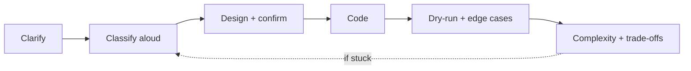

# Interview Execution Playbook

> How to spend 35 minutes so that a correct solution actually reads as a hire.

## Why It Matters

Two candidates produce the same working code. One passes, one fails. The difference is process: clarification, stated complexity, tested edge cases, and audible reasoning.

## The Time Map

| Phase | Time | What you do |
|---|---|---|
| Clarify | 2–3 min | Restate, ask about constraints, edge cases, input validity |
| Classify | 2–3 min | State constraint → complexity → pattern out loud |
| Design | 3–5 min | Describe approach and data structures before coding |
| Code | 15–18 min | Write clean, named, decomposed code |
| Test | 4–5 min | Dry-run on a small case, then edge cases |
| Optimise | 2–3 min | Discuss improvements or trade-offs |

## Phase 1 — Clarify

Ask these, always:

- What are the input size bounds?
- Can the input be empty or null?
- Are there duplicates? Negatives? Is it sorted?
- Is there a unique answer, or do I return any valid one?
- Can I modify the input in place?

**Never** skip this to look fast. Silence here reads as not thinking.

## Phase 2 — Classify Out Loud

> "n is up to 10⁵, so I need O(n log n) or better. The problem asks for the longest contiguous segment satisfying a constraint — that's a sliding window. I'll track counts in a hash map."

This one sentence signals more competence than 20 lines of correct code.

## Phase 3 — Design Before Coding

State: the data structures, the invariant, and the loop shape. Get a nod from the interviewer before you type. If they push back, you've saved 15 minutes.

## Phase 4 — Code Cleanly

- Meaningful names: `left`/`right`, not `i`/`j`, when they mean window bounds.
- Extract helpers rather than nesting four levels deep.
- Handle the edge case at the top (`if (arr == null || arr.length == 0) return ...`).
- Narrate briefly as you go, but don't give a running monologue of syntax.

## Phase 5 — Test Deliberately

Run your code on:

1. A normal case (dry-run by hand, tracking variables)
2. Empty / single element
3. All identical elements
4. Maximum and minimum values (overflow)
5. The case your invariant is most fragile on

**Do this without being asked.** Volunteering tests is a strong signal.

## Phase 6 — State Complexity and Trade-offs

> "Time is O(n) because each element enters and leaves the window once. Space is O(k) for the map, where k is the distinct character count — bounded by 26 here, so effectively O(1). If memory were tighter I could use a fixed array instead of a map."

## Visual Diagram

## When You Are Stuck

1. Say so, briefly and without panic: "Let me think about a simpler version."
2. Solve the brute force first, out loud. State its complexity.
3. Identify the specific bottleneck in the brute force.
4. Ask: what structure removes *that* bottleneck? (Repeated lookup → hash; repeated min → heap; repeated range sum → prefix.)
5. Take the hint if offered. Refusing hints is a negative signal, not a positive one.

## Common Mistakes

- Coding in silence for ten minutes.
- Starting to code before confirming the approach.
- Skipping edge cases and only finding bugs when the interviewer points them out.
- Optimising prematurely instead of getting a working solution first.
- Arguing when the interviewer suggests a different direction.
- Claiming a complexity you haven't verified.

## Related Topics

- [Pattern Recognition Framework](Pattern%20Recognition%20Framework.md)
- [Complexity Analysis](Complexity%20Analysis.md)
- [DSA Interview Checklist](../../Interview%20Checklists/DSA%20Interview%20Checklist.md)

## Revision Summary

Clarify, classify aloud, design, code, test unprompted, state complexity. The process is worth as much as the solution.

## Quick Recall

- 3 min clarify, 3 min classify, 5 min design, 18 min code, 5 min test
- Always state constraint → complexity → pattern
- Volunteer edge cases before being asked
- Brute force first, then name the bottleneck
