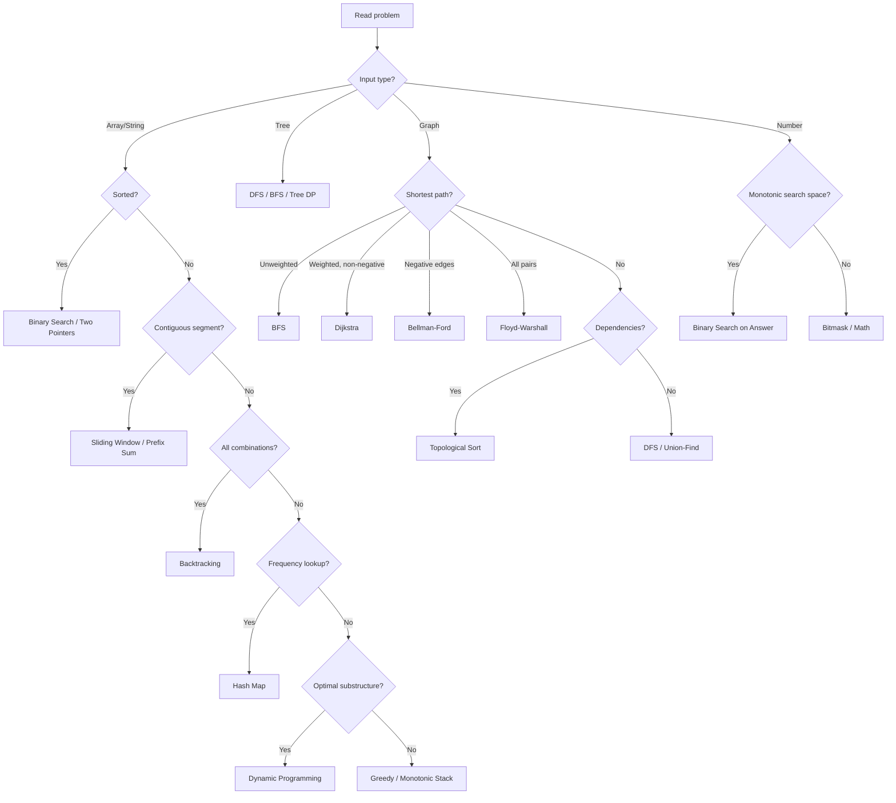

# Pattern Recognition Framework

> The single highest-leverage DSA skill: converting a problem statement into a pattern in under 60 seconds.

## Why It Matters

Interviewers give you ~35 minutes. If you spend 15 flailing for an approach, you lose. Strong candidates classify first, then code. Classification is a learnable, mechanical skill.

## Core Idea

Every problem gives you three free signals before you think at all:

1. **Input shape** — array, string, tree, graph, number
2. **Constraint size** — tells you the allowed complexity, which eliminates most patterns
3. **Signal words** — "shortest", "contiguous", "all combinations" map near-deterministically to patterns

## The 4-Step Detection Process

| Step | Question | What it eliminates |
|---|---|---|
| 1. Strip the story | What am I actually computing? | Narrative noise |
| 2. Read constraints | What complexity is allowed? | ~70% of patterns |
| 3. Spot signal words | Which keywords appear? | Narrows to 1–3 candidates |
| 4. Match transformation | Input → output relationship | Picks the winner |

## Constraint → Complexity Table

**Memorize this. It is the fastest filter you have.**

| n | Max complexity | Likely patterns |
|---|---|---|
| ≤ 10 | O(n!) | Backtracking, permutations |
| ≤ 20 | O(2ⁿ) | Bitmask DP, subset generation |
| ≤ 100 | O(n³) | Floyd–Warshall, 3-state DP |
| ≤ 1,000 | O(n²) | 2D DP, nested loops |
| ≤ 10,000 | O(n² log n) | Sort + nested loop |
| ≤ 100,000 | O(n log n) | Sort, heap, binary search |
| ≤ 1,000,000 | O(n) | Hash map, two pointers, sliding window |
| ≤ 10⁹ | O(log n) / O(1) | Binary search on answer, math |

**Interview move:** say this out loud. "n is 10⁵, so I need n log n or better — that rules out the O(n²) DP." Interviewers score this reasoning.

## Signal Word → Pattern Map

| Signal word | Pattern(s) |
|---|---|
| minimum / maximum | DP, greedy, binary search on answer, heap |
| shortest | BFS (unweighted), Dijkstra (weighted) |
| longest | DP, sliding window, two pointers |
| number of ways | DP, combinatorics |
| subarray (contiguous) | Sliding window, prefix sum, Kadane |
| subsequence (non-contiguous) | DP, two pointers |
| pair / triplet | Two pointers, hash map |
| kth largest / smallest | Heap, quickselect |
| sorted | Binary search, two pointers |
| intervals / overlapping | Sort + sweep, heap |
| parentheses / brackets | Stack |
| next greater / smaller | Monotonic stack |
| prefix | Trie, prefix sum |
| connected / island | DFS, BFS, union-find |
| cycle | DFS colours (graph), fast-slow (list) |
| dependencies / prerequisites | Topological sort |
| range query | Prefix sum, segment tree |
| minimize the maximum | Binary search on answer |

## Visual Diagram

## Interview Explanation

> "First I look at the constraints — n up to 10⁵ means I need O(n log n). The problem says 'longest substring', and substring implies contiguous, which points at a sliding window. I need to track character counts inside the window, so I'll pair it with a hash map. Let me confirm the window is expandable-and-shrinkable rather than fixed-size."

That is the whole move: constraints → signal word → pattern → data structure → confirm variant.

## Common Mistakes

- **Jumping to code before classifying.** The most common failure mode.
- **Ignoring constraints.** They are handed to you and they eliminate most of the search space.
- **Confusing subarray with subsequence.** Contiguous vs not. Completely different pattern families.
- **Reaching for DP when greedy works.** Try to prove the greedy choice property first; it's much faster to implement.
- **Not saying your reasoning aloud.** Silent classification earns you no signal.

## Related Topics

- [Pattern Confusion Matrix](Pattern%20Confusion%20Matrix.md)
- [Complexity Analysis](Complexity%20Analysis.md)
- [Interview Execution Playbook](Interview%20Execution%20Playbook.md)
- [DSA Cheat Sheet](../../Cheat%20Sheets/DSA%20Cheat%20Sheet.md)

## Revision Summary

Classification is mechanical: constraints eliminate, signal words nominate, transformation decides. Train it separately from coding — read problems and classify without solving.

## Quick Recall

- n ≤ 20 → exponential OK → bitmask/backtracking
- n ≤ 10⁵ → n log n → sort/heap/binary search
- "contiguous" → sliding window; "non-contiguous" → DP
- "shortest" unweighted → BFS; weighted → Dijkstra
- "kth" → heap or quickselect
