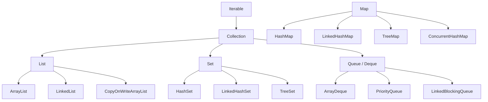

# Collections Overview

## Why It Matters

Picking the right collection is a design decision interviewers watch closely, in both coding and LLD rounds.

## The Hierarchy



**`Map` is not a `Collection`** — a common trick question.

## Selection Table

| Need | Use |
|---|---|
| Indexed access, iteration | `ArrayList` |
| Frequent insert/delete at both ends | `ArrayDeque` |
| Uniqueness, no order | `HashSet` |
| Uniqueness, insertion order | `LinkedHashSet` |
| Uniqueness, sorted / range queries | `TreeSet` |
| Key-value, no order | `HashMap` |
| Key-value, access order (LRU) | `LinkedHashMap` |
| Key-value, sorted / floor / ceiling | `TreeMap` |
| Stack | `ArrayDeque` (**not** `Stack`) |
| Queue | `ArrayDeque` (**not** `LinkedList`) |
| Priority ordering | `PriorityQueue` |
| Thread-safe map | `ConcurrentHashMap` |
| Producer-consumer handoff | `LinkedBlockingQueue` / `ArrayBlockingQueue` |
| Many reads, rare writes, concurrent | `CopyOnWriteArrayList` |

## ArrayList vs LinkedList

| | ArrayList | LinkedList |
|---|---|---|
| get(i) | **O(1)** | O(n) |
| add(end) | O(1) amortised | O(1) |
| add/remove(middle) | O(n) | O(1) *given the node*, O(n) to find it |
| Memory | Compact | 3 refs + object header per element |
| Cache locality | **Excellent** | Poor |

**Use `ArrayList` by default.** `LinkedList` looks better on paper for insertions but is almost always slower in practice because of cache misses and allocation overhead. Its real use is as a `Deque` — and `ArrayDeque` beats it there too.

## ArrayDeque vs Stack vs LinkedList

- **`Stack`** extends `Vector`, is synchronised on every operation, and iterates in the wrong order. **Legacy — do not use.**
- **`ArrayDeque`** is a circular array: faster than both, no synchronisation overhead, no null elements.

```java
Deque<Integer> stack = new ArrayDeque<>();
stack.push(x); stack.pop(); stack.peek();

Deque<Integer> queue = new ArrayDeque<>();
queue.offer(x); queue.poll(); queue.peek();
```

## TreeMap — The Underused One

`TreeMap`/`TreeSet` give **range queries** that hash structures cannot:

| Method | Returns |
|---|---|
| `floorKey(k)` | Greatest key ≤ k |
| `ceilingKey(k)` | Smallest key ≥ k |
| `higherKey(k)` / `lowerKey(k)` | Strict versions |
| `subMap(from, to)` | View of a range |
| `firstKey()` / `lastKey()` | Extremes |

This makes `TreeMap` the answer for calendar booking, stock price tracking, and "ordered multiset with deletion" problems where a heap can't remove arbitrary elements.

**Ordered multiset idiom:**
```java
TreeMap<Integer, Integer> counts = new TreeMap<>();
counts.merge(x, 1, Integer::sum);                       // add
if (counts.merge(x, -1, Integer::sum) == 0) counts.remove(x);   // remove
int max = counts.lastKey();
```

## Fail-Fast Iterators

Most collections track a `modCount`. Structural modification during iteration throws `ConcurrentModificationException` — even single-threaded.

```java
for (String s : list) if (s.isEmpty()) list.remove(s);   // throws

list.removeIf(String::isEmpty);                          // correct
Iterator<String> it = list.iterator();                   // also correct
while (it.hasNext()) if (it.next().isEmpty()) it.remove();
```

`CopyOnWriteArrayList` and `ConcurrentHashMap` are **fail-safe** — they iterate a snapshot and never throw, at the cost of possibly stale data.

## Null Handling

| Collection | Null key | Null values |
|---|---|---|
| HashMap | One | Yes |
| TreeMap | **No** (needs comparison) | Yes |
| ConcurrentHashMap | **No** | **No** |
| ArrayList | — | Yes |
| ArrayDeque | — | **No** |

**Why ConcurrentHashMap forbids null:** `map.get(k) == null` would be ambiguous — absent, or present with a null value? In a concurrent map you can't disambiguate with `containsKey` without a race.

## Common Mistakes

- Using `LinkedList` expecting fast insertion — you still pay O(n) to reach the position
- Using `Stack` or `Vector` in new code
- Modifying a collection during a for-each loop
- `Arrays.asList()` returning a **fixed-size** view — `add` throws `UnsupportedOperationException`
- `List.of()` / `Map.of()` returning **immutable** collections that also reject nulls

## Related Topics

- [HashMap Internals](HashMap%20Internals.md)
- [Concurrent Collections](../Concurrency/Concurrent%20Collections.md)
- [Sorting Algorithms](../../01%20DSA/Sorting%20and%20Selection/Sorting%20Algorithms.md)

## Revision Summary

ArrayList by default; ArrayDeque for stacks and queues; TreeMap when you need ordering or range queries; ConcurrentHashMap for concurrency. Map is not a Collection. Fail-fast iterators throw on structural modification.

## Quick Recall

- Never use `Stack`, `Vector`, or `Hashtable`
- `ArrayDeque` for both stack and queue
- `TreeMap.floorKey/ceilingKey` for range queries
- `removeIf` instead of removing during iteration
- ConcurrentHashMap allows no nulls
