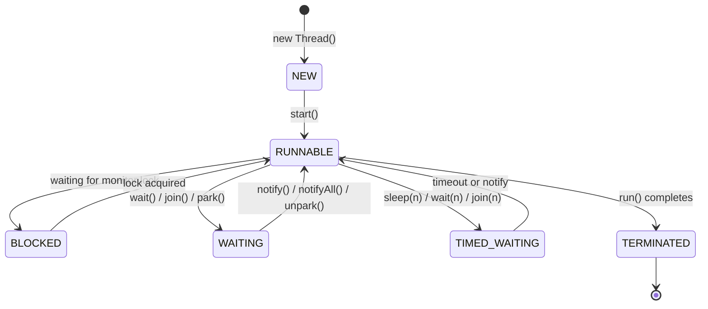

# Threads and Lifecycle

## Why It Matters

The foundation for every other concurrency topic, and the source of the most common warm-up questions.

## Thread States



| State | Meaning |
|---|---|
| NEW | Created, not started |
| RUNNABLE | Running or ready to run (Java doesn't distinguish) |
| BLOCKED | Waiting to acquire a **monitor lock** |
| WAITING | Waiting indefinitely for another thread's action |
| TIMED_WAITING | Waiting with a timeout |
| TERMINATED | Finished |

**BLOCKED vs WAITING is a favourite question:** BLOCKED means contending for a `synchronized` monitor; WAITING means voluntarily suspended via `wait()`, `join()`, or `LockSupport.park()`.

## start() vs run()

```java
t.run();     // runs in the CURRENT thread — no concurrency at all
t.start();   // creates a new OS thread, which then calls run()
```

Calling `start()` twice throws `IllegalThreadStateException` — a thread is not restartable.

## Runnable vs Callable

| | Runnable | Callable\<V\> |
|---|---|---|
| Method | `void run()` | `V call() throws Exception` |
| Returns a value | No | **Yes** |
| Can throw checked exceptions | No | **Yes** |
| Submit to executor | `execute` or `submit` | `submit` only |

`Callable` is nearly always the better choice with an executor, because exceptions are captured in the `Future` rather than silently killing the thread.

## Stopping Threads Correctly

`Thread.stop()` is deprecated and dangerous — it releases all locks instantly, leaving shared state corrupted.

**Use interruption**, which is cooperative:

```java
while (!Thread.currentThread().isInterrupted()) {
    try {
        doWork();
        Thread.sleep(100);
    } catch (InterruptedException e) {
        Thread.currentThread().interrupt();   // RESTORE the flag
        break;
    }
}
```

**Catching `InterruptedException` clears the interrupt flag.** If you swallow it without restoring, higher layers never learn the thread was asked to stop. Either restore the flag or propagate the exception — never swallow it.

## Daemon Threads

```java
t.setDaemon(true);   // must be set BEFORE start()
```

The JVM exits when only daemon threads remain. Use for background housekeeping. **Daemon threads are killed abruptly** — never use them for work that must complete or that holds resources.

## Thread Priorities

`setPriority(1..10)` is a hint mapped to OS priorities, and is inconsistent across platforms. **Never build correctness on priority.** Mention this if asked — the expected answer is that it's unreliable.

## ThreadLocal

Per-thread storage, used for request context, `SimpleDateFormat` instances, and transaction state.

```java
private static final ThreadLocal<SimpleDateFormat> FMT =
    ThreadLocal.withInitial(() -> new SimpleDateFormat("yyyy-MM-dd"));
```

**The pooled-thread leak:** in a thread pool, threads are reused indefinitely. A ThreadLocal value set during one request persists into the next, leaking memory and potentially leaking data across requests.

```java
try { CONTEXT.set(value); doWork(); }
finally { CONTEXT.remove(); }   // ALWAYS
```

`ThreadLocalMap` uses weak keys but **strong values**, so the value survives until the entry is cleaned — hence the mandatory `remove()`.

## Virtual Threads (Java 21+)

Lightweight threads scheduled by the JVM onto a small pool of carrier threads. Millions can exist concurrently.

```java
try (var executor = Executors.newVirtualThreadPerTaskExecutor()) {
    executor.submit(() -> blockingIoCall());
}
```

- Blocking a virtual thread **unmounts** it from its carrier rather than blocking an OS thread — so the thread-per-request model scales again
- Best for **I/O-bound** work; no benefit for CPU-bound work
- **Do not pool them** — they're cheap to create; pooling defeats the purpose
- **`synchronized` blocks can pin** a virtual thread to its carrier; prefer `ReentrantLock` in virtual-thread code

Worth raising in any modern Java interview.

## Common Mistakes

- Calling `run()` instead of `start()`
- Swallowing `InterruptedException` without restoring the flag
- Setting daemon status after `start()` (throws)
- Not calling `ThreadLocal.remove()` in a pooled environment
- Relying on thread priority for correctness

## Related Topics

- [Synchronisation and Locks](Synchronisation%20and%20Locks.md)
- [Executors and Thread Pools](Executors%20and%20Thread%20Pools.md)
- [Java Memory Model](../JVM%20and%20Memory/Java%20Memory%20Model.md)

## Revision Summary

Six states; BLOCKED is monitor contention, WAITING is voluntary. Interruption is cooperative — always restore the flag. ThreadLocal must be removed in pooled threads. Virtual threads make blocking I/O cheap again.

## Quick Recall

- `start()` creates a thread; `run()` does not
- BLOCKED = monitor lock; WAITING = wait/join/park
- Catching InterruptedException clears the flag — restore it
- `ThreadLocal.remove()` in a `finally`
- Virtual threads for I/O, not CPU; don't pool them
