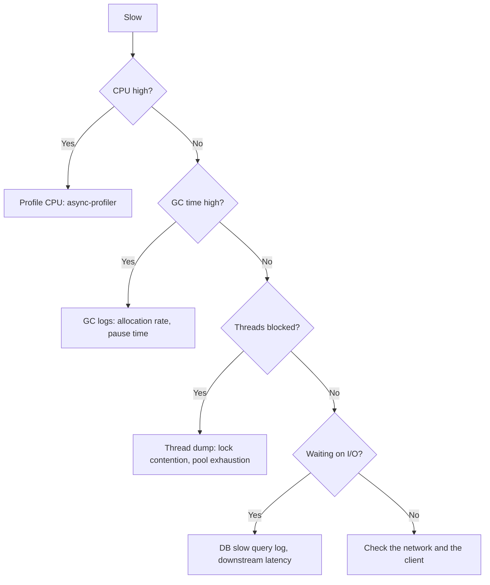

# Performance Tuning and Profiling

## Why It Matters

"The service is slow" is a real interview question. The answer is a diagnostic method, not a list of flags.

## The Method

**Measure → find the bottleneck → fix that one thing → measure again.**

Everything below is subordinate to this. Optimising without measuring is the primary failure, and interviewers listen for whether you start with data.

## Where To Look First



**In practice, the vast majority of "slow Java service" problems are: a missing database index, an N+1 query, a saturated thread pool, or GC pressure from excessive allocation.** Check those four before touching JVM flags.

## Tools

| Tool | Use |
|---|---|
| **async-profiler** | **Low-overhead CPU and allocation flame graphs — the first tool to reach for** |
| **JFR (Java Flight Recorder)** | Built in, always-on capable, very low overhead |
| **jcmd** | Thread dumps, heap dumps, GC stats, VM flags |
| jstack | Thread dumps — deadlock detection |
| **Eclipse MAT** | Heap dump analysis — dominator tree finds leaks |
| VisualVM / JMC | GUI monitoring |
| **JMH** | **The only correct way to microbenchmark** |
| Micrometer + Prometheus | Production metrics |

**JFR is the production answer:** `-XX:StartFlightRecording=duration=60s,filename=rec.jfr` runs with roughly 1% overhead, so you can profile a live service.

**Flame graphs are the single most useful artefact** — width is time spent, and the widest plateau is your bottleneck. Reading one takes thirty seconds.

## Diagnosing By Symptom

| Symptom | Likely cause | Check |
|---|---|---|
| High CPU, low throughput | Hot loop, or GC thrash | Flame graph; GC time percentage |
| **p99 spikes, p50 fine** | **GC pauses**, or lock contention, or **CFS throttling** | GC log; thread dump; container throttling metric |
| Latency grows with load | Queue or pool saturation | Pool metrics, queue depth |
| Memory grows steadily | **Leak** | Heap dump, MAT dominator tree |
| `OutOfMemoryError: heap` | Leak or undersized heap | Heap dump |
| `OOMKilled` (exit 137) | **Container limit exceeded — not a Java OOM** | Non-heap memory accounting |
| Slow only after deploy | JIT warm-up | Expected; measure after warm-up |
| Sudden regression, no code change | Data volume growth crossed an index threshold | Query plans |

**p99 spikes with a healthy p50 is the classic GC or throttling signature.** Averages hide it entirely — which is why you always look at percentiles.

## GC Tuning

**Tune allocation before tuning the collector.** Most GC problems are allocation-rate problems.

| Symptom | Action |
|---|---|
| Frequent minor GCs | Reduce allocation; consider a larger young generation |
| Frequent full GCs | Look for a leak; check for promotion pressure |
| Long pauses | Switch collector: G1 → ZGC/Shenandoah |
| `GC overhead limit exceeded` | Real leak, or badly undersized heap |

```
-Xms4g -Xmx4g                          # equal — avoids resize pauses
-XX:+UseG1GC
-XX:MaxGCPauseMillis=200
-XX:+HeapDumpOnOutOfMemoryError
-XX:HeapDumpPath=/dumps
-Xlog:gc*:file=gc.log:time,uptime:filecount=5,filesize=10M
```

**Setting `MaxGCPauseMillis` too low is counterproductive** — G1 shrinks the young generation to meet the target, causing more frequent collections and lower throughput.

**Always enable `HeapDumpOnOutOfMemoryError`.** Without a dump, an OOM in production is unanalysable and you'll wait for it to recur.

## Container Memory

```
container limit = heap + metaspace + thread stacks + direct buffers + code cache + native
```

**Setting `-Xmx` equal to the container limit guarantees an eventual `OOMKilled`.** Leave 20–25% headroom, or use `-XX:MaxRAMPercentage=75`.

**Exit code 137 is the kernel killing the process; a Java `OutOfMemoryError` is the JVM failing inside its heap.** Different causes, different fixes — confusing them wastes hours.

## Finding Memory Leaks

1. Confirm growth: old-generation occupancy rises after each **full** GC
2. Take a heap dump
3. Open in MAT → **dominator tree** shows what retains the most memory
4. Trace the **path to GC root** — that's the reference keeping it alive

**The usual culprits:**

| Leak | Cause |
|---|---|
| Static collections | Grow forever, never cleared |
| **`ThreadLocal` in a pool** | Thread outlives the request; value never removed |
| Unclosed resources | Streams, connections |
| Listeners never unregistered | The [Observer](../../03%20Low%20Level%20Design/Design%20Patterns/Behavioural/Observer.md) leak |
| Unbounded caches | No eviction policy |
| ClassLoader leaks | Redeployment; a static field pins the whole loader |

**"An unintended strong reference" is the general definition** — Java has no memory leaks in the C sense; it has objects you forgot to stop referencing.

## Allocation Reduction

| Technique | Effect |
|---|---|
| Reuse buffers | Fewer short-lived objects |
| Primitive collections (Eclipse Collections, fastutil) | Avoid boxing |
| `StringBuilder` in loops | Avoid quadratic string concatenation |
| Streams of primitives (`IntStream`) | Avoid boxing |
| Avoid unnecessary defensive copies | Fewer allocations |

**Escape analysis may eliminate the allocation entirely** for non-escaping objects — so don't hand-optimise before checking whether the JIT already did. See [JIT and Escape Analysis](../JVM%20and%20Memory/JIT%20and%20Escape%20Analysis.md).

## Benchmarking Correctly

```java
@BenchmarkMode(Mode.AverageTime)
@Warmup(iterations = 5)
@Measurement(iterations = 10)
@State(Scope.Benchmark)
public class MyBenchmark {
    @Benchmark
    public void measure(Blackhole bh) { bh.consume(work()); }
}
```

**Hand-rolled `System.nanoTime()` loops measure the wrong thing.** Without warm-up you measure the interpreter; without a `Blackhole` the JIT eliminates your code as dead. **JMH exists because naive benchmarks are reliably wrong.**

## Common Mistakes

- Tuning flags before profiling
- Optimising code that isn't the bottleneck
- Reading averages instead of percentiles
- `-Xmx` equal to the container limit
- No heap dump configured for OOM
- Microbenchmarks without JMH
- Confusing exit 137 with a Java OOM
- `MaxGCPauseMillis` set aggressively low

## Related Topics

- [Garbage Collection](../Garbage%20Collection/Garbage%20Collection.md)
- [JIT and Escape Analysis](../JVM%20and%20Memory/JIT%20and%20Escape%20Analysis.md)
- [Memory Management](../../10%20Operating%20Systems/Memory/Memory%20Management.md)
- [Executors and Thread Pools](../Concurrency/Executors%20and%20Thread%20Pools.md)

## Revision Summary

Measure first, fix the single bottleneck, measure again. Most slow Java services are a missing index, an N+1 query, a saturated pool, or allocation pressure. Use async-profiler or JFR for flame graphs, MAT for leaks, JMH for benchmarks. Watch percentiles, leave container headroom, and always configure a heap dump on OOM.

## Quick Recall

- **Profile before tuning** — always
- async-profiler / JFR → flame graph; widest plateau is the bottleneck
- p99 spikes + healthy p50 → **GC pauses or CFS throttling**
- Leak = unintended strong reference; MAT dominator tree finds it
- `ThreadLocal` in pooled threads is a classic leak
- `-Xms` = `-Xmx`; leave 20–25% container headroom
- Exit 137 ≠ Java OOM
- **JMH or the benchmark is wrong**
