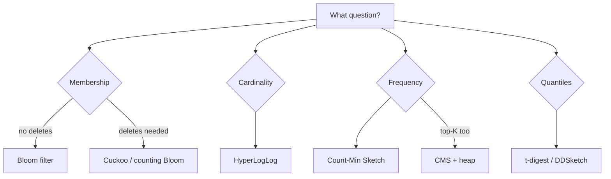

# Data Structures for Big Data

## Why It Matters

At scale, exact answers cost more than they're worth. These probabilistic structures trade a bounded error for orders-of-magnitude less memory — and they appear in almost every large-scale design.

## The Core Trade

**Exact answers need memory proportional to the data. Approximate answers need almost none.**

| Structure | Answers | Memory | Error |
|---|---|---|---|
| **Bloom filter** | "Have I seen this?" | ~10 bits/item | **False positives only** |
| **HyperLogLog** | "How many unique?" | **12 KB, fixed** | ~0.81% |
| **Count-Min Sketch** | "How often did X occur?" | Fixed grid | Overestimates only |
| **t-digest / DDSketch** | "What's the p99?" | ~KB | Small, bounded |
| **Cuckoo filter** | Membership, **with deletion** | Similar to Bloom | False positives only |

## Bloom Filter

A bit array plus *k* hash functions. To add, set the bits at *k* hash positions. To query, check those bits.

```
All k bits set   → "probably present"  (may be a FALSE POSITIVE)
Any bit unset    → "definitely absent" (NEVER a false negative)
```

**The asymmetry is the whole point:** no false negatives. If it says absent, it *is* absent.

**Sizing:** for a 1% false-positive rate you need ~9.6 bits per element. One million items ≈ **1.2 MB** versus ~40 MB for a hash set of 16-byte keys.

**Optimal k** = `(m/n) · ln 2`, and the optimal false-positive rate is achieved when the array is half full.

**Cannot delete** — clearing bits would create false negatives for other elements. Use a **counting Bloom filter** or a **cuckoo filter** if deletion is required.

**Where it's used:**

| System | Purpose |
|---|---|
| **Cassandra / RocksDB / LevelDB** | Skip SSTables that can't contain a key — critical to LSM read performance |
| **Cache penetration defence** | Reject keys that definitely don't exist before hitting the database |
| Chrome (historically) | Malicious URL pre-check |
| Bitcoin SPV clients | Transaction filtering |

**Cache penetration is the interview use case:** an attacker requesting millions of non-existent keys bypasses the cache and hammers the database. A Bloom filter in front rejects them in memory.

## HyperLogLog

Estimates cardinality by observing the **maximum number of leading zeros** in hashed values. If the longest run of leading zeros seen is *n*, roughly 2ⁿ distinct items have been observed. Averaging across many buckets (harmonic mean) tames the variance.

**1 billion unique items counted in 12 KB with ~0.81% error.** An exact set would need gigabytes.

**Mergeable** — union two HLLs by taking the per-bucket maximum. This is what makes it work across shards and time buckets:

```
PFADD visitors:2026-08-06 {userId}
PFMERGE visitors:week visitors:d1 ... visitors:d7    -- weekly uniques, no double counting
PFCOUNT visitors:week
```

**Mergeability is the property to name.** Summing per-day unique counts double-counts returning visitors; merging HLLs does not.

**Cannot** tell you whether a *specific* item was seen — that's what a Bloom filter is for.

## Count-Min Sketch

A 2D array of counters with *d* hash functions. To increment, add 1 at one position per row. To query, take the **minimum** across rows.

**Overestimates only** (collisions inflate counters, never deflate). Taking the minimum reduces the error.

**Used for:** heavy hitters, trending topics, per-key rate limiting at scale, and frequency estimation in caches (TinyLFU uses it to decide admission).

**Combine with a heap** to maintain top-K: the sketch gives approximate frequencies in constant memory, and a small heap tracks the current leaders. **This is the standard answer to "design trending topics".**

## Quantile Sketches

Computing an exact p99 requires storing every value. **t-digest** and **DDSketch** approximate quantiles in kilobytes with bounded relative error, and are **mergeable** across hosts.

**This is how monitoring systems compute a fleet-wide p99.** Averaging per-host p99s is mathematically meaningless; merging sketches is correct. Knowing why is a good signal.

## Choosing



## Other Structures Worth Naming

| Structure | Use |
|---|---|
| **Merkle tree** | Compare large datasets by exchanging hashes — Cassandra anti-entropy repair, Git, blockchains |
| **Trie / radix tree** | Prefix matching, IP routing tables |
| **Skip list** | Sorted structure with simple concurrency — Redis sorted sets, LevelDB memtables |
| **LSM tree** | Write-optimised storage — Cassandra, RocksDB |
| **Inverted index** | Full-text search |
| **Geohash / S2 / H3** | Encode 2D location into a 1D sortable key |

**Merkle trees are the one most likely to come up** outside this topic — they're how two replicas find their differences without transferring the data.

## When Approximation Is Not Acceptable

| Domain | Why |
|---|---|
| Billing and payments | Money must be exact |
| Inventory | Overselling has real cost |
| Compliance and audit | Legal requirement |
| Security decisions | A false positive may lock out a user |

**Common hybrid:** approximate for real-time dashboards, exact via a batch job for billing. Saying "I'd use HyperLogLog for the live dashboard and a nightly batch aggregation for invoicing" is a strong, practical answer.

## Common Mistakes

- Assuming Bloom filters have false negatives (they don't)
- Deleting from a standard Bloom filter
- Using HyperLogLog to test membership of a specific item
- Summing per-shard or per-day unique counts instead of merging sketches
- Averaging per-host percentiles
- Using approximations where money or compliance is involved
- Undersizing a Bloom filter and getting an unusable false-positive rate

## Related Topics

- [Caching](../Core%20Concepts/Caching.md)
- [Cassandra](../Key%20Technologies/Cassandra.md)
- [Redis Data Structures](../../06%20Caching%20and%20Redis/Redis/Redis%20Data%20Structures.md)
- [Stream Processing and Flink](../Key%20Technologies/Stream%20Processing%20and%20Flink.md)

## Revision Summary

Bloom filters answer membership with false positives but never false negatives; HyperLogLog counts uniques in fixed 12 KB and merges across shards; Count-Min Sketch estimates frequencies and pairs with a heap for top-K; quantile sketches make fleet-wide percentiles meaningful. Use exact computation wherever money or compliance is involved.

## Quick Recall

- Bloom: **no false negatives**; ~10 bits/item; can't delete
- Bloom in front of a cache stops penetration attacks
- HLL: 1B uniques in 12 KB, ~0.8% error, **mergeable**
- CMS: overestimates only; + heap = trending topics
- Never sum unique counts — merge the sketches
- Never average percentiles — merge t-digests
- Merkle trees compare datasets by hash
