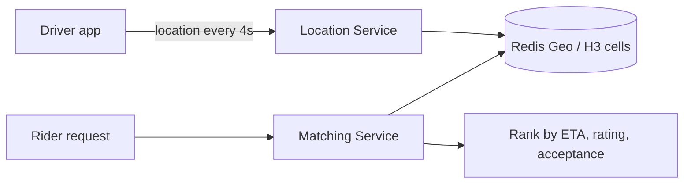

# Proximity and Geospatial Search

## Why It Matters

Uber, Yelp, DoorDash, Tinder, and "find nearby X" all reduce to the same problem: indexing two dimensions so that nearby points are cheap to retrieve.

## Why A Naive Query Fails

```sql
SELECT * FROM places
WHERE SQRT(POW(lat - ?, 2) + POW(lng - ?, 2)) < radius;
```

A function on the columns means **no index is usable** — this is a full table scan. B-tree indexes are one-dimensional; indexing latitude and longitude separately lets the database prune on one dimension but not both together.

**The core problem: reduce 2D proximity to a 1D range query that an index can serve.**

## The Approaches

| Approach | How | Best for |
|---|---|---|
| **Geohash** | Interleave lat/lng bits into a sortable string | Simple, works in any KV or SQL store |
| **Quadtree** | Recursively subdivide into 4 quadrants | In-memory, adaptive to density |
| **S2 (Google)** | Project onto a sphere-inscribed cube, Hilbert curve | Accurate at global scale, no pole distortion |
| **H3 (Uber)** | **Hexagonal** grid | Uniform neighbour distance |
| **R-tree / PostGIS** | Bounding-box tree | Rich geometry, polygons, exact distance |

## Geohash — The One To Explain

Interleave the bits of latitude and longitude, then base32-encode.

```
San Francisco → 9q8yy
```

**The key property: shared prefix means spatial proximity.** `9q8yy` and `9q8yz` are adjacent cells. So a proximity search becomes a **prefix range scan** — something every database can do:

```sql
SELECT * FROM places WHERE geohash BETWEEN '9q8yy' AND '9q8yz';
```

| Precision | Cell size |
|---|---|
| 4 | ~20 km |
| 5 | ~5 km |
| 6 | ~1 km |
| 7 | ~150 m |

**The two problems to raise:**

1. **Boundary problem** — two points either side of a cell edge can be metres apart but share no prefix. **Fix: query the target cell plus its 8 neighbours.** Always mention this; it's the standard follow-up.
2. **Non-uniform cells** — geohash cells are rectangles in lat/lng space, so they shrink toward the poles. Fine for city-scale, imprecise globally.

## Why Uber Built H3

Square and rectangular grids have a problem: a cell's **edge** neighbours are closer than its **corner** neighbours, so "adjacent" isn't a uniform distance.

**Hexagons have 6 neighbours, all equidistant from the centre.** For movement, surge pricing, and supply-demand modelling — where you're comparing a cell to its surroundings — that uniformity matters.

**H3 is the answer to "how would you build the geospatial layer for a ride-hailing app?"**

## Redis Geo

```
GEOADD drivers -122.4 37.8 driver:123
GEOSEARCH drivers FROMLONLAT -122.4 37.8 BYRADIUS 5 km ASC COUNT 10
```

Internally a **sorted set scored by a 52-bit geohash**, which is why it inherits sorted-set performance and semantics.

**Excellent for high-churn, ephemeral location data** — driver positions updated every few seconds. Not a durable store.

## PostGIS

```sql
CREATE INDEX idx ON places USING GIST (location);

SELECT * FROM places
WHERE ST_DWithin(location, ST_MakePoint(?, ?)::geography, 5000)
ORDER BY location <-> ST_MakePoint(?, ?)::geography
LIMIT 10;
```

**`ST_DWithin` is index-accelerated**; a naive distance calculation is not. The `<->` operator does an index-assisted nearest-neighbour ordering.

**PostGIS is the most capable option** — polygons, routing, exact geodesic distance, spatial joins — and often the right answer when you already run Postgres. **Not adding a new system is a legitimate design win.**

## Choosing

| Situation | Choice |
|---|---|
| Already on Postgres, moderate scale | **PostGIS** |
| Real-time positions, high update rate | **Redis Geo** |
| Simple nearby search in any KV store | **Geohash prefix** |
| Global scale, need accuracy near poles | **S2** |
| Movement and supply-demand modelling | **H3** |
| Search combined with text and filters | Elasticsearch `geo_point` |

## Designing "Find Nearby Drivers"



**Design points to raise:**

- **Write volume dominates.** 1M drivers updating every 4 seconds is 250,000 writes/sec — far more than the read side. This inverts the usual read-heavy assumption and is worth stating explicitly.
- **Store only current position**, not history, in the hot path. Ship history to a separate store asynchronously.
- **Shard by geographic cell**, so a city's traffic stays on one set of nodes.
- **Expand the radius progressively** — start at 1 km, widen if too few results.
- **Distance is not the ranking key** — ETA accounting for roads, traffic, and direction of travel is. Straight-line distance is only a candidate filter.
- **Dense-city hot cells**: a single downtown cell may hold thousands of drivers. Subdivide adaptively or cap results per cell.

**"Straight-line distance selects candidates; ETA ranks them" is the insight that separates a good answer.**

## Common Mistakes

- Distance calculations in a `WHERE` clause, killing index usage
- Ignoring the geohash boundary problem
- Assuming the workload is read-heavy when location updates dominate
- Using straight-line distance as the final ranking
- Storing full location history in the real-time path
- Adding Elasticsearch or Redis when PostGIS would suffice

## Related Topics

- [Database Indexing](../../05%20Databases/Indexing/Database%20Indexing.md)
- [Redis](../Key%20Technologies/Redis.md)
- [PostgreSQL](../Key%20Technologies/PostgreSQL.md)
- [Partitioning and Sharding](../../05%20Databases/Partitioning%20and%20Sharding/Partitioning%20and%20Sharding.md)

## Revision Summary

Proximity search means reducing two dimensions to one sortable key so an index can serve a range scan. Geohash prefixes do this simply but need neighbour-cell queries at boundaries; H3's hexagons give uniform neighbour distance; PostGIS handles real geometry. Location-update workloads are write-heavy, and ETA rather than distance should rank results.

## Quick Recall

- Distance in `WHERE` → full scan; need a 1D encoding
- Geohash: shared prefix = proximity → **query 8 neighbours too**
- Precision 5 ≈ 5 km, 6 ≈ 1 km
- H3 hexagons: 6 equidistant neighbours
- Redis Geo = sorted set over a 52-bit geohash
- `ST_DWithin` is indexed; raw distance is not
- Driver updates dominate — **write-heavy**
- Distance filters; **ETA ranks**
