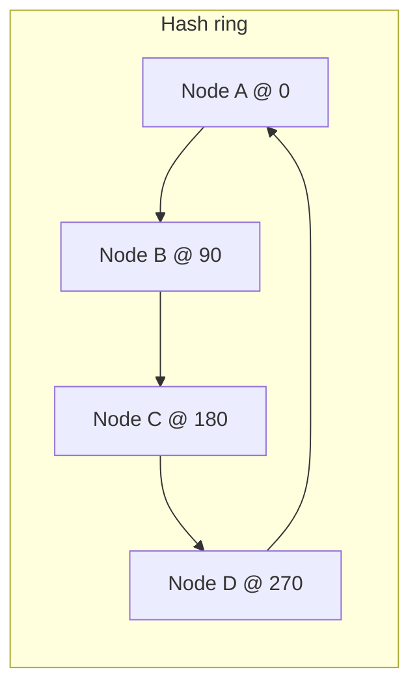

# Consistent Hashing

## Why It Matters

The mechanism behind distributed caches, sharded databases, and load balancers that must survive nodes joining and leaving. A standard deep-dive topic.

## The Problem With Modulo Hashing

```
node = hash(key) % N
```

Add or remove one node and **N changes, so almost every key remaps**.

With N = 4 → 5, roughly 80% of keys move. For a cache, that's a total cold start and a stampede onto the database. For a database, it's a full data migration.

## The Ring

Map both keys and nodes onto a circular hash space (say 0 to 2³²−1). A key belongs to the **first node clockwise** from its position.



**Adding a node only steals keys from its immediate clockwise successor.** Removing one hands its keys to that successor. On average **K/N keys move**, not K.

That single property is the whole point of the technique.

## Virtual Nodes — Not Optional

With one position per physical node, two problems appear:

1. **Uneven distribution.** Random placement of a few points on a ring gives high variance — one node may own 40% of the space.
2. **Failure cascades.** When a node dies, its *entire* range goes to one neighbour, which may then be overwhelmed and fail in turn.

**Fix: give each physical node 100–200 positions on the ring** (`hash(nodeId + "#" + i)`).

| | Without vnodes | With vnodes |
|---|---|---|
| Load variance | High | **Low** |
| On node failure | All load → one neighbour | **Spread across all nodes** |
| Heterogeneous capacity | Impossible | **Assign more vnodes to bigger machines** |

**Heterogeneous capacity is an underrated benefit**: a machine with twice the RAM simply gets twice the virtual nodes.

## Lookup

```java
TreeMap<Long, String> ring = new TreeMap<>();     // position → physical node

void addNode(String node, int vnodes) {
    for (int i = 0; i < vnodes; i++)
        ring.put(hash(node + "#" + i), node);
}

String getNode(String key) {
    long h = hash(key);
    Map.Entry<Long, String> e = ring.ceilingEntry(h);   // first clockwise
    return (e != null ? e : ring.firstEntry()).getValue();   // wrap around
}
```

**`TreeMap.ceilingEntry` is exactly the operation the ring needs** — O(log V) where V is the total virtual node count. The `firstEntry()` fallback handles wrapping past the end of the ring.

## Replication On The Ring

To store N replicas, walk clockwise from the key's position and take the next N **distinct physical** nodes — skipping virtual nodes belonging to a node already selected.

```
key → position P
replica 1 = first distinct node clockwise from P
replica 2 = next distinct node
replica 3 = next distinct node
```

**Rack and datacentre awareness** further constrains the walk: skip candidates in a rack already used, so a rack failure can't take out every replica. Cassandra's `NetworkTopologyStrategy` does exactly this.

## Rebalancing

| Event | What moves |
|---|---|
| Node added | The new node pulls its ranges from the successors of each of its vnodes |
| Node removed | Its ranges pass to the clockwise successor of each vnode |
| Node temporarily down | **Hinted handoff** — a neighbour stores writes and replays them on recovery |

**Who initiates the transfer?** The joining node pulls from its successors, streaming data before accepting traffic for those ranges. During the transfer, reads may need to consult both old and new owners.

## Hot Keys Are Not Solved By This

Consistent hashing balances **key count**, not **access frequency**. One extremely popular key still saturates one node.

Fixes: replicate the hot range to extra nodes, add a small local cache in front, or split the key (`celebrity#0..9`).

**Mention this unprompted** — it's the limitation interviewers probe after you explain the ring.

## Where It's Used

| System | Use |
|---|---|
| **Cassandra, DynamoDB, Riak** | Partitioning and replica placement |
| **Memcached / Redis clients** | Client-side shard selection |
| Akamai / CDNs | Origin selection |
| Envoy, HAProxy | `ring_hash` / consistent-hash load balancing for session affinity |
| Discord, Uber | Service sharding |

**Redis Cluster is an exception** — it uses 16,384 fixed hash slots mapped to nodes rather than a ring. Resharding moves slots, which is simpler to reason about. Knowing this distinction is worth a mention.

## Alternatives

| Approach | Note |
|---|---|
| **Rendezvous (HRW) hashing** | Compute `hash(key, node)` for every node, pick the max. Simpler, no ring, no vnodes, but O(N) per lookup |
| **Jump consistent hash** | Very fast, minimal memory, but nodes can only be added/removed at the end |
| **Fixed slots** (Redis) | Explicit slot→node map; easy to reason about and migrate |

Naming rendezvous hashing as a simpler alternative is a good senior-level aside.

## Common Mistakes

- Omitting virtual nodes — the most common gap
- Claiming it solves hot keys
- Forgetting to skip duplicate physical nodes when placing replicas
- Not handling ring wrap-around in lookup
- Assuming rebalancing is instantaneous — it involves real data transfer
- Using a poor hash function, producing clustered positions

## Related Topics

- [Partitioning and Sharding](../../05%20Databases/Partitioning%20and%20Sharding/Partitioning%20and%20Sharding.md)
- [Caching](Caching.md)
- [Redis](../Key%20Technologies/Redis.md)

## Revision Summary

Map keys and nodes onto a ring; a key belongs to the first node clockwise. Adding or removing a node moves only K/N keys instead of nearly all. Virtual nodes are mandatory for even distribution, graceful failure, and heterogeneous capacity. It does not solve hot keys.

## Quick Recall

- `hash % N` remaps ~everything; the ring moves K/N
- 100–200 virtual nodes per physical node
- vnodes → even load, spread failure, weighted capacity
- Replicas = next N **distinct physical** nodes clockwise
- `TreeMap.ceilingEntry` + wrap to `firstEntry`
- Balances key count, **not** access frequency
