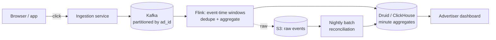

# Design an Ad Click Aggregator

> The canonical **streaming aggregation** design. Tests event-time processing, deduplication, and the tension between real-time approximation and billing-grade accuracy.

## Requirements

**Functional**
- Record ad clicks
- Aggregate click counts per ad, per minute/hour/day
- Query aggregates with low latency for advertiser dashboards
- Support filtering by dimension (campaign, region, device)

**Non-functional**
- **1M clicks/sec peak**
- Dashboard queries < 1 second
- **Clicks must not be lost** — this is billing data
- Aggregates available within ~1 minute
- Handle duplicate and late-arriving events

**The defining tension:** advertisers want a live dashboard (approximation is fine) and an accurate invoice (approximation is not). Those are two different pipelines.

## Estimation

```
1M clicks/sec peak, ~200K average
200K × 86,400 = ~17B clicks/day
Event size ~200 B → 3.4 TB/day raw

Aggregated: 10M ads × 1,440 minutes = 14B rows/day at minute granularity
→ far too many; roll up aggressively
```

**Raw events are 3.4 TB/day.** Retention and rollup policy is a first-class design decision, not an afterthought.

## Architecture



## Ingestion

The click endpoint must be **fast and never lose data**.

```
Click → ingestion service → validate → write to Kafka → 200 OK
```

- **Write to Kafka, acknowledge, done.** No database write on the request path.
- `acks=all` with `min.insync.replicas=2` — this is billing data
- If Kafka is unavailable, buffer to local disk and replay; never drop
- The client sends a **`click_id`** (UUID generated at click time) — this is what makes deduplication possible

**Client-generated `click_id` is the key design decision.** Without it, a retried click is indistinguishable from a genuine second click.

## Partitioning

**Partition Kafka by `ad_id`.**

- All clicks for an ad reach the same Flink operator, so aggregation state is local — no shuffle
- Ordering per ad, which is all you need

**The hot-key problem:** a viral ad concentrates on one partition and one operator.

**Fix — two-stage aggregation:**
```
Stage 1: key by (ad_id, random_salt 0..N) → partial counts, spread across operators
Stage 2: key by ad_id → sum the partial counts
```

**This is the deep dive to have ready.** It's the standard answer to hot keys in any streaming aggregation.

## Event Time, Not Processing Time

A click at 10:00:00 from a phone on a poor connection may arrive at 10:00:45. It belongs in the **10:00 minute**, not 10:01.

- Window by **event time**
- **Watermark** with allowed lateness (say 1 minute) — the dial between latency and completeness
- **Late events beyond the watermark go to a side output** for the batch layer to reconcile, never silently dropped

**Never drop late data in a billing pipeline.** Route it somewhere.

## Deduplication

Clicks are retried by clients and redelivered by Kafka.

```
Flink keyed state: Set<click_id> per (ad_id, window), with TTL
Seen before → drop. Otherwise → count and record.
```

**State TTL must exceed the allowed lateness window**, or a late duplicate slips through. Set it to a few multiples of the window.

For very high cardinality, a **Bloom filter** bounds memory at the cost of rare false positives — which would *undercount*. For billing, prefer exact state and accept the memory; for the dashboard, a Bloom filter is fine. **Choosing differently for the two paths is the right answer.**

## The Two-Path Design

This is the heart of the problem:

| | **Speed path** | **Batch path** |
|---|---|---|
| Source | Kafka → Flink | S3 raw events |
| Latency | ~1 minute | Hours (nightly) |
| Accuracy | Approximate — misses very late events | **Exact** |
| Used for | Live dashboard | **Billing, invoices, disputes** |
| Handles | Normal flow | Late events, reprocessing, bug fixes |

**The batch job overwrites the streaming results** for closed periods. Advertisers see live numbers immediately and finalised numbers the next day.

**This looks like Lambda architecture, and the criticism applies** — two codebases computing the same thing will diverge. Mitigate by making the batch job replay through **the same Flink logic** in batch mode (Flink supports this), so there's one implementation.

**Raising that nuance — "I'd use Kappa-style reprocessing rather than a separate batch codebase" — is a strong senior signal.**

## Storage For Queries

Minute-level aggregates in a **real-time OLAP store**:

| Option | Note |
|---|---|
| **Druid** | Built for exactly this — real-time ingestion plus sub-second aggregation |
| **ClickHouse** | Extremely fast columnar; simpler to operate |
| Pinot | User-facing analytics, low latency |

Schema is a **star-shaped fact table**:
```
timestamp (minute) | ad_id | campaign_id | region | device | clicks | impressions
```

**Pre-aggregate rollups:** minute → hour → day. Dashboards query the coarsest granularity that answers the question. A "last 30 days" chart should read 30 daily rows, not 43,200 minute rows.

**Retention:** minute data for 7 days, hourly for 90, daily forever. Raw events in S3 for a year (compliance and reprocessing), then Glacier.

## Approximate vs Exact

| Metric | Approach |
|---|---|
| Click counts (billing) | **Exact** — sum of deduplicated events |
| Unique users | **HyperLogLog** — mergeable across shards and time buckets |
| Top-K ads by clicks | **Count-Min Sketch + heap** |
| Percentile latencies | t-digest |

**Never sum per-shard unique counts** — merge the HLLs. See [Data Structures for Big Data](../Advanced%20Topics/Data%20Structures%20for%20Big%20Data.md).

## Fraud And Validity

Not all clicks are billable — bots, accidental double-clicks, click farms.

- Real-time heuristics in Flink: rate per IP/user, impossible click-through timing
- A separate `valid` flag rather than dropping — advertisers dispute, and you need the audit trail
- Heavier ML-based detection in the batch layer

**Keep invalid clicks, flagged.** Deleting evidence makes disputes unresolvable.

## Deep Dives To Be Ready For

| Question | Answer |
|---|---|
| **Exactly-once counting?** | Flink checkpointing gives exactly-once *state*; client `click_id` dedup handles producer retries; the OLAP sink must be idempotent or transactional |
| **Reprocessing after a bug?** | Replay from Kafka (retention permitting) or S3 through a new job version; write to a new table and swap |
| **Hot ad?** | Two-stage aggregation with salted keys |
| **Multi-region?** | Aggregate regionally, then merge — HLLs merge correctly; counts sum |
| **Query for an arbitrary date range?** | Serve from the coarsest rollup that covers it, plus finer data at the edges |
| **Backpressure?** | Kafka absorbs it; Flink backpressures naturally; monitor consumer lag |

## Failure Modes

| Failure | Behaviour |
|---|---|
| Flink job dies | Restarts from the last checkpoint; replays from Kafka offsets — no loss |
| Kafka partition unavailable | Ingestion buffers; alert on producer errors |
| OLAP store down | Dashboards degrade; Kafka retains data for replay |
| Late events beyond watermark | Side output → batch layer reconciles |
| Duplicate clicks | Deduplicated by `click_id` in keyed state |

**Nothing in this pipeline loses data** — Kafka retention plus S3 raw storage means any component can be rebuilt by replay. That's the property to state.

## Common Mistakes

- Processing time instead of event time
- No `click_id`, so duplicates are uncountable
- Silently dropping late events in a billing pipeline
- Ignoring hot keys
- One path only — either no live dashboard, or no accurate billing
- Writing to a database on the ingestion path
- Deleting invalid clicks instead of flagging them
- Storing minute granularity forever

## Related Topics

- [Stream Processing and Flink](../Key%20Technologies/Stream%20Processing%20and%20Flink.md)
- [Kafka Deep Dive](../../07%20Messaging%20and%20Kafka/Kafka/Kafka%20Deep%20Dive.md)
- [Data Structures for Big Data](../Advanced%20Topics/Data%20Structures%20for%20Big%20Data.md)
- [Time Series and Analytics Databases](../Advanced%20Topics/Time%20Series%20and%20Analytics%20Databases.md)

## Revision Summary

Ingest to Kafka partitioned by ad ID, aggregate in Flink using event-time windows with watermarks, deduplicate on a client-supplied click ID, and serve minute-level rollups from a real-time OLAP store. Run a batch reconciliation over raw S3 events for billing-grade accuracy, ideally through the same logic in batch mode.

## Quick Recall

- Client-generated **`click_id`** enables deduplication
- Kafka partitioned by `ad_id`; hot ad → **salted two-stage aggregation**
- **Event time + watermark**; late events to a side output, never dropped
- Dedup state TTL > allowed lateness
- Speed path approximate, batch path exact — same logic if possible
- HLL for uniques (merge, don't sum); CMS + heap for top-K
- Rollup minute → hour → day; retain raw in S3
- Flag invalid clicks, don't delete them
