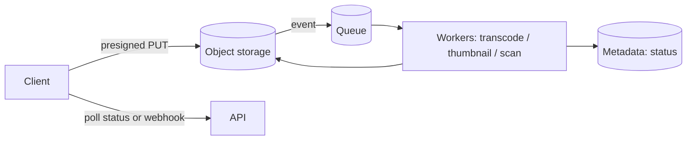

# Handling Large Blobs

## Why It Matters

Any design involving images, video, documents, or backups. The wrong answer — routing bytes through your application servers — is the default instinct and it doesn't scale.

## Never Proxy Through Application Servers

```
✗ Client → App server → S3        ✓ Client → S3 (presigned URL)
```

Proxying means:

| Cost | Detail |
|---|---|
| **Bandwidth doubled** | In to your server, out to storage |
| **Threads/memory held** | A 1 GB upload occupies a request thread for its duration |
| **Timeouts** | Load balancers cap request duration (ALB default 60s) |
| **Scaling** | You scale application servers for bytes, not for logic |
| Cost | Egress charged twice |

**Application servers should handle metadata and authorisation. Bytes go directly to object storage.**

## Presigned URLs

The application generates a **time-limited, scope-limited** URL; the client uploads straight to S3.

```
1. Client → App:  POST /uploads {filename, contentType, size}
2. App: authorise, validate size/type, create a metadata record (status=PENDING)
3. App → Client:  presigned PUT URL, expires in 15 min
4. Client → S3:   PUT the bytes directly
5. S3 → App:      event notification (or client callback) → status=COMPLETE
```

**Constrain the presigned URL** — content type, maximum size, and a short expiry. An unconstrained presigned URL is an open write endpoint.

**Use the S3 event notification rather than trusting the client callback.** A client can upload and never call back, leaving orphaned objects; the storage event is authoritative.

## Multipart Upload

For large files, split into parts (5 MB–5 GB each), upload in parallel, and complete.

| Benefit | Detail |
|---|---|
| **Parallelism** | Much higher throughput |
| **Resumability** | Retry only the failed part, not the whole file |
| Large files | Required above 5 GB on S3 |

**Always configure a lifecycle rule to abort incomplete multipart uploads** — orphaned parts consume storage and are billed indefinitely while being invisible in the bucket listing. This is a real and commonly-missed cost leak.

## Chunking and Deduplication

For sync services (Dropbox-style), chunk client-side and upload only changed chunks.

| Chunking | Behaviour |
|---|---|
| **Fixed-size** | Simple; **one byte inserted at the start shifts every boundary**, so all chunks change |
| **Content-defined (CDC)** | Boundaries set by a rolling hash of the content — an insertion changes only nearby chunks |

**Content-defined chunking is why Dropbox re-uploads kilobytes when you edit a large file**, and it's the detail that makes this design interesting.

**Deduplication:** hash each chunk (SHA-256), check whether it already exists, upload only new chunks. This gives both single-user savings (versions share chunks) and cross-user savings.

**The privacy caveat worth raising:** cross-user deduplication leaks information — an attacker can detect whether a file exists by observing whether an upload is fast. Per-user dedup avoids it.

## Download Path

| Mechanism | Use |
|---|---|
| **CDN** | Default for anything cacheable — the download never touches your infrastructure |
| **Presigned GET** | Private content, time-limited access |
| **Signed CDN URLs** | Private content **and** edge caching |
| Range requests | Video seeking, resumable downloads |

**Signed CDN URLs are the answer for private-but-cacheable content** — you keep authorisation while still serving from the edge.

## Storage Tiers

| Tier | Access | Cost |
|---|---|---|
| Standard | Immediate | Highest |
| Infrequent Access | Immediate, retrieval fee | Lower |
| Glacier / Archive | Minutes to hours | Very low |

**Lifecycle policies** move objects automatically by age. For user uploads: Standard for 30 days, IA for 90, Glacier after a year.

## Processing After Upload

Never process synchronously — transcoding a video takes minutes.



**The metadata record is the source of truth for state** — `PENDING → UPLOADED → PROCESSING → READY | FAILED`. The client polls or receives a webhook. See [Managing Long-Running Tasks](Managing%20Long%20Running%20Tasks.md).

## Consistency Between Metadata and Storage

Two systems, no shared transaction:

| Failure | Result | Mitigation |
|---|---|---|
| Metadata written, upload never completes | Orphaned record | Status field + reaper job for stale PENDING rows |
| Upload completes, metadata write fails | **Orphaned object** | Reconcile from storage events; periodic sweep |

**Write metadata first with a PENDING status, and confirm from the storage event.** Never treat the client's success callback as authoritative.

## Security

- **Buckets private by default** — public buckets are a recurring cause of real breaches
- Validate content type **server-side**; a client-declared MIME type is not trustworthy
- Enforce size limits in the presigned policy, not just in the UI
- Scan uploads for malware before serving
- Serve user content from a **separate domain** — otherwise a malicious HTML upload runs with your origin's cookies
- Encrypt at rest (SSE) and in transit

**The separate-domain point is the one candidates miss** and it's a genuine XSS vector.

## Common Mistakes

- Proxying bytes through application servers
- Presigned URLs without size or content-type constraints
- Trusting the client's completion callback
- No lifecycle rule for incomplete multipart uploads
- Serving user content from the primary domain
- Synchronous processing on the upload path
- No reconciliation between metadata and storage

## Related Topics

- [CDN](../../06%20Caching%20and%20Redis/CDN/CDN.md)
- [Managing Long-Running Tasks](Managing%20Long%20Running%20Tasks.md)
- [Scaling Writes](Scaling%20Writes.md)
- [Design a Chat System](../Design%20Deep%20Dives/Design%20a%20Chat%20System.md)

## Revision Summary

Bytes go directly between client and object storage via constrained presigned URLs; application servers handle only metadata and authorisation. Use multipart upload for large files and content-defined chunking for sync. Confirm completion from storage events, process asynchronously, and serve via CDN with signed URLs.

## Quick Recall

- **Never proxy bytes through app servers**
- Presigned URL, constrained by type, size, and short expiry
- Multipart for parallelism and resumability — **abort incomplete uploads via lifecycle**
- Content-defined chunking survives insertions
- Trust the storage event, not the client callback
- Signed CDN URLs = private + cacheable
- Serve user content from a **separate domain**
