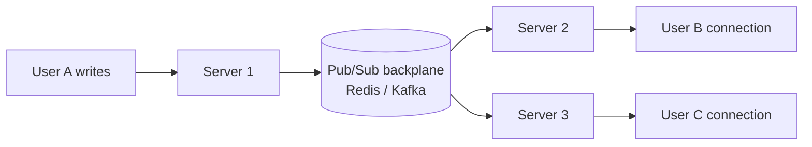

# Real-Time Updates

## Why It Matters

Chat, notifications, live feeds, collaborative editing, dashboards, and multiplayer all reduce to "how does the server push to the client?" It's one of the most common deep dives.

## The Four Transports

| | Polling | Long polling | **SSE** | **WebSocket** |
|---|---|---|---|---|
| Direction | Client pulls | Client pulls, server holds | **Server → client** | **Bidirectional** |
| Protocol | HTTP | HTTP | HTTP | Upgraded TCP |
| Connection | Repeated | Held then reopened | **One, held open** | **One, held open** |
| Auto-reconnect | N/A | Manual | **Built in** | Manual |
| Proxy/firewall friendly | Best | Good | **Good** | Sometimes blocked |
| Binary support | Yes | Yes | **No — text only** | Yes |
| Browser connection limit | — | — | **6 per domain over HTTP/1.1** | ~unlimited |
| Complexity | Trivial | Low | **Low** | High |

**The decision rule:**

- **Server → client only?** → **SSE.** It's dramatically simpler than WebSocket, reconnects automatically, and works over plain HTTP. Notifications, live scores, dashboards, and streaming LLM responses all fit.
- **Genuine bidirectional, low-latency?** → **WebSocket.** Chat, collaborative editing, multiplayer.
- **Updates every 30+ seconds and simplicity matters?** → **Polling.** Don't over-engineer.

**Most candidates reach for WebSocket by default. Choosing SSE when the flow is one-directional is a strong signal** — it shows you're weighing operational cost, not just capability.

## Server-Sent Events

```
GET /events
Accept: text/event-stream

→ text/event-stream
data: {"type":"notification","id":42}\n\n
data: {"type":"notification","id":43}\n\n
```

Built-in `Last-Event-ID` header on reconnect lets the server resume from where the client left off — you get gap recovery almost free.

**The HTTP/1.1 six-connection limit is the real gotcha.** Multiple tabs exhaust it. HTTP/2 multiplexing removes the problem, which is a good reason to require HTTP/2.

## WebSocket

```
GET /ws
Upgrade: websocket
Connection: Upgrade
→ 101 Switching Protocols
```

After the handshake it's a full-duplex frame-based channel over the same TCP connection.

**Operational realities:**

| Concern | Handling |
|---|---|
| **Load balancing** | Needs sticky sessions or a shared backplane — the connection is stateful |
| **Idle timeouts** | Proxies kill idle connections; send heartbeat pings every ~30 s |
| **Scaling** | Each connection consumes a file descriptor and memory; ~10K–100K per node |
| **Auth** | No custom headers in the browser API — pass a token in the query string or first message, and re-verify periodically |
| **Reconnection** | Implement exponential backoff with jitter yourself |

## The Hard Part: Fan-Out Across Servers

With connections spread across many servers, the server handling a *write* is not the server holding the recipient's *connection*.



**You need a pub-sub backplane.** Each server subscribes to channels for the users it holds; a write publishes to the relevant channel.

| Backplane | Trade-off |
|---|---|
| **Redis Pub/Sub** | Simple, low latency, **fire-and-forget** — offline users lose messages |
| **Kafka** | Durable, replayable, higher latency |
| Direct server-to-server | Needs a connection registry; complex |

**Redis Pub/Sub delivers only to currently-connected subscribers.** For chat, you also need to persist messages so offline users receive them on reconnect. Missing this is the most common gap.

## Connection Registry

To route a message you must know which server holds a user's connection:

```
Redis: user:123 → server-7   (with TTL, refreshed by heartbeat)
```

Alternatively, broadcast to all servers and let each drop irrelevant messages — simpler, but wasteful beyond a few dozen nodes.

## Delivery Guarantees

Real-time transports are **not** durable. For anything that must not be lost:

1. **Persist first**, then push. The push is an optimisation, not the delivery mechanism.
2. On reconnect, the client sends its **last received id** and the server backfills the gap.
3. Client-side **acks** for critical messages.

**"Persist, then push; backfill on reconnect" is the answer that shows you understand the transport is best-effort.**

## Presence

Tracking who's online is harder than it appears — a dropped connection isn't immediately distinguishable from a silent one.

- Heartbeat every 30 s, mark offline after 2–3 missed
- Store in Redis with a TTL that the heartbeat refreshes
- Accept that presence is **eventually consistent** and slightly stale
- Fan-out of presence changes to a large friend list is itself a scaling problem — batch it

## Scaling Numbers

| Concern | Rough figure |
|---|---|
| Connections per node | 10K–100K (tuning file descriptors and memory) |
| Memory per connection | ~10–50 KB |
| Heartbeat interval | 30 s |
| Backplane throughput | Redis ~100K msg/sec per node |

100M concurrent users at 50K per node needs ~2,000 nodes — a figure worth stating, because it reframes the problem as a connection-management problem rather than a messaging one.

## Common Mistakes

- WebSocket where SSE would do
- No heartbeat, so proxies silently drop connections
- No pub-sub backplane, so messages only reach users on the same server
- Treating the push as durable delivery
- No reconnection backoff — a server restart causes a reconnect storm
- Ignoring the HTTP/1.1 six-connection limit for SSE
- No message ordering or deduplication on reconnect

## Related Topics

- [Scaling Reads](Scaling%20Reads.md)
- [Redis](../Key%20Technologies/Redis.md)
- [Event Driven Architecture](../Advanced%20Topics/Event%20Driven%20Architecture.md)
- [Kafka Deep Dive](../../07%20Messaging%20and%20Kafka/Kafka/Kafka%20Deep%20Dive.md)

## Revision Summary

SSE for server-to-client, WebSocket for bidirectional, polling when simplicity wins. Multi-server fan-out requires a pub-sub backplane plus a connection registry. Transports are best-effort — persist first, push second, and backfill from a last-seen id on reconnect.

## Quick Recall

- One-directional → **SSE**; bidirectional → WebSocket; slow → polling
- SSE reconnects automatically via `Last-Event-ID`
- WebSocket needs heartbeats, sticky routing, and manual reconnect
- Multi-server → pub-sub backplane (Redis fast, Kafka durable)
- Redis Pub/Sub drops messages for offline users
- **Persist, then push**; backfill on reconnect
- ~50K connections per node
