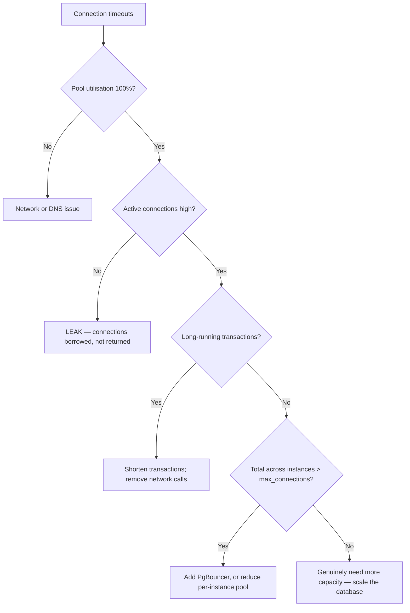

# Connection Management and Pooling

> The resource that runs out first. Connection exhaustion is a top cause of "the whole service is down" incidents, and it's invisible until it happens.

## Why It Matters

Databases handle far fewer concurrent connections than people assume. A service that scales to 100 pods, each with a 20-connection pool, requests 2,000 connections from a database that performs best around 200.

## Why Connections Are Expensive

**PostgreSQL forks a process per connection.**

| Cost | Detail |
|---|---|
| Memory | ~5–10 MB per connection |
| Fork overhead | Process creation on connect |
| **Context switching** | Hundreds of processes competing for cores |
| Shared-memory contention | Lock manager, buffer pool |

**MySQL uses a thread per connection** — cheaper, but still bounded by memory and scheduler pressure.

**The counter-intuitive finding: throughput *decreases* past a certain connection count.** More concurrent connections mean more context switching and lock contention, not more work done.

```
Connections:  50 → 15,000 TPS
             200 → 18,000 TPS      ← peak
             500 → 14,000 TPS      ← worse
           2,000 → 6,000 TPS       ← much worse
```

**More is not better.** This is the single most useful fact in this note.

## Pool Sizing

The widely-cited HikariCP formula:

```
connections = ((core_count × 2) + effective_spindle_count)
```

For an 8-core server with SSDs: roughly **18 connections**.

**That number surprises people.** The reasoning: a connection is only doing useful work while it holds a CPU or waits on I/O. Beyond `cores × 2` you're queueing inside the database rather than in the pool — and queueing in the pool is cheaper and more observable.

**Practical guidance:**

| Situation | Pool size per instance |
|---|---|
| Typical web service | **10–20** |
| Heavy I/O wait per query | Slightly higher |
| Many instances | **Lower — the total is what matters** |

```
total connections = instances × pool_size_per_instance
```

**Check the total against the database's limit.** 100 pods × 20 = 2,000 against a `max_connections` of 200 means most pods cannot connect at all.

**Smaller pools often improve p99 latency** — requests queue in the application where you can see it, rather than thrashing the database.

## Connection Poolers

When application instances outnumber what the database can serve directly, add a pooler.

**PgBouncer** multiplexes many application connections onto few database connections.

| Pool mode | Connection returned | Breaks |
|---|---|---|
| **Session** | On client disconnect | Nothing |
| **Transaction** | **After each transaction** | Prepared statements, `SET`, advisory locks, `LISTEN/NOTIFY` |
| Statement | After each statement | Multi-statement transactions |

**Transaction pooling gives the highest multiplexing** — 1,000 client connections onto 20 database connections — but **breaks session-level features**:

- Server-side prepared statements (unless the pooler supports protocol-level preparation)
- `SET` variables and search_path changes
- **Session-level advisory locks**
- `LISTEN`/`NOTIFY`
- Temporary tables

**Know this before enabling it.** JDBC and many ORMs use prepared statements by default; enabling transaction pooling without disabling them produces confusing intermittent errors.

## Connection Leaks

The most common production failure: connections borrowed and never returned.

```java
// LEAK — exception skips close()
Connection c = ds.getConnection();
doWork(c);
c.close();

// CORRECT
try (Connection c = ds.getConnection()) { doWork(c); }
```

**Symptoms:**
- Pool exhaustion after minutes or hours of uptime
- `Connection is not available, request timed out after 30000ms`
- Recovers on restart, then recurs — the signature of a leak

**Detection:** HikariCP's `leakDetectionThreshold` logs a stack trace for any connection held longer than the threshold. **Enable it in non-production permanently** — it names the exact code path.

## Critical Pool Settings

```properties
maximumPoolSize=20
minimumIdle=20                    # = max, avoids churn under steady load
connectionTimeout=3000            # fail fast rather than pile up
idleTimeout=600000
maxLifetime=1800000               # recycle BELOW any network/DB idle timeout
validationTimeout=3000
leakDetectionThreshold=60000
```

**`maxLifetime` must be shorter than the shortest timeout between the app and the database** — load balancer idle timeout, firewall connection reaping, or the database's own `idle_session_timeout`. Otherwise the pool hands out connections the network has already silently killed, producing intermittent errors that look random.

**`connectionTimeout` should be short.** Waiting 30 seconds for a connection means 30 seconds of held request threads — the pool exhaustion propagates upward and becomes a thread-pool exhaustion.

**Set `minimumIdle = maximumPoolSize`** for steady workloads. Growing and shrinking the pool adds latency at exactly the wrong moment.

## Transaction Duration Is The Real Lever

**A connection is held for the entire transaction.** Shortening transactions increases effective pool capacity more than increasing pool size does.

```java
// BAD — holds a connection for the whole HTTP call
@Transactional
public void process() {
    repo.save(entity);
    paymentGateway.charge();      // 2 seconds of network, holding a DB connection
    repo.updateStatus();
}

// BETTER — transaction only wraps database work
public void process() {
    Long id = saveInTransaction(entity);      // short
    PaymentResult r = paymentGateway.charge(); // no transaction held
    updateStatusInTransaction(id, r);          // short
}
```

**Never make a network call inside a transaction.** A 2-second external call with a 20-connection pool caps you at 10 requests/sec — regardless of how fast your database is.

**This is the highest-leverage fix for connection exhaustion**, and it's a code change rather than a configuration change.

## Read/Write Splitting

Route reads to replicas to reduce primary connection pressure:

| Approach | Trade-off |
|---|---|
| Two data sources in the app | Explicit; the code chooses |
| **Proxy-based routing** (ProxySQL, RDS Proxy) | Transparent; another component |
| ORM-level annotation | `@Transactional(readOnly = true)` can route |

**Read-after-write breaks** — a user writes to the primary and immediately reads a lagging replica. Route that user's reads to the primary for a few seconds after any write. See [Consistency Models](../../09%20Distributed%20Systems/Consistency/Consistency%20Models.md).

## Monitoring

| Metric | Alert on |
|---|---|
| **Pool utilisation** | Sustained > 80% |
| **Wait time for a connection** | Any sustained non-zero value |
| Connection timeouts | Any occurrence |
| Active vs idle | Growing active with flat throughput = long transactions |
| **Database-side connection count** | Approaching `max_connections` |
| Longest transaction duration | Anything unexpectedly long |

**Pool wait time is the leading indicator.** It rises before timeouts start, giving you warning. Latency alerts fire later and look like a database problem when they're a pool problem.

## Diagnostic Sequence



**Distinguishing a leak from saturation is the key branch:** a leak shows high pool utilisation with *low* active query count. Saturation shows both high.

## Serverless — A Different Problem

Lambda and similar create a connection per concurrent invocation, and there's no long-lived pool to share.

| Solution | Detail |
|---|---|
| **RDS Proxy / PgBouncer** | Pool outside the function |
| **Data API** (HTTP) | No persistent connection at all |
| Reserved concurrency | Cap concurrent invocations |
| Serverless-native databases | DynamoDB, Aurora Serverless v2 |

**A traffic spike creating 1,000 concurrent Lambdas creates 1,000 connection attempts.** Without a proxy, the database refuses them and the whole function fleet fails.

## Common Mistakes

- Pool size far larger than necessary
- Not multiplying pool size by instance count
- **Network calls inside transactions**
- No try-with-resources — leaks
- `maxLifetime` longer than a network idle timeout
- Long `connectionTimeout`, propagating exhaustion upward
- Transaction pooling with prepared statements enabled
- No pool metrics until an incident
- Serverless connecting directly without a proxy

## Related Topics

- [PostgreSQL](../../04%20High%20Level%20Design/Key%20Technologies/PostgreSQL.md)
- [Locking and Concurrency Control](../Consistency%20and%20Transactions/Locking%20and%20Concurrency%20Control.md)
- [Spring Transactions and AOP](../../14%20Spring%20Boot/Spring%20Transactions%20and%20AOP.md)
- [Scaling Reads](../../04%20High%20Level%20Design/Patterns/Scaling%20Reads.md)

## Revision Summary

Database connections are expensive and throughput falls past roughly `cores × 2`. Size pools small, multiply by instance count, and add PgBouncer when instances outnumber capacity. The biggest lever is transaction duration — never make a network call inside a transaction. Monitor pool wait time as the leading indicator.

## Quick Recall

- Postgres forks a **process per connection** — ~5–10 MB each
- **More connections reduce throughput** past `cores × 2`
- Pool size ≈ **10–20 per instance**; multiply by instance count
- PgBouncer **transaction pooling breaks prepared statements and advisory locks**
- `maxLifetime` < any network idle timeout
- **Never call the network inside a transaction**
- Leak signature: high pool use, **low** active queries
- Alert on **pool wait time**, not just timeouts
- Serverless needs a proxy
