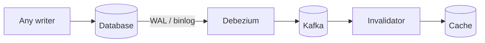

# Cache Invalidation

## Why It Matters

The genuinely hard part of caching. Every stale-data bug and every "it works on my machine but production shows old data" incident traces back here.

## The Three Approaches

| Approach | Staleness | Complexity | Use |
|---|---|---|---|
| **TTL expiry** | Bounded by the TTL | **Trivial** | Default; always have one |
| **Explicit invalidation** | Near-zero | Moderate | Writes you control |
| **Event-driven (CDC)** | Near-zero | Higher | Multiple writers, correctness matters |

**Always set a TTL, even when you invalidate explicitly.** The TTL is your backstop — it bounds the damage from any invalidation bug to a known window. A cache entry with no TTL and a missed invalidation is stale forever.

## Delete, Don't Update

```
T1: writes DB value = A
T2: writes DB value = B
T2: updates cache = B
T1: updates cache = A          ← cache permanently wrong
```

Two concurrent writers can interleave so the cache retains the older value indefinitely.

**Deleting instead means the next reader repopulates from the source of truth.** The worst case becomes one extra miss rather than permanent corruption.

## Order Matters

```
CORRECT:  write DB → delete cache
WRONG:    delete cache → write DB
```

The wrong order opens a window where a concurrent reader misses, reads the **old** value from the database, and repopulates the cache with it — just before the write lands. The cache is then stale until the TTL expires.

**Even the correct order has a narrow race:**

```
Reader:  cache miss → reads DB (old value) → [PAUSE]
Writer:  writes DB (new value) → deletes cache
Reader:  [RESUMES] → writes old value into cache
```

Rare, but real under load.

**Defences, in increasing robustness:**

| Technique | Detail |
|---|---|
| **Short TTL** | Bounds the damage regardless of the race |
| **Delayed double delete** | Delete, write, wait ~500 ms, delete again — closes the window |
| **CDC-driven invalidation** | Invalidate from the database log — authoritative and correctly ordered |
| Versioned keys | Include a version in the key; a write bumps the version, orphaning the old entry |

## Change Data Capture — The Robust Answer

Read the database's replication log and emit invalidation events.



| Advantage | Detail |
|---|---|
| **Catches every writer** | Including migrations, admin scripts, and other services |
| **Correctly ordered** | The log is the database's own commit order |
| **No dual-write problem** | Nothing to keep in sync — the log *is* the source |
| Decoupled | Application code doesn't know the cache exists |

**The key argument: application-level invalidation only catches writes that go through your application.** A DBA running an UPDATE, a batch job, or a second service writing directly will all leave the cache stale. CDC catches all of them.

**Cost:** operational complexity (Debezium, Kafka) and invalidation lag of tens to hundreds of milliseconds.

## Invalidating Derived Data

The hardest case: a cached value computed from many rows.

```
cache: "user:123:dashboard" → aggregate of orders, payments, preferences
Which writes should invalidate it?
```

| Strategy | Detail |
|---|---|
| **Tag-based invalidation** | Tag entries with their dependencies; invalidate by tag |
| **Key namespacing with versions** | `user:123:v7:dashboard`; bump `v` to orphan everything for that user |
| Short TTL | Accept staleness; often the right call |
| Recompute on write | Expensive but always fresh |

**Version-namespacing is elegant:** store `user:123:version = 7`, build keys as `user:123:v7:*`, and a single `INCR` on the version instantly invalidates every derived entry for that user without enumerating them. Old entries age out via TTL.

**This is the technique worth knowing** — it turns "invalidate 50 related keys" into one atomic increment.

## Multi-Level Invalidation

```
Browser → CDN → app-local (Caffeine) → Redis → Database
```

**Each layer needs its own invalidation, and local caches are the hard one** — you cannot delete a key from 50 application instances with one call.

| Layer | Mechanism |
|---|---|
| Browser | Versioned URLs, `Cache-Control` |
| CDN | Purge API, or **content-hashed URLs** (preferred) |
| **Local (in-process)** | **Very short TTL (seconds)**, or a pub-sub invalidation broadcast |
| Redis | Explicit delete or CDC |

**For local caches, a short TTL is usually better than broadcast invalidation.** Broadcasting requires every instance to subscribe, handle missed messages, and reconcile on restart — complexity that a 5-second TTL avoids entirely.

**Only cache locally what tolerates seconds of divergence between instances.**

## Negative Caching

Caching "this doesn't exist" prevents [cache penetration](Caching%20Strategies.md) — repeated lookups for missing keys hammering the database.

**But it creates an invalidation problem:** when the entity is *created*, the negative entry must be removed, or the new entity appears missing.

**Use a short TTL on negative entries** (seconds to a minute), and explicitly delete them on creation.

## Cache Warming

After a deploy, restart, or eviction storm, an empty cache sends full load to the database — which may not survive it.

| Technique | Detail |
|---|---|
| **Pre-warming** | Populate known-hot keys before taking traffic |
| **Gradual traffic ramp** | Route 10% of traffic, let the cache fill, then increase |
| **Request coalescing** | One loader per key; others wait — prevents the stampede |
| Never flush the whole cache | Flushing in production is how you cause an outage |

**"Never `FLUSHALL` in production" is a real operational rule.** It converts a cache into an instant thundering herd.

## Correctness Checklist

Before shipping a cache:

- [ ] Every entry has a TTL
- [ ] Writes **delete** rather than update
- [ ] Database write happens **before** invalidation
- [ ] Non-application writers are accounted for (CDC, or documented)
- [ ] Negative entries have a short TTL and are cleared on creation
- [ ] Local caches only hold data tolerant of divergence
- [ ] A cache outage degrades rather than fails
- [ ] Hit rate is monitored

## Common Mistakes

- Updating the cache instead of deleting
- Deleting before writing
- No TTL, so any bug means permanent staleness
- Assuming all writes go through your application
- Broadcasting invalidation to local caches instead of using short TTLs
- Negative caching without clearing on creation
- Flushing the cache in production
- Making the cache a hard dependency

## Related Topics

- [Caching Strategies](Caching%20Strategies.md)
- [Cache Eviction Policies](Cache%20Eviction%20Policies.md)
- [Caching](../../04%20High%20Level%20Design/Core%20Concepts/Caching.md)
- [Event Driven Architecture](../../04%20High%20Level%20Design/Advanced%20Topics/Event%20Driven%20Architecture.md)

## Revision Summary

Always set a TTL as a backstop. Delete rather than update, and write the database before invalidating. Application-level invalidation misses writers outside your application — CDC catches all of them. Version-namespaced keys invalidate derived data with one increment, and local caches should rely on short TTLs rather than broadcasts.

## Quick Recall

- **TTL on everything**, even with explicit invalidation
- **Delete, don't update**; **DB first, then invalidate**
- Delayed double delete closes the narrow race
- **CDC catches writers your application doesn't control**
- Version-namespaced keys → one `INCR` invalidates a whole family
- Local caches: short TTL beats broadcast invalidation
- Negative entries need short TTLs and explicit clearing
- Never `FLUSHALL` in production
