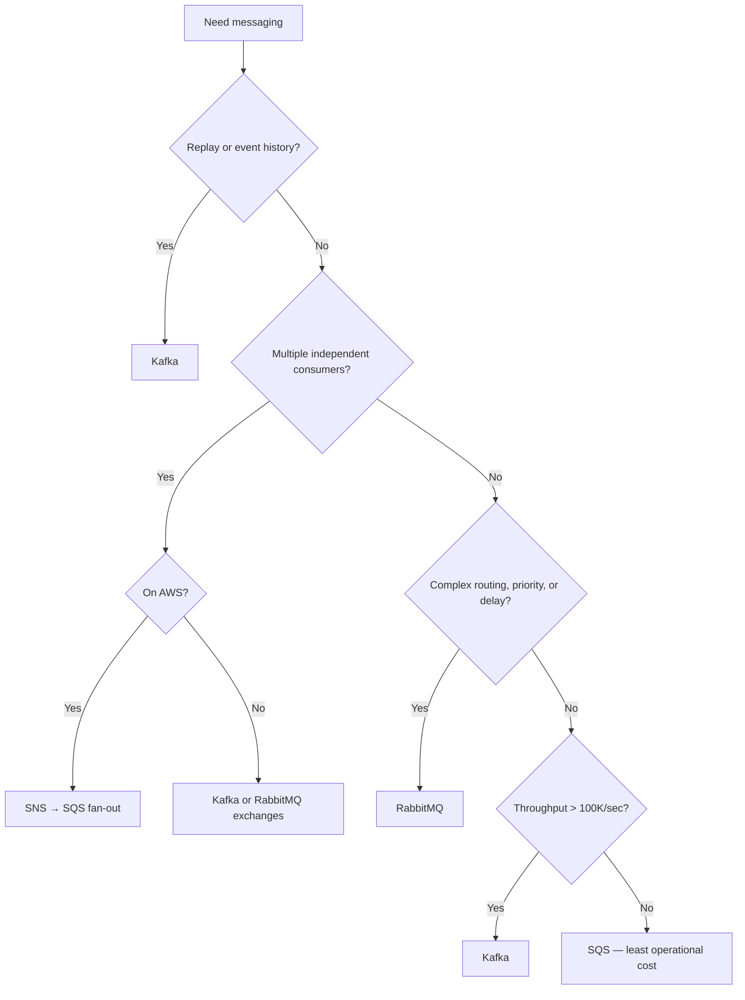

# Kafka vs SQS vs RabbitMQ

## Why It Matters

"Which queue would you use?" appears in almost every system design. Reflexively answering "Kafka" signals pattern-matching; reasoning from the requirements signals judgement.

## The Fundamental Difference

| | **Kafka** | **SQS** | **RabbitMQ** |
|---|---|---|---|
| **Model** | **Distributed log** | Managed queue | Broker with exchanges |
| Message after consumption | **Retained** | Deleted | Deleted |
| Consumer position | **Consumer-tracked offset** | Broker-tracked | Broker-tracked |
| Replay | **Yes — reset the offset** | **No** | No |
| Multiple independent consumers | **Yes (consumer groups)** | No (needs SNS fan-out) | Yes (exchanges) |

**Kafka is a log you read from; SQS and RabbitMQ are queues you take from.** That single distinction explains nearly every other difference — retention, replay, and multiple consumers all follow from messages not being destroyed on read.

## Detailed Comparison

| Dimension | Kafka | SQS | RabbitMQ |
|---|---|---|---|
| Throughput | **Millions/sec** | High (near-unlimited, standard) | Tens of thousands/sec |
| Latency | Low (ms) | Moderate (10s of ms) | **Lowest** |
| Ordering | **Per partition** | FIFO queues only (lower throughput) | Per queue |
| Routing | Simple (key → partition) | None | **Rich — topic, header, fanout exchanges** |
| Per-message delay | No | **Yes (up to 15 min)** | **Yes (plugin)** |
| Priority | No | No | **Yes** |
| Retention | **Days to forever** | 14 days max | Until consumed |
| Message size | Default 1 MB | 256 KB (2 GB via S3 extension) | Configurable |
| DLQ | Manual (retry topics) | **Built in** | **Built in** |
| Ops burden | **High** | **None (managed)** | Moderate |
| Scaling model | Add partitions/brokers | Automatic | Add nodes (clustering is fiddly) |

## When To Choose Each

### Kafka

**Choose it when at least one applies:**
- Very high throughput (100K+ messages/sec)
- **Replay is needed** — reprocessing, new consumers reading history, event sourcing
- **Several independent consumers** need the same stream
- Ordering per entity matters
- It's genuinely an event *stream*, not a task queue

**Don't choose it for:** simple task queues, per-message delay or priority, small teams without operations capacity, or low volume.

### SQS

**Choose it when:**
- You're on AWS and want **zero operational burden**
- Simple work distribution
- Variable or spiky load — it scales automatically
- Per-message visibility timeout and built-in DLQ are useful

**Standard vs FIFO:** Standard is at-least-once with best-effort ordering and effectively unlimited throughput; FIFO gives exactly-once processing and strict ordering per message group, capped at 3,000 msg/sec with batching.

**SQS's biggest strength is that there is nothing to operate.** For "decouple two services at moderate volume", it's usually the correct answer, and saying so is a strength.

### RabbitMQ

**Choose it when:**
- **Complex routing** — topic patterns, header-based routing, fanout
- **Per-message priority or delay**
- Request-reply patterns
- Lowest possible latency
- You need AMQP protocol support

**Don't choose it for:** replay, very high throughput, or huge retention.

## Kafka Specifics That Matter

| Concept | Consequence |
|---|---|
| Partition count caps consumer parallelism | 10 consumers on 4 partitions leaves 6 idle |
| Ordering is per partition | Key by entity ID; never promise global ordering |
| `acks=all` + `min.insync.replicas=2` + RF=3 | The durable configuration |
| No built-in retry queue | Implement retry topics with increasing delays |
| Consumer lag is the key metric | Alert on the **trend**, not the absolute value |

**Increasing partitions later breaks key-to-partition mapping**, so over-provision partitions rather than under-provision. See [Kafka Deep Dive](../Kafka/Kafka%20Deep%20Dive.md).

## SQS Specifics That Matter

| Concept | Detail |
|---|---|
| **Visibility timeout** | The message is hidden while being processed; reappears if not deleted in time |
| Long polling | `WaitTimeSeconds=20` reduces empty receives and cost |
| **Delete after processing** | Receiving does not delete — you must call `DeleteMessage` |
| `maxReceiveCount` → DLQ | Automatic after N failed attempts |
| At-least-once (standard) | Duplicates guaranteed — consumers must be idempotent |

**Long-running handlers must extend the visibility timeout** (`ChangeMessageVisibility`), or the message is redelivered while still being processed — producing duplicate work.

## The Hybrid Patterns

**SNS → SQS fan-out** is the standard AWS pattern when several services need the same message:

```
Publisher → SNS topic → SQS queue A → Service A
                     → SQS queue B → Service B
```

Each service gets its own queue with independent retry and DLQ. **This gives Kafka-like fan-out without running Kafka**, and is worth naming.

**Kafka + SQS together** is also common: Kafka for the high-volume event backbone, SQS for individual service task queues.

## Decision Flow



## What They All Share

Regardless of choice, these apply:

- **At-least-once delivery** → consumers must be [idempotent](../Reliability%20Patterns/Idempotent%20Consumers.md)
- Bounded queues or retention → decide what happens when full
- Retry with **jittered** exponential backoff
- A **monitored** DLQ — a silent DLQ is invisible data loss
- Ordering requires partitioning by key and costs parallelism

**Exactly-once end to end does not exist in any of them.**

## Common Mistakes

- Defaulting to Kafka regardless of requirements
- Expecting more consumers than partitions to increase Kafka throughput
- Forgetting to delete SQS messages after processing
- Not extending SQS visibility timeout for long handlers
- Promising global ordering
- Using RabbitMQ for replay or long retention
- No DLQ monitoring on any of them

## Related Topics

- [Messaging Fundamentals](../Fundamentals/Messaging%20Fundamentals.md)
- [Kafka Deep Dive](../Kafka/Kafka%20Deep%20Dive.md)
- [Idempotent Consumers](../Reliability%20Patterns/Idempotent%20Consumers.md)
- [Retries and Dead Letter Queues](../Reliability%20Patterns/Retries%20and%20Dead%20Letter%20Queues.md)

## Revision Summary

Kafka is a retained log giving replay and multiple independent consumers; SQS and RabbitMQ are queues that destroy on consumption. Choose Kafka for streams, replay, and volume; SQS for zero-ops work distribution; RabbitMQ for routing, priority, and delay. SNS→SQS gives fan-out without Kafka.

## Quick Recall

- **Kafka = log (replay, groups); SQS/Rabbit = queue (consume and delete)**
- Kafka consumers ≤ partitions
- SQS: receive ≠ delete; extend visibility for long handlers
- RabbitMQ: routing, priority, delay — not replay
- **SNS → SQS = fan-out without Kafka**
- All are at-least-once → idempotent consumers
- Don't default to Kafka
