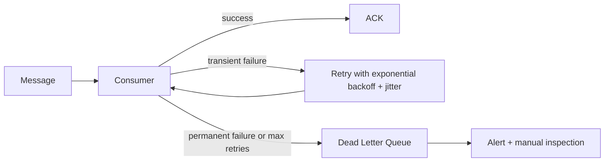

# Idempotent Consumers

## Why It Matters

Every message queue delivers **at least once**. Duplicates are not an edge case — they are guaranteed. Handling them is the difference between a correct system and one that double-charges customers.

## Why Duplicates Are Unavoidable

```
Consumer receives message → processes it → crashes before ACK
Broker never got the ACK → redelivers the message
```

This is the [Two Generals Problem](../../09%20Distributed%20Systems/Theory/Two%20Generals%20Problem.md): the broker cannot distinguish "consumer died before processing" from "consumer processed but died before acknowledging". It must redeliver, so you must tolerate it.

**"The queue guarantees exactly-once" is wrong** and a common candidate error.

## The Core Pattern

Give every message a stable **idempotency key**, and record processed keys atomically with the side effect.

```java
@Transactional
public void handle(Message msg) {
    // Insert-first: the unique constraint IS the lock
    try {
        processedRepo.insert(msg.getIdempotencyKey());   // UNIQUE constraint
    } catch (DuplicateKeyException e) {
        return;                                          // already handled
    }
    accountRepo.debit(msg.getAccountId(), msg.getAmount());
}
```

**Both writes must be in the same transaction.** If the dedup record commits but the debit doesn't, the message is lost forever. If the debit commits but the dedup record doesn't, it's applied twice.

## Why Not a Distributed Lock

```java
// FRAGILE
if (redis.setnx(key, "1")) { process(); }
```

A crash after `setnx` but before `process()` means the message is **never** processed — the lock says "done" but nothing happened. Locks provide mutual exclusion, not atomicity with the side effect. The database transaction does.

If you must use Redis (no shared DB), you need the dedup marker written *after* success plus a lease with expiry — more complex and still weaker.

## Choosing the Key

| Source | Suitability |
|---|---|
| **Client-supplied UUID** | Best — stable across retries, meaningful to the business |
| Business key (`orderId + operation`) | Very good — naturally unique |
| Content hash | Good if messages are truly identical; breaks with timestamps |
| Broker message id | **Risky** — a producer retry creates a *new* id for the same logical event |

**The broker's message id does not deduplicate producer retries.** The key must originate with whoever created the intent.

## Naturally Idempotent Operations

The cheapest solution is to not need dedup at all:

| Not idempotent | Idempotent equivalent |
|---|---|
| `balance = balance - 10` | `balance = 90 WHERE version = 5` |
| `INSERT` | `INSERT ... ON CONFLICT DO NOTHING` / upsert |
| `counter++` | Set an absolute value, or record an event and aggregate |
| "send email" | "send email with dedup key" (most providers support this) |

**Prefer absolute assignment over relative mutation** wherever the domain allows it.

## Cleanup

The dedup table grows forever. Options:

- TTL / partition by day and drop old partitions (must exceed the maximum possible redelivery window, including DLQ replays)
- Keep the key on the business entity itself (e.g. `orders.idempotency_key`), so it lives and dies with the record

## Retry and Dead Letter Queues



- **Transient** (timeout, 503): retry with exponential backoff **and jitter** — without jitter, retries synchronise into a thundering herd
- **Permanent** (malformed, validation failure): go straight to the DLQ; retrying wastes capacity
- **Always alert on DLQ depth.** A silent DLQ is invisible data loss.

**Kafka has no built-in retry queue.** Implement either in-consumer retry (blocks the partition — beware) or dedicated retry topics with increasing delays.

## Poison Messages

One malformed message that always fails blocks its partition forever in Kafka, since offsets are sequential. Bound retries and move on to the DLQ.

## Common Mistakes

- Assuming the broker guarantees exactly-once
- Writing the dedup record outside the transaction
- Using a distributed lock instead of a transactional insert
- Using the broker's message id as the idempotency key
- Retrying permanent failures
- No jitter on backoff
- No monitoring on the DLQ

## Related Topics

- [Kafka Deep Dive](../Kafka/Kafka%20Deep%20Dive.md)
- [Two Generals Problem](../../09%20Distributed%20Systems/Theory/Two%20Generals%20Problem.md)
- Saga Pattern *(not yet written)*

## Revision Summary

At-least-once delivery is guaranteed, so consumers must be idempotent. Insert the idempotency key with a unique constraint inside the same transaction as the side effect. Retry transient failures with jittered backoff; send permanent ones to a monitored DLQ.

## Quick Recall

- Queues never give exactly-once end to end
- Dedup insert + side effect in ONE transaction
- Unique constraint, not a distributed lock
- Key comes from the producer, not the broker
- Backoff needs jitter
- Alert on DLQ depth
