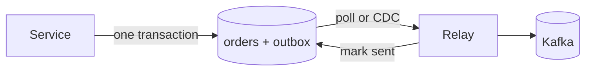

# Transactional Outbox

## Why It Matters

The dual-write problem is unavoidable in any event-driven system: you must update your database **and** publish an event, with no shared transaction between them. The outbox is the standard solution.

## The Problem

```java
@Transactional
public void placeOrder(Order order) {
    orderRepo.save(order);              // 1. database
    kafka.send("order.placed", event);  // 2. broker — DIFFERENT SYSTEM
}
```

**Four ways this breaks:**

| Failure point | Result |
|---|---|
| Crash after (1), before (2) | Order saved, **event never published** — downstream never learns |
| Crash after (2), before commit | Event published, **order rolled back** — downstream acts on a phantom |
| Kafka publish fails | Either lose the event, or fail the whole order |
| Publish succeeds, ack lost, retry | **Duplicate event** |

**There is no ordering of these two operations that is safe.** Publishing inside the transaction risks phantom events; publishing after risks lost events. This is the dual-write problem, and it cannot be solved by reordering.

## The Outbox Solution

Write the event **into the same database, in the same transaction**, then publish it separately.

```sql
BEGIN;
  INSERT INTO orders (id, customer_id, total, status) VALUES (...);
  INSERT INTO outbox (id, aggregate_id, event_type, payload, created_at)
       VALUES (gen_random_uuid(), ?, 'order.placed', ?, now());
COMMIT;
```

**One transaction, one database — atomicity is guaranteed by the database.** Either both rows exist or neither does.

A separate process then reads the outbox and publishes:



## Two Ways To Publish

### Polling Publisher

```sql
SELECT * FROM outbox WHERE published_at IS NULL
 ORDER BY created_at LIMIT 100
   FOR UPDATE SKIP LOCKED;          -- allows parallel relay instances
```

Publish, then mark `published_at = now()`.

| | |
|---|---|
| Pros | Simple; no extra infrastructure; works on any database |
| Cons | Polling latency; load on the database; needs cleanup of old rows |

**`FOR UPDATE SKIP LOCKED` is the detail that makes this work with multiple relay instances** — each grabs a different batch without blocking. Without it, relays contend on the same rows.

### Change Data Capture (preferred)

**Debezium** reads the database's replication log (Postgres WAL, MySQL binlog) and streams outbox inserts to Kafka.

| | |
|---|---|
| Pros | **No polling load**, low latency, ordered by commit order, no application involvement |
| Cons | Operational complexity (Debezium + Kafka Connect); replication slot management |

**CDC reads the log, which is the database's own record of commit order** — so events are published in exactly the order they were committed. That ordering guarantee is hard to get any other way.

**Replication slot warning:** a Debezium slot that stops consuming prevents WAL cleanup and will eventually fill the disk. Monitor slot lag.

## At-Least-Once, Not Exactly-Once

The relay can publish and crash before marking the row sent — so the event is published again.

**The outbox guarantees at-least-once delivery, never exactly-once.** Consumers must still be [idempotent](Idempotent%20Consumers.md).

**Include a stable event ID** in the outbox row so consumers can deduplicate:

```sql
outbox (
  id            uuid PRIMARY KEY,      -- the event ID consumers dedupe on
  aggregate_id  uuid,                  -- partition key
  event_type    text,
  payload       jsonb,
  created_at    timestamptz,
  published_at  timestamptz NULL
)
```

## Ordering

**Partition by `aggregate_id`** so all events for one entity land in the same Kafka partition and remain ordered relative to each other.

Ordering across different aggregates is neither guaranteed nor usually meaningful.

**With polling, ordering can break** if multiple relay instances publish concurrently. Either partition the polling by `aggregate_id`, or accept per-aggregate ordering only. **CDC preserves commit order naturally**, which is another argument for it.

## Cleanup

The outbox table grows forever without maintenance.

| Approach | Detail |
|---|---|
| **Delete after publishing** | Keeps the table tiny; loses the audit trail |
| Soft-delete + periodic purge | Retain briefly for debugging |
| **Partition by day, drop old partitions** | Instant cleanup, no dead-tuple churn |

**Deleting millions of rows generates dead tuples and vacuum load in Postgres.** Partitioning by day and dropping partitions is far cheaper. See [PostgreSQL](../../04%20High%20Level%20Design/Key%20Technologies/PostgreSQL.md).

## The Inbox Pattern — The Mirror Image

The same problem on the consuming side: you process a message and update your database, and must not process it twice.

```sql
BEGIN;
  INSERT INTO inbox (message_id) VALUES (?);   -- UNIQUE constraint
  UPDATE inventory SET count = count - 1 WHERE ...;
COMMIT;
-- duplicate key violation → already processed → skip
```

**Outbox for reliable publishing, inbox for reliable consuming.** Together they give end-to-end reliability over an unreliable broker. See [Idempotent Consumers](Idempotent%20Consumers.md).

## Alternatives And When They Apply

| Alternative | When |
|---|---|
| **Event sourcing** | The event log *is* the database — no dual write exists |
| **Listen to yourself** | Publish first, then consume your own event to update state |
| Two-phase commit (XA) | Almost never — blocking, poor broker support |
| **Accept the risk** | Genuinely fine for non-critical events like analytics |

**"Accept the risk" is a legitimate answer for low-stakes events.** An outbox for click-tracking events is over-engineering. Reserve it for events where loss or phantoms cause real harm — payments, orders, inventory.

## Common Mistakes

- Publishing inside the transaction (phantom events on rollback)
- Publishing after commit without an outbox (lost events on crash)
- No event ID, so consumers can't deduplicate
- Polling without `SKIP LOCKED`, causing relay contention
- Never cleaning up the outbox table
- Assuming the outbox gives exactly-once
- Unmonitored replication slot with CDC
- Using it for events where the risk was acceptable

## Related Topics

- [Idempotent Consumers](Idempotent%20Consumers.md)
- [Multi-Step Processes and Saga](../../04%20High%20Level%20Design/Patterns/Multi%20Step%20Processes%20and%20Saga.md)
- [Event Driven Architecture](../../04%20High%20Level%20Design/Advanced%20Topics/Event%20Driven%20Architecture.md)
- [Two Generals Problem](../../09%20Distributed%20Systems/Theory/Two%20Generals%20Problem.md)

## Revision Summary

Writing to a database and a broker cannot be made atomic, so write the event to an outbox table in the same transaction and publish it asynchronously via polling or CDC. This gives at-least-once delivery with correct ordering per aggregate; consumers still need idempotency, which the inbox pattern provides.

## Quick Recall

- **Dual write cannot be made safe by reordering**
- Business row + outbox row in **one transaction**
- Relay publishes: polling with `FOR UPDATE SKIP LOCKED`, or **CDC via Debezium**
- CDC preserves commit order and adds no database load
- **At-least-once, not exactly-once** — consumers must dedupe
- Include a stable event ID; partition by `aggregate_id`
- Partition the outbox by day and drop old partitions
- Inbox pattern is the consuming-side mirror
