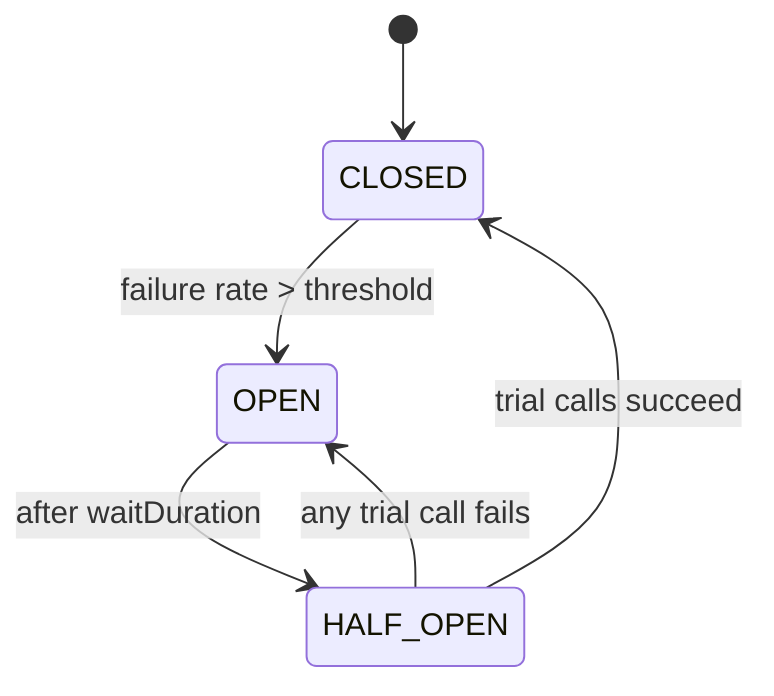

# Circuit Breaker

## Why It Matters

The standard defence against cascading failure. A required answer whenever a design has synchronous service-to-service calls.

## The Problem It Solves

Service A calls B. B slows to 30-second responses. A's threads all block waiting. A's pool exhausts. A stops responding to *everything*, including requests that don't need B. C calls A and fails too.

**One slow dependency takes down the whole system.** Note that a *slow* dependency is more dangerous than a *dead* one — a dead one fails fast.

## The State Machine



| State | Behaviour |
|---|---|
| **CLOSED** | Calls pass through; failures counted |
| **OPEN** | Calls **fail immediately** without attempting the network |
| **HALF_OPEN** | A limited number of trial calls probe recovery |

**Failing fast in OPEN is the entire point.** It frees threads instantly and gives the struggling dependency room to recover instead of being hammered by retries.

## Configuration (Resilience4j)

```java
CircuitBreakerConfig.custom()
    .slidingWindowType(COUNT_BASED)
    .slidingWindowSize(100)                    // last 100 calls
    .minimumNumberOfCalls(20)                  // don't trip on tiny samples
    .failureRateThreshold(50)                  // 50% failures → OPEN
    .slowCallRateThreshold(50)                 // 50% slow → OPEN
    .slowCallDurationThreshold(Duration.ofSeconds(2))
    .waitDurationInOpenState(Duration.ofSeconds(30))
    .permittedNumberOfCallsInHalfOpenState(5)
    .build();
```

**`minimumNumberOfCalls` matters:** without it, the first two calls failing gives a 100% failure rate and trips the breaker on noise.

**`slowCallRateThreshold` matters:** a dependency returning 200s in 10 seconds is failing, even though nothing throws. Latency-based tripping catches what error-rate tripping misses.

## Fallbacks

An open circuit needs a defined behaviour:

| Strategy | Example |
|---|---|
| Cached/stale data | Serve yesterday's recommendations |
| Default value | Empty list, generic ranking |
| Degraded feature | Hide the module rather than fail the page |
| Queue for later | Accept the write, process asynchronously |
| Fail fast with a clear error | For genuinely essential operations |

**Never silently return success for a failed write.** Degrade reads; be explicit about writes.

## The Full Resilience Stack

Circuit breakers alone are insufficient. Compose, innermost first:

```
Retry( CircuitBreaker( RateLimiter( TimeLimiter( Bulkhead( call )))))
```

| Layer | Purpose |
|---|---|
| **Timeout** | Bound every call — without it, threads block forever |
| **Bulkhead** | A separate thread pool/semaphore per dependency, so one can't exhaust all threads |
| **Circuit breaker** | Stop calling a failing dependency |
| **Rate limiter** | Protect the downstream from your own load |
| **Retry** | Handle transient blips only |

**Ordering matters:** retry outside the breaker means retries count as calls and can trip it — usually what you want. Timeout must be inside, so slow calls register as failures.

## Retry — The Dangerous One

Naive retry **amplifies** load precisely when the system is struggling. Three services each retrying three times produces 27× traffic.

Rules:
- Only retry **idempotent** operations
- Exponential backoff **with jitter** — without jitter, retries synchronise into waves
- Cap total attempts (2–3)
- **Never retry inside an open circuit**
- Consider a **retry budget** — allow retries only up to ~10% of total requests

## Timeouts

Set them from the **p99 latency** of the dependency, not a guess. Timeouts must **decrease** as you go deeper: if the API gateway times out at 3 s, the service should time out at 2 s and the database at 1 s. Otherwise the outer layer gives up while inner work continues, wasting capacity.

## Common Mistakes

- No timeout — the most common and most damaging omission
- Circuit breaker without bulkhead: threads still exhaust waiting on calls to *other* dependencies
- Retrying non-idempotent writes
- No jitter
- Thresholds so sensitive the breaker flaps
- No monitoring — an open circuit must page someone
- No defined fallback, so an open circuit is just a different error

## Related Topics

- [CompletableFuture](../02%20Java/Concurrency/CompletableFuture.md)
- [API Gateway](API%20Gateway.md)
- [Service Mesh](Service%20Mesh.md)

## Revision Summary

CLOSED → OPEN on failure or slow-call rate → HALF_OPEN probes → CLOSED. Fail fast to free threads and let the dependency recover. Always combine with timeout and bulkhead; retry only idempotent operations with jittered backoff.

## Quick Recall

- Slow dependencies are more dangerous than dead ones
- Trip on **slow calls** as well as errors
- `minimumNumberOfCalls` prevents tripping on noise
- Bulkhead per dependency; timeout on every call
- Timeouts decrease with depth
- Retry with jitter, idempotent only
