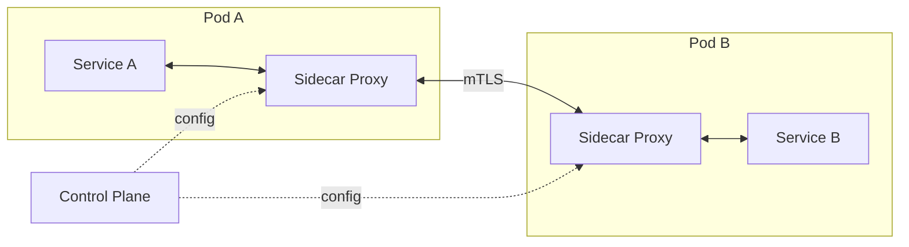

# Service Mesh

## Why It Matters

The infrastructure answer to service-to-service concerns. Interviewers ask to see whether you know when the added complexity is justified — often it isn't.

## Core Idea

Move retries, timeouts, mTLS, circuit breaking, and observability **out of application code** and into a **sidecar proxy** deployed alongside every service instance. All traffic flows through the sidecar.



- **Data plane** — the sidecars (Envoy) that actually carry traffic
- **Control plane** — distributes policy and certificates (Istio, Linkerd)

## What It Gives You

| Capability | Detail |
|---|---|
| **mTLS everywhere** | Automatic certificate issuance and rotation — the strongest single argument for a mesh |
| Retries, timeouts, circuit breaking | Configured, not coded |
| **Traffic splitting** | Canary and blue-green by percentage |
| Fault injection | Deliberately inject latency/errors to test resilience |
| Observability | Uniform golden signals for every hop, with no code changes |
| Authorisation policy | Which service may call which, enforced in the proxy |

**Language independence is the key benefit.** A polyglot estate gets identical resilience and telemetry without maintaining a client library per language.

## Canary Deployment Example

```yaml
# Istio VirtualService — 90/10 split
http:
  - route:
      - destination: { host: reviews, subset: v1 }
        weight: 90
      - destination: { host: reviews, subset: v2 }
        weight: 10
```

Header-based routing enables A/B testing: internal users get v2, everyone else v1.

## The Costs

| Cost | Detail |
|---|---|
| **Latency** | Two extra proxy hops per call (~1–3 ms typical) |
| **Resource overhead** | A sidecar per pod — significant at thousands of pods |
| **Operational complexity** | The control plane is another distributed system to run and debug |
| **Debugging difficulty** | "Is it my service, the sidecar, or the mesh config?" |
| Steep learning curve | Istio's configuration surface is large |

**Ambient/sidecar-less modes** (Istio ambient, Cilium mesh) reduce the per-pod overhead by using node-level proxies — worth mentioning as the current direction of travel.

## When To Use One

**Justified when:**
- Many services (rule of thumb: dozens, not a handful)
- Polyglot — several languages, so a shared library isn't viable
- mTLS between all services is a compliance requirement
- You need progressive delivery across the whole estate

**Not justified when:**
- Fewer than ~10 services
- A single language — a resilience library (Resilience4j) is far simpler
- The team lacks platform/ops capacity to run it

**Say this plainly:** for most systems in an interview, a resilience library plus a gateway is the right answer, and a mesh is over-engineering. Recognising that is a stronger signal than knowing Istio's CRDs.

## Mesh vs Gateway

| | API Gateway | Service Mesh |
|---|---|---|
| Traffic | **North-south** (client → system) | **East-west** (service ↔ service) |
| Deployment | Centralised fleet | Sidecar per instance |
| Concerns | Auth, rate limit, aggregation | mTLS, retries, traffic shaping |

They're complementary, not alternatives.

## Common Mistakes

- Adopting a mesh for a handful of services
- Expecting it to fix a bad service decomposition
- Ignoring sidecar resource cost at scale
- Assuming it removes the need to understand retries and timeouts — you still configure them, and bad values still cause outages
- Configuring retries in both the mesh and the application, silently multiplying load

## Related Topics

- [API Gateway](API%20Gateway.md)
- [Circuit Breaker](Circuit%20Breaker.md)
- [Kubernetes Core Concepts](../13%20Kubernetes/Kubernetes%20Core%20Concepts.md)

## Revision Summary

Sidecar proxies move mTLS, retries, timeouts, and traffic shaping out of application code. Best value in large polyglot estates; over-engineering below roughly ten services. Complements rather than replaces an API gateway.

## Quick Recall

- Data plane = sidecars (Envoy); control plane = Istio/Linkerd
- mTLS everywhere is the strongest justification
- Gateway = north-south; mesh = east-west
- Costs: latency, resources, operational complexity
- Under ~10 services, use a library instead
