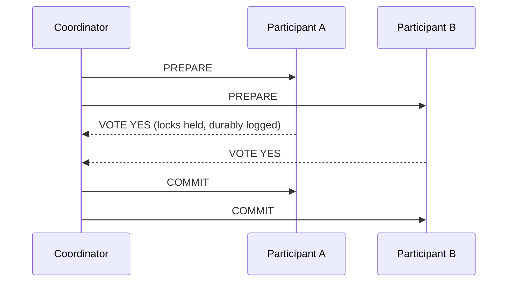

# Distributed Transactions

## Why It Matters

The moment state spans two systems, ACID stops being available for free. Knowing why 2PC is avoided — and what replaces it — is core senior material.

## Two-Phase Commit



**Phase 1 (prepare):** each participant does the work, holds locks, writes to its log, and votes. **A YES vote is a binding promise** — the participant must be able to commit even after a crash.

**Phase 2 (commit/abort):** if all voted yes, the coordinator commits; otherwise it aborts.

## Why 2PC Is Avoided

| Problem | Detail |
|---|---|
| **Blocking** | Between prepare and commit, participants hold locks and cannot proceed |
| **Coordinator is a single point of failure** | If it dies after prepare, participants are stuck **indefinitely** |
| **Availability multiplies** | Requires *all* participants up: 4 × 99.9% ≈ 99.6% |
| Latency | Two round trips to every participant, plus fsyncs |
| Poor support | Cassandra, DynamoDB, Kafka, and most modern stores don't offer XA |

**The blocking property is the fatal one.** A participant that voted YES cannot unilaterally decide — it has promised to commit — so it holds locks until the coordinator returns. A coordinator crash can hold locks for hours.

**3PC** adds a pre-commit phase to make it non-blocking, but assumes bounded network delay — which real networks violate. It is essentially unused in practice.

**2PC trades availability for atomicity.** For most user-facing systems that's the wrong trade, which is the setup for Saga.

## Where 2PC Is Still Used

Not never — just narrowly:

- **Within a single database** across shards (Spanner, CockroachDB use 2PC internally over Paxos/Raft groups)
- Kafka transactions across partitions
- Legacy XA in enterprise integration

**Spanner makes 2PC viable by making the coordinator itself fault-tolerant** — each participant is a Paxos group, so no single node's failure blocks anything. That's the key insight: 2PC's problem isn't the protocol, it's the single-node coordinator.

## Saga — The Practical Alternative

Replace one distributed transaction with a **sequence of local transactions**, each with a **compensating action**.

```
Book flight → Book hotel → Book car
                             ↓ fails
Cancel flight ← Cancel hotel ┘        (compensate in reverse)
```

**Compensation is not rollback.** A rollback erases history; a compensation is a *new* transaction that offsets the previous one. A refund doesn't delete the charge — both appear in the ledger.

Covered fully in [Multi-Step Processes and Saga](../../04%20High%20Level%20Design/Patterns/Multi%20Step%20Processes%20and%20Saga.md).

## What Saga Gives Up

Saga provides **ACD** — it drops **Isolation**.

```
After booking the flight but before the hotel:
another process sees a confirmed flight for a trip that will be cancelled
```

**Countermeasures:**

| Technique | Detail |
|---|---|
| **Semantic lock** | A `PENDING` status tells others the record is in flight |
| Commutative updates | Order-independent operations avoid conflict |
| **Pessimistic view** | Reorder steps so risky ones happen last |
| Reread value | Verify unchanged before acting |

**The semantic lock — a PENDING status field — is the practical answer** and the one to give.

## Ordering Rules For Saga Steps

| Rule | Reason |
|---|---|
| **Irreversible steps go last** | You cannot un-send an email or un-ship a package |
| Retriable steps after the pivot | Once past the pivot the saga must go forward |
| Compensations run in **reverse order** | Dependencies unwind correctly |
| Compensations must be **idempotent** | They will be retried |

**The pivot transaction** is the point of no return — after it, the saga can only go forward. Identifying it explicitly is good design.

## Alternatives Beyond Saga

| Approach | When |
|---|---|
| **Avoid the distributed transaction** | Redraw the boundary so it's one local transaction — **the best answer when possible** |
| **Eventual consistency + reconciliation** | Accept temporary divergence; a periodic job fixes it |
| **Event sourcing** | The event log is the source of truth; no dual write exists |
| **Idempotency + retry** | Convert atomicity into "eventually correct, safe to repeat" |
| **NewSQL** (Spanner, CockroachDB) | Genuine distributed ACID, at latency and cost |

**"Can I redraw the service boundary so this is one local transaction?" is the strongest question to ask.** If order and payment consistently change together, they may belong in one service. A distributed transaction is often a symptom of a bad boundary — and saying so demonstrates design judgement rather than protocol knowledge.

## The Dual-Write Problem

Even without multi-service transactions, updating a database and publishing an event is a distributed write.

**Solution: the [transactional outbox](../../07%20Messaging%20and%20Kafka/Reliability%20Patterns/Transactional%20Outbox.md)** — write the event into the same database in the same transaction, and publish asynchronously.

## Reconciliation — The Safety Net

Whatever protocol you choose, state will occasionally diverge. **Every system handling money needs a reconciliation job.**

```
Nightly: compare orders marked PAID against payment provider records
  → payment exists, order not marked  → fix forward
  → order marked, no payment          → alert; possible fraud or bug
```

**This is how real payment systems handle the [Two Generals Problem](../Theory/Two%20Generals%20Problem.md) in production.** The protocol reduces divergence; reconciliation catches what remains. Volunteering it is a strong signal.

## Comparison

| | 2PC | Saga | Eventual + reconcile |
|---|---|---|---|
| Atomicity | **Yes** | No — compensating | No |
| Isolation | **Yes** | **No** | No |
| Availability | **Poor** | Good | **Best** |
| Latency | High | Moderate | Low |
| Complexity | Moderate | **High** (compensations) | Low |
| Failure mode | Blocking | Compensation may fail | Divergence until reconciled |

## Common Mistakes

- Proposing 2PC without naming its blocking and availability costs
- Treating compensation as rollback
- Non-idempotent compensating actions
- Ignoring lost isolation — no PENDING states
- Irreversible steps early in the sequence
- Dual-writing without an outbox
- No reconciliation job for financial flows
- Not asking whether the boundary could be redrawn

## Related Topics

- [Multi-Step Processes and Saga](../../04%20High%20Level%20Design/Patterns/Multi%20Step%20Processes%20and%20Saga.md)
- [Transactional Outbox](../../07%20Messaging%20and%20Kafka/Reliability%20Patterns/Transactional%20Outbox.md)
- [Two Generals Problem](../Theory/Two%20Generals%20Problem.md)
- [Transactions and Isolation Levels](../../05%20Databases/Consistency%20and%20Transactions/Transactions%20and%20Isolation%20Levels.md)

## Revision Summary

2PC gives atomicity but blocks on coordinator failure and multiplies availability downward, so it's confined to intra-database use where the coordinator is itself replicated. Saga replaces it with local transactions plus compensations, sacrificing isolation — use semantic locks. Best of all is redrawing the boundary so no distributed transaction is needed, backed by reconciliation.

## Quick Recall

- 2PC: prepare (locks held, YES is binding) → commit
- **Coordinator crash blocks participants indefinitely**
- Availability multiplies: 4 × 99.9% ≈ 99.6%
- Spanner makes 2PC work by replicating the coordinator
- Saga = local transactions + **compensations in reverse**
- Saga drops **Isolation** → PENDING semantic locks
- Irreversible steps last; identify the pivot
- **Best answer: redraw the boundary**; always reconcile money
